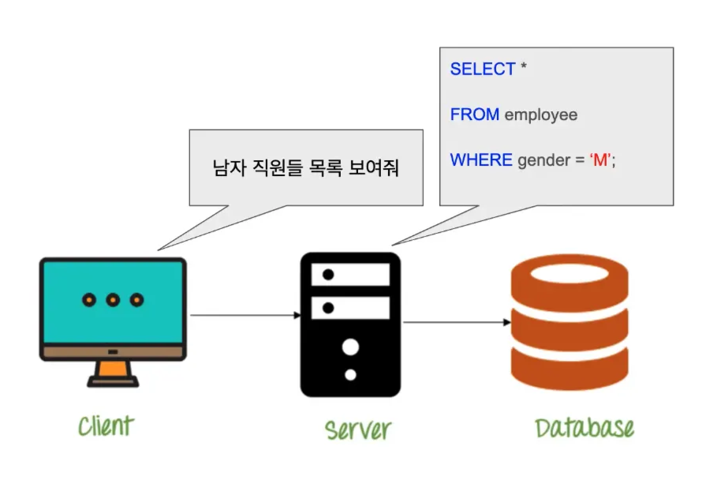
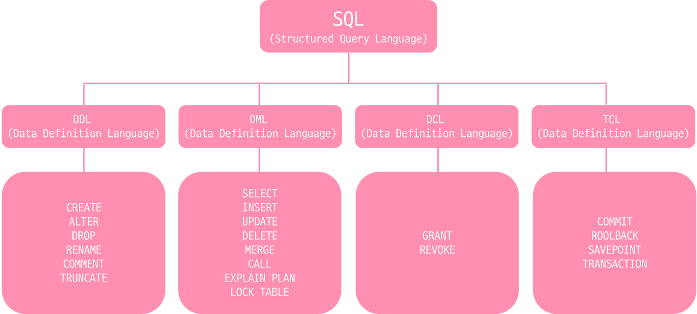

# DB 쿼리란?

 

## 목차

- [DB 쿼리란?](#db-쿼리란)
  - [목차](#목차)
  - [DB 쿼리란?](#db-쿼리란-1)
  - [DB 쿼리 종류](#db-쿼리-종류)

 

## DB 쿼리란?

Query = 질문, 질문하다

 

- Database Query
    - 데이터베이스에 원하는 정보를 얻기 위해 특정 언어 (주로 SQL)로 작성된 질문
    - 데이터베이스에 삽입, 수정 등 다양한 작업을 요청하는 명령문, 질의문

 

- SQL
    - 가장 널리 쓰이는 Database Query 언어
    - Database Query를 표현하기 위한 구체적인 언어 중 하나
    - 대부분 RDB는 SQL로 쿼리 작성
    - RDB에서 데이터 관리, 조작하는데 사용되는 표준 프로그래밍 언어

 

 

## DB 쿼리 종류

- **DDL (Data Definition Language, 데이터 정의어)**
    
    데이터베이스의 구조(테이블, 컬럼 등)를 생성, 수정, 삭제하는 명령어
    
    - 예: CREATE, ALTER, DROP, TRUNCATE, RENAME
- **DML (Data Manipulation Language, 데이터 조작어)**
    
    데이터베이스 안의 실제 데이터를 조회, 삽입, 수정, 삭제하는 명령어
    
    - 예: SELECT, INSERT, UPDATE, DELETE
- **DCL (Data Control Language, 데이터 제어어)**
    
    사용자 권한과 같은 접근 권한을 제어하는 명령어
    
    - 예: GRANT, REVOKE
- **TCL (Transaction Control Language, 트랜잭션 제어어)**
    
    여러 데이터 작업을 하나의 일괄적인 처리로 관리 및 제어하는 명령어
    
    - 예: COMMIT, ROLLBACK, SAVEPOINT

