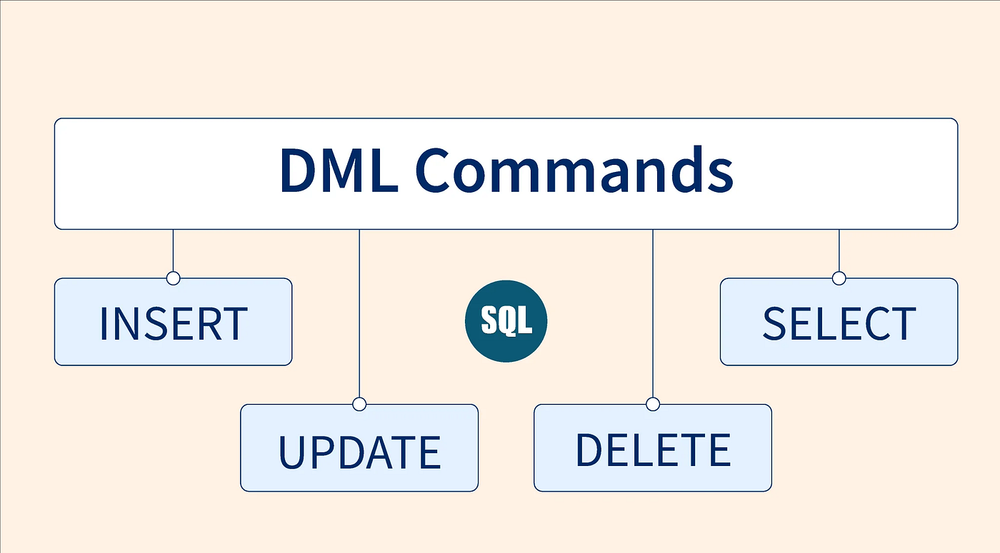

# DML

<br>

## 목차
- [DML](#dml)
  - [목차](#목차)
  - [DML](#dml-1)
    - [대표적인 SQL 명령어](#대표적인-sql-명령어)
    - [각 명령어 사용 시 주의 사항](#각-명령어-사용-시-주의-사항)

<br>

## DML

데이터베이스 내에서 데이터를 조회, 삽입, 수정, 삭제하는 작업을 수행하는 명령어

데이터베이스에 저장된 데이터를 조작하기 위해 사용

<br>

### 대표적인 SQL 명령어

- **SELECT**
    - 데이터베이스 테이블에서 원하는 데이터 조회 및 검색
        - 기본 구조
            
            ```sql
            SELECT 컬럼명1, 컬럼명2 FROM 테이블명 WHERE 조건;
            ```
            
- **INSERT**
    - 데이터베이스 테이블에 새로운 데이터 추가
        - 기본 구조
            
            ```sql
            INSERT INTO 테이블명 (컬럼1, 컬럼2) VALUES (값1, 값2);
            ```
            
        - 모든 컬럼에 값 넣을 경우 컬럼명 생략 가능
        - VALUES 뒤에 ,로 여러 행 삽입 가능
- **UPDATE**
    - 데이터베이스 테이블의 기존 데이터를 수정
        - 기본 구조
            
            ```sql
            UPDATE 테이블명 SET 컬럼1=값1, 컬럼2=값2 WHERE 조건;
            ```
            
        - WHERE 조건으로 단일 행, 여러 행 수정 가능
        - WHERE절 없이 UPDATE 실행 시 모든 행 수정됨
- **DELETE**
    - 데이터베이스 테이블에서 데이터를 삭제
        - 기본 구조
            
            ```sql
            DELETE FROM 테이블명 WHERE 조건;
            ```
            
        - WHERE 조건으로 단일 행, 여러 행 삭제 가능
        - WHERE절 없이 DELETE 실행하면 테이블의 모든 데이터 삭제됨.

<br>



<br>

### 각 명령어 사용 시 주의 사항

- **SELECT 사용 시 주의사항**
    - WHERE 조건 생략 시
        - 데이터 전체 조회되어 성능 저하 or 불필요한 정보 노출 위험 있음
    - INDEX 활용
        - 대량의 데이터에서 효율적으로 조회 방법 = INDEX가 설정된 컬럼 WHERE, ORDER BY 등에 적극 활용
    - 컬럼 지정
        - SELECT * 형태 대신 실제 필요한 컬럼만 명시 해야 함
        - 네트워크 트래픽 및 서버 부하 줄이기 위함
    - 민감정보 노출 주의
        - 개인정보, 비밀 데이터가 필요 이상으로 조회되지 않도록 주의
    - 성능 저하 유발 연산 주의
        - 아래의 것은 전체 테이블 스캔을 유발할 수 있어 성능 주의해야 함
        - JOIN, 서브쿼리, GROUP BY, ORDER BY, LIKE '%검색어%' 등

<br>

- **INSERT 사용 시 주의사항**
    - 컬럼 일관성
        - INSERT 시 컬럼 순서, 데이터 타입, 제약 조건 맞춰야 함
        - 잘못하면 에러 또는 데이터 무결성 문제 발생
    - 중복 데이터 주의
        - PRIMARY KEY, UNIQUE 같은 제약 있는 컬럼에 중복 데이터 삽입되지 않게 유의
    - 트랜잭션 단위
        - 대량 INSERT 시, 중간에 실패할 수 있음
        - 이때 전체 작업 한 번에 ROLLBACK 할 수 있게 트랜잭션 처리 권장
    - 외래키 제약 조건
        - 외래키가 있는 경우 참조하는 데이터가 이미 존재해야 함
    - 대량 삽입 시 부하
        - BATCH INSERT, BULK INSERT, 임시 테이블 활용 등을 고려
        - 부하가 적은 시간에 실행

<br>

- **UPDATE 사용 시 주의 사항**
    - WHERE 조건 필수
        - WHERE 조건이 없으면 모든 데이터가 변경됨
    - 대상 확인
        - UPDATE 전에 SELECT로 대상 데이터가 정확한지 미리 확인
    - 동시 갱신 주의
        - 여러 사용자가 동시에 데이터 수정할 경우, 동시성 제어나 Lock 전략이 필요
    - 트랜잭션 활용
        - 실수로 인한 전체 데이터 수정 등 복구하려면 COMMIT/ROLLBACK을 적절히 사용
    - 값 누락, 타입 혼동 주의
        - NULL, Data Type, 논리 오류 등 잘못된 값으로 업데이트 되는지 확인 필요

<br>

- **DELETE 사용 시 주의 사항**
    - WHERE 조건 필수
        - WHERE절 누락 시 모든 데이터가 삭제됨
    - 안전 조치
        - 중대한 DELETE는 먼저 SELECT로 내용을 확인
        - 또는 트랜잭션으로 묶어서 검증 후 COMMIT
    - 연관 데이터 영향
        - 외래키로 연결된 다른 테이블에서 연쇄 삭제가 발생할 수 있음
        - 삭제 전에 반드시 관련 데이터도 고려
    - 복구 방안
        - 잘못 삭제 시 데이터를 복원할 수 있는 백업, 로그 존재여부 확인
    - 대량 삭제 시 부하
        - 대량 데이터 삭제는 DB 부하를 유발
        - 분할 삭제, 적정 시간대 실행 등을 고민