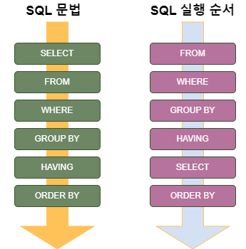

# SQL절 실행 순서

 

## 목차
- [SQL절 실행 순서](#sql절-실행-순서)
  - [목차](#목차)
  - [SQL절 실행 순서](#sql절-실행-순서-1)
    - [순서](#순서)
    - [왜 쿼리 작성 순서와 실행 순서가 다른가?](#왜-쿼리-작성-순서와-실행-순서가-다른가)

 

## SQL절 실행 순서

SQL 쿼리 실행 순서는 표면적으로 쿼리 작성 순서와 다르다.

데이터 처리 및 최적화를 위해 특정 단계 순서로 실행된다.

 

### 순서

1. **FROM, ON, JOIN**
    1. FROM
        1. 데이터를 가져올 테이블 결정
    2. ON 
        1. JOIN 조건을 확인
    3. JOIN 
        1. JOIN을 통해 가상 테이블을 만듬
2. **WHERE**
    1. FROM에서 가져온 행들에 WHERE 조건이 개별 행에 적용됨
    2. 조건에 맞는 행만 필터링하는 행 단위 필터링, 집계 전 필터링
3. **GROUP BY**
    1. WHERE 조건 통과한 행들을 GROUP BY에 지정된 열을 기준으로 그룹화 됨
    2. 집계 함수를 적용할 준비함
4. **HAVING**
    1. GROUP BY로 그룹화된 행에 HAVING의 제약 조건이 적용되어 필터링
5. **SELECT** 
    1. 화면에 출력할 컬럼을 선택, 계산
    2. 별칭 지정 시 이 시점부터 유효
6. **DISTINCT**
    1. 중복된 결과 행을 제거
7. **ORDER BY**
    1. 결과 행들을 지정한 컬럼 기준으로 오름차순 or 내림차순 정렬
8. **LIMIT, OFFSET**
    1. 결과 행 수를 제한 또는 특정 위치부터 출력

 

 

### 왜 쿼리 작성 순서와 실행 순서가 다른가?

- **논리적 데이터 처리 흐름**
    - 이 순서가 논리적으로 자연스러운 순서
        - FROM으로 데이터 가져오고→ WHERE로 필요한 데이터만 고르고 …
    - GROUP BY → HAVING 이유
        - 먼저 그룹화 되어야 집계 후 조건 적용할 수 있기 때문
    - → SELECT → DISTINCT → ORDER BY → LIMIT 이유
        - 출력할 컬럼이 정해지고 결과를 정렬하고 제한 가능하기 때문
- **최적화 효율성**
    - WHERE 같은 필터를 먼저 적용하면 데이터가 적어침
    - 이후 단계의 처리량이 줄어들어 성능 향상에 도움됨