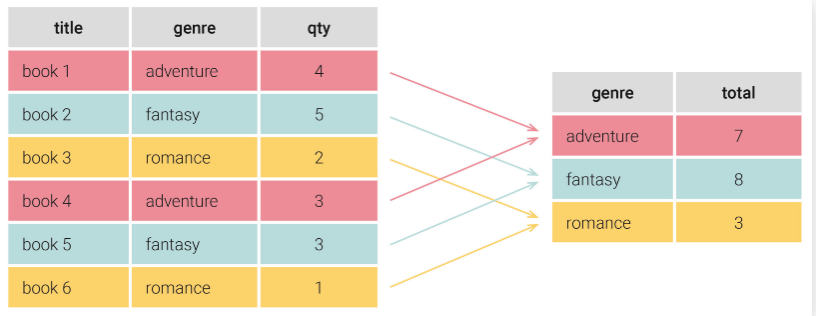

# GROUP BY

 

## 목차
- [GROUP BY](#group-by)
  - [목차](#목차)
  - [GROUP BY](#group-by-1)
    - [집계함수란?](#집계함수란)
    - [성능에 영향 주는 이유?](#성능에-영향-주는-이유)
    - [주의해야 할 점 및 성능 저하 원인](#주의해야-할-점-및-성능-저하-원인)
    - [성능 개선 방법](#성능-개선-방법)

 

## GROUP BY

### 집계함수란?

여러 행의 데이터 집합에서 합계, 평균 등과 같은 요약된 단일 결과값을 반환하는 함수

주로 GROUP BY절과 함께 사용됨

특정 집계 결과를 계산하는데 사용됨

 

 

### 성능에 영향 주는 이유?

- 대량의 데이터 정렬 및 그룹화 처리
    - 그룹화 기준 컬럼 기준으로 데이터 그룹화하고 정렬하는 작업 수행
    - 데이터 많으면 정렬과 그룹화 작업이 무거워져 자원 많이 사용
- INDEX 미활용 시 전체 테이블 스캔
    - 대상 컬럼에 적절한 INDEX 없으면 전체 테이블 스캔
    - 행들 그룹화 해야 하기 때문에 행들 읽어야 함
    - 그 후 임시 테이블에 담아 데이터 정렬 및 그룹화 처리
    - 상당한 부하가 걸림
- 임시 테이블과 디스크 IO 과다
    - 메모리 또는 디스크의 임시 저장공간을 활용해 임시 테이블 생성
    - 메모리 한계 초과하면 임시 테이블이 디스크에 생성
    - 디스크 IO로 쿼리 매우 느려질 수 있음
- 복잡한 집계, 함수, 조인
    - GROUP BY에 함수나 계산식 들어갈 경우 INDEX 무효화 됨
        - 함수, 계산식 적용 시 먼저 실행됨
        - INDEX는 원본 값을 기반으로 정렬되어 있음
        - 함수, 계산식 적용 후 값 달라져 INDEX 활용 불가능
    - 따라서 쿼리 실행 시간 늘어남

 

### 주의해야 할 점 및 성능 저하 원인

- GROUP BY 컬럼에 INDEX 없음
- 불필요하게 많은 컬럼으로 GROUP BY
    - 그룹 수 대폭 증가
    - 메모리 부족과 디스크 IO 발생 가능성 커집
- 불필요한 집합 함수, DISTINCT, HAVING 남발
    - 집합 함수 : 여러 행 요약하는 작업이라 많은 연산 필요
    - DISTINCT : 중복 행 제거 위해 데이터 정렬, 해시 처리 수행
    - HAVING : 먼저 전체 그룹화 수행 후 필터링해 작업량 많음
- LIKE, 함수, 계산식, 부정 조건, 자료형 변환 등 INDEX 활용 불가 조건 사용
    - 데이터 달라져 INDEX 활용 불가능해짐
    - 부정 조건이나 자료형 맞지 많아 변환 일어나도 INDEX 적용 안됨
- NULL 값 그룹핑, 다중컬럼 그룹핑
    - NULL 값은 NULL끼리 그룹핑 되어 NULL 포함 컬럼은 의도치 않은 NULL 그룹 생성될 수 있음
    - 여러 컬럽 그룹핑 시 컬럼 순서, 복합 INDEX 순서가 성능에 영향 미침

 

### 성능 개선 방법

- INDEX 활용 최적화
    - GROUP BY 컬럼에 INDEX 두기
        - INDEX 자체 정렬을 활용해 GROUP BY 처리를 더 빠르게 수행 가능
    - 컬럼 여러 개인 경우 모두 적절한 인덱스 생성
        - 복합 INDEX 순서와 GROUP BY 컬럼 순서 일치하면 성능 향상 가능
- 쿼리 구조 개선
    - GROUP BY 전에 WHERE로 데이터 최대한 필터링
        - 불필요한 데이터 제거
    - JOIN 전에 서브 쿼리 등으로 미리 집계
        - JOIN 대상 행 수 줄이기
- 컬럼 관련
    - GROUP BY 컬럼, 순서 조정
        - 복합 INDEX 순서와 맞으면 Loose Index Scan 등 고성능 처리 가능
    - 함수나 계산식 GROUP BY 컬럼에 사용 x
        - INDEX 무효화 피하기