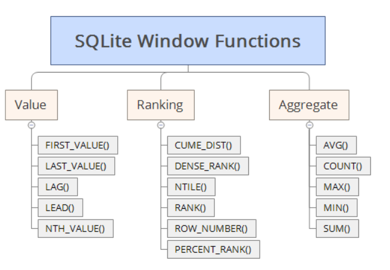

# 윈도우 함수

<br>

## 목차
- [윈도우 함수](#윈도우-함수)
  - [목차](#목차)
  - [윈도우 함수](#윈도우-함수-1)
    - [윈도우 함수란?](#윈도우-함수란)
    - [윈도우 함수 vs 집계 함수, GROUP BY](#윈도우-함수-vs-집계-함수-group-by)
    - [윈도우 함수 기본 문법 예시](#윈도우-함수-기본-문법-예시)
    - [사용 이유](#사용-이유)

<br>

## 윈도우 함수

### 윈도우 함수란?

원본 행 수를 유지하며 전체 결과 or 그룹 내 각 행에 계산 수행하는 함수

<br>



<br>

### 윈도우 함수 vs 집계 함수, GROUP BY

- 집계 함수
    - 그룹화된 데이터에 대해 하나의 값 반환
- 윈도우 함수
    - 전체 결과 or PARTITION으로 나눈 그룹 내 각 행에 대해 계산된 값 반환
    - 기존의 집계함수를 윈도우 함수로 사용하면, 그룹별 합계를 행별로도 제공 가능

<br>

- GROUP BY
    - 그룹핑해 집계한 결과 반환
    - 행을 그룹별로 줄임
    - SELECT 결과 자체를 집계해서 반환
- 윈도우 함수
    - 각 행에 집계 등의 계산 결과 추가
    - 원본 행 수 유지
    - SELECT한 결과의 각 행에 추가 정보 부여

<br>

### 윈도우 함수 기본 문법 예시

```sql
SELECT column1,
       SUM(column2) OVER (PARTITION BY column3 ORDER BY column4) AS running_total,
       RANK() OVER (PARTITION BY column3 ORDER BY column2 DESC) AS rank_in_group
FROM table_name;
```

<br>

- OVER 절 필수
    - OVER에 아래의 것들 지정
        - PARTITION BY : 행을 나누는 기준, 행의 값별로 소그룹으로 나눔
        - ORDER BY : 정렬 기준
- OVER 앞에 다양한 함수
    - 그룹 내 순위 함수
        - 특정 그룹 내 순위 계산 함수
        - RANK, DENCE_RANK, ROW_NUMBER
    - 그룹 내 집계 함수
        - 기존 집계 함수 확장한 함수
        - SUM, MAX, MIN, AVG, COUNT
    - 그룹 내 행 순서 함수
        - 그룹 내 행의 상대적 위치 값 참조 함수
        - FIRST_VALUE, LAST_VALUE, LAG, LEAD
    - 그룹 내 비율 함수
        - 그룹 내 비율이나 분포 계산 함수
        - CUME_DIST, PERCENT_RANK, NTILE, RATION_TO_REPORT
    - 통계 및 선형 분석 함수
        - 상관관계, 표준편차 등 통계 계싼에 쓰이는 함수
        - 지원 DBMS마다 다름

<br>

### 사용 이유

- 복잡한 집계, 분석을 더 간단하고 효율적으로 실행 가능
- 원본 데이터 행 수 유지하며 집계 값 확인 가능
- 서브 쿼리나 복잡한 조인 없이 한 쿼리 내에서 다양한 분석 가능
- 행 간 비교 중심의 복잡한 분석에 강점 있음