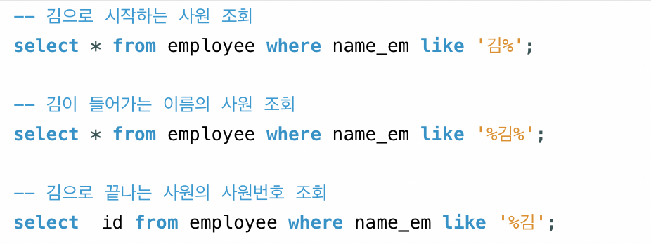

# LIKE

 

## 목차
- [LIKE](#like)
  - [목차](#목차)
  - [LIKE](#like-1)
    - [LIKE란?](#like란)
    - [LIKE 패턴 검색이 성능 문제 일으키는 이유](#like-패턴-검색이-성능-문제-일으키는-이유)
    - [성능 개선 방법](#성능-개선-방법)
    - [기타 주의할 점](#기타-주의할-점)

 

## LIKE

### LIKE란?

**LIKE 연산자**는 SELECT, UPDATE, DELETE 등에서 문자열 패턴 매칭에 사용

 

 

### LIKE 패턴 검색이 성능 문제 일으키는 이유

- 전체 테이블 스캔 발생 (INDEX 사용 제한)
    - **`LIKE ‘%pattern’`** 이처럼 패턴 앞부분에 % 있는 경우 문제
    - %가 0개 이상의 임의 문자
    - 데이터베이스는 해당 컬럼의 모든 값 다 확인해야 해서 INDEX 활용 X
    - 따라서 테이블 전체 탐색 발생해 성능 저하
- 복잡한 문자 비교
    - 단순 문자 비교가 아닌 문자 인코딩, 대소문자, 정렬(Collation) 정책까지 복합적으로 작용하여 비교 연산 비용이 증가
- 데이터 볼륨과 패턴 복잡도
    - 테이블에 데이터 양이 많은 경우
    - 패턴이 매우 복잡한 경우
    - 이런 경우인데 자주 패턴 검색이 실행되면 전체적인 쿼리 성능 저하로 이어짐

 

### 성능 개선 방법

- 패턴 앞에 % 피하기
    - **`LIKE ‘abc%’`** 가급적 이처럼 고정 prefix 검색 작성
    - 이 경우 INDEX가 효율적으로 사용됨
- Full-Text INDEX or 전문 검색 엔진 활용
    - 만약 ‘%pattern’ 형태 반드시 필요한 경우
    - 전문 검색 엔진 활용해 빠른 검색 가능하게 하자
    - ex
        - SQL Server의 Full-Text Index
        - MySQL의 Fulltext
        - 외부의 Elasticsearch
- REGEXP_LIKE 등 더 복잡한 패턴 처리 문법 활용
    - LIKE 절로는 표현하기 어려운 복잡한 패턴 검색을 가능하게 해주는 정규식 기반 패턴 매칭 함수
    - 주요 DBMS에서 지원
    - 다양한 문자 패턴 검색, 대소문자 처리, 특수문자 및 반복·선택 등과 관련된 쿼리 최적화에 활용
- 바이너리 Collation 활용
    - SQL Server는 **`COLLATE`** 구문을 활용해 바이너리 비교로 성능 향상 가능
    - 바이트 단위로 검색하게 되어 문자열 비교 불필요 작업 줄어듬
- plus
    - 성능에 민감한 서비스라면, 단순 LIKE 검색 대신 구체적 구조 개선과 검색 전문화 전략을 도입

 

### 기타 주의할 점

- 대소문자 구분
    - 데이터베이스에 따라 대소문자 구분 여부가 다름
    - 원하는 결과 나오지 않으면 COLLATE, UPPDER, LOVWER 함수 활용
- 와일드카드 등 특수문자 사용
    - %, _ 문자 자체 검색하려면 ESCAPE 옵션 or 이스케이프 문자 사용
- NULL 값 주의
    - LIKE는 NULL에 대해 항상 UNKOWN 반환
    - 패턴 매칭 조건 사용 시 NOT NULL 조건과 함께 사용 필요할 수 있음
- 유니코드와 인코딩
    - 한글, 중국어 등 다국어에서는 인코딩, 정렬 정책 영향으로 패턴 의도한대로 동작하지 않는 경우 있음