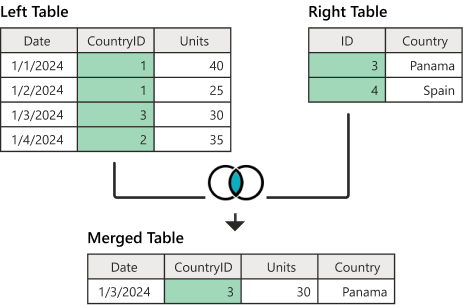

# JOIN이란?

<br>

## 목차
- [JOIN이란?](#join이란)
  - [목차](#목차)
  - [JOIN이란?](#join이란-1)
    - [개념](#개념)

<br>

## JOIN이란?

### 개념

RDB에선 중복 데이터 피하기 위해 서로 연관된 데이터를 중복 없이 여러 개 테이블로 나누는 정규화 진행. 

테이블을 분리하는 이유는 효율적인 저장, 데이터 중복 최소화, 무결성 확보, 데이터 일관성 유지 등 때문.

<br>

이렇게 분리된 데이터, 테이블을 다시 결합하여 원하는 정보를 얻을 때 사용하는 것이 JOIN.

<br>

**JOIN**은 데이터베이스에서 두 개 이상의 테이블 연결하여 하나의 테이블처럼 만들어 데이터 검색하는 방법

RDB에서는 JOIN 연산자를 사용해 두 테이블이 공유하고 있는, 관련 있는 컬럼을 기준으로 행을 합침

<br>

아래와 같은 방법으로 진행

```sql
SELECT 컬럼1, 컬럼2, ...
FROM 테이블1
JOIN 테이블2
ON 테이블1.공통컬럼 = 테이블2.공통컬럼;
```

<br>

관련 있는 id 컬럼을 가지고 두 테이블을 합친 결과 테이블을 만드는 것

