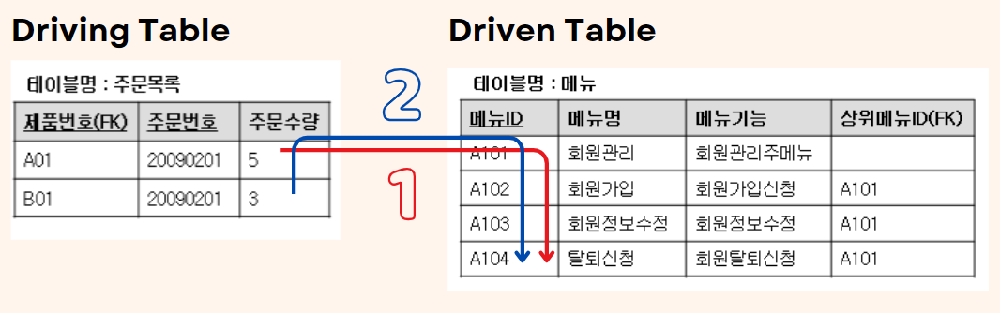
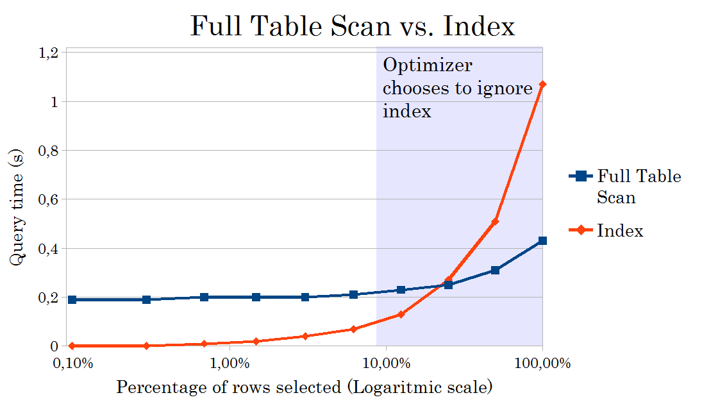

# JOIN과 성능

<br>

## 목차
- [JOIN과 성능](#join과-성능)
  - [목차](#목차)
  - [JOIN과 성능](#join과-성능-1)
    - [Driving table 선택이 성능에 미치는 영향](#driving-table-선택이-성능에-미치는-영향)
    - [join과 index](#join과-index)
    - [join 순서가 성능에 미치는 영향](#join-순서가-성능에-미치는-영향)

<br>

## JOIN과 성능

### Driving table 선택이 성능에 미치는 영향

**Driving table, Driven table이란**

- Driving table
    - Join시 먼저 access되는 테이블
    - outer table이라고도 불림
    - 2중 for문의 바깥쪽 for문 느낌
- Driven table
    - Driving table로부터 값을 받아 나중에 access되는 테이블
    - inner table이라고도 불림
    - 2중 for문의 안쪽 for문 느낌

<br>



<br>

**동작 방식**

- join 실행 시 2개 테이블 중 Driving, Driven table 선택됨
- join은 Driving 테이블의 join 조건 행 값 == Driven 테이블의 join 조건 행 값 찾아서 join 수행
- 각 Driving 테이블 행에 대해 Driven 테이블 행을 순회하면서 같은 값 찾는 것
- Driving 테이블의 각 행에 대해 Driven 테이블에서 조건에 맞는 데이터를 찾는 방식으로 진행
- 아래 코드와 비슷한 느낌
    
    ```java
    Driving Table 배열 길이 = 500000;
    Drivien Table 배열 길이 = 1000;
    
    for(int i=0; i<500000; i++){  <- Driving Table
    	for(int j=0; j<1000; j++){  <- Drivien Table
    		if(Driving Table[i]==Driven Table[j]){
    			// Join 수행!
    			break;
    		}
    	}
    }
    ```
    
- Driving table이 데이터 5000만 건이고 Driven table이 1000건이면 5000만번 반복해 Driven table 확인
- Driving table이 데이터 1000건이고 Driven table이 5000만 건이면 1000번 반복해 Driven table 확인

<br>

**Driving table 선택이 성능에 미치는 영향**

- Driving table의 행 수만큼 반복적으로 Driven table을 조회
    - 행 수가 적고, 조건으로 걸러질 가능성이 높은 테이블을 Driving table로 삼는 것이 효율적
- 데이터 수에 따른 Driving table 선택
    - 데이터 많은 테이블이 Driving table 되면 반복 조회 횟수 많아져 느려질 수 있음
    - 데이터 적은 테이블이 Driving table 되면 반복 조회가 적어져 빨라질 수 있음
- index는 어떤 테이블에??
    - Driven table에는 조인 컬럼에 Index 있을 때 성능 좋음
        - Index가 있다면 Driven table 순회하지 않고 빨리 찾을 수 있어서
        - O(MN)에서 O(MlogN) 되는 느낌 (B-Tree 인덱스)
    - Driving table에는 있으면 좋지만 없어도 상관 없음
        - Driving table은 일반적으로 한번만 full scan
- 가장 작은 결과 집합이 되는 테이블을 Driving table로 잡는 것이 일반적인 원칙
- 옵티마이저는 통계정보, 인덱스 존재 여부, 조인 조건 등을 바탕으로 자동으로 어떤 테이블을 Driving table로 사용할지 결정
- 특별한 경우 hint로 개발자가 직접 Driving table 지정 가능
- LEFT JOIN의 경우에는 일반적으로 좌측 테이블, RIGHT JOIN은 우측 테이블이 Driving table

<br>

### join과 index

- **join시 index가 없다면**
    - 전체 테이블 스캔 발생
        - 조인 조건에 맞는 데이터 위치 찾아야 함
        - index가 없어 전체 테이블 스캔 발생
        - IO 비용, 처리 시간 증가함
    - 조인 버퍼 사용으로 인한 메모리 부하 증가
        - 전체 테이블 스캔 발생하니 불필요한 디스크 IO 피하기 위해 버퍼에 데이터 올려 조인
        - 매칭 후보 레코드를 메모리 버퍼에 미리 적재해서 재사용
        - 조인 및 결과 생성에 필요한 컬럼만 조인 버퍼에 적재
        - 이로 인해 메모리 사용량 크게 증가
        - 메모리 부족 시 디스크 스와핑 발생해 응답 지연, 성능 저하
        - index 사용하면 조인 버퍼 사용 X
    - join 알고리즘 제한 및 최적화 실패
        - Nested Loop Join 등 인덱스를 활용하는 효율적인 알고리즘 사용 X
        - Hash Join이나 Sort Merge Join 같은 대체 알고리즘을 강제 사용
        - 메모리, CPU 사용량 증가 (hash table 생성, 정렬)

<br>

- **join시 index가 있다면**
    - 조인 조건에 맞는 레코드만 찾으므로 매우 빠른 성능 발휘
        - 전체 테이블 스캔 피해 성능 향상
        - index 활용하는 효율적인 join 알고리즘 사용 가능
        - 조인 버퍼 사용하지 않아 메모리 사용량 낮춤
        - 불필요한 연산, IO 작업 감소해 성능 개선
    - 실제 성능 차이 사례
        - **MySQL 사례**: index 추가 전 5-6초 → index 추가 후 0.07초 (약 70배 개선)
        - **10만 건 데이터**: index  없으면 1분 55초 → index 있으면 1초 미만

<br>

- **join에서 index 사용 시 주의할 점**
    - join 컬럼 데이터 타입 일치 필요
        - 조인 컬럼의 데이터 타입, 문자 set 이 다르면 index 못 타는 경우가 있음
        - 또 자동 형변환 동작해 비용 발생하고 인덱스 사용 문제 생김
    - join 조건에 함수, 연산자 주의
        - 조인 조건에 함수, 연산자 등 사용 시 index 무시됨
        - Equi Join은 인덱스가 있다면 효율적으로 조인할 수 있고 성능이 좋음
        - Non Equi Join은 조인 조인 조건에 부등호 등 연산자 사용되어 인덱스 활용이 제한적으로 되어 성능 저하 일어날 수 있음
    - 복합 인덱스 활용
        - 여러 컬럼 동시에 조인하면 복합 인덱스 고려
        - 순서 중요한데 자주 조인하는 컬럼을 복합 인덱스 앞쪽에 배치
    - join 대신 대체 수단 고려
        - 조인 부담될 때 윈도우 함수 등으로 대체 가능성도 고려 가능
    - join은 무거운 연산
        - join은 무거운 연산이라 과도하게 남발 X

<br>



<br>

### join 순서가 성능에 미치는 영향

- Driving table을 작게하는 것이 중요함
    - Driving table이 작으면 비교하는 행 수가 적어져 전체 join 연산 부담 감소
    - 여러 테이블 조인하는 경우도 순서 제어해 Driving table 작게
        - 어떤 순서로 join하는가에 따라 중간 결과 집합 (=Driving table 역할) 크기가 크게 바뀜
        - 작은 결과 집합 먼저 만들어지도록 해야 함
    - where 조건으로 많이 필터링 되어 데이터 줄어들 수 있는 테이블을 앞에 배치
        - 쿼리 논리적 실행 순서는 join > where
        - 하지만 실제는 옵티마이저가 순서 바꿔서 실행 가능
        - where로 데이터 많이 줄일 것 같으면 where 먼저 실행 
- Driven table에 index가 있는 것이 중요함
- INNER JOIN, OUTER JOIN에서 순서
    - INNER JOIN의 경우
        - 두 테이블 간에 조인 조건에 맞는 공통 데이터(교집합)만 결과에 포함
        - 조인 순서를 바꿔도 결과는 같음 (교집합의 특성상)
        - 데이터베이스 옵티마이저는 조인 순서를 유연하게 바꿔가며 성능 최적화를 시도
        - 실행 순서 변경이 결과에 영향을 주지 않으면서, 비용을 최소화하는 방향으로 조정 가능
    - OUTER JOIN의 경우
        - 한 쪽 테이블의 모든 행을 반드시 포함
        - 조인 순서가 논리적인 결과에 영향 줌
        - LEFT OUTER JOIN에서 왼쪽/오른쪽 테이블 위치를 바꾸면 결과 집합 자체가 달라짐
        - 옵티마이저가 임의로 순서를 바꾸기 어렵고, 개발자가 순서를 명확히 지정해야 함
        - 잘못 조인 순서를 지정하면 예상치 못한 결과가 나오거나 불필요한 조인 비용이 발생 가능