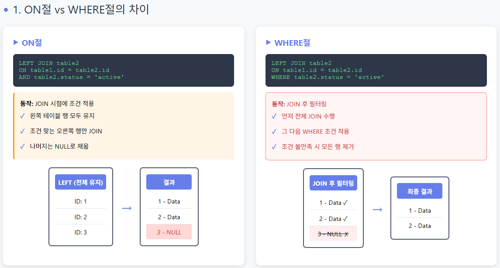
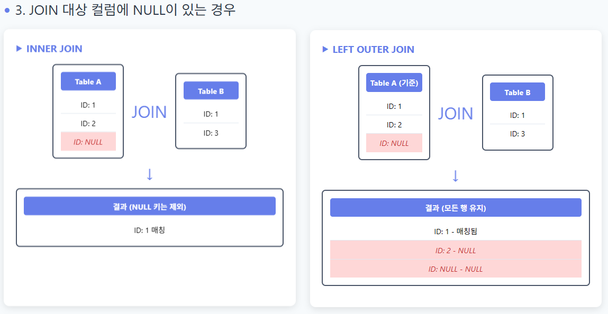

# JOIN 사용 시 주의점

 

## 목차
- [JOIN 사용 시 주의점](#join-사용-시-주의점)
  - [목차](#목차)
  - [JOIN 사용 시 주의 점](#join-사용-시-주의-점)
    - [outer join 시 주의점](#outer-join-시-주의점)

 

## JOIN 사용 시 주의 점

### outer join 시 주의점

- join 조건의 where, on 사용 시 차이점
    - on절 :
        - join할 때 조건 적용하여 어떤 행끼리 join할지 결정
        - left outer join 예시로 보면
        - right 테이블에 조건에 맞는 행 join되고 나머지 행은 NULL이 됨
        - left 테이블에 행은 모두 유지됨
    - where절 :
        - join이 끝난 전체 결과에서 추가로 행을 걸러내는 필터 역할함
        - left outer join 예시로 보면
        - 조건에 맞는 경우 right 테이블이던 left 테이블이던 모든 행이 사라질 수 있음
    - 조인 조건은 on절에, 결과 필터링은 where절에

 

 

- NULL 값 처리 주의
    - 한쪽 테이블에 매칭되는 행이 없다면 컬럼들이 NULL로 채워짐
    - join 이후 조건문이나 집계 함수에서 NULL값 고려해야 함
    - COALESCE() 같은 함수로 대체하거나 IS NULL 조건 사용해야 함
- join 대상 컬럼에 NULL 값 있는 경우
    - inner join은 join 키가 NULL인 경우 해당 행은 결과에서 완전히 제외됨
    - outer join은 키가 NULL이여도 기준 테이블의 모든 행을 결과에 항상 포함함

 

 

- 중복 행 발생
    - OUTER JOIN 시 기준 테이블 행 하나에 대해 join되는 테이블에 동일한 키가 여러 개 있으면 결과가 예상보다 행이 늘어나게 됨.
    - 이 점을 고려하여 필요 시 DISTINCT, GROUP BY 또는 서브쿼리, 윈도우 함수 등을 사용해야 함