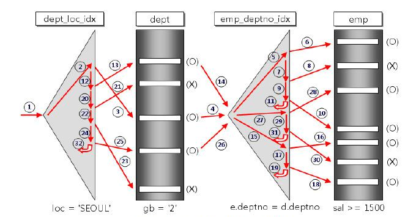
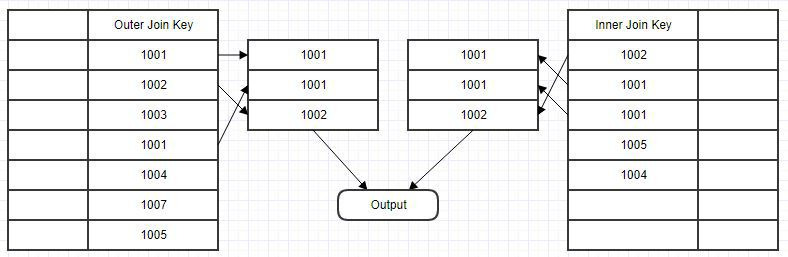
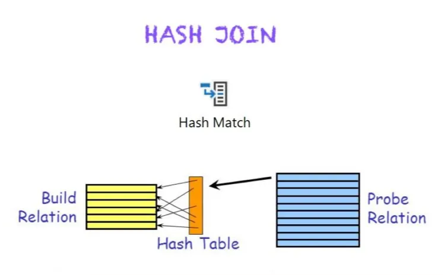

# JOIN 알고리즘

 

## 목차
- [JOIN 알고리즘](#join-알고리즘)
  - [목차](#목차)
  - [JOIN 알고리즘](#join-알고리즘-1)
    - [종류 \& 동작 방식](#종류--동작-방식)
    - [장단점](#장단점)

 

## JOIN 알고리즘

### 종류 & 동작 방식

- nested loop join
    - 가장 기본적이고 단순한 방식
    - Driving table의 각 행에 대해 Driven table의 모든 행과 반복 비교하며 join 조건 만족하는 데이터 찾음

 

 

- sort merge join
    - join에 사용할 컬럼 기준으로 두 테이블 먼저 정렬
    - 정렬된 데이터를 양쪽에서 순차적으로 비교하며 join 수행

 

 

- hash join
    - 한 쪽 테이블 (주로 작은 테이블)을 해시 테이블로 만듬
    - 다른 테이블의 각 행에 해시 함수 적용해 빠르게 매칭되는 데이터 찾아 join

 

 

### 장단점

- nested loop join
    - 데이터가 적을 때 효율적
    - 데이터 많아질수록 성능 급격히 저하됨
    - 단순 구현이 장점
    - index 활용하면 조금 더 성능 끌어올릴 수 있음
- sort merge join
    - 데이터 미리 정렬되어 있거나, 조인에 사용되는 컬럼 index 있으면 매우 효율적
    - 대량의 데이터 처리할 때 좋은 성능 보임
    - 정렬 연산에 따른 추가 비용 발생 가능
- hash join
    - 대량 데이터 조인에 성능이 좋음
        - 정렬과 전체 단순 비교 없어 연산량이 적음
    - equi join에 주로 사용됨
    - 메모리 사용량이 많음
        - 해시 테이블을 만들어야 하기 때문
    - 작은 테이블에 적합함
    - 양쪽 테이블 크기가 많이 다를 때 효율적임
        - 작은 테이블을 해시 테이블로 만들고
        - 큰 테이블은 한 줄씩 읽어와 매칭 여부만 확인하면 됨