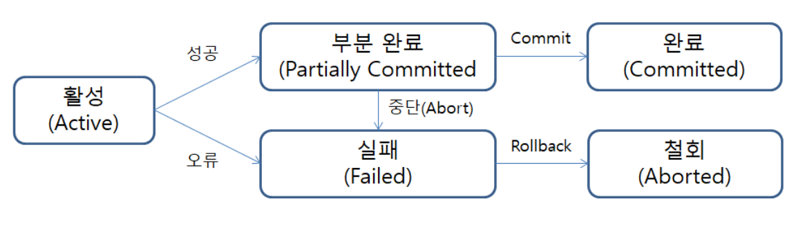

# 트랜잭션(Transcation)
---
## 트랜잭션이란?
트랜잭션은 컴퓨터 과학에서 일련의 연산들을 하나의 논리적 작업 단위(Logical Unit of Work, LUW)로 묶은 것을 의미합니다. 

---

### 트랜잭션 특징
트랜잭션은 관련된 관련된 모든 작업을 **전부 성공**하거나 하나라도 실패하면 **전부 실패**하도록 보장합니다. 이를 통해 트랜잭션은 데이터베이스가 논리적 모순 상태에 머무르는 것을 방집합니다.

---

### 트랜잭션의 필요성
트랜잭션은 데이터 베이스의 **안정성**과 **신뢰성**을 보장합니다.

- **데이터 무결성 유지**
    데이터가 논리적으로 모순된 상태에 빠지는 것을 방지합니다.
- **동시성 제어**
    다수의 사용자가 동시에 데이터에 접근할 때 발생할 수 있는 문제를 제어하여 데이터의 일관성을 지킵니다.
- **장애 복구**
    트랜잭션 로그를 기반으로 시스템 장애 발생 시 데이터를 장애 발생 직전의 일관된 상태로 복구할 수 있습니다.

#### 계좌이체를 예시로
주제 : A 계좌에서 B계좌로 10,000원을 이체
1. A 계좌에서 10,000원을 인출(UPDATE)
2. B 계좌로 10,000원을 입금(UPDATE)

위와 같이 이체는 2개의 개별 연산으로 1개의 명령을 수행합니다. 만약 시스템에서 인출을 한 뒤 B계좌로 입금을 하는 과정에서 장애로 서버가 중단되면 A계좌에서 10,000을 뺀 이 후 입금이 이뤄지지 않습니다. 그렇다면 A 계좌는 10,000원을 잃는 상황이 벌어집니다.

트랜잭션은 이 두개의 개별연산을 하나의 논리적 단위로 묶어, 인출과 입금이 성공 또는 실패가 되도록 보장함으로써 논리적 모순을 방지합니다.

---

### 트랜잭션의 상태
트랜잭션은 다음과 같은 상태(생명주기)를 따릅니다.

1. **활동(Active)**
    연산을 실행 중인 초기 상태
2. **부분 완료(Partially Committed)**
    트랜잭션의 마지막 연산 까지 실행되었지만, 변경 내용이 아직 영구적으로 저장되지 않은 상태(Commit연산을 기다림)
3. **완료(Committed)**
    COMMIT 연산을 통해 트랜잭션이 성공적으로 종료되고, 모든 변경 사항이 데이터베이스에 반영된 상태
4. **실패(Failed)**
    오류가 발생하여 트랜잭션이 더 이상 정상적으로 실행될 수 없는 상태
5. **철회(Aborted)**
    트랜잭션이 롤백(Rollback)되어 시작 이전의 상태로 복구된 상태

---

### [트랜잭션 제어어(Transaction Control Language, TCL)](TransactionControlLanguage.md)

