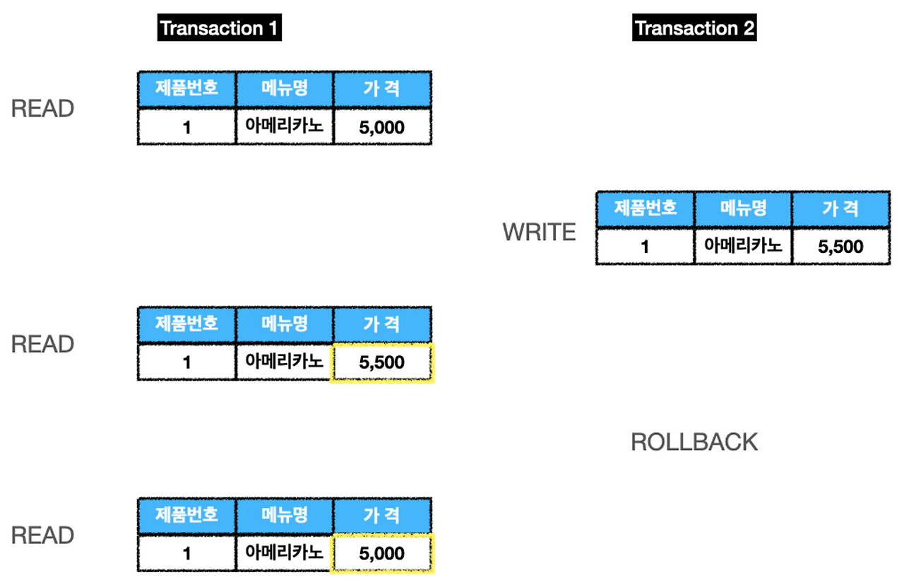
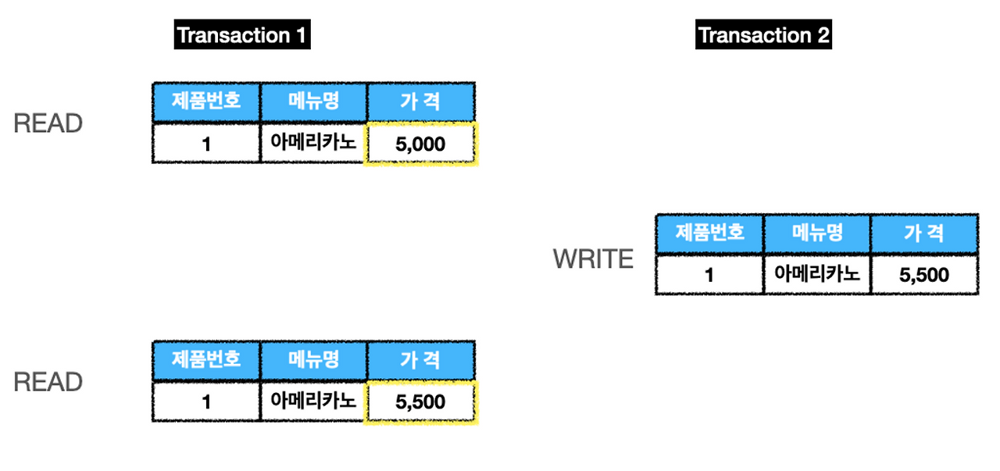
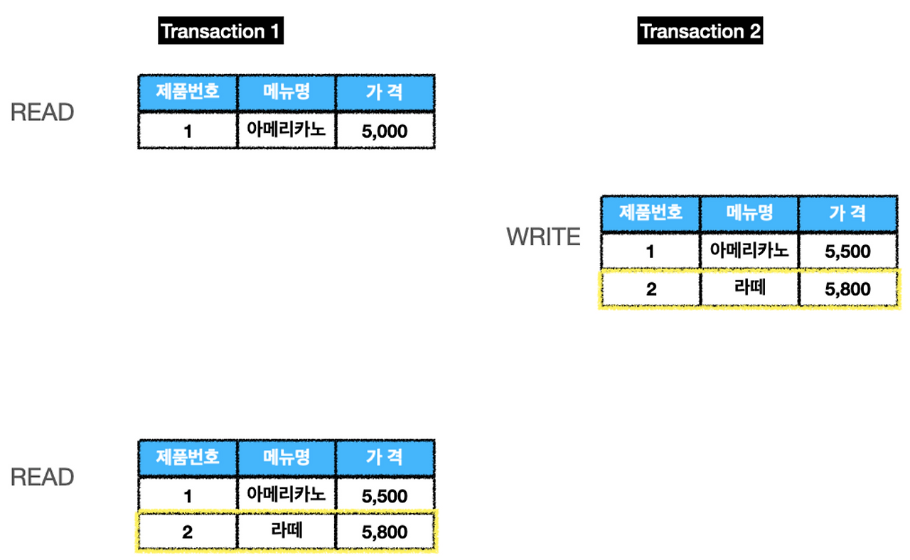

# 동시성 제어와 격리
데이터 베이스는 무결성을 훼손하지 않으면서 동시 접근을 관리할 수 있어야 합니다.

---

## 동시성 제어를 하지 않는 경우의 위험
여러 트랜잭션이 동시에 실행될 때, 각 트랜잭션의 연산들이 서로 겹치면서 의도하지 않은 결과를 초래할 수 있습니다. 이런 것을 동시성 이상(Concurrency Anomalies) 또는 읽기 현상(Read Phenomena)라고 합니다.
  
---

#### 1. 갱신 손실(Lost Update)
**문제**
 두 개 이상의 트랜잭션이 동일한 데이터를 읽고, 각자 수정한 후 다시 저장할 때 발생하는 문제
**결과**
마지막에 저장한 트랜잭션의 결과만 남고, 이전에 수행된 수정 작업은 사라지게 됨

#### 2. 더티 리드(Dirty Read)

**문제**
트랜잭션 A가 데이터를 수정했지만 아직 커밋하지 않은 상태에서, 트랜잭션 B가 커밋되지 않은 데이터를 읽을 때 발생하는 문제
**결과**
트랜잭션 B가 읽은 데이터는 트랜잭션 A가 롤백되면 무효화되어, 트랜잭션 B의 결과가 잘못될 수 있음

#### 3. 반복 불가능 읽기(Non-Repeatable Read)

**문제**
한 트랜잭션 내에서 동일한 행을 두 번 이상 읽을 때, 그 사이 다른 트랜잭션이 해당 행의 값을 수정, 삭제 후 커밋할 때 발생하는 문제
**결과**
첫 번째 읽기와 두 번째 읽기의 결과가 달라짐

#### 4. 유령 읽기(Ghost Read)

**문제**
한 트랜잭션이 WHERE 조건으로 데이터 집합을 조회했을 때, 다른 트랜잭션이 그 조건에 맞는 새로운 행을 삽입하고 커밋할 때 발생하는 문제
**결과**
첫 번째 트랜잭션이 동일한 WHERE 조건으로 재조회 시, 이전에 없었던 행이 나타나게 됨.

---

## 트랜잭션 격리 수준(Isolation Level)

SQL 표준에서 동시성 이상을 제어하기 위해 정의한 4가지 트랜잭션 격리 수준으로, 격리 수준이 높아질 수록 일관성은 강화되지만 성능(동시성)은 저하됩니다.

#### 0-LEVEL : READ UNCOMMITED
한 트랜잭션이 다른 트랜잭션의 커밋되지 않은 변경 사항을 볼 수 있습니다.
#### 1-LEVEL : READ COMMITED
트랜잭션이 커밋된 데이터만 읽을 수 있도록 보장합니다.
#### 2-LEVEL : REPEATABLE READ
트랜잭션이 시작된 시점의 데이터 일관성을 보장하여, 한 트랜잭션 내에서 특정 행을 여러 번 읽어도 항상 동일한 데이터를 반환합니다.
#### 3-LEVEL : SERIALIZABLE
트랜잭션들을 순차적으로(serially) 실행하는 것과 동일한 결과를 보장합니다. 이를 위해 일반적으로 읽기 연산에도 공유 잠금을 설정하여 다른 트랜잭션의 수정을 막습니다.

격리수준 | 더티리드 | 반복 불가능 읽기 | 유령읽기 | 성능 | DBMS기본값
--- | --- | --- | --- | --- | ---
READ UNCOMMITED | 발생가능 | 발생가능 | 발생가능 | 최상 | -
READ COMMITED | 방지 | 발생가능 | 발생가능 | 상 | PostgreSQL, Oracle
REPEATABLE READ | 방지 | 방지 | 발생가능 | 중 | MySQL(InnoDB)
SERIALIZABLE | 방지 | 방지 | 방지 | 하 | -

---

## 전파 속성(Propagation Attributes)
하나의 트랜잭션 내에서 다른 트랜잭션의 실행을 호출 할 때, 호출된 트랜잭션을 어떻게 처리할 것인지 결정하는 규칙

#### REQUIRE
부모 트랜잭션이 있으면 그 안에서 실행되고, 없으면 새로 생성(기본값)

#### SUPPORTS
부모 트랜잭션이 있으면 그 안에서 실행되고, 없으면 트랜잭션 없이 실행
#### MANDATORY
부모 트랜잭션이 반드시 있어야 하며, 없으면 예외를 발생시킴
#### REQUIRES_NEW
항상 새로운 트랜잭션을 생성합니다. 부모 트랜잭션은 잠시 중단
#### NOT_SUPPORTED
트랜잭션 없이 실행합니다. 부모 트랜잭션이 있으면 잠시 중단
#### NEVER
트랜잭션 없이 실행하며, 부모 트랜잭션이 있으면 예외를 발생시킴
#### NESTED
부모 트랜잭션이 있으면 중첩 트랜잭션을 생성.
중첩 트랜잭션의 롤백은 부모에게 영향을 주지 않지만, 부모의 롤백은 자식에게 영향을 줌

## 출처
[동시성 문제와 제어 기법](https://s-y-130.tistory.com/232)
[트랜잭션, 동시성제어, 트랜잭션고립수준](https://jamiehun.tistory.com/164)