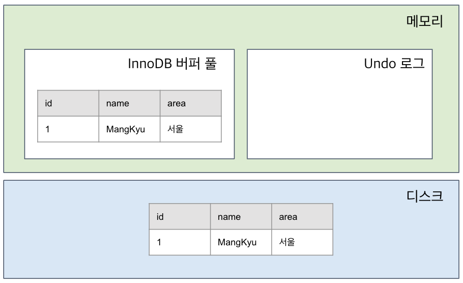

# Lock

## 락이란?

여러 트랜잭션(Transaction:tx)이 동시에 특정자원(테이블, 행 등)에 접근할 때, 데이터의 일관성(Consistency)과 무결성(Integrity)을 보장하고 충돌을 방지하기 위해 필수적으로 사용되는 메커니즘입니다.

## 락의 필요성

### 동시성 제어

여러 트랜잭션이 동시에 실행될 때, 데이터의 일관성과 정확성을 보장하며,  
동시에 수행되는 트랜잭션들이 데이터베이스에 미치는 영향이 이들을 순차적으로 수행했을 때와 같도록 보장합니다. 
만약 락이 없다면, 동시에 수행되는 여러 트랜잭션들이 **갱신 손실(lost update)**, **오손 데이터 읽기(dirty read)**, 
 **반복할 수 없는 읽기(unrepeatable read)**, **모순성(inconsistency)** 과 같은 부정확한 결과를 초래할 수 있습니다.

[동시성 문제](../05-Transaction/TransactionsConcurrencyControl.md)

### 시스템 안정성 보장

트랜잭션의 원자성을 보장하여 작업 도중에 오류로 인해 데이터가 잘못된 상태로 저장하는 것을 방지합니다.

### 데이터 정합성(Data Integrity) 보장

잘못된 읽기나 쓰기 작업을 방지하여 충돌상황에서도 데이터가 항상 일관된 상태를 유지하도록 지원합니다.

## 락의 종류

### 공유 락(Shared Lock : S-Lock)

  - **개념**: 데이터를 **읽을 때 (`SELECT`)** 사용하는 락입니다. '읽기 락(Read Lock)'이라고도 합니다.

  - **동작**: 다른 트랜잭션이 해당 데이터를 **읽는 것(S-Lock)** 은 허용하지만, **변경하는 것(X-Lock)** 은 막습니다.

데이터에 대한 사용권을 여러 트랜잭션이 함께 가질 수 있도록 허용합니다.

### 배타 락(Exclusive Lock : X-Lock)

  - **개념**: 데이터를 **변경할 때 (`INSERT`, `UPDATE`, `DELETE`)** 사용하는 락입니다. '쓰기 락(Write Lock)'이라고도 합니다.

  - **동작**: 다른 트랜잭션이 해당 데이터에 접근하는 모든 작업(**읽기, 쓰기 모두**)을 막습니다.

전용 Lock 연산을 실행한 트랜잭션만 해당 데이터에 대한 독점권을 가집니다.

### 비관적 락(Pessimistic Lock)

  - **개념**: "충돌이 발생할 것"이라고 비관적으로 가정하고, 데이터에 접근하는 시점부터 **즉시 락을 설정**하는 방식입니다. (`SELECT ... FOR UPDATE` 구문이 대표적입니다.)

  - **동작** : 한 트랜잭션이 데이터에 락을 걸면, 다른 트랜잭션은 해당 락이 해제될 때까지 접근이 차단되어 기다립니다. 데이터 정합성을 강력하게 보장합니다.

### 낙관적 락(Optimistic Lock)

  - **개념**: "충돌이 거의 발생하지 않을 것"이라고 낙관적으로 가정하고, 
  락을 사용하지 않는 대신 **데이터 수정 시점에 충돌 여부를 확인**하는 방식입니다.

  - **동작**: 데이터를 수정하기 전, 자신이 처음에 읽었던 데이터 버전과 현재 데이터 버전이 동일한지 비교합니다.  
  만약 버전이 다르다면(다른 트랜잭션이 먼저 수정했다면), 수정을 실패 처리하고 개발자가 직접 재시도 등의 후속 조치를 해야 합니다. 
  주로 데이터에 **버전(Version) 컬럼**을 추가하여 구현합니다.

### 명명된 락(Named Lock)

  - **개념**: 테이블이나 행이 아닌, **개발자가 지정한 임의의 문자열 이름**에 대해 락을 설정하고 해제하는 방식입니다. (MySQL의 `GET_LOCK()`, `RELEASE_LOCK()` 함수)

  - **동작**: 특정 문자열 이름의 락을 획득하면, 다른 세션은 동일한 이름의 락을 획득할 수 없어 대기하게 됩니다. 데이터베이스 자원과 무관한 특정 프로세스나 작업을 제어할 때 유용합니다.

### 분산 락(Distributed Lock)

  - **개념**: 여러 서버나 프로세스가 동시에 실행되는 **분산 환경**에서 공유 자원에 대한 접근을 제어하는 메커니즘입니다.

  - **동작**: 분산 락은 여러 노드에서 동일한 자원에 대한 접근을 단 하나의 노드만 할 수 있도록 제한합니다. 
   Redis의 `SETNX`나 데이터베이스의 `Named Lock`, ZooKeeper 등을 활용하여 구현합니다.

### Lock 호환성 매트릭스 (Lock Compatibility Matrix)

동일한 데이터에 동시에 접근하려고 할 때, 요청된 락(Lock)을 허용할 수 있는지 여부를 정의한 규칙표입니다.

| 현재 락 ╲ 요청 락 | 공유 락 (S-Lock) | 배타 락 (X-Lock) |
| :-- | :-- | :-- |
| **공유 락 (S-Lock)** | **허용 (Allow)** | 대기 (Wait) |
| **배타 락 (X-Lock)** | 대기 (Wait) | 대기 (Wait) |

## 락의 단위 (Granularity)

락을 거는 데이터 항목의 크기를 의미하며, 동시성과 오버헤드 간의 트레이드오프 관계가 있습니다.

  - **행 락 (Row Lock)**
      - **개념**: 개별 **행(Row)** 단위로 락을 설정합니다.
      - **장점**: 락의 범위가 가장 작아 **동시성이 가장 높습니다.**
      - **단점**: 관리할 락의 수가 많아져 **오버헤드가 커질 수 있습니다.**

  - **페이지 락 (Page Lock)**
      - **개념**: 데이터 파일의 **페이지(Page) 또는 블록(Block)** 단위로 락을 설정합니다.
      - **장점**: 행 락보다 오버헤드가 적습니다.
      - **단점**: 하나의 행만 수정해도 페이지 전체가 잠겨 동시성이 저하될 수 있습니다.

  - **테이블 락 (Table Lock)**
      - **개념**: **테이블 전체**를 기준으로 락을 설정합니다. (주로 DDL 구문과 함께 사용)
      - **장점**: 락 관리 **오버헤드가 가장 낮습니다.**
      - **단점**: 락의 범위가 가장 커서 **동시성이 최악입니다.**

-----

## 락으로 인해 발생하는 문제: 데드락 (Deadlock)

> **데드락(Deadlock)** 이란, 두 개 이상의 트랜잭션이 서로 상대방이 보유한 락이 해제되기만을 무한정 기다리는 **교착 상태**를 의미합니다.

### 데드락 발생 조건 (4가지 모두 충족 시)

1.  **상호 배제 (Mutual Exclusion)**: 자원은 한 번에 하나의 트랜잭션만 사용할 수 있습니다.
2.  **점유와 대기 (Hold and Wait)**: 트랜잭션이 자원을 가진 상태에서 다른 자원을 기다립니다.
3.  **비선점 (No Preemption)**: 다른 트랜잭션이 자원을 강제로 빼앗을 수 없습니다.
4.  **순환 대기 (Circular Wait)**: 트랜잭션들이 원형으로 서로의 자원을 기다립니다.

### 데드락 해결 방법

  - **탐지와 회복**: 대부분의 DBMS(MySQL 등)에서 사용하는 방식
    - 탐지 : 대기 그래프, 주기적 사이클 검사 등을 통해 데드락 감지
    - 회복 : 희생양을 선택하여 롤백하고, 나머지 트랜잭션은 계속 진행합니다.

  - **예방**: DBA나 개발자가 데드락이 발생하지 않도록 트랜잭션을 설계합니다.
    - **타임아웃(Timeout)**: 일정 시간 동안 락을 얻지 못하면 트랜잭션을 자동으로 롤백시킵니다.
    - **트랜잭션 크기 최소화**:
        - 트랜잭션을 짧게 정의하고 자주 커밋합니다. 
        (lock상태인 시간을 줄여 데드락 가능성을 낮추는 것)
    - **락 순서 지정(순환 대기 조건 방지)**:
        - 정해진 순서로 테이블에 접근합니다.
    - **인덱스 최적화**:
        - 인덱스를 최적화하여 불필요한 락 범위 확장을 막습니다. 
        (인덱스가 없다면 최악의 경우 테이블 전체를 락 상태로 만들어 불필요한 잠금이 늘어남)

-----

## 주요 락킹 프로토콜과 최신 기술

### 2단계 락킹 (2PL, Two-Phase Locking Protocol)

여러 트랜잭션이 동시에 데이터를 안전하게 처리하여 **직렬 가능성(Serializability)을 보장**하기 위해 락(Lock)의 획득 및 해제 규칙을 두 가지 단계로 엄격하게 정의한 것입니다.

  - **확장 단계 (Growing Phase)**: 트랜잭션이 새로운 락(Lock)을 요청하여 획득할 수는 있지만, 이전에 획득한 락을 단 하나라도 해제할 수는 없습니다.
  - **축소 단계 (Shrinking Phase)**: 트랜잭션이 보유하고 있던 락을 해제할 수 있지만, 새로운 락을 요청할 수는 없습니다.

#### 2PL의 특성

  - 모든 락 획득이 완료된 시점을 **락 포인트(Lock Point)** 라고 합니다.
  - 락 포인트 이후부터 축소 단계가 시작됩니다.

#### 2PL의 단점

  - **데드락 발생 가능성**: 락을 획득하고 해제하는 시점이 분리되어 있어 데드락이 발생할 수 있습니다.
  - **연쇄 복귀(Cascading Rollback) 가능성**: 한 트랜잭션이 롤백될 때, 그 트랜잭션이 변경한 데이터를 읽은 다른 트랜잭션도 함께 롤백되어야 하는 문제가 발생할 수 있습니다.

### MVCC (Multi-Version Concurrency Control)

> **다중 버전 동시성 제어(MVCC)** 는 데이터를 변경할 때마다 그 변경사항을 **새로운 버전(스냅샷)** 으로 만들어 관리하는 방식입니다.

  - **차이점**: 전통적인 락킹은 읽기(S-Lock)와 쓰기(X-Lock)가 서로를 방해하지만, **MVCC는 읽기 작업 시 락을 사용하지 않습니다.** 대신 특정 시점의 데이터 스냅샷을 읽어옵니다.
  - **장점**:
      - **높은 동시성**: 읽기 작업이 쓰기 작업을 기다리지 않아 성능이 크게 향상됩니다.
      - **데드락 감소**: 읽기 락을 사용하지 않으므로 락 경합이 줄어듭니다.
  - **고려사항**: 이전 버전의 데이터가 계속 쌓이므로, 이를 정리하는 별도의 시스템(가비지 컬렉션)이 필요합니다.
  - **주요 사용처**: MySQL(InnoDB), PostgreSQL, Oracle 등 현대적인 DBMS의 기본 동시성 제어 모델입니다.

## 이미지 출처
- [망나니 개발자](https://mangkyu.tistory.com/30?category=761304)
- [sennie](https://nowes00.tistory.com/19)
