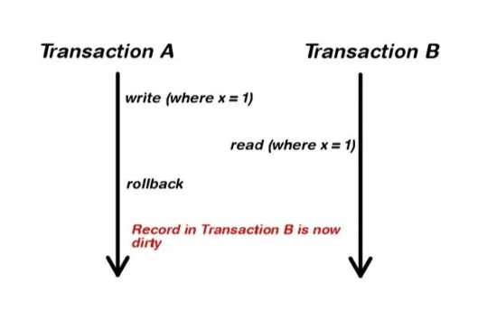
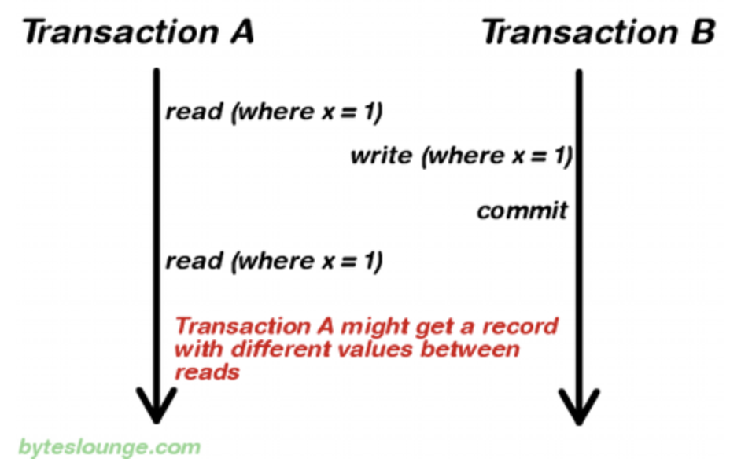
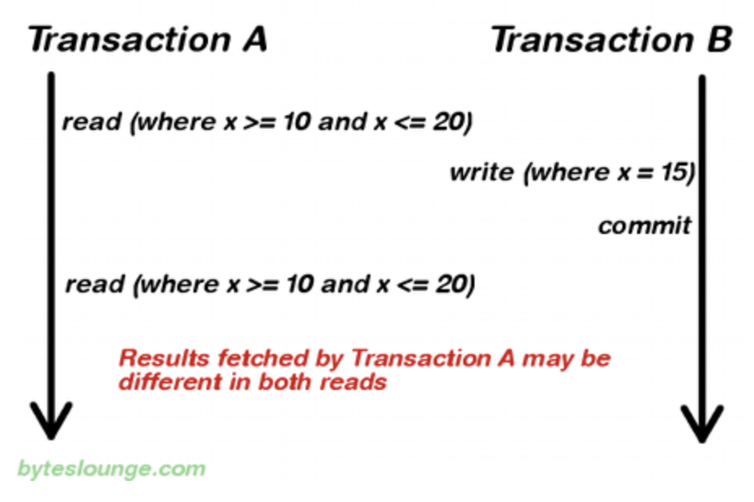
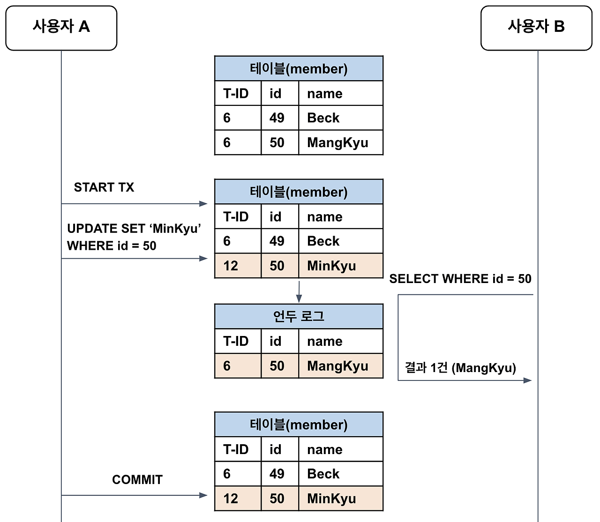
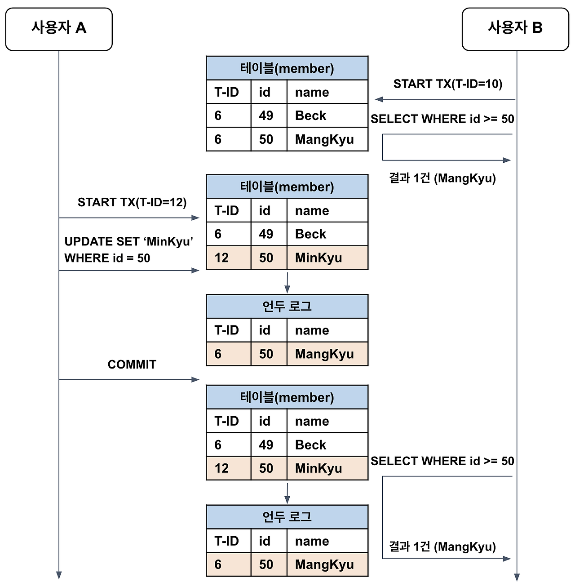
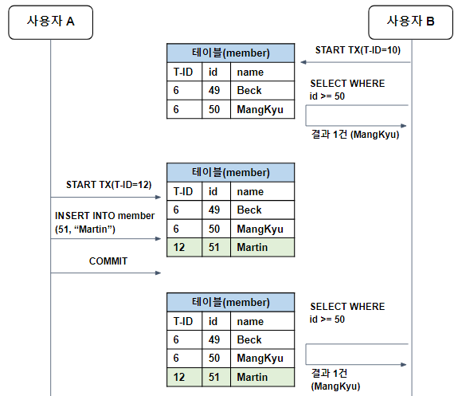
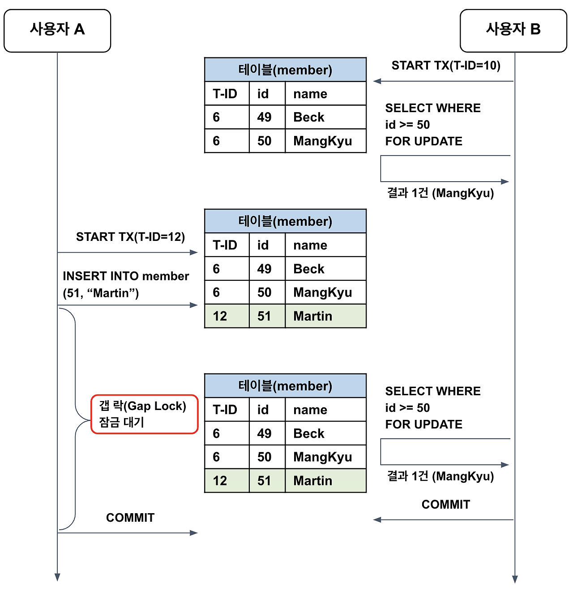
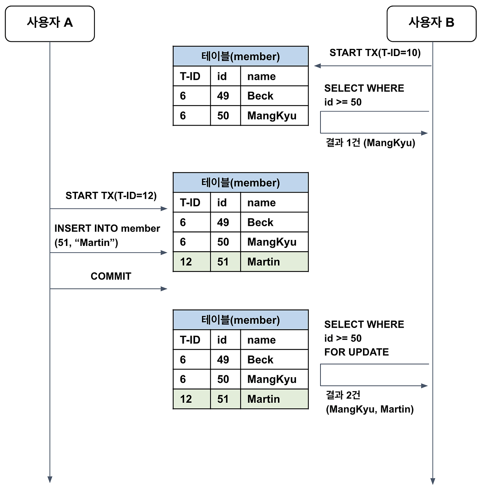

# 트랜잭션 격리 수준

 

## 목차
1. [트랜잭션 격리수준이란?](#트랜잭션-격리수준이란)
2. [데이터 관련 문제 현상](#데이터-관련-문제-현상)
3. [트랜잭션 격리 수준 종류](#트랜잭션-격리-수준-종류)
4. [성능 관련](#성능-관련)

 

## 트랜잭션 격리수준이란?

데이터베이스는 **여러 사용자가 동시에 데이터**를 읽거나 쓸 수 있음

이때 여러 트랜잭션이 **동시에 같은 데이터를 접근하면 데이터 일관성이 깨질 수 있는 문제** 생길 수 있음

한 트랜잭션 데이터 변경했는데 다른 트랜잭션도 동시에 변경 시 **서로의 변경사항 모른 채 데이터 덮어쓸 수 있음**

 

**트랜잭션의 고립성이 제대로 유지되려면** 

무조건 Locking으로 동시에 수행되는 수많은 트랜잭션들을 순서대로 처리하는 방식으로 구현해야 함

이때 동시에 처리할 수 있는 트랜잭션의 수가 줄어들어서 DBMS의 퍼포먼스가 하락한다는 단점 있음

 

그렇다고 해서, **성능을 높이기 위해 Locking의 범위를 줄인다면**, 잘못된 값이 처리될 문제가 발생 가능

 

이를 해결하기 위해 DBMS의 동시성 제어는 **여러 종류의 격리 수준을 제공**

개발자가 **데이터 정합성과 성능 사이에서 어느 정도 트레이드** 할 수 있게 함

 

ACID 원칙 중 격리성을 충족하는 것이 목적

**다양한 격리 수준을 제공해 서비스의 특성과 요구에 맞는 성능과 데이터 일관성의 타협**을 할 수 있게하는 것

트랜잭션 격리 수준은 “동시성”과 “일관성” 사이의 균형점을 결정하는 데이터베이스 설정

 

트랜잭션 격리 수준은 **각 트랜잭션이 다른 트랜잭션의 작업 결과를 언제 읽을 수 있는지 정하는 것**

특정 트랜잭션이 다른 트랜잭션에서 변경하거나 조회하는 데이터를 볼 수 있게 허용할지 여부를 결정하는 것

- 격리 수준이 낮으면 동시성(성능)은 좋아지지만, 일관성 문제가 늘어남
- 격리 수준이 높으면 일관성은 좋아지지만, 성능(동시 처리 수)이 떨어짐

 

| **격리 수준**       | **Dirty Read** | **Unrepeatable Read** | **Phantom Data Read** |
| ------------------- | -------------- | --------------------- | --------------------- |
| **READ UNCOMMITED** | O              | O                     | O                     |
| **READ COMMITTED**  | X              | O                     | O                     |
| **REPEATABLE READ** | X              | X                     | O                     |
| **SERIALIZABLE**    | X              | X                     | X                     |

 

## 데이터 관련 문제 현상

### DIRTY READ

**A 트랜잭션에서 아직 COMMIT 하지 않은 데이터를 B 트랜잭션에서 읽게 허용**해서 읽는 현상

A 트랜잭션에서 **ROLLBACK 하게 되면 문제가 발생**

B 트랜잭션에서는 실제로 존재하지 않는 잘못된 데이터를 읽고 처리하게 되어 데이터 일관성 문제가 됨

 

가장 낮은 격리 수준인 READ_UNCOMMITED에서 발생함

READ_COMMITED 격리 수준부터는 발생하지 않음

 

### UNREPEATABLE READ

A 트랜잭션이 반복적으로 SELECT 쿼리를 실행함

**SELECT 쿼리 중간에 B 트랜잭션이 데이터를 수정, 삭제하고 COMMIT함**

A 트랜잭션이 다음 SELECT 쿼리를 실행했을 때 이전과 결과가 상이하게 나타나는 일관성이 깨지는 문제

트랜잭션이 처음 읽은 값과 나중에 읽은 값이 일치하지 않아 일관성이 깨지는 문제

 

READ_UNCOMMITED, READ_COMMITED 격리 수준에서 발생할 수 있음

REPEATABLE_READ 격리 수준 이상부터는 발생하지 않음

 

### Phantom Data Read

**A 트랜잭션이** **조건을 걸어 특정 범위의 데이터를 여러 번 조회**함

조회 중간에 **B 트랜잭션이** **특정 범위에 해당하는 데이터를 INSERT** 함

A 트랜잭션이 다음에 조회를 할 때 이전과 결과가 상이하게 나타나는 일관성이 깨지는 문제 

 

**트랜잭션 중간에 다른 트랜잭션에서 새로운 데이터 INSERT를 허용**하기 때문에 나타나는 문제

READ UNCOMMITTED, READ COMMITTED, REPEATABLE READ 격리 수준에서 발생할 수 있음

SERIALIZABLE 격리 수준에서는 발생하지 않음

 

MySQL은 REPEATABLE READ 격리 수준에서 **gap lock 같은 기법으로 Phantom Read 발생을 거의 차단**

 

## 트랜잭션 격리 수준 종류

트랜잭션 격리 수준은 4종류가 있음

격리 수준이 낮은 순서대로 아래와 같음

- READ_UNCOMMITED
- READ COMMITTED
- REPEATABLE READ
- SERIALIZABLE

 

각 격리 수준에 대해 자세히 보자. 

 

### READ_UNCOMMITED

**다른 트랜잭션이 COMMIT 되지 않은 변경 데이터조차 접근할 수 있는 격리 수준** 

다른 트랜잭션의 작업이 COMMIT 또는 ROLLBACK 되지 않아도 즉시 보이게 됨

 

트랜잭션의 작업이 완료되지 않았는데 다른 트랜잭션에서 볼 수 있는 문제인 **Dirty Read 발생**

Dirty Read 상황은 시스템에 상당한 버그를 초래 가능

 

데이터 무결성에 심각한 문제가 생기고, 잘못된 비즈니스 로직 처리나 오류 생기기 쉬움

성능상으로는 가장 좋고 동시성이 높지만 데이터 일관성 면에서 문제가 많음

대부분의 데이터베이스는 이 격리 수준을 기본으로 사용하지 않거나 권장 X

 

### READ_COMMITED

**다른 트랜잭션이 COMMIT한 변경 내용만 읽을 수 있는 격리 수준**

따라서 READ_UNCOMMITED 격리 수준에서 발생 가능한 Dirty Read는 방지됨

 

A 트랜잭션이 데이터를 변경하고 **COMMIT 하지 않고 있으면 테이블이 먼저 갱신**됨

그리고 **undo log에 변경 전 데이터가 백업**이 됨

 

이때 B 트랜잭션이 데이터에 접근해 조회할 수는 있음 

하지만 COMMIT된 데이터만 조회할 수 있어 **undo log에서 변경 전의 데이터를 찾아서 반환**하게 됨

A 트랜잭션이 COMMIT 하면 이제 B 트랜잭션이 읽었을 때 새롭게 변경된 값을 참조할 수 있는 것

 

**SELECT 문장이 수행되는 동안 해당 데이터에 Shared Lock**이 걸림

하지만 Shared Lock은 트랜잭션이 종료되는 commit, rollback 시점까지 유지되는 것은 아님

**SELECT문이 처리되는 순간만 Shared Lock이 설정됨**

그래서 트랜잭션 동안 다른 트랜잭션이 해당 데이터를 수정하는 것을 막지 않음

 

따라서 같은 트랜잭션 내에서 한번 데이터 읽고 다시 데이터 읽을 때 **중간에 다른 트랜잭션이 데이터 변경 후 COMMIT 하면 데이터 값이 달라질 수 있음**

이런 문제를 **Non Repeatable Read**라고 함

 

역시 **다른 트랜잭션이 중간에 값을 삽입하거나 삭제할 수 있어 결과가 변화**할 수 있음

이런 문제를 **Phantom Read**라고 함

 

**가장 많이 사용되는 격리 수준**임

SQL Server, Oracle DBMS의 기본 격리 수준임

많은 데이터베이스의 default 값

 

**성능과 데이터 일관성 간의 균형**을 이룸

데이터 무결성은 어느 정도 확보하지만, 반복 읽기 일관성은 보장하지 않아 일부 부정합 발생 가능

금전적 계산 등 정확성이 매우 중요한 서비스에서는 Repeatable Read 이상의 격리 수준을 권장

일반 CRUD나 조회가 많은 서비스에서는 READ COMMITTED가 적합한 선택

 

### REPEATABLE_READ

**트랜잭션이 완료될 때까지 SELECT 문장이 사용하는 모든 데이터에 Shared Lock이 걸리는 격리 수준**

트랜잭션이 범위 내에서 조회한 데이터 내용이 항상 동일함을 보장함

 

일반적인 RDBMS는 변경 전의 레코드를 undo 공간에 백업

동일한 레코드에 대해 여러 버전의 데이터가 존재한다고 함

이를 **MVCC**(Multi-Version Concurrency Control, 다중 버전 동시성 제어)라고 함

 

각각의 트랜잭션은 순차 증가하는 **고유한 트랜잭션 번호**가 존재

백업 레코드에는 **어느 트랜잭션에 의해 백업되었는지 트랜잭션 번호를 함께 저장**

백업 레코드는 해당 데이터가 불필요하다고 판단되는 시점에 주기적으로 삭제함

 

REPEATABLE READ는 **트랜잭션 번호를 참고하여 자신보다 먼저 실행된 트랜잭션의 데이터만을 조회**

테이블에 자신보다 **이후에 실행된 트랜잭션의 데이터가 존재한다면 undo log를 참고해서 데이터를 조회**

따라서 어떤 트랜잭션이 읽은 데이터를 다른 트랜잭션이 수정하더라도 동일한 결과를 반환할 것을 보장

 

Repeatabe_Read는 **트랜잭션 시작한 순간에 undo log를 사용해 non repeatable read 문제를 해결**한 것

Read_Commited는 읽기 쿼리 실행 순간에 undo log를 사용

그래서 트랜잭션 중간에 값 수정되면 다시 읽었을 때 달라지는 것

 

새로운 레코드가 추가되는 경우에 부정합이 생길 수 있음

SELECT로 조회한 경우 트랜잭션이 끝나기 전에 다른 트랜잭션에 의해 추가된 레코드가 발견될 수 있음

이를 Phantom Read라고 함

하지만 **MVCC를 사용하면 트랜잭션 동안 undo log가 유지되면서 Phantom Read를 해결**할 수 있다. 

 

**MySQL에서는 gap lock이라는 메커니즘 사용해 Phantom Read 방지**

gap lock은 한 트랜잭션이 조회한 데이터 범위에 lock을 걸어버림

다른 트랜잭션에서 해당 데이터 범위에 해당하는 값 넣을 수 없음

따라서 Phantom Read 방지

 

다만 **쓰기 lock을 사용해서 데이터를 읽으면 undo log에서 데이터 읽지 않는다**. 

실제 테이블에서 데이터를 가져와 중간에 다른 트랜잭션이 데이터 추가하면 Phantom Read 일어난다. 

이러한 **특수한 상황을 제외하고는 Repeatable_Read에서는 Phantom Read도 일어나지 않는다.** 

 

### Serializable

**모든 트랜잭션이 마치 순차적으로 하나씩만 실행되는 것과 같은 결과를 보장하는 격리 수준**

동시에 여러 트랜잭션이 동작하더라도 항상 실제 수행 결과가 트랜잭션들을 하나씩 순서대로 실행한 것과 완전히 같아야 함

 

Dirty Read, Non-repeatable Read, Phantom Read 등 모든 **이상 현상을 완벽히 차단.**

트랜잭션이 하나의 or 특정 범위의 데이터에 접근하고 있다면 **다른 트랜잭션들은 동시에 접근, 수정, 추가, 삭제 불가능**

모든 쿼리에 대해 Range Lock or Shared Lock 걸어 다른 트랜잭션이 데이터 수정, 삽입, 삭제 못하게 막음

Phantom Read까지 방지해야 하므로, 단순히 읽는 순간뿐만 아니라 트랜잭션 전체에 대해 잠금이 지속

 

**여러 트랜잭션을 직렬화하여 처리하므로, 동시 처리 성능이 가장 떨어짐**

다른 트랜잭션이 같은 데이터에 접근을 시도하면 **대기하거나, 데드락 발생 위험이 높아짐.**

 

금융, 회계, 재고와 같이 데이터 일관성과 정합성이 100% 보장되어야 하는 경우에 주로 사용.

성능 Trade Off가 극심하므로 실제로는 매우 제한적으로 사용.

동시성이 중요한 DB에서는 거의 사용하지 않음

낮은 단계의 격리 수준과 함께 어플리케이션 단계에서 낙관적, 비관적 락 등을 활용해 처리하는 경우 많음

 

## 성능 관련

트랜잭션 격리 수준에서 성능은 매우 중요한 고려사항

 

| 트랜잭션 격리 수준 | 데이터 일관성 | 동시 처리 성능 |
| ------------------ | ------------- | -------------- |
| 높음               | 강함          | 낮음           |
| 낮음               | 약함          | 높음           |

 

### 격리 수준별 성능 특성

| **격리 수준**    | **성능 특성**                                          | **동시성 문제/트랜잭션 충돌** | **주의점**                                       |
| ---------------- | ------------------------------------------------------ | ----------------------------- | ------------------------------------------------ |
| READ UNCOMMITTED | **가장 빠름** (락 거의 없음)                           | 매우 높음                     | Dirty Read, 데이터 신뢰성 문제                   |
| READ COMMITTED   | 빠름, 대부분의 OLTP 서비스 기본                        | 높음                          | Non-repeatable Read,   Phantom Read 발생 가능 |
| REPEATABLE READ  | 성능 적당, 일관성 보장   (읽기는 스냅샷, 쓰기는 락) | 중~높음                       | Gap Lock 등으로 일부 트랜잭션 간 충돌 가능       |
| SERIALIZABLE     | **가장 느림**, 직렬 처리에 가까움                      | 낮음                          | 응답 지연, 데드락(교착상태) 발생 가능            |

 

### 성능에 영향을 주는 요소

- **Lock 사용**
    - 격리 수준 높아질수록 많은 데이터에 Lock 걸림
    - 동시 처리 트랜잭션 줄어듬
    - 트랜잭션 충돌, 대기, DeadLock 가능성 높힘
- **MVCC 활용**
    - MVCC 지원 DBMS는 읽기 작업에서 Lock을 적게 검
    - Repeatable Read 격리 수준 사용해도 동시성 높힐 수 있음
- **DeadLock**
    - Serializable, Repeatable Read에서 장기 트랜잭션, 복잡한 쿼리 많으면 Deadlock 위험 증가함
    - Lock이 많아지고 오래 유지되면 Deadlock 위험 증가함
- **트랜잭션 지속 시간**
    - 높은 격리 수준에서 트랜잭션이 길어질수록 다음 문제들 나타남
        - Lock 점유 시간은 늘어남
        - 시스템 전반 처리량이 감소함

 

### 격리 수준 사용 팁

- **READ_COMMITTED**
    - 읽기 성능이 중요한 경우 사용
    - 증가하는 Lock 대기 없이 빠른 대규모 조회 가능
    - 일반 CRUD나 조회가 많은 서비스에서 적합
- **REPEATABLE_READ 이상**
    - 데이터 정합성 중요한 경우
    - MVCC 적용하면 더욱 좋음
    - 하지만 필요 이상으로 트랜잭션 오래 유지하지 않도록 주의
- **대규모 쓰기 작업 or 동시성 중요 시**
    - 트랜잭션 짧게 유지
    - 필요 없는 격리 수준 사용 X
- **Serializable은 최소화**
    - 극히 일부분에서만 필요할 때 잠깐 사용

 

## 참고 자료 & 같이 보면 좋을 자료

- https://mangkyu.tistory.com/299
- https://mangkyu.tistory.com/300
- https://mangkyu.tistory.com/288