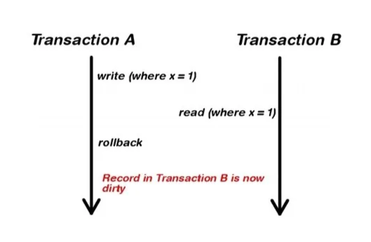
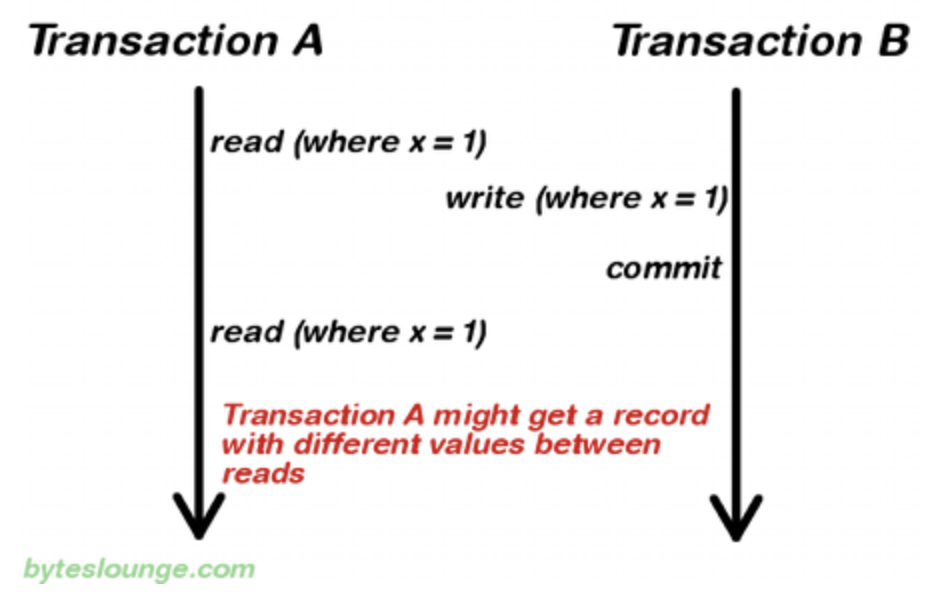
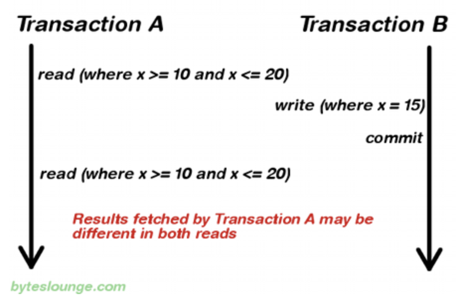

# 데이터 관련 문제 현상

 

## 목차
- [데이터 관련 문제 현상](#데이터-관련-문제-현상)
  - [목차](#목차)
  - [데이터 관련 문제 현상](#데이터-관련-문제-현상-1)
    - [DIRTY READ](#dirty-read)
    - [UNREAPTABLE READ](#unreaptable-read)
    - [Phantom Data Read](#phantom-data-read)

 

## 데이터 관련 문제 현상

### DIRTY READ

**A 트랜잭션에서 아직 COMMIT 하지 않은 데이터를 B 트랜잭션에서 읽게 허용**해서 읽는 현상

A 트랜잭션에서 **ROLLBACK 하게 되면 문제가 발생**

B 트랜잭션에서는 실제로 존재하지 않는 잘못된 데이터를 읽고 처리하게 되어 데이터 일관성 문제가 됨

 

가장 낮은 격리 수준인 READ_UNCOMMITED에서 발생함

READ_COMMITED 격리 수준부터는 발생하지 않음

 

### UNREAPTABLE READ

A 트랜잭션이 반복적으로 SELECT 쿼리를 실행함

**SELECT 쿼리 중간에 B 트랜잭션이 데이터를 수정, 삭제하고 COMMIT함**

A 트랜잭션이 다음 SELECT 쿼리를 실행했을 때 이전과 결과가 상이하게 나타나는 일관성이 깨지는 문제

트랜잭션이 처음 읽은 값과 나중에 읽은 값이 일치하지 않아 일관성이 깨지는 문제

 

READ_UNCOMMITED, READ_COMMITED 격리 수준에서 발생할 수 있음

REPEATABLE_READ 격리 수준 이상부터는 발생하지 않음

 

### Phantom Data Read

**A 트랜잭션이** **조건을 걸어 특정 범위의 데이터를 여러 번 조회**함

조회 중간에 **B 트랜잭션이** **특정 범위에 해당하는 데이터를 INSERT** 함

A 트랜잭션이 다음에 조회를 할 때 이전과 결과가 상이하게 나타나는 일관성이 깨지는 문제 

 

**트랜잭션 중간에 다른 트랜잭션에서 새로운 데이터 INSERT를 허용**하기 때문에 나타나는 문제

READ UNCOMMITTED, READ COMMITTED, REPEATABLE READ 격리 수준에서 발생할 수 있음

SERIALIZABLE 격리 수준에서는 발생하지 않음

 

MySQL은 REPEATABLE READ 격리 수준에서 **gap lock 같은 기법으로 Phantom Read 발생을 거의 차단**

