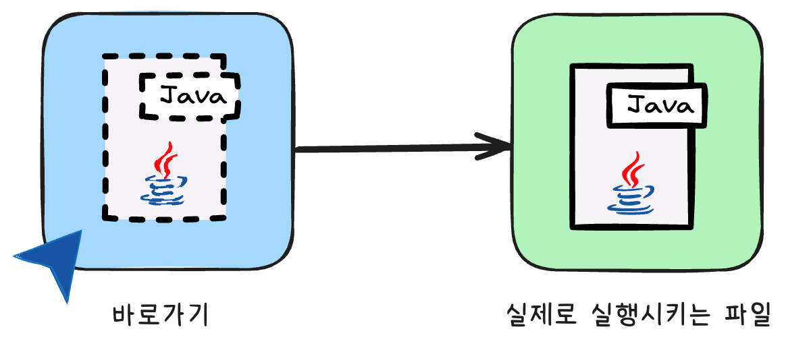

# View (뷰)

View란 데이터베이스에서 저장된 데이터를 **가상 테이블 형태**로 표현하는 것입니다.

실제 데이터를 저장하고 있지는 않지만 테이블처럼 행과 열을 가지고 있습니다.

**가상 관계(virtual relationship)** 또는 **가상 릴레이션 변수(virtual relvar)** 로도 알려져 있습니다.



뷰는 바로가기를 생각하면 이해가 쉽습니다.

바로가기는 실제 파일을 저장하고 있지는 않지만 경로를 가리켜서, 바로가기를 클릭했을 때 경로를 따라 실제 파일을 열 수 있습니다.

이와 같이 뷰는 실제 테이블을 저장하고 있지는 않지만, 쿼리를 통해 실제 테이블의 데이터를 조회할 수 있는 가상의 테이블입니다.

## 뷰의 특징

### 가상 테이블
저장된 데이터를 기반으로 쿼리에 따라 동적으로 생성되는 가상 테이블입니다. 따라서 뷰의 행을 데이터베이스에 명시적으로 저장하지 않습니다.

대신 뷰 자체의 정의를 저장하며, 뷰가 쿼리에서 나타날 때마다 저장된 쿼리 표현식으로 대체되어 재계산됩니다.

### 중첩 뷰
**이미 만들어진 뷰를 바탕으로** 새로운 뷰를 만들어낼 수 있습니다.

### 추상화
사용자는 뷰가 가상이라는 것을 인지할 필요 없이 **테이블처럼 다룰 수** 있어야 합니다.

예시)
1. 개발자 A가 `v_customer`라는 뷰를 만들어 동료들에게 제공했습니다.
2. 동료 개발자 B는 `v_customer` 뷰를 사용하여 고객 정보를 조회합니다.
3. 하지만 동료 개발자 B는 `v_customer`가 실제 테이블이 아니라는 것을 알 필요가 없습니다.

### 결론
뷰는 사용자가 **복잡한 내부를 신경 쓰지 않고**, 진짜 테이블처럼 간단하고 안전하게 사용할 수 있도록 도와주는 중요한 `데이터베이스 객체`입니다.

### 주의사항
뷰는 가상의 테이블이기 때문에, 다음과 같은 주의사항이 있습니다.

1. **성능 문제**: 복잡한 쿼리를 포함하는 뷰는 성능 저하를 초래할 수 있습니다. 특히, 대량의 데이터를 처리하는 경우에는 더욱 그렇습니다.

2. **업데이트 제한**: 뷰를 통한 데이터 수정(UPDATE, INSERT, DELETE)에는 엄격한 제약이 따릅니다. 모든 뷰가 데이터 수정을 지원하는 것은 아니며, 여러 테이블을 조인하거나 집계 함수를 사용한 복잡한 뷰는 데이터 수정이 불가능한 경우가 많습니다.

3. **의존성 문제**: 뷰가 의존하는 기본 테이블의 구조가 변경되면, 뷰가 정상적으로 작동하지 않을 수 있습니다. 따라서 뷰를 정의할 때는 기본 테이블의 구조를 충분히 고려해야 합니다.

---

## 뷰의 목적 및 장점

### 추상화 및 단순화
복잡한 기본 테이블 구조를 숨기고, 단순화되고 이해하기 쉬운 형태로 데이터를 제공하는 것이 주 목적입니다.

복잡하고 자주 사용되는 쿼리를 뷰로 만들어두면, 뷰 이름만으로 쿼리 결과를 조회할 수 있습니다.

### 맞춤형 데이터 제공
사용자가 필요로 하는 데이터의 특정 부분만 접근을 허용합니다.

이를 통해 사용자와 시스템 간의 상호작용을 단순화하고, 필요한 데이터만을 제공하여 효율성을 높입니다.

### 보안 강화
추상화된 데이터를 노출시키기 때문에 실제 테이블에 존재하는 **민감한 정보를 숨긴 채로 노출**시킬 수 있습니다.
(예시: 비밀번호)

### 재사용성
자주 사용되는 쿼리를 뷰로 만들어두면, 뷰 이름만으로 쿼리 결과를 조회할 수 있습니다.

### 논리적 데이터 독립성
뷰를 정의할 때 사용했던 테이블(source)의 논리적 구조가 변경되더라도, 뷰를 사용하여 동일한 데이터 뷰를 사용자에게 제공할 수 있습니다.

---

# 구체화된 뷰(Materialized View)

구체화된 뷰는 일반 뷰와 달리, **쿼리 결과를 실제 데이터베이스에 저장**하는 뷰입니다.

이를 통해 성능을 향상시키고, 복잡한 쿼리를 미리 계산하여 디스크에 캐시해두는 장점이 있습니다.

## 특징 및 장점

### 실제 데이터 저장
구체화된 뷰는 쿼리 결과를 물리적으로 저장하므로, 조회 성능이 향상됩니다.

### 주기적 갱신
구체화된 뷰는 기본 테이블의 데이터 변경에 따라 주기적으로 갱신되어야 합니다.

### 복잡한 쿼리 최적화
집계 함수, 조인 등이 포함된 복잡한 쿼리의 결과를 미리 계산하여 저장함으로써 응답 시간을 크게 단축시킵니다.

## 단점

### 저장 공간 오버헤드
구체화된 뷰는 쿼리 결과를 물리적으로 저장하므로, 추가적인 저장 공간이 필요합니다.

### 업데이트 오버헤드(뷰 유지보수)
기본 테이블의 데이터가 변경될 때마다 구체화된 뷰를 갱신해야 하므로, 갱신 비용이 발생합니다.

### 데이터 일관성 문제
구체화된 뷰는 기본 테이블의 데이터 변경 사항을 즉시 반영하지 않으므로, 데이터 일관성 문제가 발생할 수 있습니다.

- **Eager/Immediate 갱신**
    - 기본 데이터가 업데이트될 때 즉시 뷰를 갱신
    - 데이터 최신성을 보장
    - 업데이트 오버헤드 발생

- **Lazy/Periodic 갱신**
    - 뷰가 접근될 때 또는 주기적으로 갱신
    - 최신성을 보장하지 않음
    - 업데이트 오버헤드가 적음

### 복잡성 문제
어떤 뷰를 구체화할지 결정하고 유지보수 방식을 관리하는 것은 추가적인 복잡성을 야기합니다.

### 사용처
- 대량의 데이터를 처리할 때
- 복잡한 조인 및 집계 연산이 포함된 쿼리에서 성능을 극대화할 때
- 읽기 빈도가 높지만 약간의 데이터 불일치를 허용할 수 있을 때

---

## 사용 예시

### 뷰 생성
```sql
CREATE OR REPLACE VIEW v_developers AS
SELECT emp_id, emp_name, department, salary
FROM employees
WHERE department = '개발팀';
```

### 뷰 조회
```sql
SELECT * FROM v_developers;
```

#### 결과
| emp_id | emp_name | department | salary |
| :--- | :--- | :--- | :--- |
| 101 | 박서준 | 개발팀 | 9000 |
| 102 | 김지민 | 개발팀 | 7500 |

---

### 뷰 행 수정(조건부 가능)
```sql
UPDATE v_developers
SET salary = 9500
WHERE emp_name = '박서준';
```

#### 주의사항
데이터베이스가 뷰의 한 행과 원본 테이블의 한 행을 명확하게 매핑할 수 없으면 수정이 금지됩니다.

- JOIN으로 여러 테이블을 엮은 뷰
- GROUP BY, DISTINCT를 사용한 뷰
- SUM(), COUNT() 등 집계 함수를 사용한 뷰

#### 결과
| emp_id | emp_name | department | salary |
| :--- | :--- | :--- | :--- |
| 101 | 박서준 | 개발팀 | 9500 |

---

### 뷰 행 삭제(조건부 가능)
```sql
-- '김지민' 직원 데이터 삭제
DELETE FROM v_developers
WHERE emp_name = '김지민';
```

#### 결과
**TABLE employees**
| emp_id | emp_name | department | salary |
| :--- | :--- | :--- | :--- |
| 101 | 박서준 | 개발팀 | 9500 |
| 201 | 최은우 | 기획팀 | 8200 |

#### 주의사항
데이터베이스가 뷰의 한 행과 원본 테이블의 한 행을 명확하게 매핑할 수 없으면 삭제가 금지됩니다.

- JOIN으로 여러 테이블을 엮은 뷰
- GROUP BY, DISTINCT를 사용한 뷰
- SUM(), COUNT() 등 집계 함수를 사용한 뷰

---

### 뷰 행 삽입(제약 조건이 많음)
```sql
-- department 컬럼이 포함되지 않은 뷰 생성
CREATE VIEW v_dev_names AS
SELECT emp_id, emp_name FROM employees WHERE department = '개발팀';

-- 삽입 시 오류 발생
INSERT INTO v_dev_names (emp_id, emp_name) VALUES (103, '이신입');
```

#### 오류 원인
employees 테이블의 department 컬럼은 NOT NULL입니다.
이 뷰는 해당 컬럼을 포함하지 않아 값을 넣어줄 방법이 없으므로 데이터베이스가 INSERT를 거부합니다.

### 삽입 시 주의사항 예시
```sql
INSERT INTO v_developers (emp_id, emp_name, department, salary)
VALUES (202, '오기획', '기획팀', 7000);
```

#### 결과

**TABLE employees**
| emp_id | emp_name | department | salary |
| :--- | :--- | :--- | :--- |
| 101 | 박서준 | 개발팀 | 9500 |
| 201 | 최은우 | 기획팀 | 8200 |
| **202** | **오기획** | **기획팀** | **7000** |

**VIEW v_developers**
| emp_id | emp_name | department | salary |
| :--- | :--- | :--- | :--- |
| 101 | 박서준 | 개발팀 | 9500 |

삽입은 성공했지만 뷰에는 보이지 않습니다.

뷰는 `개발팀`에 속한 직원들만 보여주기 때문에 `오기획`은 보이지 않습니다.

이런 혼란을 방지하기 위해 뷰에 행을 삽입하는 것은 권장되지 않습니다. 

만약 삽입이 필요하다면 **WITH CHECK OPTION**을 사용하여 뷰의 조건에 맞는 삽입만 허용할 수 있습니다.

```sql
CREATE VIEW v_developers AS
SELECT emp_id, emp_name, department, salary
FROM employees
WHERE department = '개발팀'
WITH CHECK OPTION;
```

WITH CHECK OPTION은 WHERE 조건에 맞지 않는 삽입, 수정을 막기 때문에, 위 예시에서 `department`가 `개발팀`이 아닌 행을 삽입하려고 하면 오류가 발생합니다.

---

## 뷰 작업별 정리

| 작업 | 설명 | 주의사항 및 조건 | 
| :--- | :--- | :--- |
| **Read** | 뷰의 주된 목적이며 항상 가능합니다. | 없음 |
| **Update** | 뷰의 행을 수정하면 원본 테이블의 행이 수정됩니다. | 1:1 대응이 가능한 단순 뷰에서만 가능<br>(JOIN, GROUP BY, DISTINCT 등 사용 시 불가) |
| **Delete** | 뷰의 행을 삭제하면 원본 테이블의 행이 삭제됩니다. | UPDATE와 동일한 제약 조건을 가집니다. |
| **Insert** | 뷰를 통해 행을 삽입하면 원본 테이블에 행이 추가됩니다. | 제약이 가장 많음. 원본 테이블의 NOT NULL 컬럼을 모두 포함해야 하며,<br>WITH CHECK OPTION 사용이 권장됩니다. |

---

## 결론

뷰는 데이터베이스에서 중요한 추상화 도구로서, 복잡한 쿼리를 단순화하고 보안을 강화하며 데이터 독립성을 제공합니다. 일반 뷰와 구체화된 뷰 각각의 특성을 이해하고 적절한 상황에서 활용한다면, 효율적이고 안전한 데이터베이스 운영이 가능합니다.

SELECT * FROM v_monthly_vip_customers 
ORDER BY total_purchase_amount DESC;

| emp_id | emp_name | department | salary | validation |
| :--- | :--- | :--- | :--- | :--- |
| 101 | 박서준 | 개발팀 | 9500 | true |
| 201 | 최은우 | 기획팀 | 8200 | true |
| **202** | **오기획** | **기획팀** | **7000** | false | 
