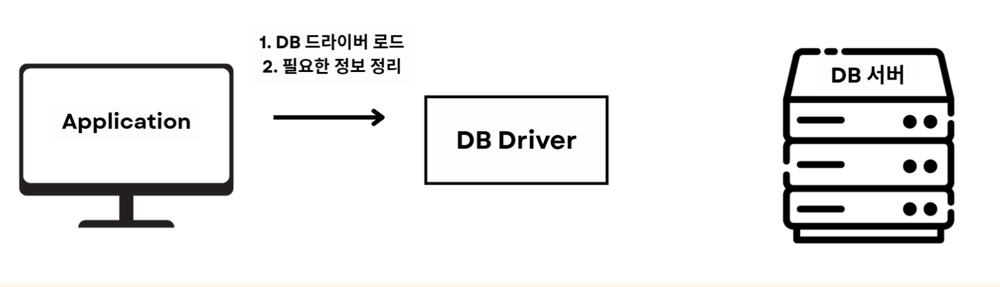
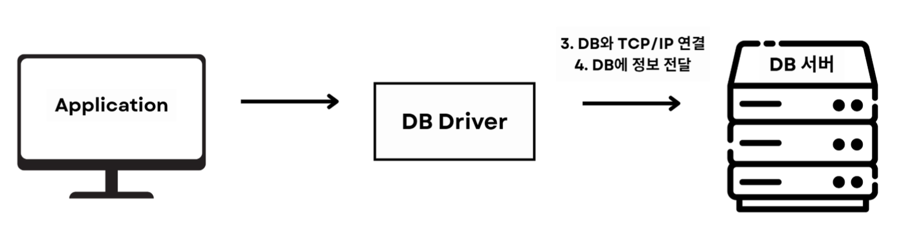
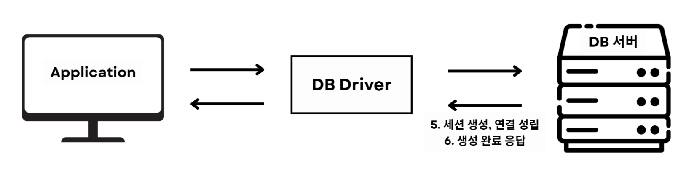
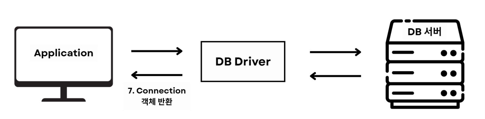
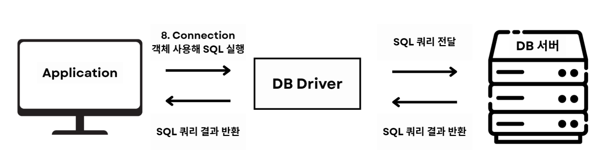
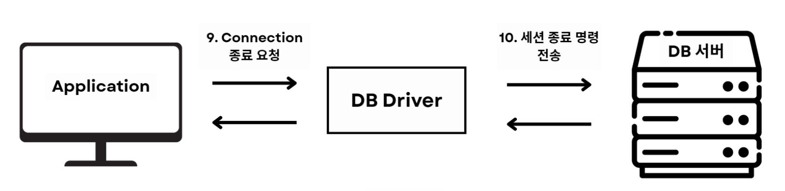
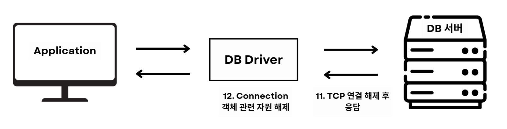

# Connection

 

## 목차
- [Connection](#connection)
  - [목차](#목차)
  - [Connection](#connection-1)
    - [Connection이란?](#connection이란)
    - [Connection만 사용할 때 동작 과정](#connection만-사용할-때-동작-과정)
    - [Connection만 사용 시 발생하는 문제점](#connection만-사용-시-발생하는-문제점)

 

## Connection

### Connection이란?

application과 database간 통신을 가능하게 하는 연결 수단

connection을 가지고 있어야 application이 SQL 실행, 결과 반환 가능 

 

### Connection만 사용할 때 동작 과정

1. Application이 사용할 DBMS의 드라이버를 로드
2. Application이 connection 연결에 필요한 정보 준비 
    1. ex: DB 서버 주소, 사용자명, 비밀번호 등
3. Application이 필요한 정보를 가지고 연결을 요청
4. DB 드라이버가 DB와 TCP/IP를 통해 연결 
    1. 3 way handshake 수행
    2. DB 드라이버와 DB 서버 사이 신뢰성 있는 통신 채널 성립 위해 
5. DB 드라이버는 DB에 준비한 정보 전달 
6. DB 서버는 전달받은 정보를 확인 후 인증에 성공하면 세션을 생성하고 연결을 성립
7. DB는 connection 생성이 완료되었다는 응답을 DB 드라이버에게 보냄
8. DB 드라이버는 Connetion 객체를 생성해 Applicaion에게 반환
9. Application에서 Connection 객체 사용해 SQL 쿼리 실행 요청 및 결과 반환
    1. CRUD 같은 SQL 실행 요청 보냄
    2. Application → 드라이버 → 네트워크(TCP/IP) → DB 서버로 SQL 쿼리가 전송
    3. DB 서버가 SQL 실행하고 결과를 응답
    4. DB 서버 → 네트워크(TCP/IP) → 드라이버 → Application으로 SQL 쿼리 결과가 전송
10. Application이 Connection 종료 요청을 드라이버에게 보냄
11. 드라이버가 DB 서버에게 세션 종료 명령 전송
12. 드라이버, DB 서버 연결 종료
    1. DB 서버는 마지막으로 커넥션 종료 응답을 보냄
    2. 드라이버와 DB 서버 간의 TCP 연결이 해제(소켓 close)됨
13. 드라이버 측 리소스 정리
    1. 드라이버는 커넥션 객체와 관련된 자원(스트림, 메모리 등)을 모두 해제

 

 

### Connection만 사용 시 발생하는 문제점

1. **연결 생성, 삭제 비용으로 인한 성능 저하**
    1. 커넥션은 단순한 객체 생성 X
    2. DB 연결은 네트워크 연결, 인증, 세션 초기화 과정 필요
    3. 매 요청마다 새로 커넥션 생성해 연결을 새로 만들면 아래 문제 발생
        1. 처리량이 매우 떨어짐 → 성능 저하
        2. 응답 속도가 느려짐
2. **DB 서버 부하 증가**
    1. 매 요청마다 연결 새로 만들고 삭제하면 DB 서버는 매번 세션 생성, 삭제
    2. 세션 생성, 삭제는 DB 서버 부하 증가 시킴
    3. 연결 폭증 시 Too many connections 오류 발생 가능
3. **자원 누수 및 안정성 문제**
    1. 커넥션을 제대로 닫지 않거나 예외 처리 미흡 시 문제 발생
    2. 커넥션이 해제되지 않고 누적되어 DB 자원 낭비
    3. DB 자원 낭비는 시스템 장애 유발 가능
4. **스파이크 트래픽 대응 불가**
    1. 갑자기 요청이 몰리면 순간적으로 DB에 연결 폭탄을 날려 DB 다운 가능
    2. DB 서버가 동시에 감당해야 하는 연결 수가 급증 가능
    3. DB의 최대 연결 수 제한에 쉽게 도달
    4. 더 이상 연결을 받을 수 없는 상태됨
5. **커넥션 재사용 불가**
    1. 매번 커넥션 새로 연결하니 지연 시간 변동이 큼
    2. 성능 예측이 어려워짐