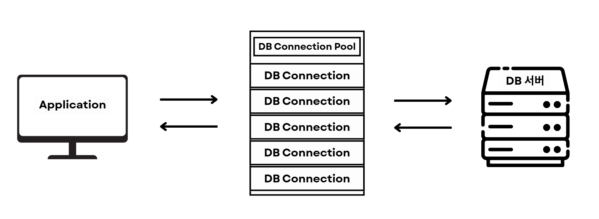
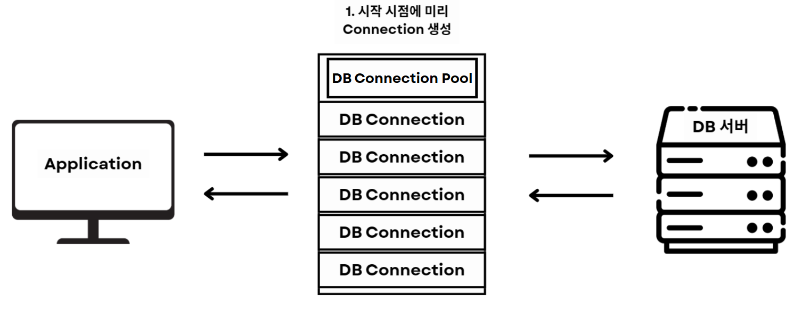
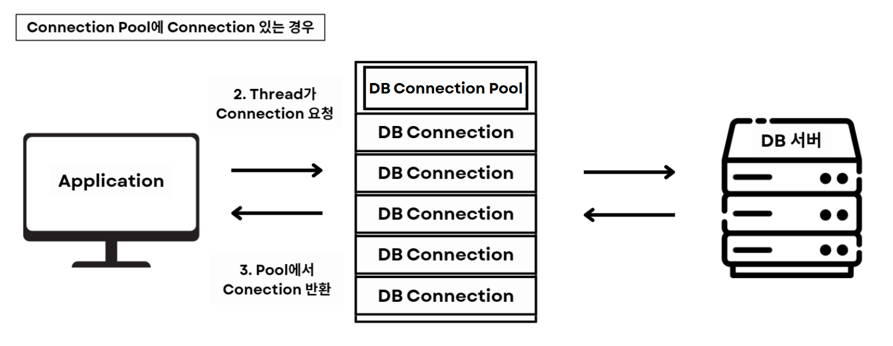
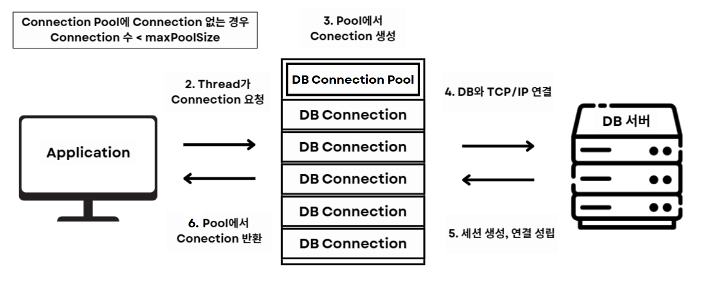
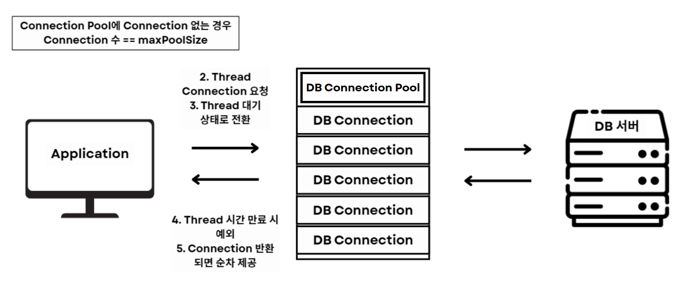
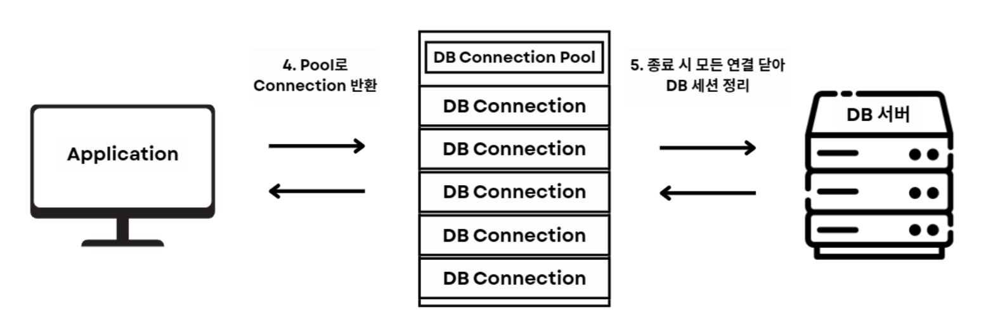

# Connection Pool

 

## 목차
- [Connection Pool](#connection-pool)
  - [목차](#목차)
  - [Conection Pool](#conection-pool)
    - [Connection Pool이란?](#connection-pool이란)
    - [Connection Pool 동작 과정](#connection-pool-동작-과정)
    - [Connection Pool 장점, 문제 해결 방법](#connection-pool-장점-문제-해결-방법)
    - [Connection Pool 발생 가능 문제](#connection-pool-발생-가능-문제)

 

## Conection Pool

### Connection Pool이란?

Connection 객체를 Application 실행 시 미리 일정 수만큼 생성

생성 후 pool에 저장해두고, 필요할 때마다 이 Connection 할당받아 사용한 뒤 반환하는 기법

Connection = DB 연결을 미리 만들어 둔 저장소

 

위에서 본 Connection만 사용해 직접 DB와 연결할 때 발생하는 문제점 때문에 필요

 

 

### Connection Pool 동작 과정

1. Application 시작 시점에 Pool에 미리 지정한 개수의 Connection을 생성
    1. Pool에 있는 Connection은 TCP/IP로 DB와 연결되어 있는 상태
2. Application의 Thread가 Connection 요청
    1. Connection Pool에 Connection 있는 경우
        1. Pool에서 사용 가능한 Connection 하나 반환
            1. Application Thread는 받은 Connection으로 DB에 접근
            2. Connection Pool 각자 방식 따라 Connection 찾아 제공
            3. 대표적인 Connection Pool 구현체인 Hickari CP는 이전에 사용한 Connection 확인 후 우선 제공
    2. Connection Pool에 Connection 없는 경우
        1. 현재 생성된 Connection 수 < maxPoolSize
            1. 새 Connection 생성해 할당
        2. 현재 생성된 Connection 수 == maxPoolSize
            1. Thread가 대기 상태로 전환
            2. 다른 Thread가 Connection 반납하기를 기다림
            3. 지정한 timeout 시간까지 대기하다 시간 만료되면 예외 던짐
            4. Connection 반환되면 대기 상태에 있는 Thread에게 순차 제공
3. Appliation Thread가 작업 끝나면 Connection 종료하지 않고 다시 Pool로 반환
    1. 반환된 Connection은 다음 요청에서 재사용됨
4. Application 종료 시 Connection Pool은 모든 연결을 닫아 DB 세션을 정리

 

 

### Connection Pool 장점, 문제 해결 방법

**성능 향상**

- 매번 Connection 생성, 종료에 드는 overhead (TCP handshake, 인증 등) 제거
- by 미리 Connection을 생성해 재사용

**DB 서버 부하 감소**

- 동시에 연결되는 Connection 수 제한해 DB 서버에 과도한 부하 방지

**안정성 향상**

- Connection 관리 중앙 집중화해 Connection 누수 및 자원 고갈 문제 방지

**예측 가능한 자원 사용**

- Application, DB 모두 리소스 사용량 일정하게 유지

 

### Connection Pool 발생 가능 문제

**Connection 수 부족으로 인한 대기 시간 증가**

- 원인
    - Connection Pool에 미리 생성된 Connection 수가 Application 동시 요청량보다 부족한 경우
    - Connection 누수로 인해 사용 가능한 Connection 없는 경우
    - 긴 트랜 잭션이 Connection 오래 점유한 경우
- 결과
    - Connection 반환될 때까지 대기 시간 증가
    - 응답 지연, 성능 저하 발생
- 예방 방법
    - maxPoolSize를 트래픽, DB 허용 범위에 맞게 조정
    - 트랜잭션 크기 최소화
    - 모니터링으로 Active, Idle (쉬고 있는, 사용 가능한) Connection 수 추적

 

**Connection Pool 크기 너무 크게 설정**

- 원인
    - maxPoolSize를 지나치게 크게 잡읍
    - 여러 Application Thread가 동시에 DB 연결을 과다하게 생성 가능
    - Thread Pool 크기와 Connection Pool 크기 사이 불균형 발생 가능
- 결과
    - DB 허용 연결 수 초과 시 접속 거부
    - DB 메모리, CPU 사용량 폭증
    - Thread Pool 크기 < Connection Pool 크기
        - 남는 Connection은 메모리 공간만 차지
    - Thread Pool 크기, Connection Pool 크기 둘 다 늘림
        - Thread 증가로 많은 Context switching 발생
- 예방
    - 적절한 Connection Pool 크기 조절, 튜닝 필요
    - DB 최대 연결 수 고려
    - Thread Pool 크기 고려

 

**Connection 누수**

- 원인
    - Application이 마지막에 Connection 적절히 반환하지 않음
    - try-with-resources 사용 X or 예외 처리 중 close 생략
- 결과
    - Connection Pool에 반환되는 Connection 없어져 Pool 고갈
    - 모든 요청이 대기 상태에 빠져 Timeout 발생
- 예방
    - try-with-resources 사용
    - 직접 Connection 하나하나 종료할 때보다 관리는 쉽지만 여전히 누수 가능

 

**죽은 Connection 사용**

- 원인
    - DB 서버가 Connection 끊었는데 Connection Pool은 아직 살아있다고 인식
    - DB 서버 Timeout이나 네트워크 장애 등으로 끊어질 수 있음
- 결과
    - 쿼리 실행 시 오류 발생
- 예방
    - Pool에서 connection의 최대 수명을 DB 세션 timeout보다 짧게 설정