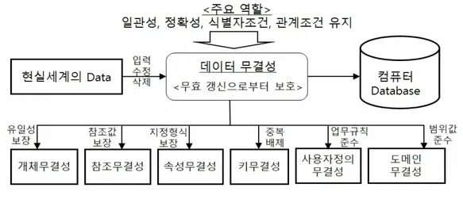

# 데이터 무결성 종류

 

## 목차
- [데이터 무결성 종류](#데이터-무결성-종류)
  - [목차](#목차)
  - [데이터 무결성 종류](#데이터-무결성-종류-1)
    - [개체 무결성](#개체-무결성)
    - [참조 무결성](#참조-무결성)
    - [도메인 무결성](#도메인-무결성)
    - [사용자 정의 무결성](#사용자-정의-무결성)
    - [고유 무결성](#고유-무결성)
    - [NULL 무결성](#null-무결성)
    - [키 무결성](#키-무결성)

 

## 데이터 무결성 종류

각 무결성에 대한 규칙을 통해 무결성 보장

 

 

### 개체 무결성

- 개념
    - Primary key에 관련된 규칙
    - 테이블의 모든 행이 고유하게 식별되어야 한다는 규칙
        - Primary key를 통해 이 규칙을 보장하는 것
- 규칙
    - Primary key는 NULL 값을 가질 수 없음
    - Primary key는 테이블 내에서 항상 고유한 값 가져야 함 (중복 값 X)
- 목적
    - 테이블 내의 특정 데이터를 유일하게 찾아냄
    - 중복된 데이터가 쌓이는 것을 방지
- 예시
    - 학생 테이블에서 학번을 Primary key로 설정
    - 모든 학생은 고유한 학번 가져야 함
    - 학번이 없는 (=NULL인) 학생은 존재할 수 없음

 

### 참조 무결성

- 개념
    - **Foreign Key** 와 관련된 규칙.
    - 두 테이블 간의 관계가 항상 일관성을 유지해야 한다는 규칙.
        - Foreign Key를 통해 보장
- 규칙
    - Foreign key 값은 참조하는 테이블의 기본 키 값 중 하나
    - 그렇지 않으면 NULL이어야 함
    - 존재하지 않는 값을 Foreign key는 참조할 수 없음
- 목적
    - 관련 테이블 간의 데이터가 일치하도록 함
    - 존재하지 않는 데이터에 대한 참조를 막음
    - 이를 통해 데이터 간 관계의 일관성 유지
- 예시
    - 수강신청 테이블의 ‘학번’은 학생 테이블의 ‘학번’을 참조하는 Foreign key
    - 학생 테이블에 존재하지 않는 학번은 수강신청 테이블에 추가될 수 없음

 

### 도메인 무결성

- 개념
    - 특정 열의 모든 값이 정해진 규칙이나 범위 내에 있어야 한다는 규칙
    - 속성 값이 미리 정해진 도메인 만족해야 한다는 규칙
        - 도메인 = 값의 범위, 데이터 타입, 허용 값, 형식 등
- 규칙
    - 도메인 지정해 도메인에 맞는 올바른 형식의 데이터만 입력되게 제한
- 목적
    - 입력되는 데이터가 유효한 형식과 값 갖도록 보장
- 예시
    - ‘성별’ 속성에는 ‘남’ or ‘여’만 입력되게 제한
    - ‘나이’ 속성에는 데이터 타입을 숫자로 지정, 범위를 0 이상으로 지정

 

### 사용자 정의 무결성

- 개념
    - 세 가지 일반적인 무결성 외의 무결성
    - 특정 비즈니스 규칙, 조직의 정책 따라 사용자가 직접 정의하는 규칙
    - 개발자가 애플리케이션, DBMS에서 업무 규칙으로 정의한 무결성
- 규칙
    - 비즈니스 로직에 맞는 복잡한 조건을 설정
- 목적
    - 특정 DB에만 적용되는 고유한 비즈니스 규칙을 DB 차원에서 강제
    - 개체/참조/도메인 무결성으로 표현되지 않는 제약 조건을 포함
- 예시
    - 상품 주문 시 ‘주문 수량’은 ‘재고 수량’ 초과할 수 없음

 

### 고유 무결성

- 개념
    - 특정 컬럼 또는 컬럼 집합에 중복되는 값 저장될 수 없도록하는 규칙
- 목적
    - 기본 키 외에도 이메일과 같은 컬럼을 고유하게 만들고 싶을 때 사용
- 예시
    - 학생 테이블에서 테이블 정의시 '이름' 속성에는 중복된 값이 없도록 제한
    - '이름' 속성에는 중복된 이름이 있어서는 안됨

 

### NULL 무결성

- 개념
    - 테이블의 특정 속성 값이 Null이 될 수 없게 하는 규칙

 

### 키 무결성

- 개념
    - 한 테이블에는 적어도 하나의 키가 존재해야 하는 규칙