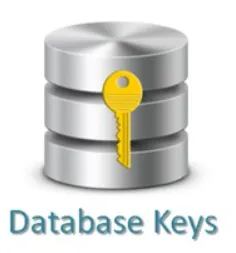

# 데이터베이스 key

 

## 목차
- [데이터베이스 key](#데이터베이스-key)
  - [목차](#목차)
  - [데이터베이스 key](#데이터베이스-key-1)
    - [개념](#개념)
    - [특징](#특징)
    - [필요성](#필요성)

 

## 데이터베이스 key

### 개념

테이블에서 각 행 (튜플, 레코드)를 유일하게 식별할 수 있게 하는 속성 또는 속성들의 집합 (열, 컬럼)

데이터베이스에서 행을 식별하기 위해 **다른 행과 구별 가능한 유일한 기준이 되는** 특정 속성을 지정한 것

 

 

각 행을 유일하게 식별할 때 외에도 아래와 같을 때 사용

- 조건에 맞는 행을 찾을 때
- 조건에 맞게 행을 정렬할 때
- 다른 테이블과 관계를 맺을 때

 

### 특징

- **유일성(Uniqueness)**:
    - 키 값은 테이블 내의 각 레코드를 유일하게 구분할 수 있어야 함.
    - 예시 : 학생 테이블에서 '학번'은 각 학생을 유일하게 식별하므로 키가 될 수 있음.
- **최소성(Minimality)**:
    - 키는 레코드를 식별하는 데 필요한 최소한의 필드로 구성되어야 함.
    - 예시 : '학번'만으로 학생을 식별할 수 있다면, '학번'과 '이름'을 굳이 묶어 키로 사용할 필요가 없음.
- **불변성(Immutability)**:
    - 키 값은 자주 변경되지 않아야 함.
    - 키 값이 자주 변경되면 데이터의 일관성과 관계 설정에 문제가 발생 가능.

 

### 필요성

- 데이터 식별
    - 각 행을 고유하게 식별 가능 (유일성을 보장)
    - 데이터 중복 방지
    - 정확성 유지
- 데이터 무결성 보장
    - 데이터 정확하고 일관성 있게 유지되게 보장
- 테이블 간의 관계 정의
    - 여러 테이블 간 관계 설정 시 필수
    - 테이블 간의 관계를 정의하여 데이터베이스의 구조 만듬
- 데이터 효율적인 검색
    - key 속성에는 종종 index 생성
    - 조인 작업의 속도를 크게 향상
- 데이터 검색, 수정, 삭제 등에서 기준으로 사용