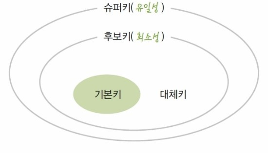
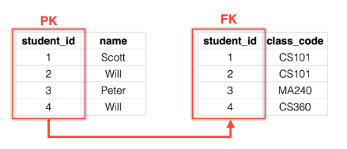

# 데이터베이스 key 종류 및 특징

 

## 목차
- [데이터베이스 key 종류 및 특징](#데이터베이스-key-종류-및-특징)
  - [목차](#목차)
  - [데이터베이스 key 종류 및 특징](#데이터베이스-key-종류-및-특징-1)
    - [super key (슈퍼 키)](#super-key-슈퍼-키)
    - [candidate key (후보 키)](#candidate-key-후보-키)
    - [primary key (기본 키)](#primary-key-기본-키)
    - [altenate key (대체 키)](#altenate-key-대체-키)
    - [foreign key (외래 키)](#foreign-key-외래-키)
    - [unique key (고유 키)](#unique-key-고유-키)
    - [composite key](#composite-key)

 

## 데이터베이스 key 종류 및 특징

 

 

### super key (슈퍼 키)

- 개념
    - 테이블 내의 튜플(행)을 유일하게 식별할 수 있는 속성(컬럼) 또는 속성들의 집합
- 특징
    - 유일성 만족 = 테이블 내 데이터를 유일하게 식별 가능
    - 최소성 보장 X (만족할수도, 안 할수도)= 불필요한 컬럼 포함 가능
- 용도
    - 모든 행을 구별할 수 있는 후보들
    - 후보키 또는 기본키 후보의 상위 개념
    - 후보키를 찾기 위한 기반으로 사용
- 무결성에 미치는 영향
    - 유일성 보장으로 중복 데이터 삽입 방지 가능
    - 직접 제약 조건으로 사용은 X
    - 데이터의 유일성 보장할 수 있는 모든 조합을 이론적으로 정의하는 역할
- 예시
    - (학번)이 후보키
    - (학번, 이름), (학번, 학과) 등 학번을 포함한 모든 조합은 슈퍼키
    - 학번으로도 모두 식별 가능한데 학번, 이름 조합으로도 가능

 

### candidate key (후보 키)

- 개념
    - 슈퍼키 중에서 최소성을 만족하는 키.
    - 기본키가 될 수 있는 후보들.
    - 데이터를 고유하게 식별할 수 있는 모든 속성 조합
- 특징
    - 유일성, 최소성 모두 만족
    - 여러 개 존재 가능
    - 모든 후보 키는 튜플을 유일하게 구분 가능
- 용도
    - DB 설계 단계에서 기본키를 선정하기 전에, 유일한 식별자가 될 수 있는 모든 속성을 파악하는 데 사용
    - 이 중 하나를 기본키로 선정
    - 나머지는 대체키가 됨
- 무결성에 미치는 영향
    - 개체 무결성의 기반
    - 후보키 중에서 기본키가 선택되기 때문
- 예시
    - 학생 테이블에서 학번과 주민등록번호는 모두 후보키가 될 수 있음

 

### primary key (기본 키)

- 개념
    - 후보키 중 하나를 대표로 지정한 키.
    - 테이블의 모든 데이터를 대표하는 단 하나의 고유 식별자.
- 특징
    - 하나의 테이블에 1개만 존재
    - 유일성 만족 = 테이블 내에서 절대 중복된 값을 가질 수 없음
    - 최소성 만족 = 행을 식별에 필요한 최소한의 속성으로만 구성
    - Not Null = NULL 허용하지 않음
- 용도
    - 행 (레코드) 식별
    - 검색, 수정, 삭제 기준
    - 다른 테이블에서 참조 시 사용
- 무결성에 미치는 영향
    - 개체 무결성 직접 보장

 

### altenate key (대체 키)

- 개념
    - 후보키 중에서 기본키로 선택되지 않은 나머지 키들
- 특징
    - 기본 키와 마찬가지로 유일성, 최소성 만족
    - NULL 불가
    - But 대표 식별자가 아닐 뿐
- 용도
    - 기본키가 변동되거나 대체 필요할 때 사용
    - 기본키 외에 데이터 검색하거나 식별할 수 있는 추가적인 수단으로 활용
    - 보통 UNIQUE 제약 조건 설정해 사용
    - 보조 식별자로 활용 가능
- 무결성에 미치는 영향
    - 개체 무결성을 간접적으로 지원
    - 해당 속성에 중복된 값이 입력되는 것을 막아 데이터의 유일성을 강화
- 예시
    - 학번을 기본키로 선택했다면, 주민등록번호는 대체키

 

 

### foreign key (외래 키)

- 개념
    - 다른 테이블의 기본키를 참조하는 키.
    - 테이블 간의 관계를 맺어주는 키.
- 특징
    - 참조하는 부모 테이블 기본키에 존재하는 값 or NULL 값만 가질 수 있음
    - = 참조 무결성 제약 적용
    - 중복된 값을 가질 수 있음
- 용도
    - 테이블 간 관계 설정
    - 두 테이블 연결 (JOIN)
- 무결성에 미치는 영향
    - 참조 무결성 보장
    - 존재 하지 않는 값 참조하는 것 막아 유령 데이터 생성 방지

 

### unique key (고유 키)

- 개념
    - 컬럼에 입력되는 값이 중복되지 않도록 제한하는 키
- 특징
    - NULL 허용(단, DBMS에 따라 다름)
    - 여러 개 가능
    - 중복 금지
- 용도
    - 주민번호, 이메일 등 중복이 허용되지 않는 속성 관리.

 

### composite key

- 개념
    - 2개 이상의 컬럼을 조합해 유일성을 가지는 키
- 특징
    - 개별 속성만으로는 유일성 보장 불가능
    - 조합 시 유일성 성립
- 용도
    - 다대다 관계의 테이블 등 단일 컬럼으로 식별 어려울 때 사용