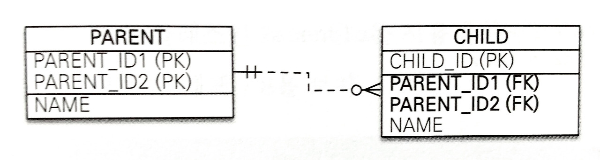

# key 관련 고려사항

 

## 목차
- [key 관련 고려사항](#key-관련-고려사항)
  - [목차](#목차)
  - [key 관련 고려사항](#key-관련-고려사항-1)
    - [자연키 vs 대리키](#자연키-vs-대리키)
    - [FK 사용 시 주의할 점](#fk-사용-시-주의할-점)
    - [index와 key](#index와-key)
    - [복합키](#복합키)

 

## key 관련 고려사항

### 자연키 vs 대리키

**자연키** 

- 개념
    - 실제 데이터 속성 자체가 업무적으로 의미를 가짐
    - 실제 데이터 속성 자체를 고유한 식별자로 사용할 수 있는 것
    - 예시 : 주민등록번호, 학번, ISBN
- 장점
    - 직관적
        - 데이터 자체에 의미가 있어 직관적 이해 가능
        - 비즈니스 의미를 담고 있음
    - 별도의 공간 불필요
        - 이미 존재하는 데이터 사용
        - 따라서 PK 위한 추가 열 필요 없음
        - 별도의 키 생성 작업이 필요 없음
- 단점
    - 데이터 노출
        - 실제 데이터가 노출될 위험이 있음
        - 민감한 정보가 포함될 수 있어 노출되면 보안 문제 발생 가능
    - 변경 가능성 O
        - 비즈니스 규칙, 정책 변화 시 PK 값이 변경될 수 있음
            - DB 구조 전체에 영향 줌
            - PK 참조하는 모든 데이터 수정해야 하는 대재앙 발생
        - 변경 가능성 전혀 없는 데이터는 적어, 예상치 못한 변경 리스크 존재
        - 변경이 잦은 칼럼을 PK로 지정하면 관계 파괴 및 관리가 힘듬
    - 성능 비효율
        - 키 값이 길거나 여러 개의 열을 조합해야 할 수 있음
        - indexing 크기 증가, join 성능 저하됨
        - 공간면에서도 비효율적임
    - 고유성 보장 X
        - 고유하다고 믿었던 값이 미래에는 중복될 가능성 존재

 

**대리키**

- 개념
    - 실제 업무 데이터와는 무관한 DB 시스템이 인위적으로 만들어주는 값을 PK로 사용하는 것
    - 단순히 데이터 행을 고유하게 식별하기 위해 인위적으로 부여된 키
    - 주로 Auto Increment 숫자, UUID 등 사용
- 장점
    - 불변성
        - 값이 절대 변하지 않음
        - 데이터베이스의 안정성을 보장
    - 유연성
        - 비즈니스 규칙이 아무리 바뀌어도 데이터 구조에 영향 X
        - 현실 세계 데이터 변경과 무관.
    - 성능 개선
        - 보통 숫자 타입이라 공간을 적게 차지
        - JOIN이나 검색 시 성능 빠름
    - 고유성 보장
        - 데이터베이스가 직접 값을 생성
        - 고유성이 완벽하게 보장
- 단점
    - 무의미성
        - 값 자체로 의미 없음
        - 데이터 해석할 수 없고 직관성 떨어짐
    - 추가 공간 필요
        - 데이터를 식별하기 위한 별도의 컬럼이 필요
    - unique 제약 별도 구현
        - 업무적으로 중요한 유일한 값이 pk가 아님
        - ex : 주민등록번호 등
        - 이 값들의 유일성을 unique 제약을 따로 둬서 별도로 관리해야 함
        - 자연스러운 비즈니스 제약 표현 어려움

 

**PK로 어떤 것 사용??**

대부분의 현대 데이터베이스 설계에서는 대리키 사용을 강력히 권장

 

why??

- 비즈니스/업무 규칙, 현실 세계 데이터는 언제든 변할 수 있음
    - 자연키는 이러한 변화에 매우 취약
    - 키 값이 변경되면 데이터베이스 전체에 큰 파급효과
    - 대리키는 비즈니스와 완전히 분리되어 있어 영향 X
- 성능, 보안, 유지보수 관점에서도 유리

 

자연키가 필요하다면?

- PK로 지정하는 대신 **UNIQUE 제약조건**을 걸어 대체키로 활용
    - 훨씬 더 안전하고 효율적인 설계 방법

 

 

### FK 사용 시 주의할 점

- 부모 테이블의 삭제, 수정
    - 참조 중인 값이 부모 테이블 (PK)에서 삭제, 변경 시
    - 자식 테이블 (FK)의 데이터 어떻게 처리할지 결정하는 제약 옵션 반드시 지정해야함
    - ON UPDATE / ON DELETE 옵션이라고 하며 FK 생성 시 고려
    - 종류
        - CASCADE
            - 부모에서 삭제/수정 시, 자식 데이터도 자동 삭제/수정.
            - 위험하지만 편리함
            - 의도치 않은 연쇄 삭제로 대량 데이터 삭제로 이어질 수 있음
            - 명확한 '부모-자식' 관계(게시글과 댓글 등)에서만 신중하게 사용
        - SET NULL
            - 부모 데이터 삭제/수정 시, 자식의 FK 값을 NULL로 변경
            - 단, FK 컬럼이 NULL 허용이어야 함
        - RESTRICT / NO ACTION
            - 부모 레코드 삭제/수정 시, 자식에 연결된 값이 하나라도 있으면 부모 데이터에 대한 작업 거부
            - 기본 옵션
            - 가장 안전함
            - 무결성 위배 방지
- 성능 관련
    - FK 제약 조건 설정 시 DB가 아래의 상황에서 데이터 일관성 항상 검사
        - INSERT, UPDATE, DELETE 시
        - 검사 과정에서 overhead 발생 가능
    - 대규모 데이터에 FK 사용하면 참조 무결성 검사로 성능 저하 될 수 있음
- 순환 참조
    - 테이블 A가 테이블 B를 참조하고, 동시에 테이블 B가 테이블 A를 참조하는 구조
    - 이런 구조는 데이터의 입력, 수정, 삭제를 매우 복잡하고 어렵게 만듬
    - 테이블 간 FK로 인한 순환 참조 구조는 설계에서 가급적 피해야 함
- 참조 대상 (참조 무결성)
    - 무조건 상대 테이블의 PK 또는 UNIQUE 제약이 걸린 컬럼만 참조 가능
- 참조 값 제한 (참조 무결성)
    - FK에 입력되는 값은 반드시 참조 대상 테이블에 **존재하는 값**이어야 함
    - 없는 값 삽입 시 오류가 발생
- 데이터 타입 일치
    - FK와 참조 PK의 데이터 타입이 반드시 같아야 함.
    - 데이터 타입, 길이, 문자셋(Character Set) 등이 완벽하게 동일해야 함
    - 타입이 다르면 제약 조건 자체가 생성되지 않거나 오류가 발생
- NULL 값 허용 가능
    - NULL 값을 가질 수 있음
        - 선택적 관계 의미
        - 관계가 "없음" 상태도 표현 가능
        - 남용 시 데이터 의미가 불분명해짐
    - **NOT NULL**로도 설정 가능
        - 필수적 관계가 됨

 

### index와 key

PK에서 Index

- 기본키, 유니크 키는 선언 시 DB가 자동으로 clustered index 생성
    - 새로운 데이터 들어올 때마다 테이블 전체를 뒤져서 중복 값이 있는지 확인하는 것은 매우 비효율적
    - 미리 정렬된 인덱스를 사용하면 중복 여부를 거의 즉시 확인할 수 있음
    - 데이터 무결성 , 검색 성능 향상 동시에 제공
- 복합 PK를 만들면 그 속성 조합으로 자동으로 복합 인덱스 생성됨

 

FK에서 Index

- FK 컬럼에도 인덱스 생성이 권장
    - FK는 자동으로 인덱스가 생성되지 않음
    - FK는 JOIN 이나 WHERE 절에서 매우 빈번하게 사용
        - FK 열에 인덱스가 없으면, 성능이 급격히 저하
        - 테이블 관계를 확인할 때마다 Full Table Scan 하게 됨
    - 부모 테이블의 데이터가 수정/삭제될 때, 자식 테이블에 참조하는 데이터가 있는지 확인
        - FK 열에 인덱스가 없으면 락 때문에 성능이 저하됨
        - 자식 테이블 full table scan해야 해서 불필요하게 큰 범위에 Lock을 걸어야 함
    - 따라서 인덱스 있다면 성능이 크게 향상됨

 

clustered index

- 개념
    - 데이터 자체를 인덱스 순서대로 물리적으로 정렬해서 저장하는 방식
    - 데이터와 인덱스가 하나로 묶여 정렬된 구조가 clustered index
- 특징
    - 물리적 정렬
        - 인덱스로 지정된 열을 기준으로 데이터가 디스크에 실제로 정렬되어 저장
    - 테이블당 하나만 가능
        - 데이터를 물리적으로 정렬하는 방식은 단 하나만 존재 가능
        - 따라서 테이블당 하나만 만들 수 있음
    - PK와 관계
        - 테이블에 PK 지정하면 대부분 DMBS는 PK를 기준으로 clustered index 자동 생성
    - 리프 노드가 곧 데이터
        - 인덱스 구조의 가장 마지막 단계인 리프 노드가 별도의 데이터 주소를 가리키는 것이 아님
        - 리프 노드가 데이터 페이지 그 자체
        - 따라서 데이터를 찾으면 바로 그 위치에 원하는 정보가 있음
- 장점
    - 매우 빠른 검색 속도
        - 인덱스가 데이터와 함께 정렬되어 있음
        - 특정 값을 찾거나 특정 범위를 검색할 때 매우 빠름
        - 원하는 데이터를 찾기 위해 추가적인 디스크 I/O가 발생 X
    - 데이터 접근 효율성
        - 인덱스를 통해 데이터를 찾으면 바로 그 자리에 모든 데이터가 있음
        - 추가적인 주소 조회 과정이 필요 없음
- 단점
    - 느린 입력, 수정, 삭제 속도
        - 새로운 데이터 입력, 기존 데이터 수정, 삭제될 때마다 데이터의 물리적인 순서를 재정렬해야 함
        - 이 과정에서 페이지 분할이 발생할 수 있어 쓰기 작업이 잦은 테이블에는 성능 저하를 유발
    - 추가 저장 공간 불필요
        - 인덱스를 위해 별도의 저장 공간을 크게 차지하지는 않음
        - 정렬 과정에서 발생하는 페이지 분할로 인해 데이터 공간이 비효율적으로 사용될 수 있음
    - 하나만 생성 가능
        - 어떤 열을 클러스터형 인덱스로 지정할지 신중하게 결정해야 함

 

### 복합키

장점

- 논리적이고 명확한 데이터 구조
    - 비즈니스 관계를 데이터 모델에 가장 자연스럽게 표현 가능
    - 여러 컬럼의 조합이 논리적으로 의미 있는 경우, 현실 세계의 규칙 자연스럽게 구현
    - ex : 같은 방, 같은 날짜 예약 불가
- 데이터 무결성 보장
    - 단일 컬럼으로는 유일성을 보장할 수 없을 때 해결책
    - 여러 필드를 조합해 유일성(고유성)을 보장 가능
- 추가 컬럼 불필요
    - 대리키를 따로 만들 필요가 없음
    - 저장 공간을 조금이라도 절약 가능
- 인덱스 효율성
    - 복합 기본 키의 해당 열들을 묶은 복합 인덱스가 자동으로 생성
    - 복합 키의 모든 열을 조건으로 사용하는 쿼리는 이 인덱스를 통해 매우 효율적으로 실행

 

단점

- 복잡한 테이블 관계와 구조
    - 복합키 테이블을 다른 테이블에서 외래 키(FK)로 참조할 때 문제 발생
    - 참조하는 테이블에도 복합키를 구성하는 모든 열을 포함해야 함
    - 자식 테이블의 구조가 불필요하게 커지고 복잡해짐
- 성능 저하 가능성
    - 여러 개의 열을 조합한 키로 JOIN 해야 함
    - 일반적으로 더 많은 비교 연산을 필요로 하므로 성능상 불리
    - 컬럼 많고 컬럼 값 길어질수록 성능 저하
    - 복합 인덱스는 왼쪽부터 순서대로 사용해야 효율적
    - 단독 검색은 인덱스 사용 불가
- ORM 복잡성 증가
    - ORM 프레임워크에서 복합키 다루려면 훨씬 복잡한 매핑 과정 필요
    - ex : @IdClass, @EmbeddedId

 

