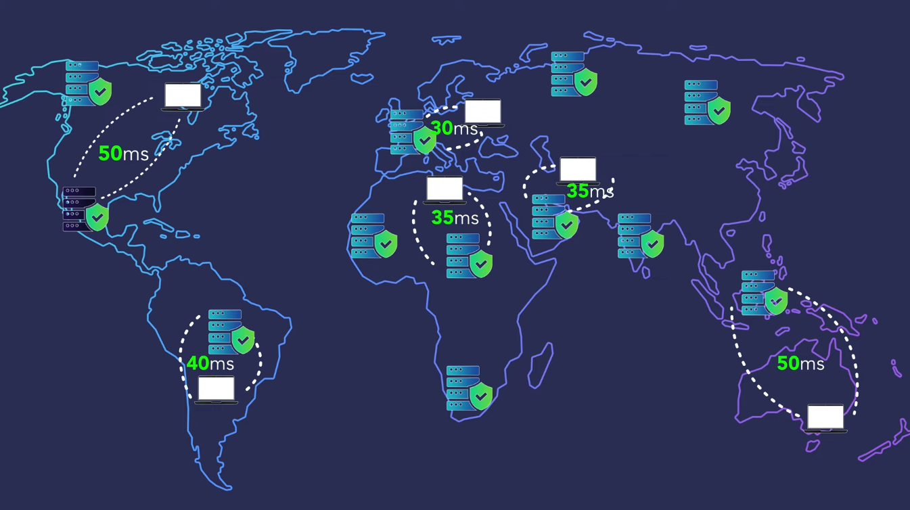
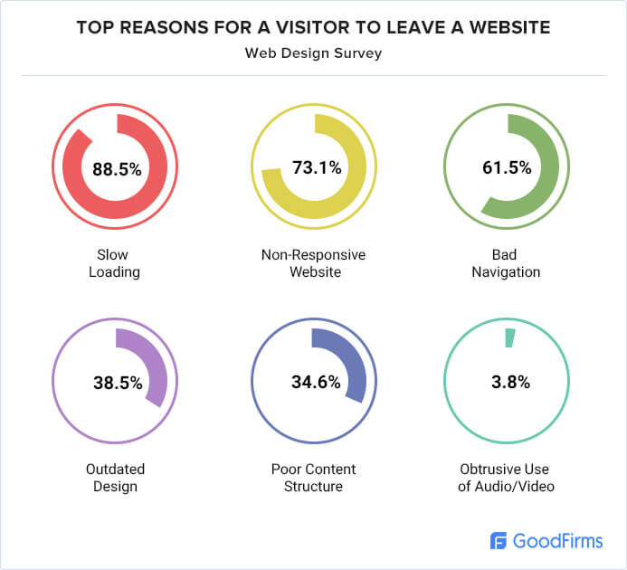
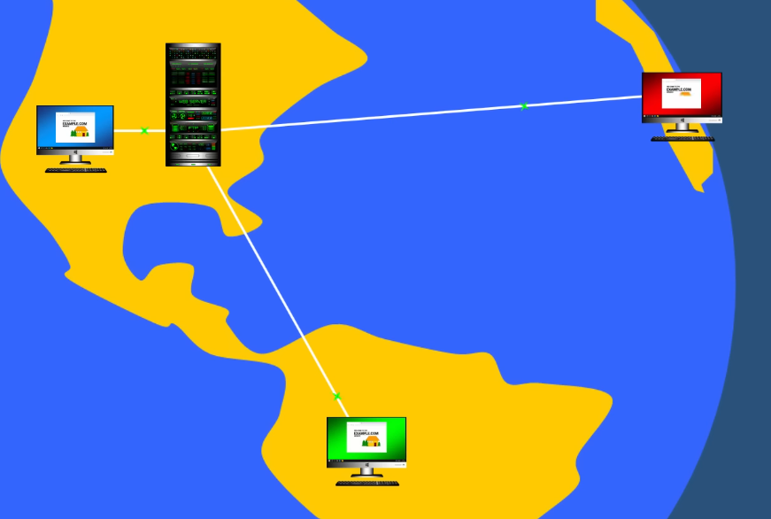
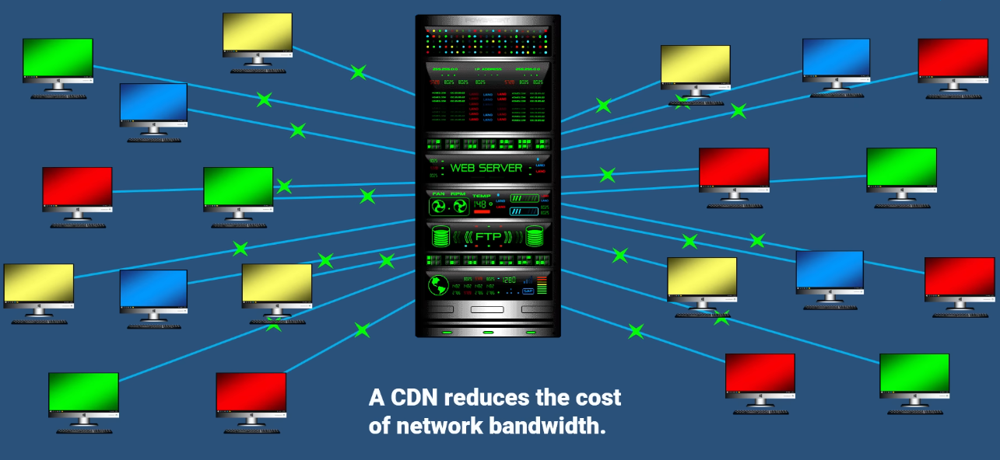

# CDN (Content Delivery Network)

## 💡 핵심 요약
> - **한 줄 정의**: 전 세계 여러 거점(에지)에 콘텐츠를 캐싱해, 사용자와 물리·네트워크 거리를 줄여 빠르고 안정적으로 전달하는 분산 전송 기술
> - **핵심 키워드**: 에지(Edge), 캐시(Cache), TTL, 조건부 재검증(ETag/Last-Modified), Anycast/GeoDNS, 오리진 오프로딩(Origin Offload)
>- **왜 중요한가?**: 지연(Latency)과 서버 부하를 줄여 TTFB 개선, 비용 절감, 트래픽 급증에도 안정적인 사용자 경험 제공

---

## 1. 개념

CDN은 지리적으로 떨어진 서버들을 서로 연결시켜, 필요한 콘텐츠(정적 파일, 이미지, 동영상, API 일부)를 가장 가까운 서버로부터 제공 받도록, 적절히 분산 처리 하는 것입니다.

좀 더 자세히 설명하면 **전 세계 PoP(Point of Presence)** 에 **캐시/프록시 노드를 배치** 해 현지 사용자와의 **물리적/네트워크적 거리(지연)를 줄여** TTFB를 개선하고, 오리진(offload) 부하를 낮추는 **분산 시스템**입니다.

<details>
<summary>용어 설명</summary>

- **PoP(Point of Presence)**: CDN/네트워크 사업자가 배치한 지역 거점(에지) 노드
- **지연(latency)**: 한 지점에서 다른 지점까지 가는 **편도(one-way) 지연 시간**
- **RTT(Round-Trip Time)**: 요청 왕복 시간(편도 지연 × 2 + 기타 처리)
- **TTFB(Time To First Byte)**: 요청 시작부터 **첫 바이트 수신**까지의 시간 (DNS, TCP/TLS 핸드셰이크, 서버 처리, 네트워크 지연 포함)
- **Offload**: 원래 오리진이 처리해야 할 트래픽을 CDN이 **대신 처리**하여 부하/비용을 줄이는 것
    
</details>

## 2. 왜 필요한가



유저가 웹사이트를 떠나는 이유중 가장 큰 이유는 **느린 로딩** 때문입니다. <br />
이런 느린 로딩은 서버의 상태가 좋지 않을 때도 발생할 수 있지만, <br />
서버와 클라이언트의 **물리적 거리**가 멀거나 **연결 사이의 홉 수가 많을 때도** 응답이 느릴 수 있습니다.




만약 우리의 서비스가 글로벌 시장에 진출하려고 할때, <br />
오리진 서버가 한국에 있고 미국에서 그 웹사이트에 접속한다고 하면,<br />
**물리적 거리가 멀고 복수 네트워크 구간의 변동** 때문에 통신을 하는데 굉장히 오랜시간이 소요될 것입니다.

CDN은 이런 문제를 사용자와 가까운 에지에서 응답하도록해 이 문제를 해결합니다.

## 3. 동작 원리 및 주요 특징

### 동작 절차
1. **에지 선택**: Anycast/GeoDNS로 사용자에게 **가장 가까운 PoP**로 라우팅
2. **캐시 키 결정**: 기본 키 = `Method + Scheme + Host + Path + Query`  
   - `Vary` 헤더(예: `Accept-Encoding`, `Accept-Language`, Client Hints 등)가 추가 키 분기 요소가 됨
3. **신선도(유효성) 판단**:  
   - `Cache-Control: max-age, s-maxage, public/private, no-store, no-cache`  
   - 만료 전이면 **캐시 히트**, 만료면 **재검증** 또는 **오리진 요청**
4. **오리진 폴백/재검증**:  
   - 조건부 요청(`If-None-Match`/`If-Modified-Since`) → **변경 없음**이면 `304 Not Modified`
5. **응답 전달**: 에지에서 사용자에게 최종 전달 (HTTP/2·HTTP/3 전송 최적화 포함)

> 용어 주의  
> - `no-cache` = “저장 금지”가 아니라 “저장해도 되지만 사용 전 **반드시 재검증**”  
> - `private` = 브라우저 전용 캐시(공유 캐시 금지), `public` = 공유 캐시 허용  
> - `s-maxage` = **공유 캐시 전용** TTL (브라우저에는 적용되지 않음)

### 배포 전략
1) **계층형 캐시 & Origin Shield**
```
CDN Cache Hierarchy:
┌─────────────────────────────────────┐
│  User Browser (0-100ms)            │  <- 브라우저 캐시
├─────────────────────────────────────┤
│  CDN Edge (10-50ms)                │  <- 가까운 PoP
├─────────────────────────────────────┤
│  CDN Regional (50-200ms)           │  <- 리전/중앙 캐시
├─────────────────────────────────────┤
│  Origin Server (100-1000ms)        │  <- 원본
└─────────────────────────────────────┘
```
- 상위 캐시(Shield)로 **오리진 트래픽 급증을 흡수** → **Offload 극대화**

2) **전송 최적화**
- HTTP/2, HTTP/3(QUIC)로 다중화 및 손실 회복 최적화, HOL 블로킹 완화
- 텍스트 압축(gzip/brotli), 이미지 포맷(WebP/AVIF), Range 요청(스트리밍)
- HTTP/3의 0-RTT는 **재생(Replay) 위험** → **비멱등 요청에는 비활성화** 권장

### 기본 기능

#### Cache-Control/ETag 설계
- 정적 자산: **콘텐츠 해시 파일명 + immutable, max-age=1y**
- HTML/JSON: **짧은 TTL + stale-while-revalidate + ETag/Last-Modified**
- 민감/개인화 응답: **private** 또는 **no-store** (공유 캐시 저장 금지)
- Authorization/Set-Cookie 응답은 **기본적으로 공유 캐시 비대상**임에 유의

> ETag와 압축  
> - 강한 ETag(바이트 동일)는 **압축 계층이 섞이면** 불일치가 생길 수 있음 → 필요 시 **약한(Weak) ETag** 사용 고려

#### 무효화(Purge)
- **즉시 무효화**: 경로·태그 단위 purge (가격/재고 등 즉시성 요구)
- **소프트 퍼지**: `stale-while-revalidate`로 사용자는 즉시 응답, 백그라운드 갱신
- **버전 해시**: 파일명에 콘텐츠 해시(권장) → 긴 TTL + 무효화 최소화

#### 보안
- **서명 URL/쿠키**: 만료, 경로 범위, IP 제한 등으로 사설 파일 보호
- **원격 IP 전달**: `X-Forwarded-For`/`True-Client-IP` 신뢰 설정 및 `real_ip` 구성
- **TLS 최적화**: TLS 1.3, HSTS, HTTP/3 지원

#### 보안
- 서명 URL/쿠키: 만료·경로 제한 포함된 서명으로 사설 파일 보호

- 원격 IP 전달: X-Forwarded-For/True-Client-IP 처리로 감사·레이트리밋 정확성 확보

- TLS 최적화: TLS 1.3, HSTS, HTTP/3 가능 시 활성화


## 4. 장점과 단점

### 👍 장점
- **성능**: 지연 감소, TTFB/로드 시간 단축, 대용량 미디어 전송 최적화
- **안정성**: 트래픽 급증에도 에지에서 흡수, 오리진 보호
- **비용**: 오리진 egress/스케일 비용 절감  
  
- **글로벌 품질**: 지역별 PoP으로 체감 품질 균일화

### 👎 단점
- **복잡도**: 캐시 키/TTL/Vary, 무효화 전략, 이미지/동영상 파이프라인 설계 필요
- **일관성**: 전 세계 에지에 변경 전파 지연 → 재검증/퍼지 자동화 필수
- **개인화/민감 데이터**: 공유 캐시 비대상 → no-store/서명 URL/에지 컴퓨팅 등 별도 설계
- **운영 부담**: 벤더별 설정/로그·IP 목록 관리, 관측·모니터링 체계 필요


## 주의 사항
- 캐시 키/TTL 설계

- 조건부 요청(ETag/Last-Modified)

- 사설/퍼블릭 리소스 분리

- 무효화 전략

- API와 정적 리소스의 헤더 정책 분리

---

## 5. 분류

### 5-1. 전달/배포 방식
- **Pull CDN**: 미스 시 오리진에서 당겨와 캐시(일반적)
- **Push CDN**: 사전 에지 적재(대규모 정적 배포/미디어)

### 5-2. 네트워크/라우팅
- **Anycast**: BGP로 가까운 PoP 연결
- **GeoDNS**: 지역별로 다른 DNS 응답

### 5-3. 기능 확장
- **계층형 캐시/Origin Shield**
- **에지 컴퓨팅**(Workers/Functions): 헤더 조작, 리다이렉트, 이미지 리사이즈, A/B
- **보안**: WAF/봇 차단/DDoS 완화, 레이트 리미팅

---

## 6. Q&A / 심화 질문
- 캐시 키에 포함 요소(Path/Query/Vary)가 많아지면 왜 **히트율이 급락**할까?
- HTML은 왜 1년 캐시 대신 **짧은 TTL + 재검증**이 적합할까?
- 개인화/민감 응답은 어떻게 **서명 URL/쿠키** 또는 **에지 컴퓨팅**으로 해결할까?
- 퍼지 비용/리스크를 줄이는 **콘텐츠 해시 전략**은 어떻게 설계할까?
- HTTP/3의 **0-RTT 재생 위험**은 어떻게 완화할까? (비멱등 요청 제외 등)


## 7. 출처
[정보통신기술용어해설](http://www.ktword.co.kr/test/view/view.php?nav=2&no=2125&sh=CDN)

[Ferdy.com](https://www.youtube.com/watch?v=Wj11aOkvARU)

[WebFX](https://www.youtube.com/watch?v=kzbVb3PQt0k)

[goodfirm](https://www.goodfirms.co/resources/web-design-research-small-business)