# 가상 메모리와 페이징

**가상 메모리(Virtual Memory)** 란 운영 체제가 제공하는 메모리 관리 기법으로, 물리적 메모리(RAM)의 한계를 극복하고 더 큰 메모리 공간을 프로그램에 제공합니다. 프로그램이 사용하는 메모리 주소(논리 주소)와 실제 물리적 메모리 주소를 분리하여 관리하는 방식입니다. 현대 운영 체제에서는 주로 **페이징(Paging)** 기법을 통해 가상 메모리를 구현합니다.

**면접에선 페이징만 따로 질문할 가능성이 높지만..**

페이징 기법 자체도 중요하지만, 왜 페이징이 필요한지 이해하려면 기존의 메모리 관리 기법의 문제점을 먼저 파악해야 합니다. 따라서 이 문서에서는:
- 페이징 이전 메모리 관리 기법의 문제점
- 페이징 기법이 이러한 문제점을 어떻게 해결하는지

를 차근차근 알아보겠습니다.

## MMU와 주소 변환

### CPU의 메모리 접근 과정

먼저 CPU가 메모리에 어떻게 접근하는지 살펴봅시다.

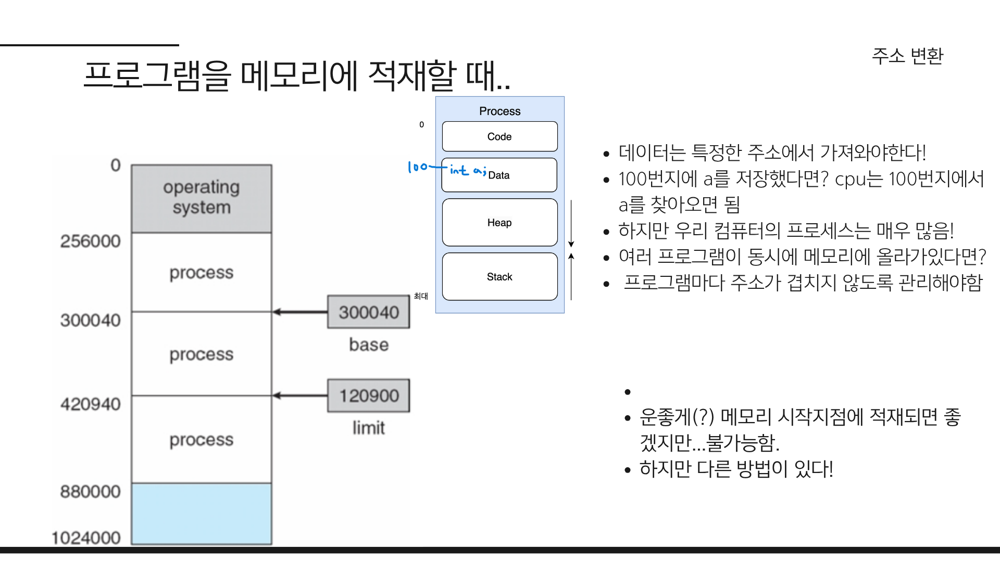

프로그램에서 `int a = 10;` 과 같은 코드를 작성하면, CPU는 변수 a를 저장하기 위해 메모리에 접근합니다. 예를 들어, 변수를 메모리의 100번지에 저장한다고 가정해봅시다. 이 때,

**프로그램이 하나뿐인 경우:**
- CPU는 100번지에 접근하여 값을 직접 저장할 수 있습니다.

**여러 프로그램이 동시에 실행되는 경우:**
- 메모리의 시작 지점에 적재된 프로그램은 100번지에 정상적으로 접근할 수 있습니다.
- 하지만 다른 프로그램입장에서는, 100번지는 이미 다른 프로그램이 사용 중인 영역이고 접근해서는 안됩니다.
- 이 경우 CPU가 100번지에 접근하여 값을 저장하려고 하면, **다른 프로그램의 데이터를 덮어쓰는 심각한 문제**가 발생합니다.

### 논리 주소와 물리 주소

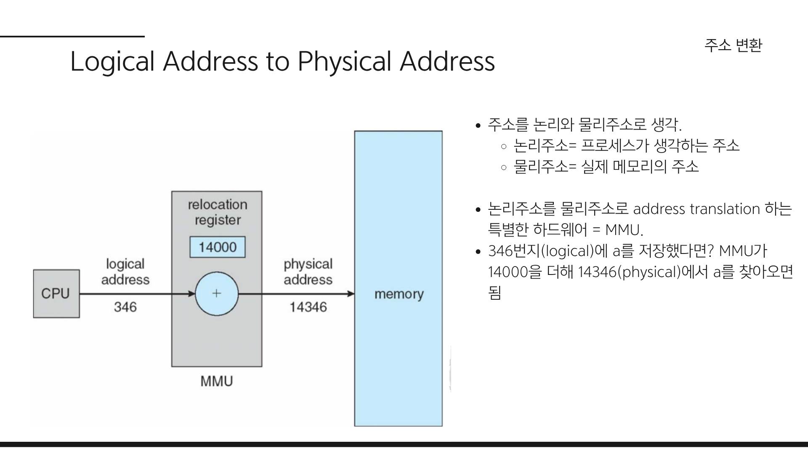

이 문제를 해결하기 위해 운영 체제는 각 프로그램에 **독립적인 메모리 공간**을 제공해야 합니다. 이를 위해 두 가지 주소 체계를 도입했습니다:

- **논리 주소(Logical Address):** 프로그램이 사용하는 주소 공간
- **물리 주소(Physical Address):** 실제 메모리(RAM)의 주소 공간

이전 예시에서 프로그램이 100번지에 접근하려고 할 때, 이 100번지는 **논리 주소**입니다. 운영 체제는 이 논리 주소를 **물리 주소**로 변환하여 실제 메모리에 접근하도록 합니다.   
만약 14000번지에 프로그램이 적재되어 있다면, 논리 주소 100번지는 물리 주소 14100번지로 변환됩니다.
이런 방식으로 각 프로그램은 자신만의 독립적인 논리 주소 공간을 가지게 되어, 서로 간섭하지 않고 안전하게 메모리를 사용할 수 있습니다.

위 과정을 CPU가 메모리에 접근할 때마다 변환한다면 부하가 클 것입니다. CPU대신 이를 수행해주는 하드웨어가 바로 **메모리 관리 유닛(MMU: Memory Management Unit)** 입니다.  
**MMU** 는 다음과 같은 역할을 수행합니다:

1. CPU가 생성한 **논리 주소**를 받음
2. 논리 주소를 **물리 주소로 변환**
3. 변환된 물리 주소로 실제 메모리에 접근

이전 예시는 단순히 메모리에 base주소를 더하는 방식이었지만, 실제 MMU는 더 복잡한 변환 방식을 사용합니다.   
우선은 논리주소를 물리주소로 변환한다는 개념만 이해합시다.

## 메모리 관리 기법
이제 본격적으로 메모리 관리 기법에 대해 알아봅시다.
각 기법의 utilization(메모리 사용률)과 performance(성능)에 집중하며 살펴보겠습니다.
### 연속 할당(Contiguous Allocation)
연속 할당(Contiguous Allocation)은 메모리 관리의 가장 기본적인 기법 중 하나로, 각 프로세스가 메모리 내에서 연속된 블록을 할당받는 방식을 의미합니다.
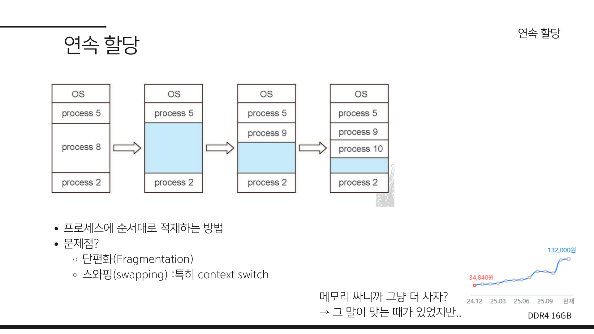
배열을 생각하면 쉽습니다.
그림처럼 프로세스가 종료되면 그 공간이 비게 되는데, 이후 새로운 프로세스가 들어오면 다시 빈 공간에 할당합니다.
#### 단편화(Fragmentation)

그림에서 process 5, 9, 10까지 잘 적재되었지만, process 1은 적재되지 못했습니다.  
만약 9번 프로세스가 종료된고 남은 메모리의 총합이 1번 프로세스보다 크다 하더라도 1번 프로세스는 적재될 수 없습니다.  
프로세스 1이 필요로 하는 메모리 크기를 충족하는 *연속된* 빈 공간이 없기 때문입니다.  

이렇게 메모리가 조각조각 나뉘어진 상태를 **단편화(Fragmentation)** 라고 합니다.
단편화는 크게 두 가지로 나뉩니다:
- **내부 단편화(Internal Fragmentation):** 할당된 메모리 블록 내에서 사용되지 않는 공간이 발생하는 현상
- **외부 단편화(External Fragmentation):** 메모리 전체에서 사용되지 않는 작은 조각들이 흩어져 있어, 새로운 프로세스가 적재될 수 없는 현상

위 예시는 **외부 단편화** 때문에 발생한 문제입니다.

#### 스와핑(Swapping)
또 다른 문제도 있습니다.
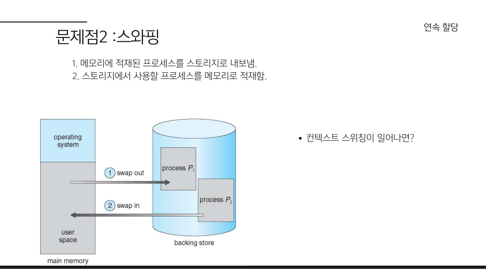
어떻게든 프로세스1번을 적재하려면 다른 프로세스를 메모리에서 내보내야 합니다.  
그리고 스토리지에 저장해둔 후, 스토리지에서 다시 1번 프로세스를 메모리에 적재해야 합니다.
이 과정을 **스와핑(Swapping)** 이라고 합니다.

**스토리지에 접근**하는 것은 메모리에 접근하는 것보다 **매우 느립니다**.  
프로세스가 많아지고 컨텍스트 스위칭이 자주 일어나면, 스와핑으로 인한 성능 저하가 심각해질 수 있습니다.

이제 메모리를 좀 더 효율적으로 관리할 수 있는 기법이 필요합니다.

> ### 잠깐! 그냥 메모리를 더 사는게 낫지 않나요?  
> 잠시 메모리의 중요성에 대해 이야기해봅시다.  
> 컴퓨터의 초창기에 메모리가 매우 비쌌던 시절에는 메모리를 더 사는게 비용적으로 부담스러웠습니다.  
> 이 시절 메모리 가격은 컴퓨터를 구매할 때 매우 큰 비중을 차지했으며, 지금의 그래픽카드 가격마냥 매우 비쌌습니다.
> 요즘은 메모리가 매우 저렴해졌고, GB단위의 메모리가 기본이 되었습니다. 그래서 딱히 메모리를 효율적으로 관리할 필요가 있나라는 의문도 들 수 있습니다.   
> 하지만 메모리는 여전히 중요한 자원이기에, 효율적인 메모리 관리 기법은 여전히 중요합니다.  
> 제가 이 글을 쓰기 위해 참고한 전공 강의에서는 교수님이 메모리의 중요성에 대해 좀 길게 설명하였지만 지금은 아래 한 장의 이미지면 충분할 것 같네요.  
> 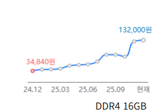  

### 세그멘테이션
세그멘테이션(Segmentation)은 메모리 관리 기법 중 하나로, 프로세스의 메모리 공간을 논리적인 단위인 세그먼트(segment)로 나누어 관리하는 방식을 의미합니다.
우리의 프로세스는 코드, 데이터, 힙, 스택으로 구성되는데, 세그먼트도 코드, 데이터, 스택 등과 같이 프로세스의 **논리적 구성**을 반영합니다.
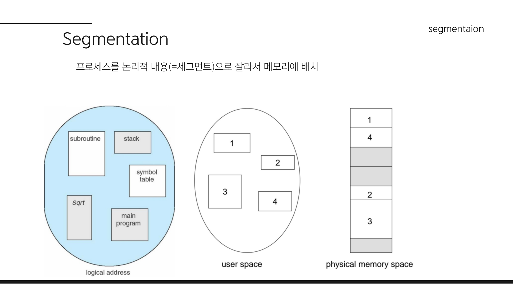
- 그림처럼 논리적인 단위로 메모리를 나누어 세그멘테이션으로 관리하기 때문에, 프로세스의 요구에 따라 유연하게 메모리를 할당할 수 있습니다.  
- 그리고 한 프로그램의 세그멘테이션들이 물리 메모리에 흩어져 있습니다. 
#### 주소 변환과 세그먼트 테이블
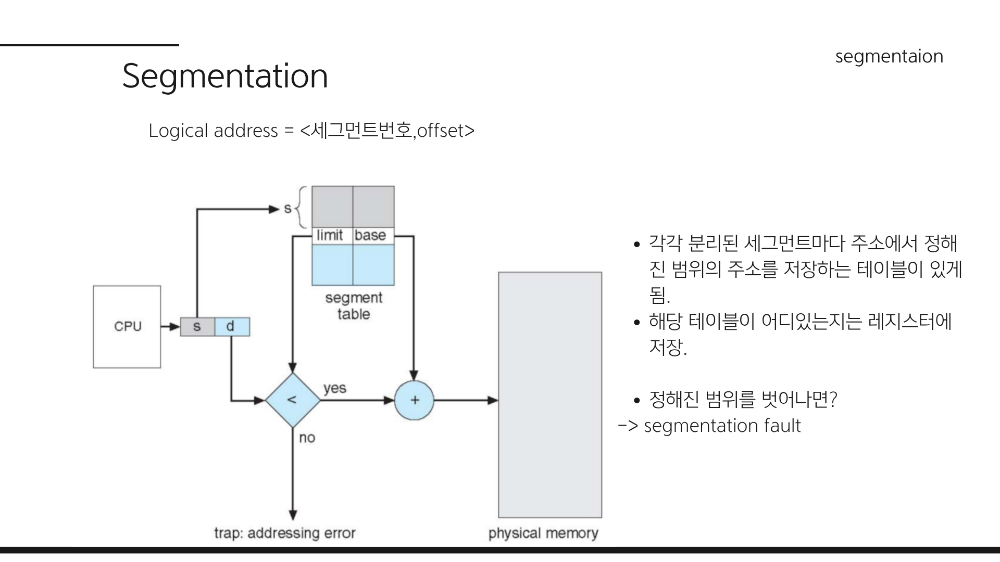
연속 할당 방식에서는 단순히 `Base 주소 + Offset`으로 물리 주소를 찾았지만, 세그먼트가 흩어져 있는 환경에서는 참조 방식이 달라집니다.

- 주소 참조 방식: `세그먼트 번호(Segment Number) + 오프셋(Offset)`

- 세그먼트 테이블 (Segment Table): 흩어진 세그먼트가 물리 메모리 어디에 있는지 추적하기 위한 매핑 테이블입니다.

CPU가 논리 주소를 요청하면 **MMU**는 **세그먼트 테이블**을 참조하여 해당 세그먼트의 시작 주소(Base)를 알아내고, 여기에 오프셋을 더해 실제 물리 주소로 변환합니다.

#### 세그멘테이션 폴트 (Segmentation Fault)
만약 요청한 주소의 오프셋(Offset)이 세그먼트의 크기(Limit)를 초과하면 어떻게 될까요?  
이 경우, 시스템은 유효하지 않은 메모리 접근으로 간주하여 세그멘테이션 폴트(Segmentation Fault) 인터럽트를 발생시킵니다.  
>참고:메모리를 잘못 참조하여 마주치는 오류 메시지 "Segmentation Fault"는 여기서 유래했습니다.

### 세그멘테이션의 성능 및 문제점
이제 성능과 속도를 살펴봅시다.

#### 속도: 오버헤드 발생
연속 할당 방식에 비해 속도는 다소 느려지는 경향이 있습니다.
- 추가적인 메모리 접근:

  - 이전(연속 할당): Base 주소 + Offset 연산만으로 즉시 물리 주소에 접근했습니다.

  - 세그멘테이션: 세그먼트 번호를 통해 세그먼트 테이블을 먼저 조회해야 하고, 그 후 실제 물리 주소에 접근해야 합니다. 즉, 메모리를 한 번 더 거쳐야 하는 오버헤드가 발생합니다.
#### 성능(메모리 측면): 외부단편화 여전히 존재
메모리 활용도는 연속 할당 방식보다 개선되었습니다.
- 프로세스 전체를 연속된 공간에 넣을 필요 없이 빈 공간을 찾아 나누어 저장할 수 있으므로 유연성이 높아졌습니다.
- 이로인해 외부 단편화가 줄어들었지만, 여전히 외부 단편화 문제는 존재하며 해결되지 않았습니다.

#### 세그멘테이션의 한계
*"그렇다면 세그먼트 크기를 잘 조절해서 나누면 되지 않을까요?"*

안타깝게도 순수 세그멘테이션 기법은 현대 운영체제의 주류 관리 기법에서 밀려났습니다(실패했습니다). 그 이유는 '관리의 주체와 복잡성' 때문입니다.

- 개발자 및 관리의 부담: 세그먼트를 얼마나 잘 나누느냐가 성능을 좌우하는데, 이는 결국 개발자(또는 컴파일러/OS 설계자)가 논리적 단위를 얼마나 정교하게 정의하느냐에 달려 있습니다.

- 마치 우리가 코딩할 때 스레드(Thread)를 완벽하게 나누어 짜면 성능이 비약적으로 상승하지만, 모든 프로그램을 매번 그렇게 완벽하게 최적화해서 짤 수 없는 것과 같습니다.

결국 가변적인 크기를 관리해야 하는 세그멘테이션의 복잡함과 외부 단편화 문제로 인해, 현대 시스템은 운영체제에서 정한 일정한 크기로 나누어 관리하는 **페이징(Paging)** 기법을 주로 사용하게 되었습니다.

### 페이징 (Paging) - 중요!

**페이징**은 현대 운영체제 메모리 관리의 핵심 기법으로, 메모리 공간을 물리적으로 **일정한 크기**(페이지)로 나누어 다루는 방식입니다.

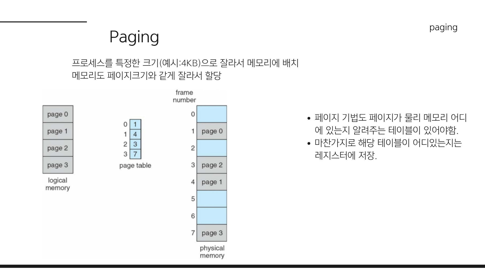

#### 고정된 크기로 나누자
세그멘테이션이 논리적 단위였다면, 페이징은 **물리적 고정 크기**(예:4KB)로 나눕니다.

* **페이지(Page):** 논리 주소를 일정한 크기로 나눈 블록
* **프레임(Frame):** 물리 주소를 페이지와 동일한 크기로 나눈 블록

세그멘테이션과 마찬가지로, 어디에 저장되어 있는지 추적하기 위해 매핑 테이블이 필요합니다. 이를 페이지 테이블이라 하고 레지스터에 테이블의 주소를 저장해둡니다.

>레지스터에 테이블자체를 저장하면 안되나요?   
>페이지 테이블은 일반적으로 레지스터보다 매우 클 수 있기 때문에 레지스터에 직접 저장하는 것은 비현실적입니다. (32비트,4KB 페이지 기준 4MB) 
대신 페이지 테이블의 시작 주소만 레지스터에 저장하고, 필요할 때마다 메모리에서 페이지 테이블을 참조합니다.

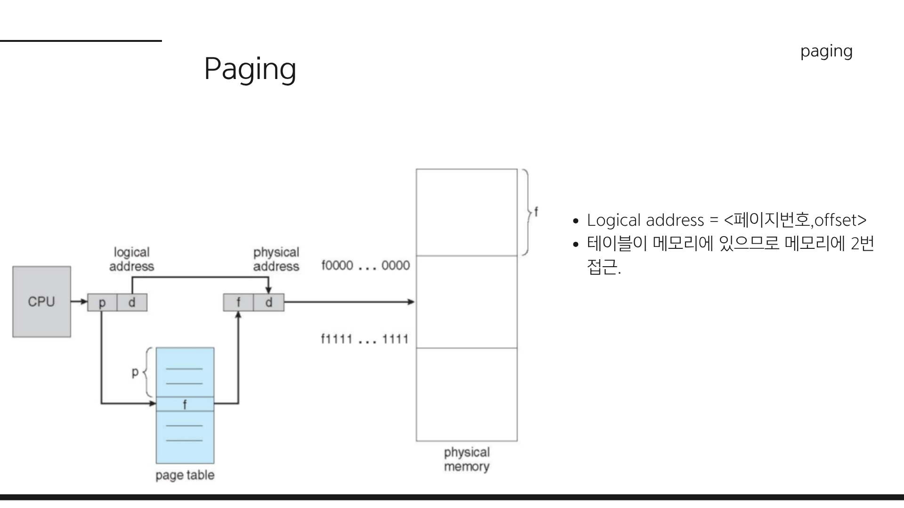

### 주소 변환:
MMU는 이제 논리주소를 페이지 번호와 offset으로 나누어 실제 물리주소를 찾아야합니다. 이때 페이지 테이블을 이용합니다.   
*  `Logical Address = Page Number + Offset`  
* **페이지 테이블(Page Table):** 페이지 번호를 물리 프레임 번호로 매핑하는 테이블.

`페이지 번호`-> `페이지 테이블` -> `실제 물리 프레임 번호` 로 변환하고 offset을 더해 최종 물리 주소에 접근합니다.

 **문제점:** 메모리에 접근하려면 **페이지 테이블 접근 + 실제 물리 메모리 접근**, 총 **2번의 접근**이 필요합니다.

### TLB (Translation Lookaside Buffer) - 속도 문제 해결
*"매번 메모리를 2번 뒤적거리는 건 너무 느리다. MMU 옆에 빠른 하드웨어 캐시를 하나 더 달자!"*

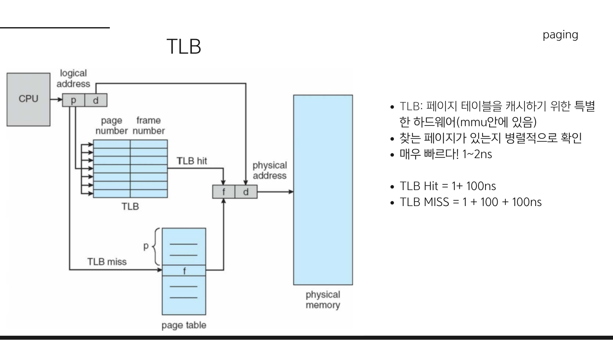
TLB는 주소 변환을 빠르게 하기 위한 하드웨어 캐시 메모리입니다. 2번 접근하는 단점을 해결하기 위해 고안되었습니다.
* **특징:**
    * 병렬 탐색이 가능하여 속도가 매우 빠릅니다.(1~2ns)
    * **TLB Hit:** 원하는 주소가 TLB에 있으면 바로 변환 (메모리 접근 1회).
    * **TLB Miss:** TLB에 없으면 페이지 테이블 참조 (메모리 접근 2회).
* **TLB는 성능에 큰 영향을 미칩니다:** 우리의 코드는 사용하는 부분만 계속 사용합니다. 이를 지역성(Locality)이라 하고 덕분에 **Hit 확률이 매우 높기 때문**에 2번 접근하는 오버헤드를 획기적으로 줄일 수 있습니다.

### 페이징의 성능

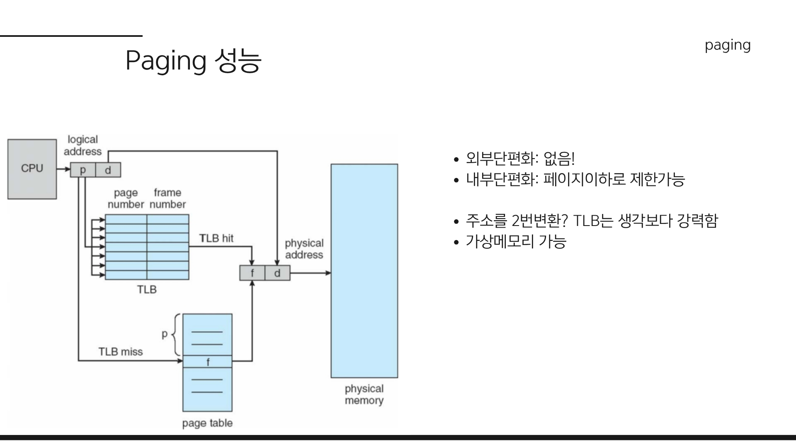

* **메모리 측면**
    * **외부 단편화(External Fragmentation):** **완전히 해결됨.** (모든 조각 크기가 같으므로)
    * **내부 단편화(Internal Fragmentation):** 존재하지만 미미함. (페이지 크기 미만)
* **속도 측면:**
    * 이론적으로는 2번 접근이지만, TLB 덕분에 속도 문제가 거의 해결되었습니다.

### 디맨드 페이징 (Demand Paging)과 가상 메모리

* **Remind: 가상 메모리란?** 물리 메모리보다 큰 프로세스를 실행할 수 있게 해주는 기술.

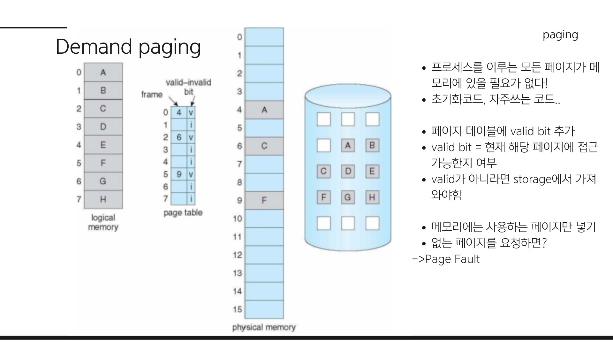
다시 한 번 말하지만 우리의 코드는 사용하는 부분만 계속 사용합니다(지역성). 즉, 모든 주소를 항상 물리 메모리에 전부 적재해 둘 필요는 없습니다. 그래서 필요한 페이지만 메모리에 올리는 기법이 등장했습니다.  
이를 **Demand Paging**이라 합니다:  
- **Demand Paging**: 당장 필요한(Demand) 페이지만 메모리에 올리고, 나머지는 스토리지에 둡니다.  

그리고 스토리지에 있는 페이지와 메모리에 있는 페이지를 구분하기 위해 페이지 테이블에 **Valid Bit**라는 플래그를 추가합니다.
- **Valid Bit:** 페이지 테이블에 해당 페이지가 메모리에 있는지(Valid) 없는지(Invalid) 표시합니다.

### 페이지 폴트 (Page Fault)
만약 접근하려는 페이지가 메모리에 없다면(Invalid) 어떻게 될까요?
스토리지에서 해당 페이지를 찾아 메모리에 적재해야 합니다. 이를 **페이지 폴트(Page Fault)** 라고 합니다.
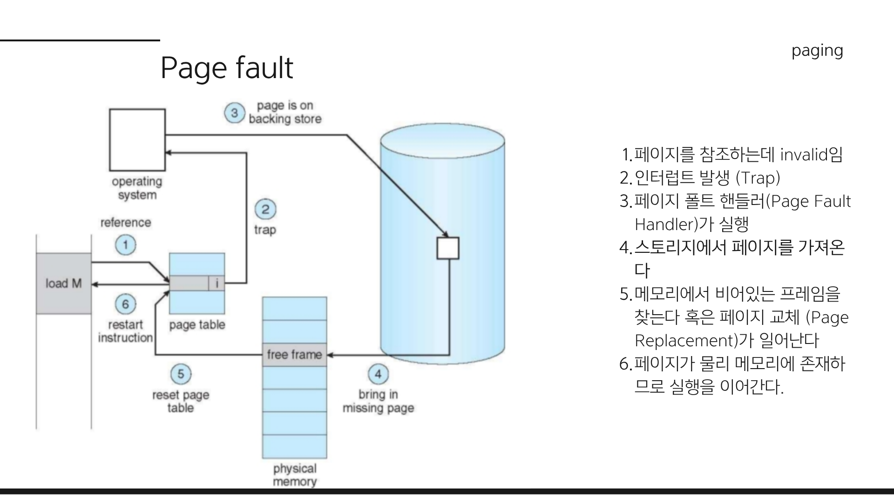

**처리 과정:**
1.  CPU가 페이지를 참조했는데 **Invalid** 상태.
2.  **페이지 폴트 트랩(Interrupt)** 발생.
3.  OS의 **페이지 폴트 핸들러(Page Fault Handler)** 실행.
4.  스토리지(Disk)에서 해당 페이지를 찾음. (**매우 느림!**)
5.  물리 메모리의 빈 프레임에 적재 (꽉 찼다면 **페이지 교체(Page Replacement)** 수행).
6.  페이지 테이블을 업데이트(Valid)하고 프로세스를 재개.

스토리지 접근은 매우 느립니다.  
Disk I/O(밀리초 단위)는 인간이 체감할 정도로 **압도적으로 느립니다.**(ms단위)   
 따라서 페이지 폴트 비율을 줄이는 것이 성능의 핵심입니다.  

다행히 페이지 폴트 확률은 매우 낮습니다. 지역성 덕분에 대부분의 메모리 접근이 존재하는 페이지에서 일어나기 때문입니다.

---

#### 6. 요약

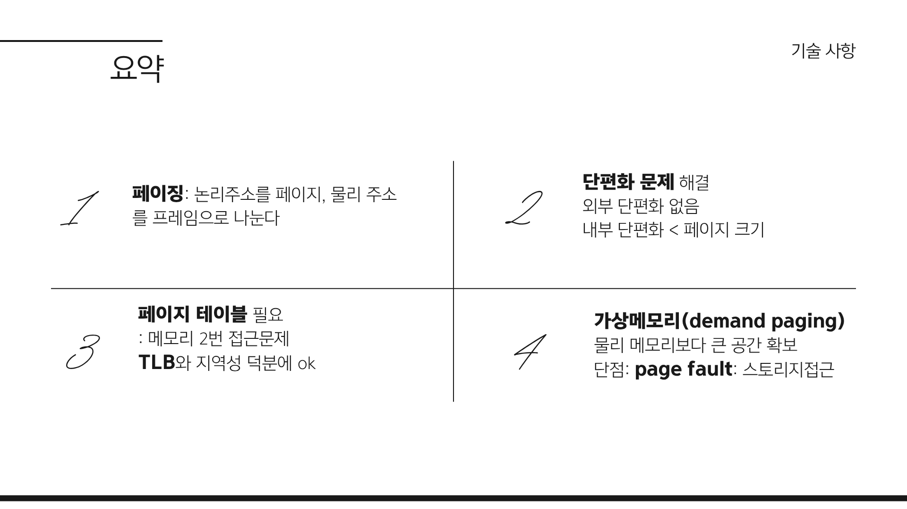

> **Q. 페이징에 대해 설명해 보세요.** 라는 질문이 나오면..

> "페이징은 물리 메모리를 고정된 크기(프레임)로 나누어 관리하는 기법입니다.   
> **장점**으로는 외부 단편화 문제를 해결했다는 점이고,  
> **단점**으로는 주소 변환을 위한 테이블 접근 오버헤드가 있지만 이는 **TLB**로 해결했습니다.  
> 또한, 이를 통해 필요한 페이지만 로드하는 **Demand Paging**으로 가상 메모리를 구현할 수 있습니다. 단, 메모리에 없는 페이지 접근 시 **페이지 폴트**가 발생하여 디스크 I/O 비용이 발생할 수 있습니다."

---

###  심화: 알아두면 좋은 계층적 페이징

32비트 시스템에서 페이지 크기가 4KB($2^{12}$)라고 가정해 봅시다.

* **주소 공간:** 32비트 주소 체계이므로 $2^{32}$ (4GB)의 가상 메모리를 표현할 수 있습니다.
* **페이지 개수:** 4GB 공간을 4KB로 쪼개면 총 **약 100만 개($2^{20}$ = $2^{32}$ / $2^{12}$)** 의 페이지가 나옵니다.
* **테이블 크기:** 각 페이지마다 '어디에 있는지' 적어두는 엔트리(Entry)가 필요합니다. 한 엔트리당 4바이트(32bit)라고 치면,
    $$2^{20} \text{ (entries)} \times 4 \text{ (bytes)} = 4\text{MB}$$
    
**"겨우 4MB?"라고 생각할 수 있지만, 문제는 다음과 같습니다:**
1.  **프로세스마다 필요함:** 프로세스가 100개만 떠도 페이지 테이블로만 **400MB**의 메모리를 잡아먹습니다.
2.  **연속된 공간 요구:** 1단 페이지 테이블은 배열처럼 **연속된 메모리 공간**에 있어야 합니다. 4MB짜리 연속된 빈 공간을 찾는 것은 메모리 단편화가 심할 때 부담스럽습니다.
3.  **대부분은 빈 공간 (Sparse Address Space):** demand paging에서 언급했듯이 실제 프로그램은 4GB를 다 쓰지 않습니다. **쓰지도 않는 나머지 공간(수 GB)에 대한 항목(Entry)까지 만들어두는 것**은 엄청난 낭비입니다.

#### 해결책: 페이지 테이블을 쪼개자 
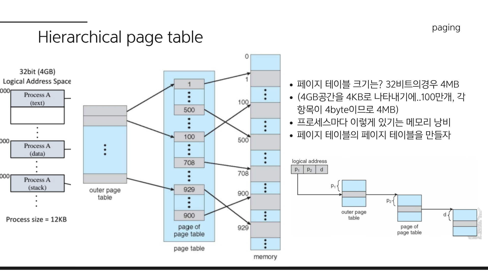
*예시는 2 level 페이징입니다. 실제로는 3 level, 4 level 등 더 깊은 계층 구조도 사용됩니다.*   

계층적 페이징(Multi level paging또는 Hierarchical paging)은 **"페이지 테이블 자체를 다시 페이징"** 하는 기법입니다.

**구조 (32비트 기준):**

* `P1 (10bit)`: **외부 페이지 테이블 (Page Directory)** 인덱스
* `P2 (10bit)`: **내부 페이지 테이블** 인덱스
* `d (12bit)`: 페이지 내 오프셋 (Offset)

1.  **외부 테이블 (Outer Page Table / Directory):**
    * 최상위 테이블로 레지스터에 직접 이 테이블의 주소를 저장합니다.
    * 각 항목은 **내부 테이블**의 주소를 가리킵니다.
    * 크기: $2^{10}$개 항목 $\times$ 4바이트 = **4KB**.(4MB에 비하면 훨씬 작음)

2.  **내부 테이블 (Inner Page Table):**
    * 실제 물리 주소를 가리키는 테이블입니다.
    * **핵심:** 만약 프로세스가 특정 영역(예: 2GB~3GB 구간)을 **전혀 사용하지 않는다면, 해당 구간을 담당하는 '내부 테이블'은 아예 만들지 않습니다.**
    * 외부 테이블에는 그 구간이 Invalid로 표시됩니다.

테이블이 늘어나면 메모리에 접근하는 횟수도 늘어나기에 성능이 저하 될 것 같지만, TLB 덕분에 성능 저하는 거의 없습니다.  
계층적 페이징 덕분에 페이지 테이블로 인한 메모리까지 크게 줄일 수 있습니다. 
