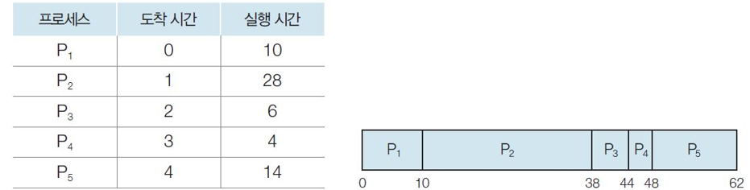
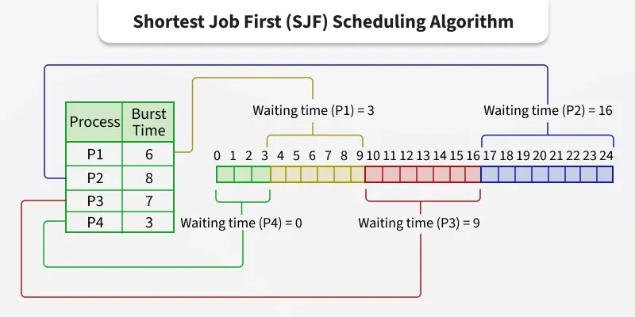
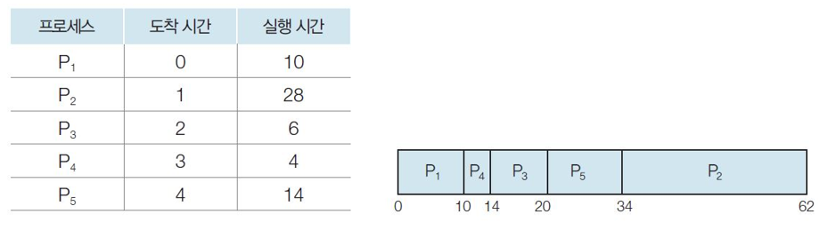
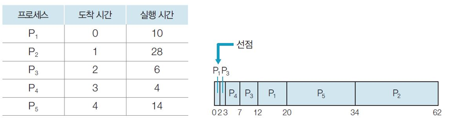
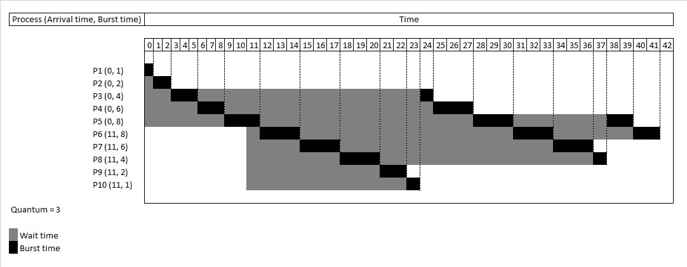

# CPU 스케줄링

## 정의

시스템의 한정된 자원을 사용하려는 여러 경쟁자 중에서, 특정 시점에 어떤 대상에게 자원을 할당할지 결정하는 정책 및 행위

## 목적

- **공평성**
  - 모든 프로세스가 자원을 공평하게 배정받아야 함
- **효율성**
  - 시스템 자원이 유휴 시간 없이 사용되어야 함
  - 유휴 자원을 사용하려는 프로세스에는 우선권이 있어야 함
- **안정성**
  - 중요 프로세스의 우선순위를 높여 먼저 작동하도록 배정해야 함
  - 그렇게 함으로써, 시스템 자원을 점유하거나 파괴하려는 프로세스로부터 자원을 보호해야 함
- **확장성**
  - 프로세스가 증가해도 시스템이 안정적으로 작동해야 함
- **반응 시간 보장**
  - 시스템은 적절한 시간 안에 프로세스의 요구에 반응해야 함
- **무한 연기 방지**
  - 특정 프로세스의 작업이 무한히 연기되어서는 안 됨

## 스케줄러의 계층적 구조

**장기 스케줄러(Long-Term Scheduler)**

- 디스크의 작업 풀에 대기 중인 프로그램 중에서 어떤 것을 메모리에 적재하여 프로세스화(준비 큐에 넣을지)할지 결정함
- 메모리에 동시에 상주하는 프로세스의 총 개수(다중 프로그래밍의 정도)를 제어함
- 현대에는 메모리 용량이 커지고 가상 메모리 기술이 발달하면서 대부분의 작업은 요청 즉시 메모리에 적재되기에 역할이 거의 없거나 최소화됨

**단기 스케줄러(Short-Term Scheduler)**

- 이미 메모리에 적재되어 있는 프로세스들, 준비 큐에서 대기 중인 프로세스 중에서 어떤 프로세스에게 다음 CPU 시간을 할당할지 결정함
- 매우 빈번하게 호출되어야 하므로 속도가 매우 빨라야 함

**중기 스케줄러(Medium-Term Scheduler)**

- 메모리에 적재된 프로세스의 수를 동적으로 관리함
- 시스템이 과도하게 많은 프로세스를 승인하여 메모리가 부족해질 경우 중기 스케줄러가 개입함
- 메모리에 있는 프로세스 중 일부를 선택하여 그 메모리 내용을 통째로 스왑 영역으로 내보냄 (Swap Out)
- 다중 프로그래밍의 정도를 일시적으로 줄여서 메모리 부담을 완화하고, 시스템이 안전화되면 추후 해당 프로세스를 다시 메모리로 불러옴 (Swap In)

## 프로세스 우선 순위

**커널 프로세스와 일반 프로세스**

- 커널 프로세스는 중요한 작업을 많이 하므로 일반 프로세스보다 우선 순위가 높음

**CPU 집중 프로세스와 입출력 집중 프로세스**

- CPU 집중 프로세스
  - CPU를 할당받아 실행하는 작업(CPU 버스트)이 많은 프로세스
- 입출력 집중 프로세스
  - 입출력 작업(입출력 버스트)이 많은 프로세스
- 사이클 훔치기 (Cycle Stealing) : 입출력 집중 프로세스의 우선순위가 높아 먼저 실행 상태로 가면 입출력 요구에 의해 대기 상태로 옮겨지기에 다른 프로세스가 CPU를 사용할 수 있으므로 시스템 효율이 향상됨

**전면 프로세스와 후면 프로세스**

- 전면 프로세스
  - 입력과 출력을 사용하여 사용자와 상호작용이 가능한 프로세스
- 후면 프로세스(일괄 작업 프로세스)
  - 사용자와 상호작용이 업는 프로세스
- 전면 프로세스는 사용자의 요구에 즉각 반응해야 하기에 후면 프로세스보다 우선 순위가 높음

## 스케줄링 결정 시점

- 프로세스가 실행 상태에서 대기 상태로 전환할 때 (I/O 요청)
- 프로세스가 실행 상태에서 준비 상태로 전환될 때 (타이머 인터럽트 발생)
- 프로세스가 대기 상태에서 준비 상태로 전환될 때 (I/O 작업 완료)
- 프로세스가 실행을 마치고 종료될 때

## 선점형 vs 비선점형

### 선점 (Preemptive)

- 정의
  - 한 프로세스에게 CPU가 할당되면, 해당 프로세스가 스스로 CPU를 방출할 때까지 다른 프로세스가 CPU를 강제로 빼앗을 수 없는 방식
- 동작 시점
  - 프로세스가 실행 상태에서 대기 상태로 전환할 때 (I/O 요청)
  - 프로세스가 실행을 마치고 종료될 때
- 장점
  - 알고리즘이 단순하고 구현이 용이함
  - 문맥 교환으로 인한 오버헤드가 적음
  - 프로세스 순서가 정해져 있어 응답 시간을 예측하기 쉬움
- 단점
  - CPU 사용 시간이 긴 프로세스가 CPU를 독점하여 다른 모든 프로세스가 무기한 대기하는 경우가 생길 수 있음
  - 이로 인한 시스템의 전반적인 응답성이 심각하게 저해됨
- 적합 시스템
  - 예측 가능성이 중요한 일괄 처리 시스템

**일괄 처리 시스템(Batch Processing System)**

- 유사한 성격의 작업들을 모아서 한 번에 순차적으로 처리하는 방식
- 사용자의 직접적인 상호작용 없이 미리 정의된 작업 순서에 따라 자동으로 실행
- 많은 사용자가 시스템 자원을 공유함
- 시스템 지향적이기에 처리 효율이 향상됨
- 같은 유형의 작업이 모일 때까지 대기하기하는 방식이기에 생산성이 저하됨
- 작업이 모이고 앞 작업이 끝날 때 까지 대기해야 하므로 긴 응답시간이 소요됨

### 비선점 (Non-preemptive)

- 정의
  - 운영체제가 현재 실행 중인 프로세스를 강제로 중단시키고, CPU 제어권을 다른 프로세스에게 넘겨줄 수 있는 방식
- 동작 시점
  - 프로세스가 실행 상태에서 대기 상태로 전환할 때 (I/O 요청)
  - 프로세스가 실행 상태에서 준비 상태로 전환될 때 (타이머 인터럽트 발생)
  - 프로세스가 대기 상태에서 준비 상태로 전환될 때 (I/O 작업 완료)
  - 프로세스가 실행을 마치고 종료될 때
- 장점
  - 긴급하거나 우선순위가 높은 프로세스가 CPU를 즉시 얻을 수 있음
  - 한 프로세스의 CPU 독점을 방지하여 시스템의 전반적인 반응성과 평균 응답 시간이 향상됨
- 단점
  - 알고리즘이 복잡하며, 잦은 문맥 교환으로 인한 오버헤드가 큼
  - 프로세스가 공유 데이터를 수정하는 도중에 선점당할 경우, 다른 프로세스가 해당 데이터에 접근하여 데이터의 일관성이 깨질 수 있음
- 적합 시스템
  - 빠른 응답 시간이 요구되는 대화형 시스템, 시분할 시스템, 실시간 시스템

**시분할 시스템(Time-Sharing System)**

- 여러 작업을 짧은 시간 단위로 번갈아가면서 동시에 처리하는 방식
- 사용자의 요청에 즉각적인 피드백이 가능함
- CPU가 사용자 간 즉시 전환하여 응답 시간이 단축됨
- 사용자 생산성이 높으나 잦은 문맥 교환 비용 발생
- CPU 유휴 시간을 최소화하여 생산성이 향상됨

**실시간 시스템(Real-Time System)**

- 작업 처리에 제한 시간을 갖는 시스템
- 제한 시간 내에 서비스를 제공하는 것이 자원 활용 효율보다 중요함
- 종류
  - Hard Real-Time Task
    - 시간 제약을 지키지 못하는 경우 치명적
    - 발전소 제어, 무기 제어
  - Soft Real-Time Task
    - 사회적으로 치명적인 문제는 일으키지 않으나 사용에 불편함
    - 동영상 재생

## 스케줄링의 평가 기준

- **CPU 이용률 (CPU utilization)** : 전체 시간 중 CPU가 유휴 상태가 아닌 실제 작업을 수행한 시간의 비율
- **처리량 (Throughtput)** : 단위 시간 동안 완료된 프로세스의 총 개수
- **반환 시간 (Turnaround time)** : 하나의 프로세스가 시스템에 도착된 시점부터 모든 실행을 완료한 시점까지 걸린 총 시간
  - `반환 시간 = 완료 시간 - 도착 시간`
- **대기 시간 (Waiting time)** : 프로세스가 준비 큐에서 자신의 차례를 기다리면서 소비한 시간의 총합
  - `대기 시간 = 반환 시간 - 실제 CPU 실행 시간`
- **응답 시간 (Response time)** : 프로세스가 시스템에 도착한 후, 처음으로 CPU를 할당받기까지 걸린 시간
  - `응답 시간 = 첫 실행이 시작된 시간 - 도착 시간`

## 스케줄링 알고리즘

### FCFS(First Come First Service)

- 준비 큐에 도착한 순서대로 CPU를 할당 받는 알고리즘
- 공정하고 이해하기 쉬운 구조의 알고리즘
- **호위 효과(Convey Effect)**
  - CPU 버스트 시간이 매우 긴 프로세스 하나가 짧은 여러 프로세스보다 먼저 도착하여 CPU를 점유하는 현상

**문제**
| 프로세스 | 도착 시간 | 버스트 시간 |
|-----|-----|-----|
| P1 | 0 | 10 |
| P2 | 1 | 28 |
| P3 | 2 | 6 |
| P4 | 3 | 4 |
| P5 | 4 | 14 |

**정답**
| 프로세스 | 도착 시간 | 버스트 시간 | 종료 시간 | 반환 시간 | 대기 시간 |
|-----|-----|-----|-----|---------------|---------------|
| P1 | 0 | 10 | 10 | 10 - 0 = 10 | 10 - 10 = 0 |
| P2 | 1 | 28 | 38 | 38 - 1 = 37 | 37 - 28 = 9 |
| P3 | 2 | 6 | 44 | 44 - 2 = 42 | 42 - 6 = 36 |
| P4 | 3 | 4 | 48 | 48 - 3 = 45 | 45 - 4 = 41 |
| P5 | 4 | 14 | 62 | 62 - 4 = 58 | 58 - 14 = 44 |

- 평균 반환 시간 = (10 + 37 + 42 + 45 + 58) / 5 = 38.4
- 평균 대기 시간 = (0 + 9 + 36 + 41 + 44) / 5 = 26

### SJF(Shortest-Job-First)

- 준비 큐에 있는 프로세스 중에서 다음 CPU 버스트 시간이 가장 짧은 프로세스에게 CPU를 할당하는 알고리즘
- 주어진 프로세스의 평균 대기 시간을 최소화하는 최적의 알고리즘
- **기아 현상(Starvation)**
  - 만약 시스템에 CPU 버스트 시간이 짧은 프로세스들이 지속적으로 도착한다면, 이미 대기 큐에 있던 버스트 시간이 긴 프로세스는 CPU를 영원히 할당 받지 못하고 무한정 대기할 수 있음
  - 해결책 : **에이징 (Aging)**
    - 시스템에서 오랫동안 대기한 프로세스의 우선순위를 시간이 지남에 따라 점진적으로 높여주는 방식
    - 오래 대기한 긴 작업도 우선순위가 높아져 CPU를 할당 받을 수 있음
- 다음 CPU 버스트 시간 예측의 어려움
  - 해결책 : **예측**
    - 프로세스의 과거 버스트 기록을 바탕으로 예측
    - **$T_{n+1} = \alpha \cdot t_n + (1 - \alpha) \cdot T_n$**
      - $T_{n+1}$: 다음에 예측할 버스트 시간
      - $t_n$: 가장 최근에 실제 실행된 버스트 시간
      - $T_n$: 이전에 예측했던 버스트 시간
      - $\alpha$ (0 ≤ $\alpha$ ≤ 1): 가중치(평활 인자).
      - $\alpha$가 1에 가까우면 최근의 실제 값($t_n$)에, 0에 가까우면 과거의 예측($T_n$)에 더 큰 비중을 둡니다.

**문제**
| 프로세스 | 도착 시간 | 버스트 시간 |
|-----|-----|-----|
| P1 | 0 | 10 |
| P2 | 1 | 28 |
| P3 | 2 | 6 |
| P4 | 3 | 4 |
| P5 | 4 | 14 |

**정답**
| 프로세스 | 도착 시간 | 버스트 시간 | 종료 시간 | 반환 시간 | 대기 시간 |
|-----|-----|-----|-----|---------------|---------------|
| P1 | 0 | 10 | 10 | 10 - 0 = 10 | 10 - 10 = 0 |
| P2 | 1 | 28 | 62 | 62 - 1 = 61 | 61 - 28 = 33 |
| P3 | 2 | 6 | 20 | 20 - 2 = 18 | 18 - 6 = 12 |
| P4 | 3 | 4 | 14 | 14 - 3 = 11 | 11 - 4 = 7 |
| P5 | 4 | 14 | 34 | 34 - 4 = 30 | 30 - 14 = 16 |

- 평균 반환 시간 = (10 + 61 + 18 + 11 + 30) / 5 = 26
- 평균 대기 시간 = (0 + 33 + 12 + 7 + 16) / 5 = 13.6

### HRN(Highest Response Ratio Next)

- SJF 스케줄링의 기아 현상을 해결하기 위해 고안된 방법
- 대기 시간과 버스트 시간을 고려해서 다음에 사용한 프로세스를 결정함
- **응답 비율 (RR) = $\frac{(대기 시간 + 실행 시간)}{실행 시간}$**
- 버스트 시간이 길더라도 대기 시간이 충분히 길어지면 언젠가 가장 높은 응답 비율을 가지게 되어 실행이 보장됨
- 기아 현상을 방지하며 평균 반환 시간이 감소함
- SJF와 마찬가지로 여전히 각 프로세스의 버스트 시간을 미리 예측해야 함
- 매번 응답 비율을 계산해야 하는 오버헤드가 발생함

**문제**
| 프로세스 | 도착 시간 | 버스트 시간 |
|-----|-----|-----|
| P1 | 0 | 10 |
| P2 | 1 | 28 |
| P3 | 2 | 6 |
| P4 | 3 | 4 |
| P5 | 4 | 14 |

**정답**
| 프로세스 | 도착 시간 | 버스트 시간 | 종료 시간 | 반환 시간 | 대기 시간 |
|-----|-----|-----|-----|---------------|---------------|
| P1 | 0 | 10 | 10 | 10 - 0 = 10 | 10 - 10 = 0 |
| P2 | 1 | 28 | 62 | 62 - 1 = 61 | 61 - 28 = 33 |
| P3 | 2 | 6 | 20 | 20 - 2 = 18 | 18 - 6 = 12 |
| P4 | 3 | 4 | 14 | 14 - 3 = 11 | 11 - 4 = 7 |
| P5 | 4 | 14 | 34 | 34 - 4 = 30 | 30 - 14 = 16 |

- 평균 반환 시간 = (10 + 61 + 18 + 11 + 30) / 5 = 26
- 평균 대기 시간 = (0 + 33 + 12 + 7 + 16) / 5 = 13.6

### SRTF(Shortest Remaining Time First)

- SJF 알고리즘의 선점형 버전
- 프로세스가 실행을 완료했을 때 남은 프로세스 중 가장 버스트가 짧은 것을 선택함
- 프로세스 실행 도중 새로운 프로세스가 큐에 도착했을 때 스케줄러는 새로 도착한 프로세스의 버스트 시간과 현재 실행 중인 프로세스의 남아있는 버스트 시간을 비교함
- 만약 새로 도착한 프로세스의 버스트 시간이 현재 실행 중인 프로세스의 남은 시간보다 짧다면 운영체제는 현재 프로세스를 중단시키고 새 프로세스를 실행함
- 비선점형 SJF보다 평균 대기 시간을 줄일 수 있음
- SJF의 문제점을 동일하게 가지며, 잦은 선점으로 인한 문맥 교환 오버헤드가 더 큼

**문제**
| 프로세스 | 도착 시간 | 버스트 시간 |
|-----|-----|-----|
| P1 | 0 | 10 |
| P2 | 1 | 28 |
| P3 | 2 | 6 |
| P4 | 3 | 4 |
| P5 | 4 | 14 |

**정답**
| 프로세스 | 도착 시간 | 버스트 시간 | 종료 시간 | 반환 시간 | 대기 시간 |
|-----|-----|-----|-----|---------------|---------------|
| P1 | 0 | 10 | 20 | 20 - 0 = 20 | 20 - 10 = 10 |
| P2 | 1 | 28 | 62 | 62 - 1 = 61 | 61 - 28 = 33 |
| P3 | 2 | 6 | 12 | 12 - 2 = 10 | 10 - 6 = 4 |
| P4 | 3 | 4 | 7 | 7 - 3 = 4 | 4 - 4 = 0 |
| P5 | 4 | 14 | 34 | 34 - 4 = 30 | 30 - 14 = 16 |

- 평균 반환 시간 = (20 + 61 + 10 + 4 + 30) / 5 = 25
- 평균 대기 시간 = (10 + 33 + 4 + 0 + 16) / 5 = 12.6

### RR(Round Robin)

- FCFS 알고리즘에 시간 할당량이라는 선점 개념을 추가한 것
- 매커니즘
  - 프로세스들은 FCFS 원칙에 따라 준비 큐에 줄을 섬
  - 스케줄러는 큐의 맨 앞 프로세스를 선택하여 $q$ 타임 퀸텀동안만 실행하도록 타이머를 설정함
  - 만약 프로세스가 퀸텀이 만료되기 전에 CPU 버스트를 완료하거나 I/O를 요청하면 자발적으로 CPU를 방출하고 큐에서 제거됨
  - 만약 퀸텀이 만료될 때 까지 프로세스가 계속 실행 중이면, 운영체제는 이 프로세스를 강제로 선점시키고 준비 큐의 맨 뒤로 보냄
- 모든 프로세스가 $q$ 시간 단위 내에 적어도 한 번은 CPU를 할당 받을 기회를 공평하게 얻음
- **시간 할당량 중요성**
  - $q$가 너무 작은 경우
    - 문맥 교환이 매우 빈번하게 발생함
    - 문맥 교환에 드는 오버헤드가 실제 작업 시간을 압도함
    - 시스템 전체의 처리량을 급격히 저하시킴
  - $q$가 너무 큰 경우
    - 강제 선점이 거의 일어나지 않아 사실상 FCFS처럼 동작하게 됨

**문제**
| 프로세스 | 도착 시간 | 버스트 시간 |
|-----|-----|-----|
| P1 | 0 | 10 |
| P2 | 1 | 28 |
| P3 | 2 | 6 |
| P4 | 3 | 4 |
| P5 | 4 | 14 |

**정답**

- $q$의 크기 : 5

| 프로세스 | 도착 시간 | 버스트 시간 | 종료 시간 | 반환 시간   | 대기 시간    |
| -------- | --------- | ----------- | --------- | ----------- | ------------ |
| P1       | 0         | 10          | 29        | 29 - 0 = 29 | 29 - 10 = 19 |
| P2       | 1         | 28          | 62        | 62 - 1 = 61 | 61 - 28 = 33 |
| P3       | 2         | 6           | 35        | 35 - 2 = 33 | 33 - 6 = 27  |
| P4       | 3         | 4           | 19        | 19 - 3 = 16 | 16 - 4 = 12  |
| P5       | 4         | 14          | 49        | 49 - 4 = 45 | 45 - 14 = 31 |

- 평균 반환 시간 = (29 + 61 + 33 + 16 + 45) / 5 = 36.8
- 평균 대기 시간 = (19 + 33 + 27 + 12 + 31) / 5 = 24.4

---

- $q$의 크기 : 10

| 프로세스 | 도착 시간 | 버스트 시간 | 종료 시간 | 반환 시간   | 대기 시간    |
| -------- | --------- | ----------- | --------- | ----------- | ------------ |
| P1       | 0         | 10          | 10        | 10 - 0 = 10 | 10 - 10 = 0  |
| P2       | 1         | 28          | 62        | 62 - 1 = 61 | 61 - 28 = 33 |
| P3       | 2         | 6           | 26        | 26 - 2 = 24 | 24 - 6 = 18  |
| P4       | 3         | 4           | 30        | 30 - 3 = 27 | 27 - 4 = 23  |
| P5       | 4         | 14          | 54        | 54 - 4 = 50 | 50 - 14 = 36 |

- 평균 반환 시간 = (10 + 61 + 24 + 27 + 50) / 5 = 34.4
- 평균 대기 시간 = (0 + 33 + 18 + 23 + 36) / 5 = 22

---

- $q$의 크기 : 20

| 프로세스 | 도착 시간 | 버스트 시간 | 종료 시간 | 반환 시간   | 대기 시간    |
| -------- | --------- | ----------- | --------- | ----------- | ------------ |
| P1       | 0         | 10          | 10        | 10 - 0 = 10 | 10 - 10 = 0  |
| P2       | 1         | 28          | 62        | 62 - 1 = 61 | 61 - 28 = 33 |
| P3       | 2         | 6           | 36        | 36 - 2 = 34 | 34 - 6 = 28  |
| P4       | 3         | 4           | 40        | 40 - 3 = 37 | 37 - 4 = 33  |
| P5       | 4         | 14          | 54        | 54 - 4 = 50 | 50 - 14 = 36 |

- 평균 반환 시간 = (10 + 61 + 34 + 37 + 50) / 5 = 38.4
- 평균 대기 시간 = (0 + 33 + 28 + 33 + 36) / 5 = 26

### 우선 순위

- 각 프로세스에 우선순위를 부여하여 CPU 스케줄러는 항상 준비 큐에서 가장 높은 우선순위를 가진 프로세스를 선택하여 실행함
- SJF와 마찬가지로 기아 현상이 발생할 수 있음
- 우선 순위가 높은 프로세스들이 계속 시스템에 도착하면 우선 순위가 낮은 프로세스는 영원히 실행되지 못할 수 있음
- 에이징 기법을 사용하여 오래 기다린 프로세스의 우선순위를 점진적으로 높여줌으로써 기아 현상을 방지할 수 있음

**문제**
| 프로세스 | 도착 시간 | 버스트 시간 | 우선순위 |
|-----|-----|-----|-----|
| P1 | 0 | 10 | 3 |
| P2 | 1 | 28 | 2 |
| P3 | 2 | 6 | 4 |
| P4 | 3 | 4 | 1 |
| P5 | 4 | 14 | 2 |

단, 낮은 순위가 우선순위가 우선인 경우

**정답**

- 비선점형

| 프로세스 | 도착 시간 | 버스트 시간 | 종료 시간 | 반환 시간   | 대기 시간    |
| -------- | --------- | ----------- | --------- | ----------- | ------------ |
| P1       | 0         | 10          | 10        | 10 - 0 = 10 | 10 - 10 = 0  |
| P2       | 1         | 28          | 42        | 42 - 1 = 41 | 41 - 28 = 13 |
| P3       | 2         | 6           | 62        | 62 - 2 = 60 | 60 - 6 = 54  |
| P4       | 3         | 4           | 14        | 14 - 3 = 11 | 11 - 4 = 7   |
| P5       | 4         | 14          | 56        | 56 - 4 = 52 | 52 - 14 = 38 |

- 평균 반환 시간 = (10 + 41 + 60 + 11 + 52) / 5 = 34.8
- 평균 대기 시간 = (0 + 13 + 54 + 7 + 38) / 5 = 22.4

---

- 선점형

| 프로세스 | 도착 시간 | 버스트 시간 | 종료 시간 | 반환 시간   | 대기 시간    |
| -------- | --------- | ----------- | --------- | ----------- | ------------ |
| P1       | 0         | 10          | 56        | 56 - 0 = 56 | 56 - 10 = 46 |
| P2       | 1         | 28          | 33        | 33 - 1 = 32 | 32 - 28 = 4  |
| P3       | 2         | 6           | 62        | 62 - 2 = 60 | 60 - 6 = 54  |
| P4       | 3         | 4           | 7         | 7 - 3 = 4   | 4 - 4 = 0    |
| P5       | 4         | 14          | 47        | 47 - 4 = 42 | 42 - 14 = 29 |

- 평균 반환 시간 = (56 + 32 + 60 + 4 + 43) / 5 = 39
- 평균 대기 시간 = (46 + 4 + 54 + 0 + 29) / 5 = 26.6

### MLQ(Multi-Level Queue)

- 준비 큐를 여러 개의 독립적인 큐로 분할시키는 방식
- 각 큐는 특정 유형의 프로세스들만 전담함
- 각 큐는 자신만의 독립적인 스케줄링 알고리즘을 가질 수 있음
- 큐 사이에는 고정된 우선순위가 부여되어 상위 큐에 프로세스가 단 하나라도 존재한다면, 하위 큐의 프로세스들은 CPU를 할당 받지 못함
- 상위 큐에 작업이 계속 들어올 경우, 하위 큐의 프로세스들은 기아 현상을 겪게 됨

### MLFQ(Multi-Level Feedback Queue)

- MLQ와 유사하지만 프로세스가 큐 사이를 이동할 수 있음
- **동작(Behavior)**
  - 새로운 프로세스는 무조건 가장 높은 우선순위 큐에 들어감
  - 프로레스가 큐 0에서 실행되다가 타임 퀸텀을 다 사용하면 운영체제는 이 프로세스를 다음 우선순위 큐로 **강등(Demote)** 시킴
  - 만약 프로세스가 타임 퀸텀을 다 사용하기 전에 I/O를 요청하면 운영체제는 이 프로세스를 '대화형'으로 간주하여 높은 우선순위 큐에 그대로 두거나 상위 큐로 **승격**시킴
  - 이 과정을 반복하여 CPU-Bound 프로세스들은 점차 낮은 우선순위 큐(더 긴 퀸텀을 가짐)으로 내려가고, I/O 프로세스들은 최상위 큐에 머물게 됨
- I/O 프로세스들은 높은 우선순위를 유지하며 빠른 응답 시간을 보장받고, CPU-Bound 프로세스들은 낮은 우선순위에서 긴 퀸텀으로 효율적인 일괄 처리를 수행함
- **우선순위 부스팅(Priority Boosting)**
  - 시스템은 일정 시간마다 가장 낮은 우선순위 큐에 있는 프로세스를 포함한 모든 프로세스를 강제로 가장 높은 우선순위 큐(큐 0)로 이동시킴
  - 낮은 우선순위 큐에서 무한정 대기적인 작업을 해결해줄 뿐만 아니라 작업 도중 행동이 바뀐 프로세스에게(CPU-Bound -> IO-Bound)도 다시 높은 우선순위를 받을 기회를 제공함
- 큐의 개수, 큐의 타임 퀸텀, 부스팅 주기 등 튜닝해야 할 매개변수가 많고 복잡함

## 출처

- https://nahaan.tistory.com/94
- https://rob-coding.tistory.com/31
- https://www.geeksforgeeks.org/operating-systems/cpu-scheduling-in-operating-systems/
- https://wonit.tistory.com/103
