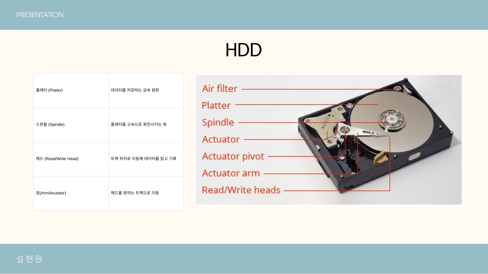
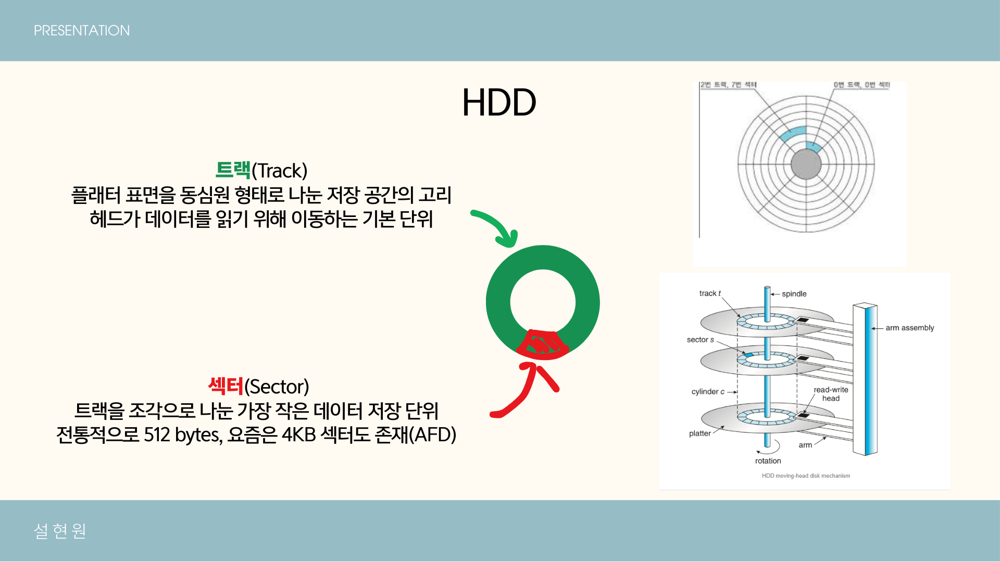
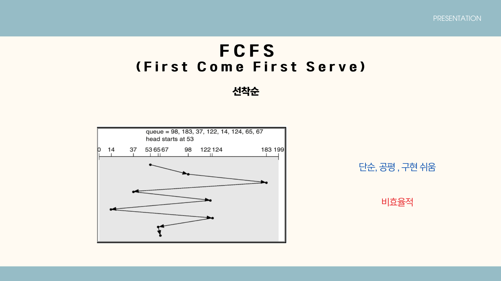
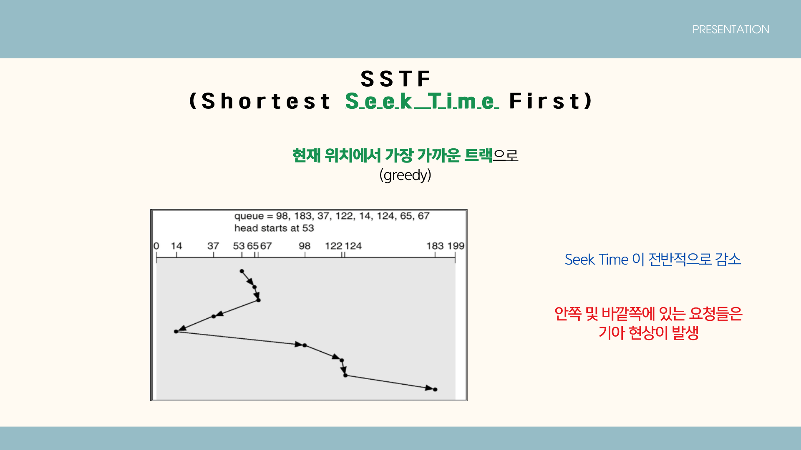
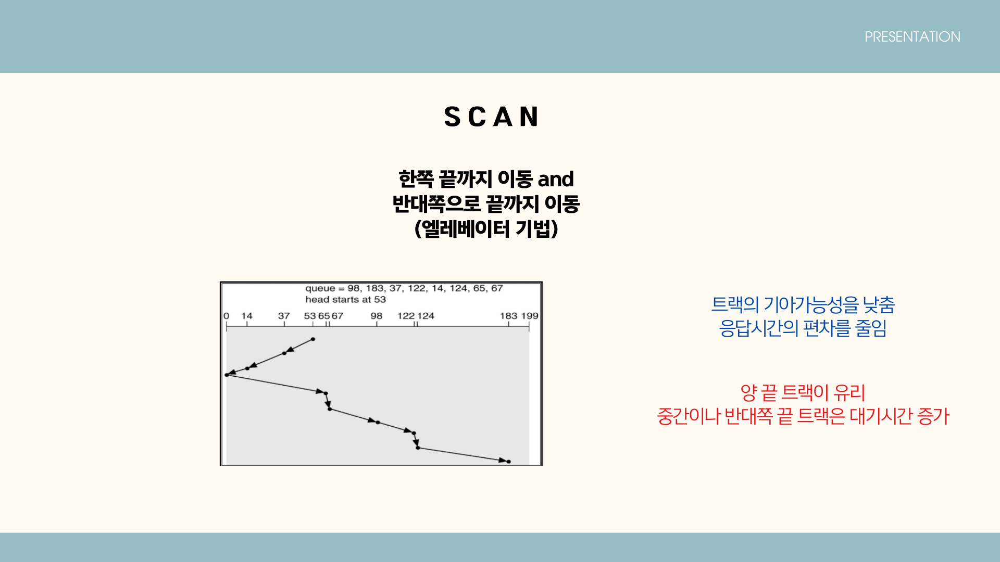
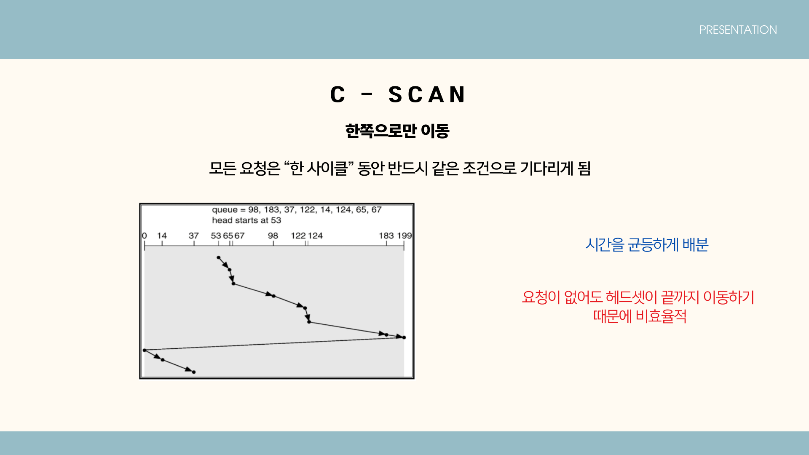
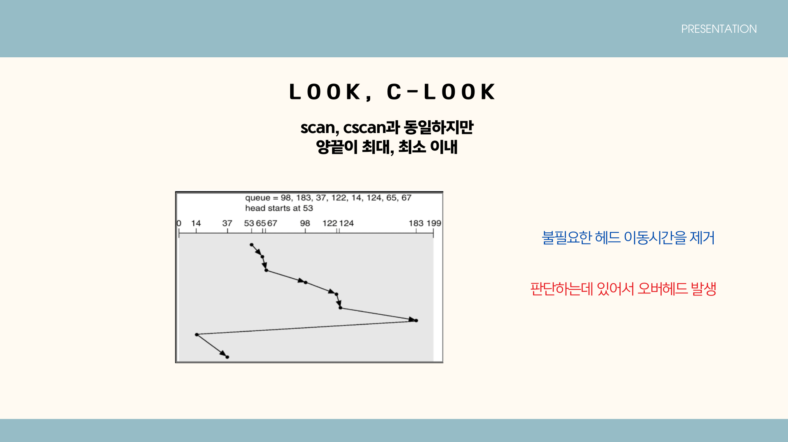
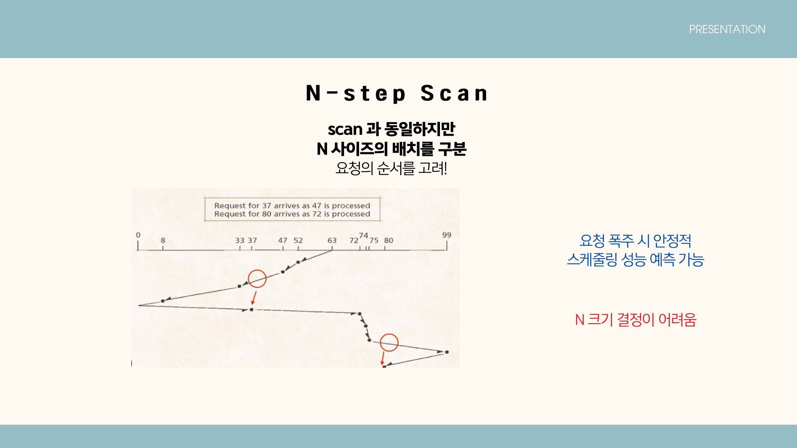
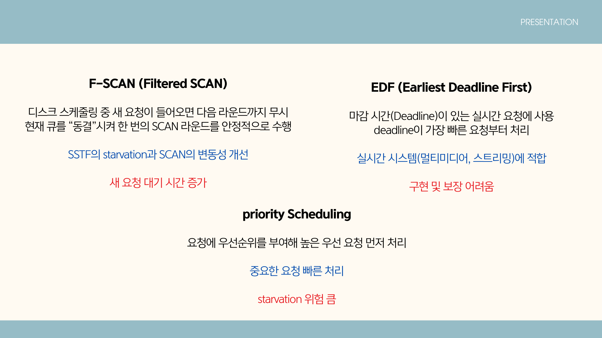

# 📌 Disk Scheduling 정리

## 🖥 개요
디스크 스케줄링은 운영체제가 **디스크 I/O 요청을 효율적으로 처리**하기 위해 사용하는 알고리즘이다.  
특히 HDD는 **기계적 구조**로 인해 `Seek Time(헤드 이동)`과 `Rotational Latency(회전 대기 시간)`이 전체 접근 시간에 큰 영향을 미치므로,  
효율적인 요청 처리 전략이 매우 중요하다.

---

## 💽 HDD 구조 및 동작 원리

### HDD 구성 요소
| 구성 요소 | 설명 |
|-----------|------|
| Platter | 데이터를 저장하는 금속 원판 |
| Spindle | 플래터를 고속 회전시키는 축 |
| Read/Write Head | 데이터를 읽고 기록 |
| Actuator Arm | 헤드를 원하는 위치로 이동 |

### 데이터 접근 시간
Disk Access Time = Seek Time + Rotational Latency + Transfer Time

HDD는 **기계적 이동**이 발생하기 때문에 느리다 → 따라서 **디스크 스케줄링 필요**

---

## 🚦 디스크 스케줄링 알고리즘

| 알고리즘 | 설명 | 장점 | 단점 |
|-----------|---------|-------|-------|
| **FCFS** | 요청 순서대로 처리 | 단순, 공평 | 헤드 이동 비효율 |

- 요청이 들어온 순서(FIFO)대로 처리하는 가장 기본적인 방식  
- 구현이 쉽고 모든 요청을 공평하게 처리하지만, 요청 간 거리가 멀면 헤드 이동이 매우 비효율적임  
- 평균 응답 시간이 크게 증가할 수 있으며 시스템 전체 처리량이 낮아질 수 있음  
| **SSTF** | 가장 가까운 요청 먼저 처리 | 평균 Seek Time 감소 | starvation 문제 발생 |

- 현재 헤드 위치에서 가장 가까운 트랙 요청을 우선 처리하는 방식 (Greedy)  
- 평균 seek time이 크게 감소하여 전체 처리 성능은 좋아지지만  
- 멀리 있는 요청들은 계속 뒤로 밀려 **Starvation(기아 현상)** 이 발생할 수 있음  
| **SCAN** | 엘리베이터 방식(끝까지 이동 후 반대 방향) | 응답 균등, 기아 감소 | 중간 요청 지연 |

- 헤드가 한쪽 끝까지 이동하면서 요청을 처리한 뒤 반대 방향으로 이동  
- 데이터가 한쪽에 몰려도 기아 위험이 줄고 응답 시간 편차가 작아짐  
- 하지만 중간에 있는 요청이 양끝 요청보다 더 오래 기다리는 현상 발생 가능  
| **C-SCAN** | 한 방향으로만 스캔하고 처음으로 복귀 | 응답시간 균등 | 불필요 이동 |

- 한 방향으로만 요청을 처리하고 끝까지 가면 헤드를 처음 위치로 되돌림  
- 모든 요청이 공평한 대기 기대 시간을 갖고 응답 시간의 일관성이 높음  
- 요청이 없어도 끝까지 이동해야 하기 때문에 불필요한 이동이 생길 수 있음  
| **LOOK / C-LOOK** | 요청 범위까지만 이동 | 이동 최소화 | 판단 오버헤드 |

- SCAN / C-SCAN과 유사하지만 요청이 존재하는 실제 범위까지만 이동하고 방향 전환  
- 불필요한 이동을 줄여 효율이 높고 처리 시간이 단축됨  
- 다만 요청 범위를 계산하기 위한 추가 판단이 필요해 오버헤드 발생  
| **N-step SCAN** | 요청을 N개씩 그룹으로 스캔 | 폭주 상황 안정 | N 결정 어려움 |

- 요청을 **N개씩 batch로 묶어서 처리**, batch 처리 중 새 요청은 다음 batch로 넘김  
- 요청이 폭주해도 현재 batch만 고려하므로 예측 가능한 성능 유지  
- 최적의 N 크기를 상황에 맞게 결정하는 것이 쉽지 않다는 단점  
| **F-SCAN** | 현재 큐를 한 번 스캔하는 동안 “동결”하고, 새 요청은 다음 라운드에서 처리 | 한 라운드 동안 큐 구성이 변하지 않아 **예측 가능한 응답 시간** | 스캔 중 들어온 새 요청은 **다음 스캔까지 무조건 대기**해야 함 |

- SCAN 변형 알고리즘으로 스캔 시작 시 큐를 **동결(freeze)** 하고 스캔 중 새 요청은 다음 라운드로 미룸  
- 큐가 변하지 않기 때문에 스케줄링의 변동성이 줄어들고 응답 예측 가능성 향상  
- 그러나 스캔 중 새로 들어온 요청의 대기 시간이 길어져 지연 발생  
| **EDF (Earliest Deadline First)** | 각 요청의 deadline(마감 시간)을 기준으로, 마감이 가장 임박한 순서대로 처리 | 실시간 시스템에서 **마감 시간 보장**에 유리 | deadline 관리, 오버런 처리 등 구현이 복잡하고, 항상 보장을 입증하기 어려움 |
| **Priority Scheduling** | 각 요청에 우선순위를 부여하고, **우선순위가 높은 I/O**부터 처리 | 중요한 작업(예: DB 로그, 시스템 프로세스)을 빠르게 처리 가능 | 낮은 우선순위 요청이 계속 밀리며 **starvation**이 발생할 수 있음 |
** 스케줄링 방법이야 상황에 따라 다양. 외울필요x

---

## ⚡ SSD 시대의 스케줄링

| HDD 중심 | SSD 중심 |
|----------|-----------|
| 기계적 이동 최소화가 목표 | 병렬 처리·IO 최적화 |
| Seek / 회전 지연 중요 | 지연 시간, 대역폭, 공정성 중요 |
| 헤드 위치 고려 필요 | 요청 병합(coalescing) 등 중요 |

즉 SSD에서도 스케줄링은 여전히 중요하며,  
클라우드 인프라에서 **I/O 성능이 전체 비용을 좌우**한다.

---

## 📍 디스크 스케줄링을 배우는 이유

- AWS / GCP / Azure 등에서 **스토리지 I/O 성능이 핵심**
- DBMS(MySQL, PostgreSQL, Redis)에서 I/O 최적화가 절반 이상의 영향
- RAID / NAS / SDS(Software-Defined Storage) 기반 성능 개선에 필수
- **시스템 성능 튜닝 능력 = 실무 경쟁력**

