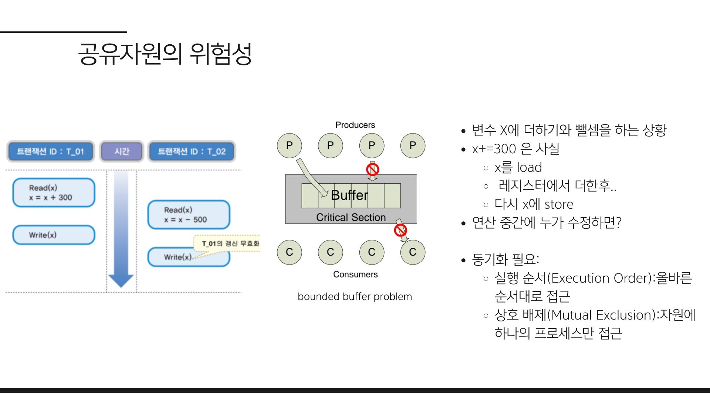
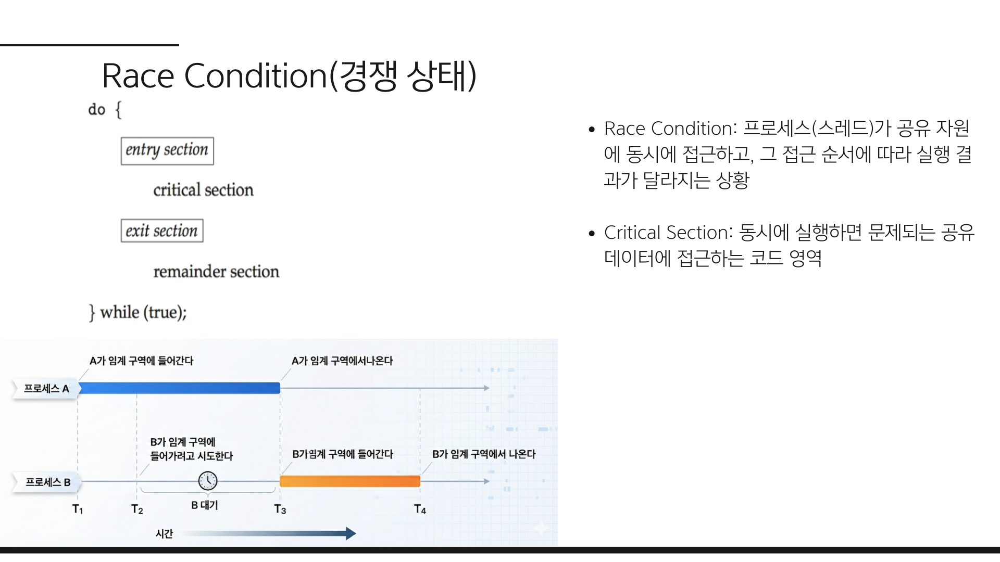
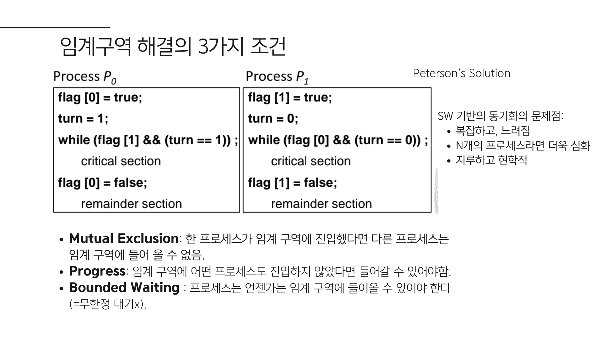
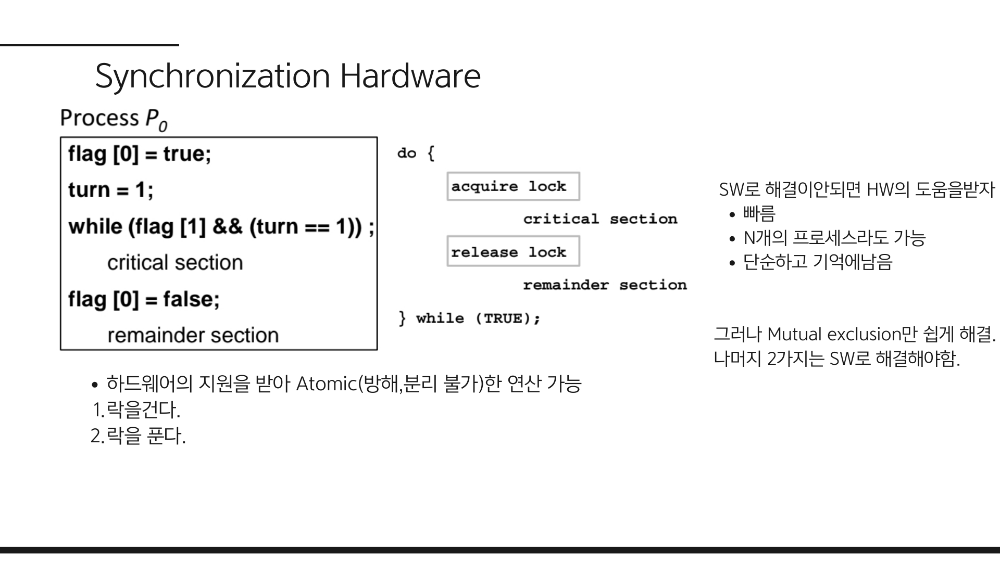
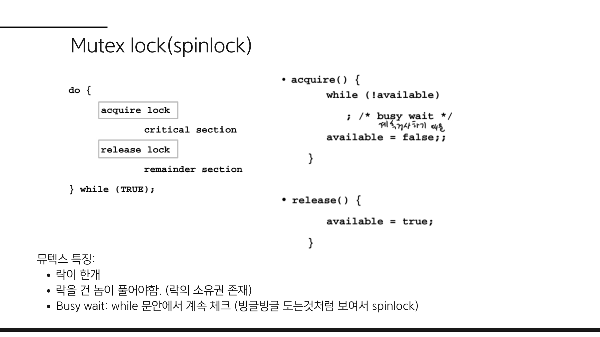
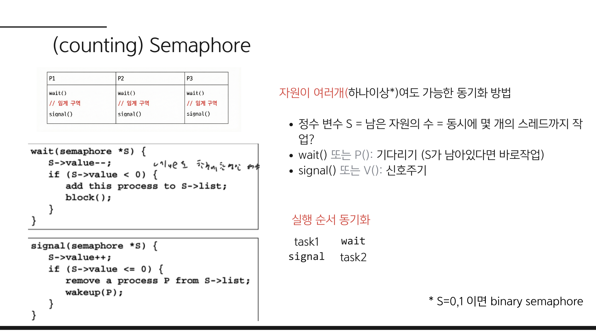
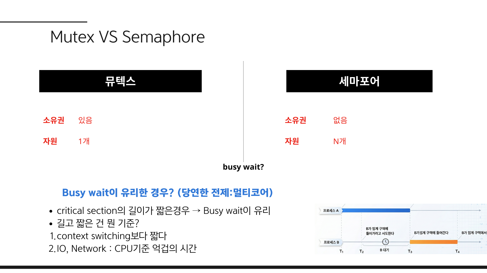
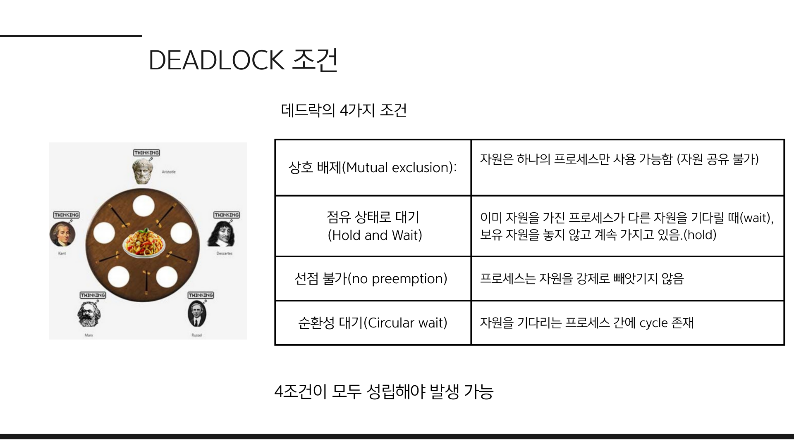
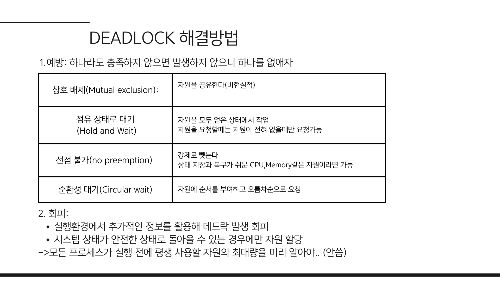
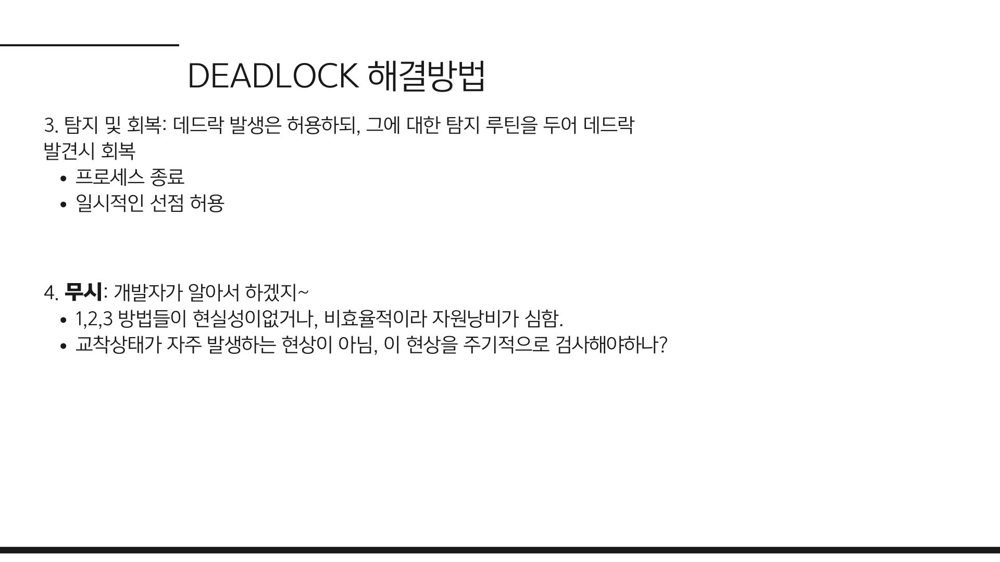

# 프로세스 동기화

[프로세스와 스레드](../01-Process&Thread/README.md#멀티스레드가-무조건-좋을까)에서 멀티스레드는 자원 공유로 인한 **동기화 문제**가 발생할 수 있다고 하였습니다.
이 글에서는 이 **동기화**에 대해 설명하겠습니다.

## 동기화는 왜 필요한가? (Race Condition)

우리가 작성하는 코드 한 줄, 예를 들어 `count += 1`은 CPU 내부에서 한 번에 실행되지 않습니다. (Atomic하지 않음)
기계어 레벨로 내려가면 이 한 줄은 다음과 같은 3단계로 쪼개져서 실행됩니다.

1. **LOAD**: 메모리(RAM)에 있는 `count` 값을 레지스터(CPU)로 가져옵니다.
2. **ADD**: 레지스터의 값에 `1`을 더합니다.
3. **STORE**: 연산된 값을 다시 메모리에 저장합니다.

이 과정 사이에 **Context Switch**가 발생하고 다른 프로세스가 `count`에 접근한다면 어떻게 될까요?

1. 프로세스 A가 `count(10)`을 읽어옴 (LOAD) -> **Context Switch 발생**
2. 프로세스 B가 `count(10)`을 읽어오고 더해서 저장함 (`count = 11`) -> **Context Switch 발생**
3. 프로세스 A는 아까 읽은 `10`에 `1`을 더해 저장함 (`count = 11`)

결과적으로 두 번 더해졌으니 `12`가 되어야 하는데 `11`이 되는, **데이터 유실**이 발생합니다.  
따라서 **실행 순서를 제어**하고, 공유 자원에 **동시에 접근하지 않도록** 해야 합니다.

이렇게 프로세스(스레드)가 공유자원에 동시에 접근하고, 그 접근 순서에 따라 실행 결과가 달라지는 현상을 **경쟁 상태**(Race Condition) 라고 합니다.  
이를 막기 위해 공유 자원에 접근하는 코드 영역인 **임계 구역**(Critical Section)을 관리해야 합니다.

### 임계구역 해결방법

임계구역을 해결하는 3가지 조건은 다음과 같습니다.

1. **Mutual Exclusion**: 동시에 여러 프로세스가 임계구역을 실행할 수 없습니다.
2. **Progress**: 임계구역에 어떤 프로세스도 진입하지 않았다면 진입할 수 있어야합니다
3. **Bounded Waiting**: 프로세스는 임계 구역에 진입하기 위해 무한정 대기해서는 안됩니다.

위 3가지를 지키는 SW방식의 해결법으로 피터슨 알고리즘(Peterson's Algorithm)이 있습니다.(이미지 참조)  
이 외에도 여러 알고리즘이 있지만 이런 SW방식은 복잡하고 프로세스가 많아질수록 성능이 떨어질 수 있습니다.  

### 하드웨어의 도움을 받기

대신 하드웨어레벨에서 Atomic한 연산을 사용하면 SW방식보다 효율적으로 임계구역을 관리할 수 있습니다.  
락을 걸고, 락을 해제하는 과정이 **하드웨어레벨**에서 **원자적으로** 이루어지기 때문입니다.

그러나 Mutual Exclusion만 해결할 수 있기에 Progress와 Bounded Waiting은 SW로 해결해야합니다.

## 뮤텍스(Mutex)와 세마포어(Semaphore)

### 뮤텍스

mutex는 이름에서 알 수 있듯이 **MUT**ual **EX**clusion를 달성하기 위한 잠금방식입니다. 
- 공유 자원에 한 번에 하나의 스레드만 임계 구역에 진입할 수 있도록 보장합니다.  
- 임계 구역에 진입하기 전에 락을 획득하고, 작업을 마친 후 락을 반환하여 다른 스레드가 진입할 수 있도록 합니다.
즉, **락을 획득한 스레드가 락을 해제** 해야합니다.

> **busy wait**?  
> 예제에서는 while문을 통해 락을 획득할 때까지 CPU를 사용하여 대기합니다. 
> 이를 **busy wait**라고 합니다.   
> 다른 대기 방식으로 **sleep wait** 방식이 있습니다.
> sleep wait 방식은 while문 대신 `wait` 함수를 통해 락을 획득할 때까지 **CPU를 사용하지 않고** 대기합니다.  
> 둘 중 어떤 것이 효율적인지는 [뮤텍스 vs 세마포어](#뮤텍스-vs-세마포어)에서 설명하겠습니다

### 세마포어

세마포어는 **여러 스레드**가 공유 자원에 접근할 수 있도록 제어하는 메커니즘입니다.   
- 정수변수를 사용하여 남은 자원의 수를 관리합니다
- `wait()` 함수는 세마포어의 값이 0이면 임계 구역에 진입할 수 없으며, 1 이상이면 세마포어의 값을 1 감소시켜 임계 구역에 진입할 수 있습니다. 
- `signal()` 함수는 세마포어의 값을 1 증가시켜 다른 스레드가 임계 구역에 진입할 수 있도록 합니다.

세마포어는 실행 순서를 제어하는 데도 사용됩니다.  
특정한 순서로 작업을 수행해야 할 때, 세마포어를 사용하여 wait()와 signal()을 통해 순서를 제어할 수 있습니다.

> - 세마포어가 0 또는 1인 경우 **뮤텍스**로 사용할 수 있습니다. (이진 세마포어)  
> - 예제의 경우는 카운팅 세마포어라고도 부릅니다.

### 뮤텍스 vs 세마포어

이 둘은 자원 수와 소유권에 대해 다르게 동작합니다.

| 구분 | 뮤텍스 (Mutex) | 세마포어 (Semaphore) |
| :--- | :--- | :--- |
| **자원 수** | **1개** | **1개 이상** |
| **소유권** | **있음**. 락을 건 프로세스만 락을 해제 가능 | **없음**. `wait()`한 프로세스와 `signal()`하는 프로세스가 달라도 됨 |

#### Busy wait이 유리한 경우?
구현 방식은 mutex와 세마포어 모두 sleep wait 방식을 사용할 수도 있고 busy wait 방식을 사용할 수도 있습니다.  

- sleep 방식은 다른 프로세스가 signal()을 호출할 때까지 기다려야 하므로 **context switch가 발생**합니다.    
- busy wait이였다면 계속 락을 얻을때까지 CPU를 사용하여 대기할 것입니다.

일반적으로는 sleep wait 방식이 효율적이지만, busy wait 방식이 유리한 경우가 있습니다.  
**critical section의 작업이 짧다면** 락이 빨리 반환 될 것이고 busy wait이 더 효율적일 수 있습니다.   
**즉, context switch의 오버헤드가 critical section의 실행 시간보다 큰 경우 busy wait이 유리합니다.**

예를 들어, IO작업의 경우 매우 긴 시간이므로 sleep wait 방식이 효율적이지만, 단순히 특정 변수를 공유하여 증가시키는 작업의 경우 busy wait이 더 효율적일 수 있습니다.

> 반드시 뮤텍스와 세마포어, busy wait과 sleep wait 중 하나만 선택해야하는것은 아닙니다.   
> 세마포어를 관리하기 위해 뮤텍스가 필요하며, sleep wait도 바로 sleep 하지 않고 짧은 시간동안 busy wait을 하다가 sleep 합니다. 

## 교착 상태 (Deadlock)

자원을 보호하기 위해 락을 너무 강력하게 걸다 보면, 정작 프로세스들이 서로의 자원을 기다리며 영원히 멈춰버리는 현상이 발생합니다.  
마치 *"가위를 꺼내려면 포장을 뜯어야 하는데, 포장을 뜯으려면 가위가 필요한"* 상황과 같습니다. 이를 **교착 상태**(Deadlock)라고 합니다.

### 데드락이 발생하는 4가지 필수 조건

아래 4가지 조건이 **동시에 충족**되어야만 데드락이 발생 가능합니다. (하나라도 깨지면 발생하지 않음)
**발생 가능**에서 알 수 있듯이 4가지를 모두 충족시켜도 데드락이 발생하지 않을 수 있습니다. 

1. **상호 배제 (Mutual Exclusion)**: 자원은 한 번에 한 프로세스만 쓸 수 있어야 함.
2. **점유 대기 (Hold and Wait)**: 자원을 가진 상태(Hold)에서 다른 자원을 기다려야(Wait) 함.
3. **비선점 (No Preemption)**: 남의 자원을 강제로 뺏을 수 없음.
4. **순환 대기 (Circular Wait)**: 꼬리에 꼬리를 물고 자원을 기다리는 사이클이 존재함.

## 데드락의 해결 방법

데드락을 이론적으로 해결하는 방법은 예방, 회피, 탐지/회복 등이 있습니다.

- **예방(Prevention)**: 위 4가지 조건 중 하나를 시스템적으로 불가능하게 만듭니다. 그러나 비현실적이거나 비효율적(자원 낭비가 있음)입니다
1. 상호 배제를 없앤다(자원을 공유한다): 애초에 자원을 공유하려고 이렇게 복잡한 동기화를 하는것입니다. 
2. 점유 대기를 없앤다(프로세스가 자원을 사용하지 않을 때만 자원을 할당 또는 실행될 때 모든 자원 할당): 자원 낭비입니다.
3. 비선점을 없앤다 (자원을 강제로 빼앗음): CPU나 메모리 같은경우 가능 하겠지만 모든 자원이 이런 것은 아닙니다.
4. 순환 대기를 없앤다 (자원을 사용하는 프로세스가 자원을 사용하는 순서를 결정): 자원 낭비입니다.  

- **회피(Avoidance)**: **안전한 상태(Safe State)**일 때만 자원을 할당합니다. 매우 복잡하고 비효율적입니다. 프로세스가 요구하는 자원 및 최대값을 알기엔 비현실적입니다.

- **탐지/회복(Detection/Recovery)**: 데드락이 발생했을 때 이를 탐지하고 회복합니다. 자원의 그래프를 관리하여 데드락이 발생했는지 확인하고 회복합니다. 주기적으로 데드락을 탐지하여 비효율이 발생합니다.

### 현대 OS의 선택: 무시 (Ignorance)

하지만 현대의 OS는 대부분 **무시(Ignorance)** 전략을 사용합니다.
교착상태가 자주 발생하는 현상이 아니니 굳이 예방, 회피, 탐지회복 기법으로 오버헤드를 추가하는 것은 비효율적입니다. 