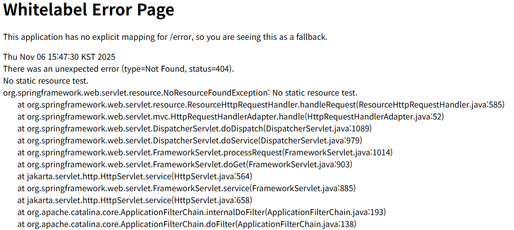

# Spring 프로젝트 공통 예외 처리

<br>

## 목차
- [Spring 프로젝트 공통 예외 처리](#spring-프로젝트-공통-예외-처리)
  - [목차](#목차)
  - [Spring Boot 기본 예외 처리](#spring-boot-기본-예외-처리)
    - [BasicErrorController](#basicerrorcontroller)
    - [동작 방법](#동작-방법)
    - [한계점](#한계점)
  - [@ExceptionHandler](#exceptionhandler)
    - [@ExceptionHandler란?](#exceptionhandler란)
    - [사용 방법](#사용-방법)
    - [한계점](#한계점-1)
  - [@ControllerAdvice](#controlleradvice)
    - [@ControllerAdvice](#controlleradvice-1)
    - [사용 방법](#사용-방법-1)
  - [공통적인 예외 처리를 위한 클래스들](#공통적인-예외-처리를-위한-클래스들)
    - [ErrorCode](#errorcode)
    - [UserException](#userexception)
    - [ErrorResponse](#errorresponse)
  - [추후 알아볼 것](#추후-알아볼-것)
  - [Appendix](#appendix)
    - [참고 자료](#참고-자료)

<br>

## Spring Boot 기본 예외 처리

### BasicErrorController

Spring Boot는 아무런 예외 처리 코드를 작성하지 않아도 **자동으로 예외를 처리함**

그리고 적절한 에러 페이지 또는 JSON 응답을 반환

이런 **예외 처리를 위한 컨트롤러**를 미리 등록해 놓음 → **`BasicErrorController`**

<br>

컨트롤러 등 다른 곳에서 예외가 발생했는데 아무도 예외를 처리하지 않은 것

그러면 DispatcherServlet은 예외를 받아 `/error` 라는 기본 에러 엔드포인트로 이동

**/error 경로를 처리하는 기본 컨트롤러가 BasicErrorController**

<br>

HTML 요청이면 error.html 혹은 Whitelabel 에러 페이지를 렌더링.

API(JSON) 요청이면 JSON 형식으로 에러 정보를 반환.

<br>

Whitelabel 에러 페이지는 `/error` 경로에 등록된 기본 에러 페이지

만약 기본 에러 페이지가 아닌 스스로 작성한 커스텀 페이지를 보여주고 싶다면? 

뷰 템플릿 경로에 커스텀 페이지 파일을 만들어서 넣어두면 됨

<br>

아래와 같이 파일명을 설정하면 HTTP 상태 코드에 따라 표시되는 웹페이지를 다르게 설정할 수 있음

- 4xx.html: 400대 오류 페이지
- 5xx.html: 500대 오류 페이지
- 404.html: 404 오류 페이지

<br>

### 동작 방법

흐름도

```
요청
   ↓
Controller
   ↓ (예외 발생)
DispatcherServlet
   ↓
HandlerExceptionResolver (예외 처리 체인)
   ↓
처리되지 않은 예외 → /error 요청으로 위임
   ↓
BasicErrorController
   ↓
응답(JSON or HTML) 반환
```

<br>

BasicErrorController는 요청을 아래와 같이 구분해 다르게 응답해줌

- 요청이 '브라우저'에서 온 것인지
- 요청이 'API 클라이언트'에서 온 것인지 (ex: postman)

<br>

이 구분은 HTTP 요청의 **`Accept` 헤더** 값을 보고 판단.

<br>

**브라우저(HTML) 요청일 때: "Whitelabel Error Page"**

- **판단 기준**:
    - `Accept` 헤더에 `text/html`이 포함된 경우
- **동작**:
    - Spring Boot는 "Whitelabel Error Page"라는 기본 오류 HTML 페이지를 보여줌

<br>



<br>

**API 클라이언트(JSON) 요청일 때: "기본 JSON 응답"**

- **판단 기준**:
    - `Accept` 헤더가 `text/html`이 **아닌** 경우
    - 예: `application/json`이거나 `Accept` 헤더가 없는 Postman 요청
- **동작**:
    - Whitelabel 페이지의 내용과 **동일한 정보**를 **JSON 형식**으로 반환함

```json
{
  "timestamp": "2025-11-06T09:40:23.671+00:00",
  "status": 500,
  "error": "Internal Server Error",
  "path": "/api/v1/test"
}
```

<br>

### 한계점

- **일관성 없는 응답 포맷**
    - 프론트엔드 입장에서는 성공, 실패 시 json 구조가 달라 번거로움
- **부족한 정보**
    - 기본 응답에는 status, error 등만 존재
    - 예외가 발생했을 때 문제 파악이 어려워짐
- **비즈니스 예외 구분 불가**
    - 커스텀 예외를 정의해도 `500`으로 처리됨
    - 에러가 처리되지 않고 WAS가 에러를 전달받았기 때문
- **HTML 페이지 노출**
    - url만 알면 누구나 마음대로 error 페이지에 접근할 수 있음
    - stack trace 등 잘못 설정 시 내부 정보 노출 가능

<br>

## @ExceptionHandler

### @ExceptionHandler란?

BasicController의 예외 처리에는 한계점이 많고 원하는 방식이 아님

직접 예외를 처리하는 첫 번째 방법을 알아보자. 

<br>

`@ExceptionHandler`는 **컨트롤러 클래스 내부**에 작성

해당 컨트롤러에서 발생한 특정 예외를 '지역적'으로 처리하는 annotation

- **동작 범위**:
    - 어노테이션이 선언된 **컨트롤러 클래스 내부**에서만 동작.
    - 코드를 작성한 컨트롤러에서만 발생하는 예외만 처리.
- **목적**: 특정 컨트롤러에서만 발생하는 고유한 예외를 처리하거나, 간단하게 예외를 처리할 때 사용.

<br>

`@ExceptionHandler`는 Exception 클래스들을 속성으로 받아 처리할 예외를 지정할 수 있다. 

`@ExceptionHandler`에 예외 클래스를 지정하지 않는다면, 파라미터에 설정된 에러 클래스를 처리하게 된다.

<br>

@ExceptionHandler는 에러 응답을 자유롭게 다룰 수 있다는 점에서 유연하다. 

우리가 정의한 공통 응답에 맞춰 응답할 수 있다. 

컨트롤러별로 반환하고자 하는 body와 메시지를 예외별로 적절하게 선택하여 세밀한 정보를 제공할 수 있다.

<br>

**@ExceptionHandler를 사용 시에 주의할 점** 

@ExceptionHandler에 등록된 예외 클래스와 파라미터로 받는 예외 클래스가 동일해야 한다는 것이다.

만약 값이 다르다면 스프링은 컴파일 시점에 에러를 내지 않다가 런타임 시점에 에러를 발생시킨다.

<br>

### 사용 방법

- 예외 처리가 필요한 컨트롤러 클래스 내부에 메서드 생성
- 메서드 위에 `@ExceptionHandler(value = {처리할_예외.class})` 어노테이션 추가
- **다중 매칭 가능 :** `@ExceptionHandler({AException.class, BException.class})`

```java
@RestController
@RequestMapping("/users")
public class UserController {

    private final UserService userService;

    // 비즈니스 로직을 처리하는 기본 API
    @GetMapping("/{id}")
    public ResponseEntity<UserDto> getUserById(@PathVariable Long id) {
        // userService.findById(id)가 UserNotFoundException을 throw 할 수 있음
        UserDto user = userService.findById(id);
        return ResponseEntity.ok(user);
    }
    
    // --------------------------------------------------------------------------------
    // @ExceptionHandler를 통한 예외 처리
    @ExceptionHandler(UserNotFoundException.class)
    public ResponseEntity<ErrorResponse> handleUserNotFound(UserNotFoundException ex) {
        // 정의한 공통 오류 응답 DTO
        ErrorResponse response = new ErrorResponse("USER_NOT_FOUND", ex.getMessage());
        
        // 404 상태 코드와 ErrorResponse 본문을 담아 응답
        return new ResponseEntity<>(response, HttpStatus.NOT_FOUND);
    }
    // --------------------------------------------------------------------------------
}
```

<br>

### 한계점

- **코드 중복**
    - `@ExceptionHandler`는 코드를 작성한 컨트롤러에서만 발생하는 예외만 처리됨.
    - 다른 컨트롤러에서도 같은 예외 처리해야 한다면?
    - 똑같은 메서드를 복사, 붙여넣기 해야 함.
    - 코드의 중복 발생
- **관심사 분리 위배**
    - 예외 처리라는 **부가적인(공통적인)** 코드가 컨트롤러 내부에 섞이게 됨
    - 컨트롤러가 컨트롤러의 핵심 로직에 집중하지 못하게 됨
    - 컨트롤러 클래스가 비대해지고 코드가 지저분해짐

<br>

## @ControllerAdvice

### @ControllerAdvice

`@ExceptionHandler`가 컨트롤러 내부에 있어 **코드 중복**을 일으키는 문제를 확인했다.

이 문제를 해결할 수 있는 것이 @ControllerAdvice이다. 

<br>

`@ControllerAdvice` 란?

Spring에서 **여러 컨트롤러에 걸쳐 공통으로 적용되는 기능**을 정의할 때 사용하는 어노테이션

프로젝트 전역에서 발생하는 예외를 한 곳에서 모아서 처리할 수 있게 하는 어노테이션

<br>

여러 컨트롤러에 대해 전역적으로 ExceptionHandler를 적용해주는 것

모든 컨트롤러에 대해 **횡단적으로 동작하는 AOP 기반 예외 처리기**

<br>

**`@RestControllerAdvice`**란?

`@ControllerAdvice`와 `@ResponseBody`가 합쳐진 어노테이션.

- 이 어노테이션이 붙은 클래스의 `@ExceptionHandler` 메서드는 **반환 값을 항상 HTTP 응답 본문(Response Body)으로** 만듬.
- REST API 서버에서는 모든 응답이 JSON이므로, 이것을 사용하는 것이 훨씬 편리해 REST API 프로젝트에서 주로 사용.

<br>

```java
@Target(ElementType.TYPE)
@Retention(RetentionPolicy.RUNTIME)
@Documented
@ControllerAdvice
@ResponseBody
public @interface RestControllerAdvice {
    ...
}

@Target(ElementType.TYPE)
@Retention(RetentionPolicy.RUNTIME)
@Documented
@Component
public @interface ControllerAdvice {
    ...
}
```

<br>

@Component 어노테이션이 있어서 ControllerAdvice가 선언된 클래스는 스프링 빈으로 등록된다. 

전역적으로 에러 처리해주는 예외 처리 클래스를 만들어 어노테이션을 붙여주면 에러 처리를 위임할 수 있다.

<br>

### 사용 방법

각 컨트롤러에 중복으로 존재했던 예외 처리 로직을 **별도의 예외 처리 클래스로 분리**

예외 처리 클래스에 `@RestControllerAdvice`를 붙여주면 됨

<br>

예외 처리 클래스에 @ExceptionHandler가 붙은 예외 처리 메서드들을 모아두면 됨

그렇다면 모든 컨트롤러 클래스에서 발생한 예외를 모아둔 예외 처리 메서드들에서 잡아 처리해줌

```java
// 이 어노테이션 하나로, 모든 @RestController에서 발생하는 예외를 감시합니다.
@RestControllerAdvice
public class GlobalExceptionHandler {

    // UserNotFoundException이 터지면 이 메서드가 잡습니다.
    // (UserController, PostController 등 어느 컨트롤러에서 발생하든 상관없이!)
    @ExceptionHandler(UserNotFoundException.class)
    @ResponseStatus(HttpStatus.NOT_FOUND) // 404
    public ErrorResponse handleUserNotFound(UserNotFoundException ex) {
        return new ErrorResponse("USER_NOT_FOUND", ex.getMessage());
    }
}
```

<br>

**적용 범위 설정 (필터링)**

`@ControllerAdvice`는 프로젝트 전체에 적용되지만, 필요하면 특정 범위만 선택할 수도 있다.

```java
@ControllerAdvice(
    basePackages = "com.example.api.user",    // 특정 패키지만
    assignableTypes = {UserController.class}, // 특정 클래스만
    annotations = RestController.class        // 특정 어노테이션만
)
public class UserExceptionHandler { ... }

```

이렇게 하면 예외 처리를 “모듈별로 분리”할 수 있다.

예: `UserController` 전용 핸들러, `AdminController` 전용 핸들러 등.

<br>

**여러 전역 핸들러의 우선순위**

전역 예외 핸들러가 여러 개라면 `@Order` 또는 `Ordered` 인터페이스로 순서를 지정 가능하다.

```java
@Order(1)
@RestControllerAdvice
public class GlobalSecurityExceptionHandler { ... }

@Order(2)
@RestControllerAdvice
public class GlobalBusinessExceptionHandler { ... }

```

숫자가 작을수록 우선순위가 높다.

<br>

여러 `ControllerAdvice`가 있을 때 `@Order`어노테이션으로 순서를 지정하지 않는다면?

Spring은 `ControllerAdvice`를 임의의 순서로 호출합니다. 

즉, 사용자가 예상하지 못한 예외 처리가 발생할 수 있습니다.

<br>

## 공통적인 예외 처리를 위한 클래스들

모든 에러를 같은 형태로 내려야 프론트엔드에서 일관되게 처리 가능하다. 

따라서 공통적인 예외 처리를 위한 클래스들을 보자. 

<br>

### ErrorCode

**항상 동일한 오류 코드와 메시지를 반환**하도록 강제할 수 있기에 ErrorCode 관련 클래스가 필요하다. 

그리고 에러 코드와 메시지를 한 곳에서 관리하고 유지보수하기 위해 ErrorCode 관련 클래스 만들어야 한다. 

먼저 ErrorCode 인터페이스로 추상화하자. 

```java
public interface ErrorCode {

    String name();
    HttpStatus getHttpStatus();
    String getMessage();
}
```

<br>

이제 인터페이스에 대한 구현체로 각각 필요한 상황에 맞는 에러 코드 클래스를 만들면 된다. 

enum 클래스로 구현하면 된다. 

```java
@Getter
@RequiredArgsConstructor
public enum CommonErrorCode implements ErrorCode {

    INVALID_PARAMETER(HttpStatus.BAD_REQUEST, "Invalid parameter included"),
    RESOURCE_NOT_FOUND(HttpStatus.NOT_FOUND, "Resource not exists"),
    INTERNAL_SERVER_ERROR(HttpStatus.INTERNAL_SERVER_ERROR, "Internal server error"),
    ;

    private final HttpStatus httpStatus;
    private final String message;
}

@Getter
@RequiredArgsConstructor
public enum UserErrorCode implements ErrorCode {

    INACTIVE_USER(HttpStatus.FORBIDDEN, "User is inactive"),
    ;

    private final HttpStatus httpStatus;
    private final String message;
}
```

<br>

### UserException

상황에 맞는 ErrorCode를 담아 던지기 위한 예외 클래스를 만들자. 

```java
@Getter
@RequiredArgsConstructor
public class RestApiException extends RuntimeException {

    private final ErrorCode errorCode;

}
```

<br>

### ErrorResponse

이제 error code나 message를 담은 공통 에러 응답 클래스를 만들자. 

클라이언트에게 일관되고 표준화된 형식의 오류 JSON을 반환할 수 있다. 

```java
@Getter
@AllArgsConstructor
public class ApiErrorResponse {
    private final String code;
    private final String message;
    private final LocalDateTime timestamp = LocalDateTime.now();
}
```

<br>

## 추후 알아볼 것

- ResponseEntityExceptionHandler
- HandlerExceptionResolver

<br>

## Appendix

### 참고 자료

- 공통 예외 처리
    - https://tecoble.techcourse.co.kr/post/2023-05-03-ExceptionHandler-ControllerAdvice/
    - https://velog.io/@juhyeon1114/Spring-API-%EC%98%88%EC%99%B8%EC%B2%98%EB%A6%AC%ED%95%98%EA%B8%B0-ExceptionHandler-ControllerAdvice
    - https://velog.io/@kiiiyeon/%EC%8A%A4%ED%94%84%EB%A7%81-ExceptionHandler%EB%A5%BC-%ED%86%B5%ED%95%9C-%EC%98%88%EC%99%B8%EC%B2%98%EB%A6%AC
    - https://kkongchii.tistory.com/entry/Spring-Boot-ExceptionHandler-ControllerAdvice-Exception-%EA%B3%B5%ED%86%B5-%EC%B2%98%EB%A6%AC
    - https://hyerin6.github.io/2021-08-16/spring-exception/
    - https://github.com/binghe819/TIL/blob/master/Spring/%EA%B8%B0%ED%83%80/%EC%8A%A4%ED%94%84%EB%A7%81%20%EC%98%88%EC%99%B8%EC%B2%98%EB%A6%AC%20%EA%B0%9C%EB%85%90%20%EB%B0%8F%20%EC%A0%84%EB%9E%B5.md
    - https://mangkyu.tistory.com/204
    - https://mangkyu.tistory.com/205
- 공통 예외 처리 구현
    - https://velog.io/@lundy/RestControllerAdvice%EB%A5%BC-%EC%9D%B4%EC%9A%A9%ED%95%9C-%EC%98%88%EC%99%B8%EC%B2%98%EB%A6%AC-%EA%B3%B5%ED%86%B5%ED%99%94
    - https://kdyspring.tistory.com/45