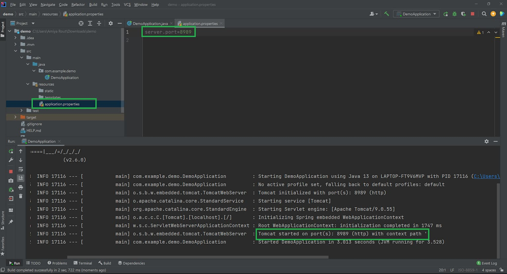

# 설정 파일 분리

<br>

## 목차
- [설정 파일 분리](#설정-파일-분리)
  - [목차](#목차)
  - [설정 파일이란?](#설정-파일이란)
    - [설정 파일 개념 및 사용 이유](#설정-파일-개념-및-사용-이유)
    - [설정 파일 분리 이유](#설정-파일-분리-이유)
  - [설정 파일 기능별 분리](#설정-파일-기능별-분리)
    - [기능별 설정 파일 분리 방법](#기능별-설정-파일-분리-방법)
    - [민감 정보 분리](#민감-정보-분리)
  - [설정 파일 환경별 분리](#설정-파일-환경별-분리)
    - [Spring Profiles](#spring-profiles)
    - [환경별 설정 파일 분리 방법](#환경별-설정-파일-분리-방법)
    - [특정 Profile 활성화 방법](#특정-profile-활성화-방법)
  - [설정 파일 기능별 + 환경별 분리](#설정-파일-기능별--환경별-분리)
    - [1. 파일 구조 및 명명 규칙](#1-파일-구조-및-명명-규칙)
    - [2. `application.yml` 작성 (공통 설정 작성 및 그룹핑)](#2-applicationyml-작성-공통-설정-작성-및-그룹핑)
    - [3. 상세 파일 작성 예시](#3-상세-파일-작성-예시)
    - [동작 원리 (Layering)](#동작-원리-layering)
  - [설정 파일의 속성 값 사용 방법](#설정-파일의-속성-값-사용-방법)
    - [@Value](#value)
    - [@ConfigurationProperties](#configurationproperties)
  - [.properties vs .yml](#properties-vs-yml)
    - [1. 문법 차이](#1-문법-차이)
    - [2. 가독성 차이](#2-가독성-차이)
    - [`.properties`](#properties)
    - [`.yml`](#yml)
    - [3. 주석 작성 방식 차이](#3-주석-작성-방식-차이)
    - [4. 기능별 + 환경별 분리에서의 차이](#4-기능별--환경별-분리에서의-차이)
    - [5. 다중 문서(Multi Document) 지원 여부](#5-다중-문서multi-document-지원-여부)
    - [6. 직관성 \& 표준성](#6-직관성--표준성)
    - [7. Spring Boot 공식 권장 사항](#7-spring-boot-공식-권장-사항)
    - [8. 실제 기업/팀에서의 선택 경향](#8-실제-기업팀에서의-선택-경향)
    - [9. 언제 무엇을 써야 할까? (선택 기준)](#9-언제-무엇을-써야-할까-선택-기준)

<br>

## 설정 파일이란?

### 설정 파일 개념 및 사용 이유

소프트웨어 개발에서 설정 파일은 애플리케이션의 코드와 변경 가능한 데이터를 분리하는 핵심적인 요소다.

<br>

**1. 설정 파일의 개념**

설정 파일은 **애플리케이션이 실행될 때 필요한 환경값들을 외부에 분리해 둔 파일**이다.

설정 파일은 **프로그램의 소스 코드를 변경하지 않고, 소프트웨어의 동작 방식이나 환경 설정을 제어하기 위한 값들을 저장해 둔 파일**을 의미한다.

- **역할:** 애플리케이션이 실행될 때 필요한 초기값이나 환경 변수 등을 제공한다.
- **포함되는 내용:**
    - 데이터베이스 연결 정보 (URL, Username, Password)
    - 서버 포트 번호 (예: 8080)
    - 외부 API 키 또는 인증 토큰
    - 로그 레벨 설정 (Debug, Info, Error 등)
    - 파일 저장 경로 등

<br>

쉽게 말해, 프로그램 내부 로직이 아닌 **변경 가능한 옵션**들을 따로 모아둔 곳이다.



<br>

**2. 설정 파일을 사용하는 이유**

설정 파일을 별도로 분리하여 사용하는 주된 이유는 **유연성**과 **유지보수성** 때문이다.

**A. 재컴파일 및 재배포 방지 (유연성)**

- **하드 코딩(Hard Coding)의 문제:**
    - 소스 코드 내부에 DB 주소나 IP 등을 직접 적는 것이 하드 코딩이다.
    - 이 경우 값이 바뀔 때마다 코드를 수정하고, 다시 빌드 및 컴파일하여 배포해야 한다.
- **설정 파일 사용 시:**
    - 설정 파일의 텍스트만 수정하고 애플리케이션을 재시작하면 변경 사항이 바로 적용된다.

**B. 환경별 유연한 대처 (이식성)**

- 개발, 테스트, 운영 환경은 서로 다른 DB 주소와 API 키를 사용헌다.
- 코드는 동일하게 유지하되, 각 환경에 맞는 설정 파일만 교체하여 ‘Write Once, Run Anywhere'를 실현할 수 있다.

**C. 보안 및 관리의 효율성**

- 비밀번호나 비밀 키 같은 민감한 정보를 소스 코드(Git 등)에서 분리하여 별도로 관리할 수 있다.
- 모든 설정값이 한곳에 모여 있어, 시스템 전체의 구성을 파악하고 관리하기 쉽다.

<br>

### 설정 파일 분리 이유

**1. 환경별 독립성 보장**

애플리케이션은 개발(Local/Dev), 테스트(Beta/Stage), 운영(Prod) 등 다양한 환경에서 실행된다. 

각 환경은 서로 다른 인프라 설정을 가진다.

예 : 개발 환경 DB → `localhost:5432` ,  운영 환경 DB → `rds.amazoncloud.com:5432`

- **문제점:**
    - 모든 설정을 하나의 파일에서 `if-else` 로직이나 주석 처리로 관리한다면?
    - 배포 시 실수로 운영 DB에 테스트 데이터를 넣는 등의 치명적인 휴먼 에러가 발생할 수 있다.
- **분리 효과:**
    - `application-dev.yml`, `application-prod.yml`과 같이 환경별로 파일을 완전히 분리한다.
    - 빌드된 애플리케이션(Code)은 건드리지 않고, 실행 시점에 알맞은 설정 파일만 로드하여 환경 간 충돌을 방지한다.

<br>

**2. 민감 정보 보호**

설정 파일에는 아래와 같은 외부로 유출되어서는 안 되는 정보들이 포함된다.

→ 데이터베이스 비밀번호, AWS Secret Key, 결제 모듈 API Key 등

- **문제점:**
    - 이 모든 정보를 하나의 설정 파일에 담아 버전 관리 시스템(Git 등)에 올리면?
    - 프로젝트 접근 권한이 있는 모든 사람이 실제 운영 서버의 비밀번호 알게 되는 보안 위험이 발생한다.
- **분리 효과:**
    - 공개되어도 되는 '기본 설정’과 공개되면 안 되는 '민감 설정'을 분리한다.
    - 민감 정보가 담긴 파일은 `.gitignore` 등으로 제외하거나, 별도의 보안 저장소(Vault, Secret Manager) 등을 통해 주입받아 보안성을 높인다.

<br>

**3. 유지보수 및 가독성 향상 (Maintainability)**

프로젝트 규모가 커지면 설정 항목이 수백 줄을 넘어가게 된다.

- **문제점:**
    - 하나의 파일에 DB, Mail, Redis, Logging, Custom Logic 등 모든 설정이 섞여 있으면 가독성이 떨어지고 관리가 어렵다.
- **분리 효과:**
    - **기능별 분리:**
        - 관련된 설정끼리 파일을 나눈다.
        - 예: 데이터베이스 설정만 모은 파일, 비즈니스 로직 설정만 모은 파일
    - **공통/개별 분리:**
        - 모든 환경에서 변하지 않는 '공통 설정(Base)'과 환경마다 바뀌는 '개별 설정'을 나누어 중복을 제거하고 관리 효율을 높다.

<br>

## 설정 파일 기능별 분리

### 기능별 설정 파일 분리 방법

하나의 거대한 `application.properties`를 DB, 보안, 로그 등 성격에 맞게 여러 파일로 쪼개 관리하는 방법.

<br>

**기능별 설정 분리 이유**

1. **설정 파일 가독성 향상**
    1. application.properties 한 파일에 모든 설정 들어간다면?
        1. 수천 줄 금방 넘어감
        2. 어디어 어떤 설정이 있는지 찾기 힘듬
    2. 기능별로 설정 파일 나눈다면?
        1. 역할이 명확해짐
2. **팀 협업에 유리**
    1. 각 담당자들이 서로 건드리는 파일이 적어짐
    2. 충돌이 줄어들고 책임 범위도 명확해짐
        1. 보안 담당은 application-security.properties 관리
        2. 인프라 담당은 application-logging.properties 관리
3. **기능, 모듈 단위로 재사용이 쉬움**
    1. 모듈화된 설정 구조는 재사용성 측면에서도 유리

<br>

**방법 1: `spring.config.import` 사용 (권장, Spring Boot 2.4+)**

Spring Boot 2.4부터 도입된 기능으로, **명시적으로 다른 설정 파일을 가져오는(Import)** 가장 깔끔한 방법.

<br>

**1. 파일 생성**

먼저 DB 설정만 담은 파일을 만든다. 

이름은 자유롭지만 관례상 `application-{name}.properties` 형식을 많이 쓴다.

- **파일명:** `application-db.properties`

```bash
# application-db.properties
spring.datasource.url=jdbc:mysql://localhost:3306/mydb
spring.datasource.username=admin
spring.datasource.password=1234
```

<br>

**2. 메인 설정 파일에서 불러오기**

메인 설정 파일(`application.properties`)에서 방금 만든 파일을 import 한다.

- **파일명:** `application.properties` (메인)

```bash
# application.properties

# application-db.properties 파일을 가져옵니다.
spring.config.import=classpath:application-db.properties

# 다른 설정들도 추가로 import 가능
# spring.config.import=classpath:application-db.properties, classpath:application-mail.properties

server.port=8080
```

<br>

> 장점:
> 
> - 어떤 파일이 로드되는지 코드상에서 명확하게 보인다.
> - 프로파일(Profile) 개념과 섞이지 않아 구조가 단순하다.

<br>

**방법 2: `spring.profiles.include` 사용 (과거 방식)**

Spring Boot 2.4 이전에는 이 방식을 주로 사용했다. 

파일을 분리하기 위해 **프로파일(Profile) 기능**을 응용하는 방식이다.

<br>

**1. 파일 생성**

스프링 부트는 `application-{profile}.properties` 형식의 파일을 자동으로 인식할 수 있다.

 DB 설정을 위한 'db'라는 프로파일이 있다고 가정하고 파일을 만든다.

- **파일명:** `application-db.properties`

```bash
# application-db.properties
spring.datasource.url=jdbc:mysql://localhost:3306/mydb
spring.datasource.username=admin
spring.datasource.password=1234
```

<br>

**2. 메인 설정 파일에서 포함하기**

메인 파일에서 `db` 프로파일을 포함(`include`)시킨다고 선언한다.

- **파일명:** `application.properties`

```bash
# application.properties

# 'db'라는 이름의 프로파일(설정 파일)을 포함시킵니다.
spring.profiles.include=db

# 여러 개일 경우 쉼표로 구분
# spring.profiles.include=db, security
```

<br>

> 주의점:
> 
> - 이 방식은 `db`를 하나의 '프로파일'로 취급한다.
> - 만약 `dev`, `prod` 같은 환경 프로파일과 함께 쓸 때, 복잡도가 올라갈 수 있음
>     - why?
>         - 여러 설정 파일에 같은 key 있을 때 설정 우선순위 혼란해짐 (ex : dev vs db)
>         - 환경마다 설정 달라야 하면 파일 관리 복잡해집 (ex : db-dev, db-prod)
> - 최신 버전에서는 `import` 방식을 더 권장한다.

<br>

**구조화 예시**

설정을 기능별로 분리하면 프로젝트 구조가 아래와 같이 정리된다.

```bash
src/main/resources
 ├─ application.properties       (메인: 공통 설정 + Import 구문)
 ├─ application-db.properties    (DB 관련 설정 모음)
 ├─ application-mail.properties  (메일 발송 관련 설정 모음)
 └─ application-security.properties (보안 관련 설정 모음)
```

<br>

### 민감 정보 분리

소스 코드 저장소(GitHub, GitLab 등)에 아래와 같은 민감 정보가 그대로 올라가는 것을 방지해야 한다. 

<br>

대표적인 민감 정보 목록

- DB 비밀번호
- DB URL (운영 주소 포함 시 위험)
- Redis/Kafka/Mongo 등 인증 정보
- API Key / Secret Key
- OAuth2 Client ID, Client Secret
- JWT Secret (노출되면 누구나 토큰 생성 가능)
- Cloud 서비스 Key (AWS, GCP, NCP 등)
- SMTP 계정 정보
- 결제 서비스 키(PG사)
- 내부 시스템 도메인
- ….

<br>

**1. 왜 분리해야 하는가?**

- **보안 위험:**
    - Public Repository에 비밀번호가 올라가면 전 세계 해커들의 타겟이 된다.
    - Private이라도 퇴사자나 권한 없는 내부자가 정보를 볼 수 있다.
- **Git History:**
    - 한 번 커밋되면 파일을 지워도 기록에 남는다.
    - 따라서 저장소를 통째로 삭제하거나 복잡한 정제 과정을 거쳐야 한다.

<br>

**2. 주요 분리 방법**

난이도와 보안 수준에 따라 크게 3가지 방법으로 나뉜다.

<br>

**방법 1: 별도 파일 분리 및 .gitignore 처리 (가장 기초)**

민감 정보만 모아둔 설정 파일을 따로 만들고, Git이 추적하지 않도록 설정하는 방법이다.

**1. 파일 생성**

- `application-secret.properties` (또는 .yml) 파일을 생성한다.
- 여기에 DB 비밀번호, API Key 등을 작성한다.

```bash
# application-secret.properties
spring.datasource.password=MySuperSecretPassword123!
api.key=abcdef123456
```

<br>

**2. 메인 설정에서 Import**

- 앞서 배운 `spring.config.import`를 사용한다.

```bash
# application.properties
spring.config.import=optional:classpath:application-secret.properties
```

*(Tip: `optional`을 붙이면 로컬에 파일이 없어도 에러 없이 실행되어 개발 시 편리하다.)*

<br>

**3. .gitignore 등록 (핵심)**

- 프로젝트 루트의 `.gitignore` 파일에 해당 파일명을 추가한다.

```bash
# .gitignore
application-secret.properties
```

<br>

> 장점: 구현이 매우 쉽다. 로컬에는 안전하지만, 운영 서버 배포에는 별도 방식 필요.
단점: 새로운 개발자가 합류하면 비밀번호 파일을 메신저나 USB로 따로 전달해야 하는 번거로움이 있다.
> 

<br>

**방법 2: 환경 변수(Environment Variables) 사용 (표준 권장)**

설정 파일에는 값을 적지 않고 변수만 적어두는 방식이다. 

실제 값은 OS나 실행 환경(Docker, Jenkins 등)이 주입한다.

운영 환경에서 가장 표준적인 방법이다. 

<br>

**1. 설정 파일 작성**

- `${변수명}` 형식을 사용다.

```bash
# application.properties
spring.datasource.username=${DB_USERNAME}
spring.datasource.password=${DB_PASSWORD}
```

<br>

**2. 값 주입 방법**

- **IntelliJ/IDE:** 실행 설정(Run/Debug Configurations) → Environment variables에 추가.
    - `DB_USERNAME=admin`
    - `DB_PASSWORD=1234`
- **Linux/Server:** `export DB_PASSWORD=1234` 후 실행.
- **Docker/K8s:** 컨테이너 실행 시 환경 변수 옵션으로 주입.

<br>

> 장점: 코드가 완전히 안전하며, 클라우드/컨테이너 환경(AWS, Docker)에서 표준으로 사용된다.
단점: 로컬 개발 시마다 환경 변수를 IDE에 세팅해야 하는 귀찮음이 있다.
> 

<br>

**방법 3. 클라우드 Secret Manager 사용 (가장 안전)**

운영 환경에서는 비밀번호를 직접 파일로 두지 않고, **Secret Manager**에서 즉시 받아온다.

<br>

예시 서비스:

- AWS Secrets Manager
- AWS SSM Parameter Store
- GCP Secret Manager
- Hashicorp Vault
- Kubernetes Secrets

<br>

Spring에서는 아래처럼 연동 가능:

```yaml
spring:
  cloud:
    aws:
      secretsmanager:
        enabled: true
```

📌 운영 환경에서는 이 방법을 **가장 권장**한다.

<br>

**방법 4. Docker `.env` 파일 분리**

도커 기반이면 환경변수 파일을 따로 관리한다.

```
DB_USER=prod_user
DB_PASSWORD=prod_pass
JWT_SECRET=xxxxx
```

<br>

그리고 `docker-compose.yml`:

```yaml
environment:
  - DB_USER=${DB_USER}
  - DB_PASSWORD=${DB_PASSWORD}
```

`.env` 역시 Git에 올려선 안 된다.

<br>

**민감 정보 분리 시 주의할 점**

❌ 절대 금지

- 설정 파일에 운영 비밀번호 직접 기입
- GitHub에 `.yml`, `.properties` 그대로 올리기
- Slack/노션에 평문으로 공유
- 프론트엔드 코드에 Secret 넣기(완전 금지)
- 테스트 편의를 위해 Secret을 하드코딩

<br>

✔ 권장

- 환경 변수 + Secret Manager 조합
- Secret은 역할(Role)별로 쪼개서 최소 권한만 부여
- Secret Rotation 주기 적용 (예: 3개월마다 자동 변경)

<br>

## 설정 파일 환경별 분리

### Spring Profiles

**1. 개념** 

애플리케이션 설정의 일부를 분리해, **특정 환경에서만 사용할 수 있게 만드는 스프링 프레임워크의 핵심 기능**.

**환경(environment)에 따라 다른 설정을 적용하기 위한 Spring의 공식 기능**이다.

즉, 하나의 애플리케이션 안에서

- "개발 환경용 설정(dev)"
- "운영 환경용 설정(prod)"
- "테스트 환경용 설정(test)"

처럼 **설정 파일을 분리해서 로딩할 수 있는 기능**이다.

<br>

- **목적:**
    - 개발, 테스트, 운영 등 서로 다른 환경에 맞춰 소스 코드 수정 없이 동작 방식을 변경하기 위함이다.
- **제어 대상:**
    1. **설정 값:** 
        1. DB 접속 정보, 로그 레벨 등 (`.properties`, `.yml`)
    2. **Bean 등록:** 
        1. 특정 환경에서만 메모리에 올릴 객체 
        2. 예: 로컬에서는 가짜 결제 모듈, 운영에서는 실제 결제 모듈 사용

<br>

**2. 동작 원리**

Spring Framework 내부의 `Environment` 추상화 인터페이스를 통해 동작한다.

과정은 크게 3단계로 나뉜다.

<br>

**Step 1: 활성화 (Activation)** 

사용자가 애플리케이션을 실행할 때, "나는 지금 **dev** 모드야"라고 알려준다. 

(예: `-Dspring.profiles.active=dev`)

<br>

**Step 2: 감지 및 로드 (Detection & Loading)** 

스프링 컨테이너(IoC Container)가 시작될 때, `Environment` 객체는 활성화된 프로파일 정보를 읽어들인다.

1. **설정 파일 탐색:**
    - 기본 `application.yml`을 읽는다.
    - 활성화된 프로파일 명칭이 붙은 `application-dev.yml`을 찾아 추가로 읽는다.
    - 나중에 읽은 환경별 파일의 값이 우선순위를 가져 덮어쓴다(Override).
2. **Bean 등록 판단 (`@Profile`):**
    - 코드 상에 `@Profile("dev")`가 붙은 컴포넌트(Class, Method)가 있다면, 현재 프로파일과 일치하는지 검사한다.
    - 일치하면 메모리(Bean)에 등록하고, 일치하지 않으면 무시한다.

<br>

**Step 3: 애플리케이션 실행** 

최종적으로 병합된 설정 값과 선별된 Bean들로 애플리케이션이 구동된다.

<br>

**3. 코드 예시**

자바 코드(Bean)도 프로파일에 따라 갈아끼울 수 있다.

```java
public interface PayService {
    void pay();
}

// 개발 환경에서는 실제 결제가 안 되도록 가짜 객체 사용
@Profile("dev")
@Service
public class MockPayService implements PayService { ... }

// 운영 환경에서는 실제 PG사와 통신
@Profile("prod")
@Service
public class RealPayService implements PayService { ... }
```

<br>

> 결과:
> 
> - `active=dev` 실행 시: `MockPayService`가 주입됨.
> - `active=prod` 실행 시: `RealPayService`가 주입됨.

<br>

4. **Profile별 파일 명명 규칙**

Spring Boot 공식 규칙:

```
application-{profile}.yml
application-{profile}.properties
```

<br>

예시:

- `application-dev.yml`
- `application-test.yml`
- `application-stage.yml`
- `application-prod.yml`

파일 이름만 맞으면 Spring이 자동으로 인식한다.

<br>

주의 사항

- **`application.yml` (Default):** 프로파일과 상관없이 항상 로드되는 **공통(Base) 설정**.
- 만약 `application-myconfig.yml` 처럼 이름을 지어놓고 `myconfig` 프로파일을 활성화하지 않으면?
    - 스프링은 `application-myconfig.yml` 파일을 절대 읽지 않는다.

<br>

### 환경별 설정 파일 분리 방법

환경별 설정 파일 분리는 Spring 프로젝트에서 **가장 중요한 설정 관리 패턴**이다.

목적은 **프로덕션, 개발, 테스트, 로컬** 환경에서 서로 다른 값들을 안전하게 나누어 사용하는 것이다.

<br>

**1) 왜 환경별로 분리해야 할까?**

환경마다 필요한 설정이 다르기 때문이다.

<br>

예시로 보면 바로 이해됨:

| 항목 | 개발(dev) | 운영(prod) |
| --- | --- | --- |
| DB 주소 | localhost | RDS, Cloud DB |
| 로그 레벨 | DEBUG | INFO/WARN |
| 캐시 정책 | 캐시 없이 | Redis 사용 |
| CORS | localhost:3000 | 실제 도메인 |
| 외부 API URL | Sandbox | Live |

<br>

→ **이걸 한 파일 안에 넣으면 관리가 불가능하다.**

그래서 Spring에서는 **Profile** 기능을 제공한다.

<br>

**2) 환경별 설정 파일 이름 규칙**

Spring Boot 공식 규칙:

```
application-{profile}.yml
application-{profile}.properties
```

<br>

대표적으로:

- `application-dev.yml`
- `application-test.yml`
- `application-prod.yml`
- 필요하면 `application-local.yml`도 가능

<br>

**3) 환경별 설정 파일 분리 구조 만들기**

가장 널리 사용되는 구조는 다음과 같다.

```
src/main/resources/
 ├─ application.yml             ← 공통 설정
 ├─ application-dev.yml         ← 개발 환경
 ├─ application-test.yml        ← 테스트 환경
 └─ application-prod.yml        ← 운영 환경
```

<br>

**4) 공통 설정 파일(application.yml)에 무엇을 넣는가?**

환경에 상관없는 공통적인 값만 넣는다.

예시:

```yaml
spring:
  application:
    name: my-service

logging:
  level:
    root: INFO   # 기본값
```

<br>

넣지 말아야 하는 것

- DB URL
- Secret Key
- 외부 API URL
- 운영/개발에서 달라지는 값들

이 값들은 반드시 환경별 파일로 분리해야 한다.

<br>

**5) 환경별 파일에 무엇을 넣는가?**

각 환경에 따라 달라지는 값만 넣는다.

<br>

예: application-dev.yml

```yaml
spring:
  config:
    activate:
      on-profile: dev

  datasource:
    url: jdbc:postgresql://localhost:5432/mydb
    username: dev_user
    password: dev_pass

logging:
  level:
    root: DEBUG
```

<br>

예: application-prod.yml

```yaml
spring:
  config:
    activate:
      on-profile: prod

  datasource:
    url: jdbc:postgresql://prod-db:5432/prod_db
    username: prod_user
    password: ${DB_PASSWORD}     # 운영에서는 환경 변수로 관리

logging:
  level:
    root: INFO

server:
  error:
    include-stacktrace: never
```

<br>

6) 환경별 설정 파일 합쳐지는 원리

Spring은 다음 순서로 파일을 불러온다.

1. **application.yml** (공통)
2. **application-{profile}.yml**
3. 같은 키가 있으면 **프로필 파일이 override**

<br>

예시

```yaml
# application.yml
logging:
  level:
    root: INFO
```

```yaml
# application-dev.yml
logging:
  level:
    root: DEBUG
```

<br>

**7) Profile 활성화 방법**

환경별 파일을 만들어도, Spring이 어떤 파일을 적용할지 알려줘야 한다.

아래에서 확인하자. 

<br>

### 특정 Profile 활성화 방법

1. spring.profiles.active 설정
2. JVM 옵션 or Command Line 인자 전달
3. IDE 실행 환경 설정

<br>

Spring에서는 Profile을 활성화하는 방법이 여러 가지다.

실제 운영·개발 환경에서 각각 사용 빈도가 다르다.

<br>

**방법 1: 설정 파일 내부에서 지정 (`spring.profiles.active`)**

`application.yml` 파일 안에 직접 적어두는 방식이다.

```yaml
# application.yml
spring:
  profiles:
    active: dev  # 기본적으로 dev를 활성화해라
```

- **특징:**
    - 별도의 옵션 없이 실행해도 항상 `dev`로 동작한다.
- **단점:**
    - 운영 서버에 배포할 때 이 값을 지우거나 바꿔주지 않으면?
    - 운영 서버가 개발 설정으로 돌아가는 대형 사고가 날 수 있습니다.
    - **로컬 개발용 기본값**으로만 쓰는 것이 좋다.

<br>

**방법 2: IDE 실행 환경 설정 (개발 시 주로 사용)**

IntelliJ나 Eclipse 같은 IDE에서 실행 옵션을 주는 방법입니다.

코드를 수정하지 않고 환경을 바꿀 수 있습니다.

- **경로 (IntelliJ):** Run/Debug Configurations → Active profiles 입력란에 `dev` 입력.
- **특징:** 내 컴퓨터(Local)에서만 적용되므로 팀원들에게 영향을 주지 않는다.

<br>

**방법 3: JVM 옵션 또는 Command Line 인자 (배포 시 표준)**

서버에 배포해서 `jar` 파일을 실행할 때, 명령어 뒤에 옵션을 붙이는 방식입니다. 

**가장 우선순위가 높고 확실한 방법**입니다.

<br>

**A. JVM 옵션 (`-D`)**

시스템 속성(System Property)으로 전달하는 방식이다.

```bash
java -jar -Dspring.profiles.active=prod my-app.jar
```

<br>

**B. 커맨드 라인 인자 (`--`)**

스프링 부트 인자로 전달하는 방식이다.

```bash
java -jar my-app.jar --spring.profiles.active=prod
```

<br>

**Profile 로딩 우선순위**

위 방법들은 아래 우선순위로 적용된다.

1. Command line 인자
2. JVM 옵션
3. OS 환경 변수
4. application.yml 내부 설정

<br>

application.yml에 dev로 설정하여도 command line에서 prod로 설정한다면?

**명령어(External)가 파일(Internal)을 이긴다.** 

따라서 배포 시 안전하게 덮어쓸 수 있다.

즉, **가장 나중에 지정한 값이 우선한다.**

<br>

## 설정 파일 기능별 + 환경별 분리

### 1. 파일 구조 및 명명 규칙

파일 이름에 환경과 기능을 모두 명시한다.

- 규칙: `application-{환경}-{기능}.yml`

```
resources/
 ├─ application.yml             (메인: 공통 및 그룹핑 정의)
 ├─ application-dev-db.yml      (개발용 DB 설정)
 ├─ application-dev-security.yml(개발용 보안 설정)
 ├─ application-prod-db.yml     (운영용 DB 설정)
 └─ application-prod-security.yml(운영용 보안 설정)
```

<br>

### 2. `application.yml` 작성 (공통 설정 작성 및 그룹핑)

이전처럼 application.yml에 공통 설정을 작성한다. 

이제 스프링 부트에게 "dev라고 부르면 `dev-db`와 `dev-security`를 가져와"라고 알려줘야 한다.

`spring.profiles.group`을 사용한다.

```yaml
# application.yml
spring:
  profiles:
    group:
      # 'dev' 프로파일 활성화 시 -> dev-db, dev-security 파일 로드
      dev:
        - "dev-db"
        - "dev-security"
      
      # 'prod' 프로파일 활성화 시 -> prod-db, prod-security 파일 로드
      prod:
        - "prod-db"
        - "prod-security"
        
 # --- [공통 설정] 모든 DB가 공유하는 설정 ---
  datasource:
    driver-class-name: com.mysql.cj.jdbc.Driver
    hikari:
      maximum-pool-size: 20
      connection-timeout: 30000       
```

<br>

### 3. 상세 파일 작성 예시

각 파일은 해당 환경에 필요한 내용만 담는다. 

서로 의존하지 않으므로 마음껏 수정해도 다른 환경에 영향을 주지 않는다.

<br>

**A. 개발용 DB (`application-dev-db.yml`)**

```yaml
spring:
  datasource:
    url: jdbc:h2:mem:testdb  # 인메모리 DB 사용
    username: sa
    password:
  h2:
    console:
      enabled: true          # 개발 시에만 콘솔 허용
```

<br>

**B. 운영용 DB (`application-prod-db.yml`)**

```yaml
spring:
  datasource:
    url: jdbc:mysql://real-db-server/mydb  # 실제 MySQL 사용
    username: ${DB_USER}
    password: ${DB_PASS}
  # 운영 환경은 H2 콘솔 설정 자체가 필요 없음 (아예 안 적음)
```

<br>

### 동작 원리 (Layering)

스프링 부트는 설정을 로딩할 때 **순서**가 있다.

1. **Base (1단계):** `application.yml`을 먼저 읽는다. (공통 설정 로드)
2. **Profile (2단계):** `application-dev-db.yml` 등을 읽다. (구체적 설정 로드 및 덮어쓰기)

<br>

개발 환경(`dev`)으로 실행하면, 스프링 부트는 내부적으로 아래 설정을 합쳐서 완성된 설정을 만든다. 

**`application.yml + application-dev-db.yml + application-dev-security.yml`**

<br>

## 설정 파일의 속성 값 사용 방법

설정 파일에 값을 자바 코드로 가져와서 사용하는 방법을 보자. 

스프링 부트에서는 크게 두 가지 방식(**`@Value`**, **`@ConfigurationProperties`**)을 제공한다. 

<br>

### @Value

가장 간단하고 직관적인 방법으로, **단일 필드 값**을 주입받을 때 사용한다.

<br>

**1. 사용법**

SpEL(Spring Expression Language) 형식인 **`${...}`** 를 사용하여 키(Key)를 명시한다.

타입에 맞게 자동 형변환(int, long, boolean 등)도 해준다.

- **설정 파일 (`application.yml`)**
    
    ```yaml
    server:
      port: 8080
    auth:
      jwt-secret: mySecretKey123
    ```
    
- **자바 코드**
    
    ```java
    @Service
    public class AuthService {
    
        // 1. 정확한 키를 입력하여 값 주입
        @Value("${auth.jwt-secret}")
        private String secretKey;
    
        // 2. 값이 없을 경우를 대비한 기본값(Default Value) 설정 가능 (콜론 : 사용)
        @Value("${server.port:80}")
        private int port;
    
        public void printKey() {
            System.out.println("Key: " + secretKey);
        }
    }
    ```
    

<br>

**2. 장단점**

- **장점:**
    - 설정이 간편하고 빠르게 적용할 수 있다.
    - SpEL을 통해 간단한 연산이나 시스템 변수 참조가 가능하다.
    - 간단한 값 한두 개 주입에는 제일 편하다.
    - 빠르게 테스트하거나 임시 설정 주입할 때 좋다.
    - 기존 코드에 한 줄 추가로 설정 바꾸기 쉬움.
- **단점:**
    - 설정 항목이 많아지면 클래스에 `@Value`가 덕지덕지 붙어 코드가 지저분해진다.
    - 문자열을 숫자로 변환하는 등의 과정이 느슨하는 등 타입 안정성이 약하다.
    - 관련된 설정들을 하나의 객체로 묶어서 관리하기 어렵다.
    - 복잡한 구조(중첩 객체, 리스트, Map)에 부적합

<br>

### @ConfigurationProperties

설정 파일의 특정 prefix로 시작하는 값들을 자바 클래스(객체)에 통째로 맵핑하는 방식이다. 

실무에서 가장 권장되는 방식이다.

- 타입 세이프(type-safe)
- 구조화된 설정에 어울림
- 유지보수성과 테스트가 좋음

<br>

**1. 사용법**

관련된 설정들을 묶을 접두어(Prefix)를 정하고, 자바 클래스의 필드명과 매칭시킨다.

- **설정 파일 (`application.yml`)**
    
    ```yaml
    # 'myapp.mail' 로 시작하는 설정들을 묶음
    myapp:
      mail:
        host: smtp.gmail.com
        port: 587
        enabled: true
        receivers: # 리스트(List)도 쉽게 매핑 가능
          - admin@example.com
          - user@example.com
    ```
    
- **자바 코드 (DTO 같은 클래스 생성)**
    
    ```java
    @ConfigurationProperties(prefix = "myapp.mail") // 접두어 지정
    @Component // Bean으로 등록
    @Getter @Setter // Getter, Setter 필요 (Lombok 사용 시)
    public class MailProperties {
    
        private String host;
        private int port;
        private boolean enabled;
        private List<String> receivers; // List 자동 매핑
    }
    ```
    
- **사용하는 곳**
    
    ```java
    @Service
    @RequiredArgsConstructor
    public class MailService {
    
        private final MailProperties mailProperties; // 객체째로 주입받음
    
        public void send() {
            System.out.println("Host: " + mailProperties.getHost());
            // 객체에서 꺼내 쓰듯이 사용 (자동완성 지원)
        }
    }
    ```
    

<br>

2. @ConfigurationProperties 활성화 방법

두 가지 방식이 있다.

**(1) 설정 클래스에서 활성화**

```java
@Configuration
@EnableConfigurationProperties(AppProperties.class)
public class AppConfig {
}
```

<br>

**(2) Boot 2.2+ : `@ConfigurationPropertiesScan`**

```java
@SpringBootApplication
@ConfigurationPropertiesScan
public class MyApplication {
}
```

그리고 `AppProperties`에 그냥 `@ConfigurationProperties`만 붙여두면 된다. 

<br>

**3. 장단점**

- **장점:**
    - **계층 구조 표현:** List, Map 등 복잡한 데이터 구조를 쉽게 매핑할 수 있다.
    - **재사용성:** 여러 클래스에서 `MailProperties`만 주입받으면 설정을 공유할 수 있다.
    - **유효성 검사(Validation):** `@Validated`, `@NotNull`, `@Min` 등을 사용하여 설정값이 올바른지 앱 실행 시점에 검사할 수 있다.
    - **IDE 지원:** IntelliJ 등에서 설정 키 자동 완성 기능을 제공한다. (메타데이터 생성 시)
- **단점:**
    - 별도의 클래스를 만들어야 하므로 아주 간단한 설정 하나를 가져오기에는 번거로울 수 있다.

<br>

## .properties vs .yml

Spring Boot는 설정 파일로 두 가지 형식을 지원한다.

- `.properties` → 전통적인 Key-Value 기반 설정
- `.yml`(또는 `.yaml`) → 계층 구조 기반 설정 (더 현대적인 표준)

둘 다 같은 역할을 하지만 **문법과 구조, 사용성에서 큰 차이**가 있다.

<br>

### 1. 문법 차이

`.properties` 문법 (Key=Value)

```
server.port=8080
spring.datasource.url=jdbc:mysql://localhost:3306/mydb
spring.datasource.username=root
spring.datasource.password=1234
```

- Key를 “점(.)”으로 이어서 계층 관계를 표현한다.
- 모든 값은 문자열 기반이라 가독성이 떨어질 수 있다.

<br>

`.yml` 문법 (계층 구조 YAML)

```yaml
server:
  port: 8080

spring:
  datasource:
    url: jdbc:mysql://localhost:3306/mydb
    username: root
    password: 1234
```

- 들여쓰기 기반으로 계층 구조를 표현함
- 구조가 눈에 보이기 때문에 가독성이 매우 높아짐

<br>

### 2. 가독성 차이

기능이 늘어날수록 차이가 극적으로 커진다.

예: 다단계 설정이 많은 경우

### `.properties`

```
spring.jpa.hibernate.ddl-auto=update
spring.jpa.properties.hibernate.format_sql=true
spring.jpa.properties.hibernate.show_sql=true
spring.jpa.open-in-view=false
```

<br>

### `.yml`

```yaml
spring:
  jpa:
    hibernate:
      ddl-auto: update
    properties:
      hibernate:
        format_sql: true
        show_sql: true
    open-in-view: false
```

📌 **YML은 구조가 한눈에 보이고 논리적 그룹화가 자연스럽다.**

<br>

### 3. 주석 작성 방식 차이

둘 다 `#`을 사용하지만 YAML은 블록 전체를 주석처럼 다룰 수 있어 유연하다.

```yaml
# 전체 주석 처리 가능
# spring:
#   datasource:
#     url: xxx
```

Properties도 가능은 하지만 줄 단위로만 가능:

```
# spring.datasource.url=xxx
# spring.datasource.username=xxx
```

<br>

### 4. 기능별 + 환경별 분리에서의 차이

활용성 측면에서 YAML이 압도적이다.

예시:

```yaml
spring:
  config:
    import:
      - "classpath:config/db/db-common.yml"
      - "classpath:config/db/db-dev.yml"
```

→ `.properties`는 import 구조가 매우 제한적.

<br>

### 5. 다중 문서(Multi Document) 지원 여부

YAML은 `---` 구분으로 여러 문서를 한 파일에 넣을 수 있음.

```yaml
spring:
  profiles: dev
---
spring:
  profiles: prod

```

→ 하나의 파일 안에서 여러 프로필을 나누는 활용 가능.

Properties는 불가능하다.

<br>

### 6. 직관성 & 표준성

- `.yml`은 DevOps, Docker Compose, Kubernetes, GitHub Actions 등
    
    거의 모든 현대 인프라 설정이 YAML 기반
    
- 구조가 비슷해서 개발자 입장에서도 익숙해짐
- 설정 파일이 일관된 구조를 갖게 됨

<br>

### 7. Spring Boot 공식 권장 사항

Spring Boot는 공식 문서에서 언급하진 않지만,

Spring 팀과 대다수 실무자들은 다음과 같이 권장한다.

**“가능하면 .yml 사용을 권장한다.”**

이유:

- 구조화가 쉽고
- 대규모 설정 관리가 용이하며
- 마이크로서비스 구조와 어울리기 때문.

<br>

### 8. 실제 기업/팀에서의 선택 경향

최근 회사/팀 트렌드:

| 기업/팀 | 선호 |
| --- | --- |
| 스타트업 | .yml 강력 선호 |
| 중대형 프로젝트 | 기능별 YAML 구조 사용 |
| 레거시 프로젝트 | .properties 남아있지만 점차 YAML로 전환 |
| MSA 환경 | YAML 99% 사용 |

<br>

### 9. 언제 무엇을 써야 할까? (선택 기준)

`.yml`을 써야 하는 경우 (대부분)

- 설정 파일이 많음
- 기능별로 설정이 분리됨
- 환경별 yml 파일 사용
- 리스트/맵/계층 구조 필요
- DevOps/YAML 기반 인프라와 연동
- 마이크로서비스 구조

**→ 100% YAML 추천**

---

`.properties`를 써도 괜찮은 경우

- 아주 작은 프로젝트
- 설정 파일이 거의 없는 경우
- 레거시 프로젝트
- 간단한 key-value만 있는 경우
- 개인 실습용