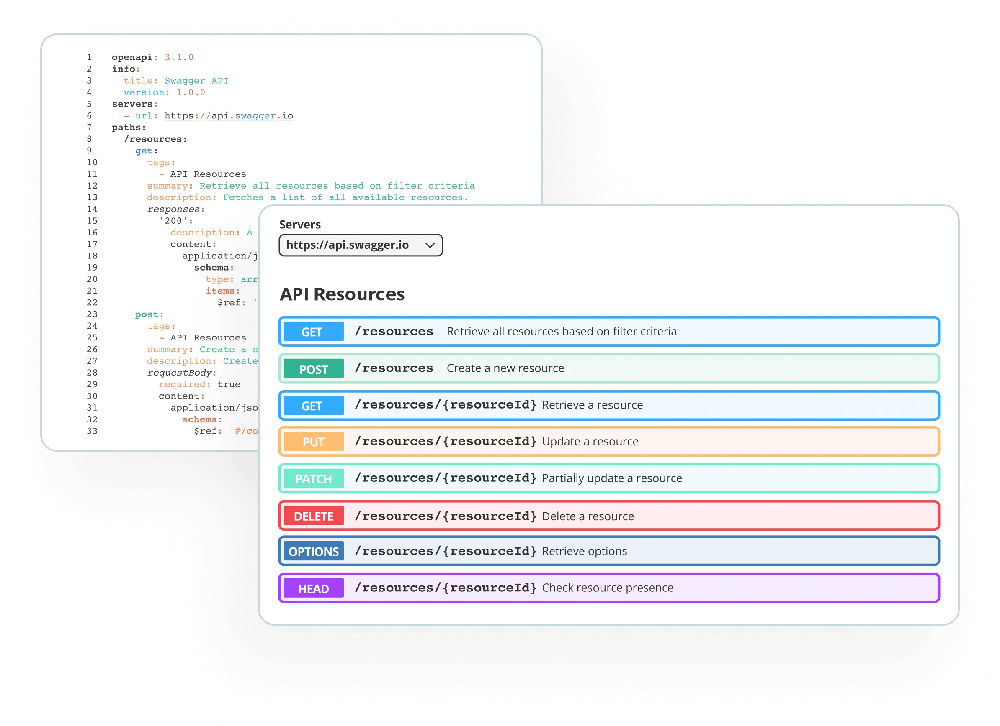
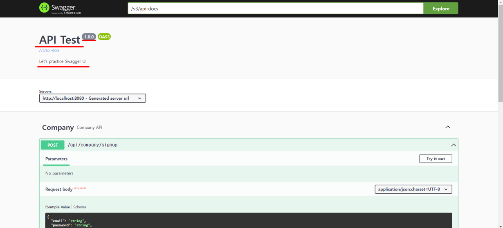
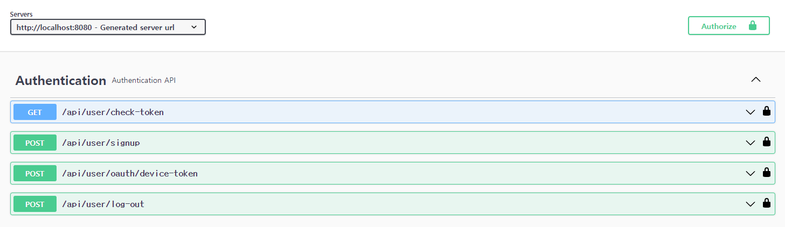
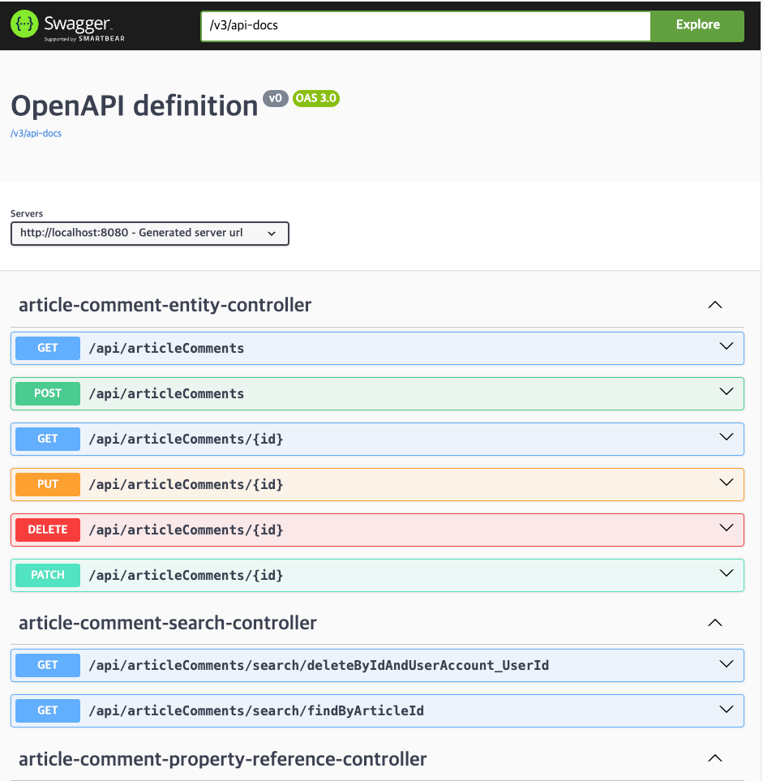
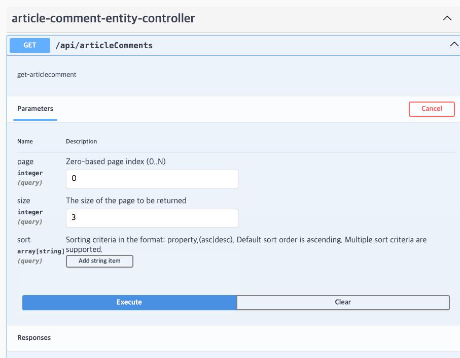
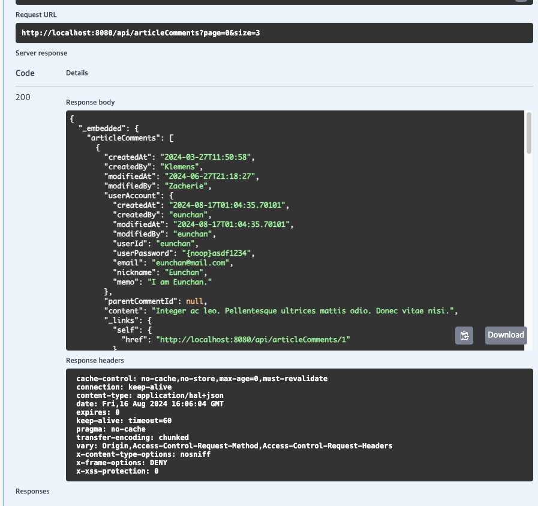

# Swagger

<br>

## 목차
- [Swagger](#swagger)
  - [목차](#목차)
  - [Swagger란?](#swagger란)
    - [개념](#개념)
    - [Swagger 도입의 필요성](#swagger-도입의-필요성)
  - [Swagger 적용 방법](#swagger-적용-방법)
    - [의존성 추가](#의존성-추가)
    - [설정 추가 (application.properties, application.yml)](#설정-추가-applicationproperties-applicationyml)
    - [Config 클래스 작성](#config-클래스-작성)
    - [심화: JWT 인증 버튼 추가하기 (Authorize)](#심화-jwt-인증-버튼-추가하기-authorize)
    - [Swagger UI 접속 및 확인](#swagger-ui-접속-및-확인)
  - [Swagger 주요 annotation](#swagger-주요-annotation)
    - [API 그룹화 (@Tag)](#api-그룹화-tag)
    - [API 설명 (@Operation)](#api-설명-operation)
    - [응답 설명 (@ApiResponse)](#응답-설명-apiresponse)
    - [DTO 설명 (@Schema)](#dto-설명-schema)

<br>

## Swagger란?

### 개념

Swagger는 개발자가 API를 쉽게 설계, 구축, 문서화, 테스트할 수 있게 도와주는 API 개발 도구

Swagger는 RESTful API의 표준화된 인터페이스를 제공하며, API 문서를 자동으로 생성해준다.

<br>

아래의 경우에 명확하고 잘 정리된 API 문서는 필수적

- 여러 명의 개발자가 함께 작업
- 외부 클라이언트가 API를 사용해야 할 때
- 프론트엔드와 백엔드간 협업 시

백엔드에서 구축한 API 스펙을 문서화 하여 프론트엔드에게 보여줘야한다.

Swagger는 이러한 API 문서를 자동으로 생성하고 관리하는 데 매우 유용하다.

<br>



<br>

### Swagger 도입의 필요성

- **전통적인 문제:** 과거에는 API 명세를 개발자가 직접 엑셀이나 워드 파일로 수동 관리.
- **문제점:**
    - API가 변경될 때마다 문서를 **수동으로 업데이트**해야 해서 번거로움.
    - 업데이트가 누락되면 **코드와 문서가 일치하지 않는 문제**가 발생.

<br>

**Swagger의 해결**

1. **API 문서화 자동화 및 표준화** 
    1. API 코드에 어노테이션만 추가하면, Swagger가 이를 분석해 **웹 문서를 자동으로 생성**. 
    2. 문서 작성에 드는 시간이 획기적으로 감소.
2. **코드와 문서의 불일치 문제 해결**
    1. Swagger는 현재의 코드를 기반(Source of Truth)으로 문서를 생성. 
    2. 코드가 변경되면 별도 작업 없이 build나 재시작만으로 문서가 **자동으로 업데이트**. 
    3. 따라서 문서는 항상 최신 API 상태를 정확하게 반영.
3. **협업 강화 및 명확한 API 스펙 공유**
    1. 프론트엔드와 백엔드 개발자가 공유된 정의를 바탕으로 병렬 작업이 가능.
    2. 표준화된 형식을 제공하여 협업을 촉진.
    3. API의 변경 사항을 실시간으로 공유할 수 있어 협업 효율성이 높아짐
4. **즉각적인 API 테스트 지원** 
    1. 이전에는 API가 개발되었는지 확인하기 위해서는? 
        1. 프론트엔드 개발자가 직접 코드를 짜서 호출
        2. 백엔드 개발자가 Postman 같은 별도 툴을 열어 테스트
    2. Swagger UI는 버튼 클릭만으로 API 엔드포인트에 요청 보내고 응답 확인할 수 있는 기능을 제공
    3. 이를 통해 API의 동작을 쉽게 테스트하고 디버깅

<br>

## Swagger 적용 방법

### 의존성 추가

Swagger를 우리 Spring Boot 프로젝트에 적용하는 가장 첫 번째 단계는, "Swagger 관련 라이브러리를 다운로드해서 쓸 수 있게 하겠다"라고 프로젝트 설정 파일(`build.gradle`)에 명시하는 것.

<br>

**Springdoc vs Springfox**

- **Springfox (구 버전):**
    - 과거에 `springfox-swagger2`라는 라이브러리가 널리 쓰였다.
    - 하지만 Spring Boot 3.x 버전(Java 17 이상, Jakarta EE)과 호환성 이슈가 있음
    - 현재는 업데이트가 활발하지 않다.
- **Springdoc (권장):**
    - 현재는 **Springdoc** (`springdoc-openapi`) 라이브러리가 사실상 표준.
    - Spring Boot 3.x와 완벽하게 호환되며, 설정도 훨씬 간편.

<br>

**1. 권장: Springdoc (Spring Boot 3.x 이상)**

`build.gradle` 파일의 `dependencies { ... }` 블록 안에 다음 한 줄을 추가.

```groovy
dependencies {
    // ... (기존의 다른 의존성들, e.g., spring-boot-starter-web)

    // Swagger(Springdoc) 의존성 추가
    implementation 'org.springdoc:springdoc-openapi-starter-webmvc-ui:2.5.0' // (버전은 최신 버전을 확인하고 적용하세요)
}
```

**이 한 줄의 의미:**

- `org.springdoc:springdoc-openapi-starter-webmvc-ui`
- 이 라이브러리 하나만 추가하면?
    - Springdoc의 **핵심 기능**(API 분석)과 **Swagger UI**(시각적 문서 페이지)가 **모두 자동으로 포함된다**.
    - 즉, 의존성 추가만으로도 기본 설정이 완료되어 Swagger UI 페이지에 접속할 수 있게 된다.

<br>

**Maven 의존성 추가**

Maven을 사용하는 경우 **pom.xml 파일**에 다음과 같이 추가한다.

```xml
<dependency>
   <groupId>org.springdoc</groupId>
   <artifactId>springdoc-openapi-starter-webmvc-ui</artifactId>
   <version>2.5.0</version>
</dependency>
```

<br>

**2. 참고: Springdoc (Spring Boot 2.x)**

만약 Spring Boot 2.x 버전을 사용 중이라면?

`starter-webmvc-ui`가 아닌 `springdoc-openapi-ui` (버전은 1.x.x)를 사용해야 한다.

```groovy
dependencies {
    // Spring Boot 2.x 버전 사용자
    implementation 'org.springdoc:springdoc-openapi-ui:1.8.0' // (1.x 대의 최신 버전을 사용)
}
```

<br>

**3. 참고: Springfox (구 버전)**

오래된 프로젝트나 블로그에서 이 코드를 볼 수 있다. 

현재는 권장하지 않는다.

```groovy
dependencies {
    // ⚠️ (구 버전) Springfox. Spring Boot 3.x와 호환성 문제 있음
    // implementation 'io.springfox:springfox-boot-starter:3.0.0' 
}
```

<br>

의존성을 추가한 뒤에는 Gradle을 'Reload'(새로고침) 하여 라이브러리를 한다.

<br>

### 설정 추가 (application.properties, application.yml)

설정 추가는 선택 사항. 

앞서 의존성만 추가해도 Swagger는 기본 설정으로 잘 동작한다. 

하지만, 설정을 통해 **접속 URL을 변경**하거나 **API 표시 순서**를 바꾸는 등 디테일한 커스터마이징 할 수 있다.

<br>

Spring Boot 설정 파일(`application.properties` 또는 `application.yml`)에 `springdoc` 관련 설정을 추가하여 Swagger의 동작 방식을 제어.

<br>

**1. 주요 설정 항목 (많이 쓰는 것들)**

가장 자주 사용되는 설정 4가지.

1. **UI 접속 경로 변경 (`springdoc.swagger-ui.path`)**
    - 기본값은 `/swagger-ui.html` (Springdoc 버전에 따라 `/swagger-ui/index.html`).
    - 이것을 `/swagger` 처럼 짧고 외우기 쉬운 주소로 바꿀 때 사용.
2. **API 명세(JSON) 경로 변경 (`springdoc.api-docs.path`)**
    - Swagger UI가 화면을 그리기 위해 참조하는 원본 JSON 데이터의 경로. (기본값: `/v3/api-docs`)
3. **API 정렬 순서 (`springdoc.swagger-ui.operations-sorter`)**
    - 기본적으로는 컨트롤러에 작성된 코드 순서대로 API가 나열됨.
    - 이 값 `alpha`로 설정하면 API 경로(URL)나 메서드 이름의 **알파벳 순서대로 정렬**되어 찾기 쉬워짐.
4. **스캔할 패키지 지정 (`springdoc.packages-to-scan`)**
    - 프로젝트가 커지면 모든 패키지를 뒤지는 것이 비효율적일 수 있다.
    - 특정 패키지(예: `com.example.controller`)만 스캔하도록 제한하여 **실행 속도를 높일 수 있다.**

<br>

**2. 작성 예시**

프로젝트에서 사용하는 포맷에 맞춰 복사해서 사용.

<br>

**A. `application.properties` 형식**

**Properties**

```yaml
# 1. Swagger UI 접속 경로 변경 (기본값: /swagger-ui/index.html)
# 예: localhost:8080/api-docs 로 접속하게 됨
springdoc.swagger-ui.path=/api-docs

# 2. API 알파벳 순 정렬 (기본값: 코드 작성 순)
# alpha: 알파벳 순, method: HTTP 메소드 순
springdoc.swagger-ui.operations-sorter=alpha

# 3. 태그(Controller) 알파벳 순 정렬
springdoc.swagger-ui.tags-sorter=alpha

# 4. 특정 패키지만 스캔 (성능 향상)
springdoc.packages-to-scan=com.example.myproject.controller

# 5. (중요) 운영 서버(Production)에서는 비활성화 하기
# springdoc.swagger-ui.enabled=false
# springdoc.api-docs.enabled=false
```

<br>

**B. `application.yml` 형식**

**YAML**

```yaml
springdoc:
  swagger-ui:
    path: /api-docs               # 접속 경로 변경
    operations-sorter: alpha      # API 정렬
    tags-sorter: alpha            # 태그 정렬
    enabled: true                 # 활성화 여부
  api-docs:
    path: /api-docs-json          # JSON 명세 경로 변경
    enabled: true
  packages-to-scan: com.example.myproject.controller # 스캔 패키지
```

<br>

---

**꿀팁: 운영 환경에서는 끄세요!**

실제 서비스가 배포되는 **운영(Production) 서버**에서는 보안상 Swagger를 꺼두는 것이 좋다. 

API 구조가 외부에 그대로 노출되면 해커들의 표적이 될 수 있기 때문.

- 개발(`dev`) 프로필: `enabled=true`
- 운영(`prod`) 프로필: `enabled=false`

이렇게 프로필별로 설정을 다르게 가져가는 것이 일반적다.

<br>

### Config 클래스 작성

Swagger UI 페이지의 **간판을 만드는 작업**. 

`application.properties`가 프로그램의 동작 설정을 담당한다면,

이 Config 클래스는 문서의 **제목, 설명, 버전** 등 내용 정의한다.

springdoc-openapi는 의존성만 추가해도 동작하지만, 더 상세한 API 문서를 위해 Config 클래스 작성한다.

<br>

Spring Boot에서는 `OpenAPI`라는 객체를 Bean으로 등록하여 문서의 메타데이터를 설정한다.

<br>

1. 역할

- **API 문서 제목 및 설명:** "OOO 프로젝트 API 명세서", "v1.0" 같은 정보를 표시한다.
- **인증(Security) 설정:** JWT 토큰 등을 입력할 수 있는 **'Authorize' 버튼**을 만들 수 있다.

<br>

2. 작성 예시 코드 (Springdoc 기준)

`config` 패키지를 만들고 아래와 같이 클래스를 작성한다.

```java
package com.example.demo.config;

import io.swagger.v3.oas.models.Components;
import io.swagger.v3.oas.models.OpenAPI;
import io.swagger.v3.oas.models.info.Info;
import org.springframework.context.annotation.Bean;
import org.springframework.context.annotation.Configuration;

@Configuration // 1. 스프링 설정 클래스임을 명시
public class SwaggerConfig {

    @Bean
    public OpenAPI openAPI() {
        return new OpenAPI()
            .components(new Components())
            .info(apiInfo());
    }
 
    private Info apiInfo() {
        return new Info()
            .title("API Test") // 2. API 제목
            .description("Let's practice Swagger UI") // 3. API 설명
            .version("1.0.0"); // 4. API 버전
    }
}
```

<br>

3. 코드 상세 설명

- **`@Configuration`:**
    - 이 클래스가 스프링의 설정 파일임을 알려준다.
- **`@Bean public OpenAPI ...`:**
    - `OpenAPI` 객체를 스프링 컨테이너에 Bean으로 등록한다.
    - Springdoc 라이브러리가 이 Bean을 찾아 설정을 적용한다.
- **`Info` 객체:**
    - `.title()`:
        - Swagger UI 최상단에 크게 표시될 제목.
    - `.description()`:
        - 제목 아래에 표시될 상세 설명.
        - 마크다운(Markdown) 문법도 일부 지원.
    - `.version()`:
        - 현재 API의 버전을 명시.

<br>

화면 예시



<br>

### 심화: JWT 인증 버튼 추가하기 (Authorize)

실무에서는 로그인이 필요한 API가 많다. 

Swagger에서 토큰을 넣을 수 있는 자물쇠 버튼을 활성화하려면 Config 코드를 조금 더 추가해야 한다.

```java
@Bean
public OpenAPI openAPI() {
    String jwt = "JWT";
    SecurityRequirement securityRequirement = new SecurityRequirement().addList(jwt);
    
    SecurityScheme securityScheme = new SecurityScheme()
        .name(jwt)
        .type(SecurityScheme.Type.HTTP)
        .scheme("bearer")
        .bearerFormat("JWT")
    
    Components components = new Components().addSecuritySchemes(jwt, securityScheme);

    return new OpenAPI()
        .components(components)
        .addSecurityItem(securityRequirement)
        .info(apiInfo());
}
```

<br>

이 설정을 추가하면 Swagger UI 오른쪽 상단에 **`Authorize`** 버튼이 생긴다.

여기에 토큰을 입력하면 모든 API 요청 헤더에 자동으로 토큰이 포함되어 날아간다.

Authorize 버튼과 API 우측의 좌물쇠가 잠긴 것을 확인할 수 있는데, 이는 로그인 되었음을 의미한다.

이제부터 호출하는 모든 API의 Authorization 헤더에 'Bearer Access_Token'이 포함된다.

- JWT가 필요하지 않은 API에도 Access Token이 포함된다.
- Bearer는 자동으로 포함되므로, 반드시 Access Token만 붙여넣는다.

<br>

화면 예시



<br>

이렇게 Config 클래스까지 작성하고 애플리케이션을 실행하면, Swagger UI 페이지에서 우리가 설정한 제목과 설명을 볼 수 있게 된다.

<br>

### Swagger UI 접속 및 확인

http://localhost:8080/swagger-ui.html로 접속하면 자동으로 생성된 API 문서를 확인할 수 있다.



<br>

Swagger UI를 통해 각 API 엔드포인트를 테스트할 수 있다.





<br>

## Swagger 주요 annotation

### API 그룹화 (@Tag)

`@Tag`는 이름 그대로 관련된 API들을 **하나의 그룹으로 묶어서** 제목과 설명을 붙여주는 역할을 한다.

보통 **Controller 클래스** 위에 붙여서, "이 컨트롤러에 있는 API들은 모두 '회원 관리'와 관련된 것입니다"라고 명시하는 데 사용한다.

<br>

**1. 사용 전 vs 사용 후**

- **사용 안 했을 때:**
    - Swagger UI에 `member-controller` 같이 클래스 이름(영어)이 그대로 노출된다.
    - 개발자가 아닌 사람이 보기에 직관적이지 않다.
- **사용 했을 때:**
    - "회원 관리 API" 처럼 **한글로 된 깔끔한 제목**과 설명이 달린다.

<br>

**2. 사용 코드 예시**

주로 **Controller 클래스 상단**에 선언한다.

```java
package com.example.demo.controller;

import io.swagger.v3.oas.annotations.tags.Tag;
import org.springframework.web.bind.annotation.*;

@Tag(name = "회원 (Member)", description = "회원 가입, 로그인, 정보 수정 등 회원 관련 API") // 여기가 핵심!
@RestController
@RequestMapping("/api/members")
public class MemberController {

    @GetMapping("/{id}")
    public String getMember(@PathVariable Long id) {
        return "회원 조회 성공";
    }
    
    @PostMapping("/join")
    public String join() {
        return "회원 가입 성공";
    }
}
```

<br>

**3. 주요 속성**

- **`name`**:
    - 태그의 이름.
    - Swagger UI에서 **가장 큰 제목**으로 표시된다.
- **`description`**:
    - 태그에 대한 상세 설명.
    - 제목 옆이나 아래에 작게 표시된다.

<br>

### API 설명 (@Operation)

`@Tag`가 책의 '챕터(장)' 제목이라면, `@Operation`은 그 챕터 안에 있는 '소제목(섹션)'에 해당한다. 

개별 API가 **무엇을 하는 녀석인지** 한눈에 알려주는 아주 중요한 어노테이션.

`@Operation`은 **컨트롤러의 메서드(Method) 위**에 붙여서, 해당 API가 어떤 기능을 수행하는지 상세하게 설명할 때 사용한다.

이걸 안 붙이면 Swagger UI에는 그냥 `GET /api/members/{id}` 처럼 URL만 덩그러니 나온다. 

그래서 이 API가 뭐 하는 건지 URL만 보고 유추해야 한다.

<br>

**1. 주요 속성**

- **`summary`**:
    - API에 대한 요약(제목).
    - 목록 화면에서 URL 옆에 굵게 표시되어 **가장 먼저 눈에 띈다.**
    - 짧고 간결하게 적는 것이 좋다. (예: "회원 단건 조회")
- **`description`**:
    - API에 대한 **상세 설명**.
    - 해당 API를 클릭해서 펼쳤을 때 보인다.
    - 동작 방식, 주의 사항 등을 길게 적을 수 있다.

<br>

**2. 사용 코드 예시**

```java
@GetMapping("/{id}")
@Operation(
    summary = "특정 회원 조회",  // 1. 목록에 보이는 제목
    description = "회원의 ID(Long)를 이용하여 특정 회원의 정보를 조회합니다." // 2. 펼치면 보이는 상세 설명
)
public String getMember(@PathVariable Long id) {
    return "회원 조회 성공";
}
```

<br>

**꿀팁: `deprecated` 속성**

만약 구버전 API라서 사용을 권장하지 않는다면?

```java
@Operation(summary = "...", deprecated = true)
```

이렇게 `deprecated = true`를 주면, Swagger UI에서 해당 API 이름에 취소선이 그어지고 회색으로 변한다.

<br>

### 응답 설명 (@ApiResponse)

`@ApiResponse`는 사용자가 API 요청을 보냈을 때 서버가 반환하는 HTTP 상태 코드와 **메시지**, 그리고 데이터 형태(JSON)를 정의한다.

<br>

**1. 필요성**

기본적으로 Swagger는 성공(200 OK) 케이스만 간단히 보여주거나, 엉뚱한 응답 모델을 보여줄 때가 있다.

하지만 실제로는 데이터가 없으면 **404**, 입력값이 이상하면 **400**, 서버 터지면 **500**이 나온다.

이 **모든 경우의 수**를 명시해줘야 클라이언트가 예외 처리를 할 수 있다.

<br>

**2. 주요 속성**

- **`responseCode`**:
    - HTTP 상태 코드.
    - 예: "200", "400", "404", "500"
- **`description`**:
    - 해당 상태 코드에 대한 설명.
    - 예: "조회 성공", "존재하지 않는 회원"
- **`content`**:
    - (선택 사항) 구체적으로 어떤 모양의 데이터(DTO)가 반환되는지 명시한다.

<br>

**3. 사용 코드 예시 (여러 케이스 정의하기)**

보통 하나의 API는 여러 응답을 가질 수 있다. 

그러므로, **`@ApiResponses`** 라는 껍데기(Container) 안에 여러 개의 `@ApiResponse`를 묶어서 작성한다.

```java
@GetMapping("/{id}")
@Operation(summary = "특정 회원 조회", description = "id로 회원을 조회합니다.")
@ApiResponses(value = {
    // 성공 케이스 (200)
    @ApiResponse(responseCode = "200", description = "성공", 
        content = @Content(schema = @Schema(implementation = MemberResponseDto.class))),
    
    // 실패 케이스 (400)
    @ApiResponse(responseCode = "400", description = "잘못된 요청 (파라미터 오류)", 
        content = @Content(schema = @Schema(implementation = ErrorResponse.class))),
    
    // 실패 케이스 (404)
    @ApiResponse(responseCode = "404", description = "해당 ID의 회원이 존재하지 않음", 
        content = @Content(schema = @Schema(implementation = ErrorResponse.class)))
})
public ResponseEntity<MemberResponseDto> getMember(@PathVariable Long id) {
    // ... 로직 ...
}
```

<br>

### DTO 설명 (@Schema)

API 문서의 꽃은 결국 "어떤 데이터를 주고받느냐"이다.

 `@Schema`는 그 데이터를 담는 그릇인 DTO를 상세하게 꾸며주는 역할을 한다.

API 요청 보낼 때나 응답 받을 때, Swagger UI는 기본적으로 `string`, `0` 같은 무의미한 기본값만 보여준다.

`@Schema`를 사용하면 이 무미건조한 데이터 모델에 **"이 필드는 무슨 뜻이고, 실제로는 어떤 값이 들어가는지"** 예시를 불어넣어 줄 수 있다.

<br>

**1. 필요성**

- **친절한 가이드:**
    - "age"라는 필드가 있을 때, 이게 '만 나이'인지 '연 나이'인지 설명해 줄 수 있다.
- **테스트 편의성:**
    - Swagger UI에서 'Try it out'을 눌렀을 때, 우리가 미리 설정해 둔 예시 값(Example Value)이 입력창에 자동으로 채워진다.
    - 매번 타이핑할 필요가 없어진다.

<br>

**2. 주요 속성**

- **`description`**: 필드에 대한 상세 설명.
- **`example`**: 실제로 입력될 법한 예시 값.
- **`hidden`**: 문서에서 숨기고 싶은 필드가 있을 때 `true`로 설정.

<br>

**3. 사용 코드 예시 (DTO 클래스)**

Controller가 아니라, 데이터를 담는 **DTO 클래스** 내부의 필드 위에 작성한다.

```java
import io.swagger.v3.oas.annotations.media.Schema;
import lombok.Getter;
import lombok.Setter;

@Getter @Setter
@Schema(description = "회원 가입 요청 DTO") // 클래스 자체에 대한 설명
public class MemberJoinDto {

    @Schema(description = "사용자 이메일 주소", example = "user123@example.com")
    private String email;

    @Schema(description = "사용자 비밀번호 (영문+숫자+특수문자 8자 이상)", example = "P@ssword123!")
    private String password;

    @Schema(description = "사용자 닉네임", example = "코딩하는고양이")
    private String nickname;
    
    @Schema(description = "나이", example = "25")
    private int age;
}
```

<br>

**팁: Validation과 찰떡궁합**

만약 `@NotNull`, `@Size(min=2)` 같은 검증 어노테이션을 같이 쓰면 좋다. 

`@Schema`가 이를 자동으로 감지해서 문서에 **"Required(필수)"**, **"MinLength: 2"** 같은 제약 조건을 빨간색 글씨로 표시해 준다.