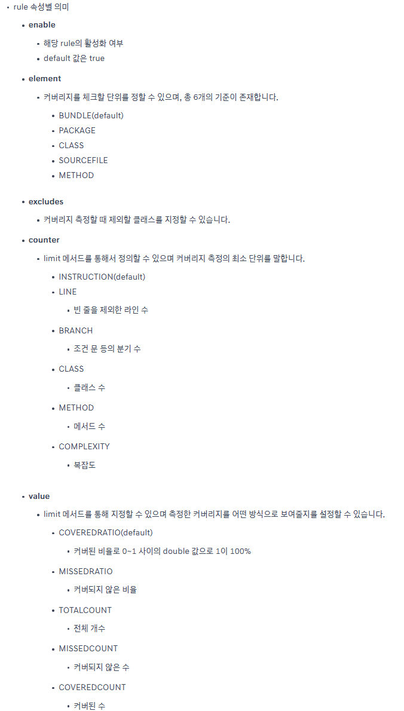
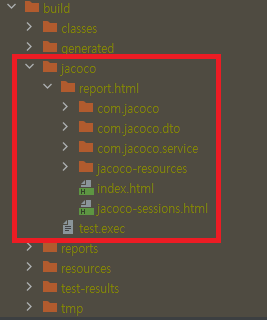
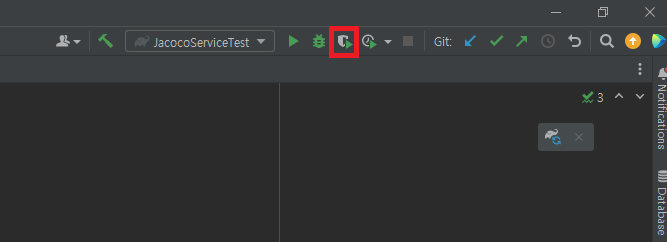
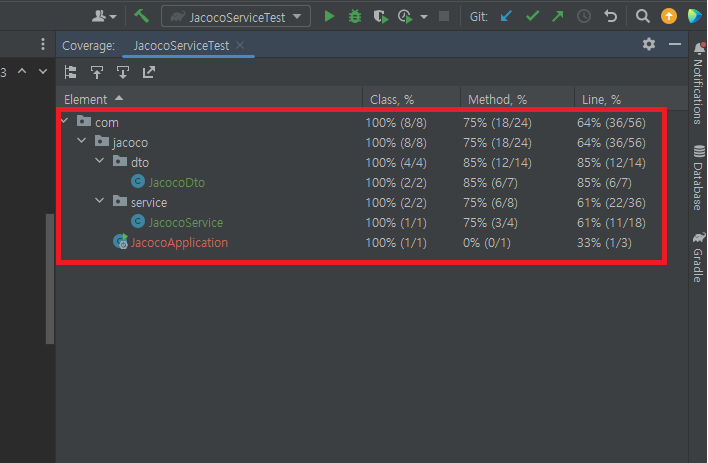
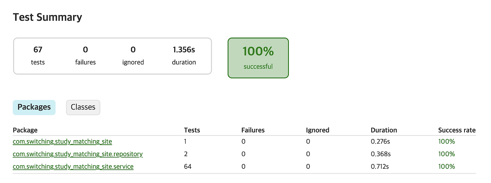
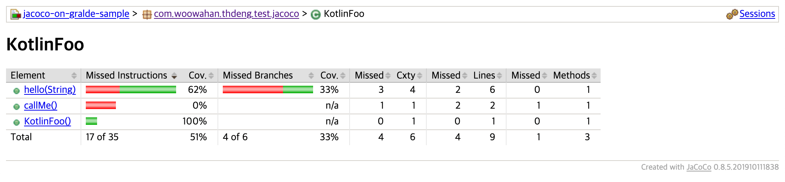
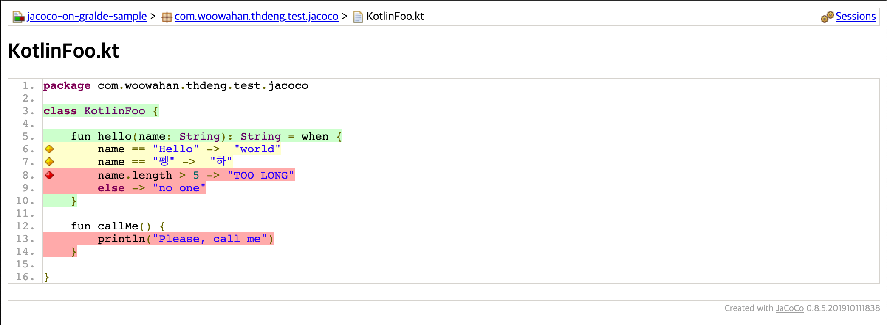

# Jacoco

<br>

## 목차
- [Jacoco](#jacoco)
  - [목차](#목차)
  - [Jacoco란?](#jacoco란)
    - [개념 및 특징](#개념-및-특징)
    - [Code Coverage란?](#code-coverage란)
  - [Jacoco 적용 방법](#jacoco-적용-방법)
    - [플러그인 설정 (build.gradle, pom.xml)](#플러그인-설정-buildgradle-pomxml)
    - [Gradle 주요 Task 설명](#gradle-주요-task-설명)
    - [Maven 환경 설정](#maven-환경-설정)
    - [경로 및 제외 설정 (Excludes)](#경로-및-제외-설정-excludes)
    - [최종 Jacoco 설정 파일](#최종-jacoco-설정-파일)
  - [Jacoco 리포트](#jacoco-리포트)
    - [리포트 생성 방법](#리포트-생성-방법)
    - [리포트 보기](#리포트-보기)
    - [리포트 지표 상세 (Metrics)](#리포트-지표-상세-metrics)
    - [이상적인 code coverage 비율](#이상적인-code-coverage-비율)

<br>

## Jacoco란?

### 개념 및 특징

**개념**

- JaCoCo는 **Ja**va **Co**de **Co**verage의 약자
- Java 코드를 테스트할 때, 테스트 코드가 실제 프로덕션 코드를 얼마나 커버했는지 측정하는 **무료 오픈소스 라이브러리**
- 주요 목적은 테스트 코드가 실제로 소스 코드의 어느 부분을 실행하는지 분석하고, 테스트가 미치지 않은 코드 영역을 시각적으로 보여주는 것
- 작성한 단위 테스트가 코드를 얼마나 꼼꼼하게 검증하고 있는지 수치와 시각적인 리포트로 보여줌
- 코드 커버리지는 소프트웨어 테스팅 품질의 중요한 지표로, Jacoco를 통해 효율적으로 측정 및 관리할 수 있음

<br>

**특징**

- **바이트코드 조작 (Bytecode Instrumentation):**
    - 소스 코드를 직접 수정하지 않는다.
    - **On-the-fly 방식:**
        - Java Agent를 통해 애플리케이션 실행될 때 바이트코드 실시간으로 조작하여 실행 여부를 추적.
        - 클래스를 JVM에 로딩하는 시점에 계측이 이루어짐．
    - 따라서 설정이 간편하고 실행 속도가 빠르다.
- **높은 호환성 및 통합성:**
    - **빌드 도구:** Gradle, Maven, Ant 등 주요 빌드 도구와 완벽하게 호환.
    - **언어:** Java뿐만 아니라 JVM 기반 언어인 **Kotlin**, Groovy 등도 지원.
    - **CI/CD:** Jenkins, Github Actions, **SonarQube** 등과 연동하여 품질 관리를 자동화하기 좋다.
- **상세한 커버리지 지표 제공:**
    - 단순히 "줄(Line)"만 실행되었는지 보는 것이 아님.
    - 클래스, 메서드, 라인, 분기(Branch) 등 다양한 커버리지 지표를 상세하게 제공.
    - **Branch Coverage:**
        - `if`, `switch` 문 등의 모든 조건 분기가 실행되었는지 확인. (가장 중요한 특징 중 하나)
    - **Cyclomatic Complexity:**
        - 코드의 복잡도를 함께 측정하여 리포팅.
- **가독성 높은 리포트:**
    - HTML, XML, CSV 등 다양한 포맷으로 결과를 출력해 코드 커버리지 데이터를 시각적으로 보기 좋게 확인할 수 있다.
    - 특히 HTML 리포트는 코드 라인별로 색상을 입혀 테스트 실행 여부를 직관적으로 보여준다.

<br>

### Code Coverage란?

**1. 정의**

- **소프트웨어의 테스트 충분성 지표:**
    - 소프트웨어의 테스트 케이스가 소스 코드를 얼마나 실행했는지를 나타내는 지표.
    - 테스트가 빈틈없이 잘 작성되었는지, 미처 테스트하지 못한 코드가 어디인지 파악할 수 있음.
    - 신뢰할 수 있는 소프트웨어를 만들기 위한 테스트 품질의 가이드라인 역할.
- **수치화:**
    - 전체 코드 중에서 테스트 코드가 실행한 코드의 비율을 백분율(%)로 표시.

`CodeCoverage = 테스트에 의해 실행된 코드 라인 수 / 전체 코드 라인 수 * 100`

<br>

**2. 주요 측정 기준 (Coverages Criteria)**

- **라인 커버리지 (Line Coverage):**
    - 코드의 한 줄이 한 번이라도 실행되면 충족된다.
    - 가장 대표적이고 달성하기 쉽지만, 조건문의 내부 로직까지 검증하지 못할 수 있다.
- **결정/분기 커버리지 (Decision/Branch Coverage):**
    - `if`, `switch` 등의 분기문(Branch)이 `True`인 경우와 `False`인 경우를 모두 실행했는지 측정한다.
    - 로직의 흐름을 검증하는 데 매우 중요하다.
- **조건 커버리지 (Condition Coverage):**
    - 분기문 내부의 **각각의 개별 조건식**이 `True/False`를 모두 가졌는지 측정한다.
- **함수/메서드 커버리지 (Function/Method Coverage)**
    - 전체 함수(메서드) 중 실제 호출된 함수의 비율을 측정한다.
- **Class Coverage (클래스 커버리지)**
    - 프로젝트에 존재하는 **클래스들이 테스트 중 한 번이라도 로드되고 실행되었는지** 측정한다.

<br>

**3. 코드 커버리지 측정의 목적**

- **휴먼 에러 방지:**
    - 개발자가 놓친 로직이나 예외 상황을 발견하게 해준다.
- 테스트가 비어있는 부분 탐지 :
    - 테스트가 한 줄도 안 타는 로직, 분기, 예외 처리 등이 있는지 확인
- **데드 코드(Dead Code) 탐지:**
    - 실제로는 절대 실행되지 않는 불필요한 코드를 찾아낼 수 있다.
- **리팩토링 신뢰성:**
    - 커버리지가 높으면 코드를 리팩토링할 때 기존 기능이 망가지지 않았다는 확신을 가질 수 있다.
    - 커버리지가 어느 정도 있는 상태에서 리팩토링하면 테스트 깨지는지 보면서 안심하고 구조 변경 가능

<br>

**4. ⚠️ 주의사항 (100%의 함정)**

- **높은 커버리지 ≠ 무결점:** 커버리지가 100%라고 해서 버그가 없는 것은 아니다.
- 로직 실행만 되었을 뿐 결과값 검증 누락되었거나 로직 자체가 잘못 작성된 경우는 잡아내지 못할 수 있다.
- 따라서 "숫자에 집착하기보다 의미 있는 테스트를 작성하는 것"이 핵심.

<br>

## Jacoco 적용 방법

### 플러그인 설정 (build.gradle, pom.xml)

Jacoco는 일반적인 라이브러리와 달리, **빌드 도구의 플러그인** 형태로 프로젝트에 주입된다.

이는 Jacoco가 단순히 코드에서 호출되는 것이 아니라, **테스트가 실행되는 과정(Build Lifecycle)에 개입**하여 바이트코드를 분석해야 하기 때문.

<br>

**1. Gradle 환경 설정 (`build.gradle`)**

`build.gradle` 파일 상단의 `plugins` 블록에 `id 'jacoco'`를 한 줄 추가하는 것으로 시작한다.

<br>

**1) 플러그인 추가**

`build.gradle` 파일 상단의 `plugins` 블록에 `id 'jacoco'`를 한 줄 추가하는 것으로 시작.

```groovy
plugins {
    id 'java'
    id 'org.springframework.boot' version '3.2.0'
    id 'io.spring.dependency-management' version '1.1.4'
    
    // [핵심] Jacoco 플러그인 추가
    id 'jacoco'
}
```

<br>

**2) 도구 버전 명시 (선택 사항)**

플러그인 추가만으로도 기본 버전이 적용된다. 

하지만, 팀원 간의 환경 통일과 최신 기능 사용을 위해 버전을 명시하는 것이 좋다.

```groovy
jacoco {
    // 2024년 기준 0.8.11 or 0.8.12 버전이 널리 쓰임 (Java 21 지원 여부 확인 필요)
    toolVersion = "0.8.11"
}
```

<br>

**💡 Gradle 설정의 특징:**

- 플러그인을 추가하면 `jacocoTestReport`, `jacocoTestCoverageVerification` 같은 Task들이 자동으로 프로젝트에 생성된다.
- 별도의 복잡한 설정 없이 `test` 태스크 실행 시 자동으로 Jacoco Agent가 로드된다.

<br>

**2. Maven 환경 설정 (`pom.xml`)**

Maven은 XML 구조 특성상 설정이 조금 더 길며, 실행 단계(Goal)를 명확히 지정해주어야 한다.

<br>

**설정 코드 상세**

`<build>` -> `<plugins>` 태그 안에 아래 내용을 추가.

```xml
<build>
    <plugins>
        <plugin>
            <groupId>org.jacoco</groupId>
            <artifactId>jacoco-maven-plugin</artifactId>
            <version>0.8.11</version>
            
            <executions>
                <execution>
                    <id>prepare-agent</id>
                    <goals>
                        <goal>prepare-agent</goal>
                    </goals>
                </execution>
                
                <execution>
                    <id>report</id>
                    <phase>test</phase>
                    <goals>
                        <goal>report</goal>
                    </goals>
                </execution>
            </executions>
        </plugin>
    </plugins>
</build>
```

<br>

**Maven 설정의 핵심 포인트 (`executions`)**

Maven에서는 **두 가지 Goal**을 반드시 명시해야 정상 작동한다.

1. **`prepare-agent`**:
    - 테스트가 실행되기 **직전**에 실행된다.
    - Jacoco Agent(`jacocoagent.jar`)를 JVM 인자에 추가한다.
    - 테스트가 실행될 때 코드를 추적할 수 있도록 준비시킨다.
    - 이 설정이 없으면 커버리지 데이터 파일(`jacoco.exec`)이 생성되지 않는다.
2. **`report`**:
    - 테스트(`test` phase)가 완료된 **후**에 실행된다.
    - 생성된 바이너리 데이터(`jacoco.exec`) 읽어 사람이 볼 수 있는 HTML/XML 리포트로 변환해 준다.

<br>

3. 플러그인 적용의 원리 (심화 설명)

- **Java Agent 주입:**
    - Jacoco 플러그인을 설정하면, 테스트를 실행하는 명령어(예: `java -jar ...`)에 `javaagent:jacocoagent.jar` 옵션이 자동으로 붙는다.
- **On-the-fly Instrumentation:**
    - 이 Agent가 테스트가 실행되는 동안 클래스 로더(Class Loader)에 간섭하여, 클래스가 메모리에 로드될 때 분석 코드를 심는다.
- **결과:**
    - 개발자가 소스 코드를 한 줄도 건드리지 않아도 커버리지가 측정된다.

<br>

### Gradle 주요 Task 설명

Gradle 환경에서 Jacoco를 사용할 때 가장 핵심이 되는 3가지 Task의 역할과 유기적인 관계를 보자. 

"테스트 실행→결과 리포트 생성→기준 통과 여부 검사"라는 전체 파이프라인 구성하는 단계로 매우 중요.

<br>

Jacoco의 3가지 Task는 아래와 같다. 

- `test` : Jacoco task 순서 설정
- `jacocoTestReport`: 리포트 생성
- `jacocoTestCoverageVerification`: 커버리지 기준 검증

<br>

일반적인 실행 흐름은 이렇게 된다:

1. `test`
    - JUnit 테스트 실행
    - 이때 Jacoco가 코드 실행 정보(커버리지 데이터)를 수집
2. `jacocoTestReport`
    - `test`에서 수집된 데이터를 이용해서
    - HTML, XML 같은 **리포트 파일 생성**
3. `jacocoTestCoverageVerification`
    - 수집된 커버리지 데이터를 기준으로
    - “Line 80% 이상이어야 한다” 같은 **조건을 검증**
    - 기준 미달이면 **빌드 실패**

<br>

**1. `test`: Jacoco Task 순서 설정 (Workflow)**

**"테스트와 Jacoco Task들을 올바른 순서로 연결하는 단계"**

Gradle에서 Task는 의존성이 없으면 병렬로 실행되거나 순서가 꼬일 수 있다. 

따라서 [테스트 실행 → 리포트 생성 → 검증]의 순서가 보장되도록 명시적인 설정이 필요하다.

실제로 **테스트를 돌리는 Task로** JUnit, SpringBootTest, Mockito 등이 다 여기서 실행된다.

- **순서 설정 방법 (`finalizedBy` 사용):**
    - `dependsOn`보다는 `finalizedBy`를 사용하는 것이 좋습니다.
    - `test`가 성공하든 실패하든 리포트는 생성되어야 실패 원인을 분석할 수 있기 때문입니다.
    
    ```groovy
    // 1. test Task가 끝난 뒤에 리포트 생성이 실행되도록 설정
    test {
        finalizedBy jacocoTestReport 
    }
    
    // 2. 리포트 생성이 끝난 뒤에 검증이 실행되도록 설정
    jacocoTestReport {
        finalizedBy jacocoTestCoverageVerification
    }
    ```
    

<br>

여기서 중요한 건:

- `finalizedBy jacocoTestReport`
    - `./gradlew test`만 실행해도
    - 테스트 끝난 뒤 자동으로 리포트 생성까지 이어지도록 하는 설정.

<br>

- Jacoco는 별도로 `test`를 실행하지 않는다.
- **항상 `test`가 먼저 실행되어야** Jacoco가 쓸 데이터가 생긴다.
- 그래서 보통:
    - `test { finalizedBy jacocoTestReport }`
    - `jacocoTestReport { dependsOn test }`
    
    둘 중 하나, 또는 둘 다 사용해서 순서를 명시해 준다.
    

<br>

**2. `jacocoTestReport`: 리포트 생성 (Visualization)**

**"사람과 도구가 볼 수 있는 성적표를 만드는 단계"**

테스트 실행 후 생성된 바이너리 커버리지 데이터(`jacoco.exec`)를 기반으로, 사용자가 보기 편한 **HTML, XML, CSV** 형식의 리포트를 생성하는 Task.

- **주요 역할:**
    - **HTML:** 개발자가 브라우저를 통해 눈으로 직접 코드의 커버리지를 확인할 때 사용.
    - **XML:** **SonarQube**나 Codecov 같은 외부 분석 도구에 연동할 때 필수적으로 사용.
    - **CSV:** 잘 사용하지 않지만, 데이터 가공이 필요할 때 사용.
- **설정 예시 (build.gradle):**
    
    ```groovy
    jacocoTestReport {
        reports {
            html.required = true // 사람이 보기 위해 필수
            xml.required = true  // CI/CD, SonarQube 연동 시 필수
            csv.required = false // 보통 false로 설정
        }
    
        // 리포트 생성 후 바로 커버리지 검증 단계로 넘어가도록 설정 (선택 사항)
        // finalizedBy 'jacocoTestCoverageVerification'
    }
    ```
    

<br>

기본적으로 (Gradle 기준):

- `build/reports/jacoco/test/html/index.html`
    
    → 이 파일을 브라우저로 열면 커버리지 리포트를 볼 수 있다.
    

<br>

**3. `jacocoTestCoverageVerification`: 커버리지 기준 검증 (Quality Gate)**

**"성적표를 보고 합격/불합격을 결정하는 단계"**

프로젝트에서 정한 최소한의 커버리지 기준을 만족하는지 검사한다. 

만약 기준에 미달하면 빌드 자체를 실패(Build Failed)시켜 배포를 막는다. 

이는 코드 품질이 일정 수준 아래로 떨어지는 것을 방지하는 **강제적 안전장치** 역할을 한다.

- **검증 규칙 (Violation Rules):**
    - **Element:** 무엇을 기준으로 할 것인가? (`BUNDLE`(전체), `CLASS`, `METHOD` 등)
    - **Counter:** 무엇을 셀 것인가? (`LINE`(구문), `BRANCH`(분기), `INSTRUCTION` 등)
    - **Value:** 어떤 값을 볼 것인가? (`COVEREDRATIO`(커버된 비율), `TOTALCOUNT` 등)
    - **Minimum:** 최소 통과 기준 (0.0 ~ 1.0)
- **설정 예시 (build.gradle):**

```groovy
jacocoTestCoverageVerification {
    violationRules {
        rule {
            enabled = true
            element = 'CLASS' // 클래스 단위로 체크

            // 조건 1: 브랜치 커버리지 90% 이상
            limit {
                counter = 'BRANCH'
                value = 'COVEREDRATIO'
                minimum = 0.90
            }

            // 조건 2: 라인 커버리지 80% 이상
            limit {
                counter = 'LINE'
                value = 'COVEREDRATIO'
                minimum = 0.80
            }
        }
    }
}
```

<br>



<br>

### Maven 환경 설정

Maven (`pom.xml`) 환경에서는 Gradle의 Task 개념 대신 플러그인의 Goal(목표)과 Phase(생명주기 단계)를 사용하여 설정한다.

Gradle에서 **Task 순서를 연결**했던 것과 달리, Maven은 Build Lifecycle(생명주기)에 맞춰 자동으로 실행되도록 설정해야 한다.

아래는 리포트 생성(`report`)과 검증(`check`)을 포함한 전체 설정.

<br>

**1. 전체 설정 예시 (pom.xml)**

`<build>` 태그 내 `<plugins>` 안에 아래 코드를 추가하면 된다.

Gradle의 3가지 단계(`prepare`, `report`, `verification`)가 모두 포함된 설정.

```xml
<build>
    <plugins>
        <plugin>
            <groupId>org.jacoco</groupId>
            <artifactId>jacoco-maven-plugin</artifactId>
            <version>0.8.11</version>
            <configuration>
                <excludes>
                    <exclude>**/Q*.class</exclude> <exclude>**/*Dto.class</exclude>
                    <exclude>**/*Application.class</exclude>
                </excludes>
            </configuration>
            
            <executions>
                <execution>
                    <id>prepare-agent</id>
                    <goals>
                        <goal>prepare-agent</goal>
                    </goals>
                </execution>

                <execution>
                    <id>report</id>
                    <phase>test</phase> <goals>
                        <goal>report</goal>
                    </goals>
                </execution>

                <execution>
                    <id>check</id>
                    <phase>verify</phase> <goals>
                        <goal>check</goal>
                    </goals>
                    <configuration>
                        <rules>
                            <rule>
                                <element>BUNDLE</element>
                                <limits>
                                    <limit>
                                        <counter>LINE</counter>
                                        <value>COVEREDRATIO</value>
                                        <minimum>0.80</minimum>
                                    </limit>
                                </limits>
                            </rule>
                        </rules>
                    </configuration>
                </execution>
            </executions>
        </plugin>
    </plugins>
</build>
```

<br>

**2. 각 설정 상세 설명 (Gradle Task와 비교)**

Maven에서는 `<execution>` 태그를 통해 각 단계를 정의.

**1) `prepare-agent`** (필수 초기화)

- **역할:**
    - 테스트가 실행될 때 Jacoco Agent를 JVM에 주입한다.
    - 이 과정이 없으면 `jacoco.exec` 파일(데이터)이 생성되지 않는다.
- **Gradle 비교:**
    - `test` Task 실행 시 자동으로 일어나는 동작을 Maven에서는 명시해줘야 한다.

**2) `report` (= `jacocoTestReport`)**

- **역할:**
    - `jacoco.exec` 데이터를 읽어 **HTML/XML 리포트**를 생성한다.
- **Phase 설정:** `<phase>test</phase>`
    - Maven의 `test` 단계가 끝날 때 실행되도록 설정한다.
    - 즉, `mvn test` 명령어만 쳐도 테스트 후 리포트가 만들어진다.
    - **결과물 위치:** `target/site/jacoco/index.html`

**3) `check` (= `jacocoTestCoverageVerification`)**

- **역할:**
    - 설정한 커버리지 기준(예: 80%)을 만족하는지 검사한다.
    - 실패 시 **Build Failed**를 발생시킨다.
- **Phase 설정:** `<phase>verify</phase>`
    - `verify` 단계는 `test` 단계보다 뒤에 있다.
    - `mvn verify` 명령어를 실행해야 리포트 생성 후 검증까지 진행된다.
    - 보통 CI/CD 파이프라인에서는 `mvn verify`를 실행하여 이 단계를 거치게 된다.

<br>

### 경로 및 제외 설정 (Excludes)

실무에서 Jacoco를 적용할 때 **가장 공을 들여야 하는 부분이**다. 

비즈니스 로직과 무관한 코드(DTO, 설정 파일, 자동 생성 코드)가 포함되면 전체 커버리지 점수가 깎여 **왜곡된 지표**가 나오기 때문이다.

가장 널리 쓰이는 **Gradle**과 **Maven** 설정법, 그리고 **Lombok**을 위한 특별한 꿀팁을 보자.

<br>

**1. 제외 대상 선정 기준 (Best Practice)**

무조건 제외하는 것이 아니라, "테스트할 가치가 없는 코드인가?"를 기준으로 삼는다.

- **QueryDSL Q-Class:**
    - `QMember.java` 등은 라이브러리가 자동 생성하므로 테스트 불필요.
    - **패턴 예시:** `**/Q*`
- **DTO / Entity:**
    - 단순 필드와 Getter/Setter만 있는 경우 로직이 없으므로 제외.
    - **패턴 예시:** `**/*Dto*`
- **Configuration:**
    - `WebConfig`, `SecurityConfig` 등은 프레임워크 설정이므로 단위 테스트 범위에서 벗어남.
    - **패턴 예시: `**/*Config*`**
- **Application Main:**
    - 스프링 부트 실행 메인 메소드.
    - **패턴 예시:** `**/*Application*`
- **Exception:**
    - 단순 커스텀 예외 정의 클래스.
    - **패턴 예시:** `**/*Exception*`
- MapStruct 구현체
    - MapStruct는 인터페이스를 정의하면 컴파일 시점에 `Impl` 클래스를 **자동 생성**.
    - 이는 라이브러리가 만들어준 코드이므로 테스트할 필요가 없다.
    - **패턴 예시:** `**/*MapperImpl.class`
- 상수 및 Enum 클래스
    - 상수 및 enum은 실행 로직이 없기 때문에 테스트 코드 작성하는 것이 무의미하다.
    - **패턴 예시:** `**/constants/**`, `**/*Constant.class`, `**/enums/**`
- custom annotation (@interface)
    - annotation 선언 자체는 로직이 없음
    - **패턴 예시:** `**/annotation/**`
- Swagger / OpenAPI 설정 및 DTO
    - API 문서를 만들기 위한 Swagger 관련 설정이나 전용 객체들로 비즈니스 로직과 전혀 무관한 문서화용 코드다.
    - **패턴 예시:** `**/swagger/**`, `**/docs/**`

<br>

**2. Gradle 환경에서의 제외 설정**

`excludes`로 제외할 클래스명을 지정할 수 있고, 와일드카드(* 과 ?)를 사용할 수 있다. 

Gradle에서는 `jacocoTestReport`와 `jacocoTestCoverageVerification` Task **두 곳 모두**에 제외 설정을 적용해야 데이터가 일치한다.

보통 공통된 제외 리스트를 변수로 만들어 사용한다.

아래 코드는 제외 방법 2가지를 모두 보여주는 것이다. 

```groovy
// build.gradle

jacocoTestReport {
    dependsOn test
    
    // 리포트 생성 시 제외할 파일 패턴 설정
    afterEvaluate {
        classDirectories.setFrom(files(classDirectories.files.collect {
            fileTree(dir: it, exclude: [
                "**/Q*",                           // 1. QueryDSL Q-Class (패키지 무관 Q로 시작하는 클래스)
                "**/*Application*",                // 2. 메인 애플리케이션
                "**/*Config*",                     // 3. 설정 파일
                "**/*Dto*",                        // 4. DTO (클래스명에 Dto가 들어가는 경우)
                "**/*Request*",                    // 5. Request DTO
                "**/*Response*",                   // 6. Response DTO
                "**/*Exception*",                  // 7. 예외 클래스
                "**/entity/**"                     // 8. 특정 패키지(entity) 하위 전체 제외
            ])
        }))
    }
}

jacocoTestCoverageVerification {
    // 검증 시 제외할 파일 패턴 설정 (위와 동일한 패턴 적용)
    violationRules {
        rule {
            element = 'CLASS'
            
            // excludes 속성을 사용하여 제외 패턴 등록
            excludes = [
                "**.Q*",
                "**.*Application*",
                "**.*Config*",
                "**.*Dto*",
                "**.*Request*",
                "**.*Response*",
                "**.*Exception*",
                "**.entity.**"
            ]
            
            limit {
                counter = 'LINE'
                value = 'COVEREDRATIO'
                minimum = 0.80
            }
        }
    }
}
```

<br>

- ⚠️ 주의:
    - Gradle 문법 버전에 따라 excludes 리스트 문법(와일드카드 * 사용법)이 미세하게 다를 수 있다.
    - 적용 후 반드시 gradlew jacocoTestReport를 돌려 html 결과를 확인해야 한다.

<br>

**3. Maven 환경에서의 제외 설정**

Maven은 `<configuration>` 태그 안에 `<excludes>`를 추가하면 전역적으로 적용되어 편리하다.

```xml
<plugin>
    <groupId>org.jacoco</groupId>
    <artifactId>jacoco-maven-plugin</artifactId>
    <configuration>
        <excludes>
            <exclude>**/Q*.class</exclude>         <exclude>**/*Application.class</exclude>
            <exclude>**/*Config.class</exclude>
            <exclude>**/*Dto.class</exclude>
            <exclude>**/dto/*.class</exclude>      </excludes>
    </configuration>
    </plugin>
```

<br>

**4. [꿀팁] Lombok 제외하는 가장 깔끔한 방법**

Getter, Setter, Builder, ToString 등 **Lombok이 생성한 코드**는 테스트할 필요가 없다. 

하지만 파일명으로 제외하자니 `Entity`나 `DTO` 클래스 자체를 제외해야 해서 애매한 경우가 많다.

이때 `lombok.config` 파일을 활용하면 간편하게 해결된다.

**방법:** 프로젝트 최상위 루트(보통 `build.gradle`이 있는 곳)에 `lombok.config` 파일을 만들고 아래 한 줄을 추가한다.

```
# lombok.config 파일 내용
lombok.addLombokGeneratedAnnotation = true
```

<br>

**원리:**

- 이 설정을 추가하면 Lombok이 코드를 생성할 때 자동으로 `@lombok.Generated` 애노테이션을 붙여준다.
- **Jacoco는 `@Generated` 애노테이션이 붙은 메소드는 자동으로 분석 대상에서 제외한**다.
- 따라서 `build.gradle`에 지저분하게 `exclude` 패턴을 적지 않아도 Lombok 코드가 깔끔하게 무시된다.

<br>

**5. QueryDSL (Q-Class) 제외 상세**

QueryDSL을 사용하면 `build/generated` 경로 등에 `QMember.java` 같은 파일이 생긴다. 

이들은 클래스 이름이 무조건 대문자 `Q`로 시작한다는 규칙이 있다.

따라서 제외 패턴을 **`**/Q*`** (Gradle) 또는 **`**/Q*.class`** (Maven)로 설정하면 된다. 

그러면 패키지 깊이와 상관없이 이름이 `Q`로 시작하는 모든 클래스를 안전하게 제외할 수 있다.

<br>

### 최종 Jacoco 설정 파일

Gradle

```groovy
plugins {
    id 'java'
    id 'org.springframework.boot' version '3.2.2'
    id 'io.spring.dependency-management' version '1.1.4'
    id 'jacoco' // [필수] Jacoco 플러그인
}

jacoco {
    toolVersion = "0.8.11" // [필수] Jacoco 버전 명시
}

// [설정] 제외할 파일 패턴 목록 (공통 사용)
def jacocoExcludePatterns = [
    // 1. 기본 양식 및 설정
    "**/Q*",                             // QueryDSL Q-Class
    "**/*Application*",                  // Main Class
    "**/*Config*",                       // 설정 클래스
    "**/*Dto*",                          // DTO
    "**/*Request*",                      // Request DTO
    "**/*Response*",                     // Response DTO
    "**/*Exception*",                    // Exception
    
    // 2. 라이브러리 생성 코드 & 기타
    "**/*MapperImpl*",                   // MapStruct 구현체
    "**/config/**",                      // config 패키지
    "**/constants/**",                   // 상수 패키지
    "**/enums/**",                       // Enum 패키지
    "**/*Client*",                       // Feign Client
    "**/entity/**"                       // JPA Entity
]

// [Task 1] 리포트 생성
jacocoTestReport {
    dependsOn test // test가 끝나야 실행됨

    reports {
        html.required = true // 사람이 보는 리포트
        xml.required = true  // SonarQube 등을 위한 리포트
        csv.required = false
    }

    // 리포트에서 제외 패턴 적용
    afterEvaluate {
        classDirectories.setFrom(files(classDirectories.files.collect {
            fileTree(dir: it, exclude: jacocoExcludePatterns)
        }))
    }
    
    finalizedBy jacocoTestCoverageVerification // 리포트 생성 후 검증 단계 실행
}

// [Task 2] 커버리지 검증
jacocoTestCoverageVerification {
    // 검증에서도 제외 패턴 적용 (리포트와 동일하게 맞춰야 함)
    violationRules {
        rule {
            enabled = true
            element = 'CLASS'

            // 제외 목록 적용
            excludes = jacocoExcludePatterns

            // 규칙 1: 브랜치 커버리지 90% 이상
            limit {
                counter = 'BRANCH'
                value = 'COVEREDRATIO'
                minimum = 0.90
            }

            // 규칙 2: 라인 커버리지 80% 이상
            limit {
                counter = 'LINE'
                value = 'COVEREDRATIO'
                minimum = 0.80
            }
        }
    }
}

// [Task 3] 순서 설정
test {
    finalizedBy jacocoTestReport // test -> report -> verification 순서 보장
}
```

<br>

Maven 

```xml
<build>
    <plugins>
        <plugin>
            <groupId>org.jacoco</groupId>
            <artifactId>jacoco-maven-plugin</artifactId>
            <version>0.8.11</version>
            
            <configuration>
                <excludes>
                    <exclude>**/Q*.class</exclude>
                    <exclude>**/*Application.class</exclude>
                    <exclude>**/*Config.class</exclude>
                    <exclude>**/*Dto.class</exclude>
                    <exclude>**/*Request.class</exclude>
                    <exclude>**/*Response.class</exclude>
                    <exclude>**/*Exception.class</exclude>
                    
                    <exclude>**/*MapperImpl.class</exclude>
                    <exclude>**/constants/*.class</exclude>
                    <exclude>**/enums/*.class</exclude>
                    <exclude>**/*Client.class</exclude>
                </excludes>
            </configuration>

            <executions>
                <execution>
                    <id>prepare-agent</id>
                    <goals>
                        <goal>prepare-agent</goal>
                    </goals>
                </execution>

                <execution>
                    <id>report</id>
                    <phase>test</phase>
                    <goals>
                        <goal>report</goal>
                    </goals>
                </execution>

                <execution>
                    <id>check</id>
                    <phase>verify</phase>
                    <goals>
                        <goal>check</goal>
                    </goals>
                    <configuration>
                        <rules>
                            <rule>
                                <element>CLASS</element>
                                <limits>
                                    <limit>
                                        <counter>BRANCH</counter>
                                        <value>COVEREDRATIO</value>
                                        <minimum>0.90</minimum>
                                    </limit>
                                    <limit>
                                        <counter>LINE</counter>
                                        <value>COVEREDRATIO</value>
                                        <minimum>0.80</minimum>
                                    </limit>
                                </limits>
                            </rule>
                        </rules>
                    </configuration>
                </execution>
            </executions>
        </plugin>
    </plugins>
</build>
```

<br>

lombok.config - 프로젝트 root에 생성

```java
# lombok.config
lombok.addLombokGeneratedAnnotation = true
```

<br>

## Jacoco 리포트

### 리포트 생성 방법

Jacoco 리포트는 테스트 코드가 실행된 결과를 바탕으로 생성됩니다. 

따라서 **반드시 테스트가 먼저 선행**되어야 합니다.

<br>

**1. 터미널(Terminal)에서 생성하기 (정석)**

CI/CD 서버에서 자동화할 때 사용하는 가장 기본적인 방법입니다.

<br>

**A. Gradle 프로젝트**

앞서 `test` 태스크가 끝나면 자동으로 `jacocoTestReport`가 실행되도록 설정(`finalizedBy`)했으므로, 테스트 명령어만 입력하면 됩니다.

```bash
# 윈도우
./gradlew clean test

# 맥/리눅스
./gradlew clean test
```

- **`clean`을 사용하는 이유:** 이전 빌드의 잔여 데이터(`jacoco.exec`)를 지우고 깨끗한 상태에서 측정하기 위함입니다.
- 만약 설정을 하지 않았다면: `./gradlew test jacocoTestReport` 명령어를 명시적으로 입력해야 합니다.

<br>

**B. Maven 프로젝트**

Maven 역시 `test` 페이즈에 `report` 골을 묶어두었으므로, 아래 명령어로 실행합니다.

```bash
mvn clean test
```

<br>

**2. 생성된 리포트 파일 위치 (결과 확인)**

명령어가 성공적으로 끝나면 프로젝트 폴더 내에 HTML 파일이 생성됩니다. 

이 파일을 브라우저로 열면 됩니다.

**A. Gradle 경로**

- `build/reports/jacoco/test/html/index.html`
- 위 경로의 **`index.html`** 파일을 크롬이나 엣지 브라우저로 엽니다.

**B. Maven 경로**

- `target/site/jacoco/index.html`
- 마찬가지로 **`index.html`** 파일을 엽니다.



<br>

**3. 리포트 미리보기**

브라우저에서 `index.html`을 열면 아래와 같은 화면을 볼 수 있습니다.

- **Element:** 패키지 -> 클래스 -> 메소드 순으로 계층 구조를 탐색할 수 있습니다.
- **Missed Instructions / Cov.:** 바이트코드 명령 단위의 커버리지 비율입니다.
- **Missed Branches / Cov.:** 분기문(if/switch) 커버리지 비율입니다.
- **시각화:** 커버리지 비율에 따라 막대그래프(Bar chart)로 시각화되어 있어, 어느 패키지가 테스트가 부족한지 한눈에 파악 가능합니다.

<br>

**4. [꿀팁] IntelliJ IDE 기능 활용하기**

터미널을 쓰지 않고 개발 중에 빠르게 커버리지를 확인하고 싶을 때 사용하는 방법입니다. 

엄밀히 말하면 Jacoco 리포트 파일 생성과는 다르지만, 개발 생산성에 매우 중요합니다.

1. 테스트 코드 실행 버튼 좌측의 방패 모양 아이콘(Run with Coverage)을 클릭합니다.
2. 테스트가 완료되면 우측 패널에 커버리지 통계가 뜨고, **소스 코드 라인 옆에 색상(초록/빨강)이 실시간으로 표시**됩니다.
- **장점:** 리포트 파일을 열 필요 없이 코드 에디터에서 바로 확인 가능.
- **주의:** 이것은 IntelliJ 내장 기능이며, 실제 빌드/배포 시 생성되는 Jacoco 리포트와는 별개입니다.





<br>

### 리포트 보기

index.html에 처음 들어가면 다음과 같은 화면이 나온다. 



<br>

만들어진 html 리포트 브라우저로 열면 다음과 같이 각 커버리지 항목 마다 총 개수와 놓친 개수 표시해준다. 



<br>

코드 파일에서는 커버가 된 라인은 초록색, 놓친 부분은 빨간색으로 표시해 준다.

노란색은 모든 조건이 아닌 일부만 테스트된 라인이다. 



<br>

### 리포트 지표 상세 (Metrics)

**1. Line Coverage (라인 커버리지)**

가장 직관적인 지표.

 소스 코드의 한 줄(Line)이 테스트 중에 실행되었는지 여부를 측정한다.

- **측정 기준:**
    - Java 소스 코드 한 줄은 컴파일되면 여러 개의 바이트코드 명령어로 변환된다.
    - 해당 라인에 속한 바이트코드 명령어가 **하나라도 실행되면** 그 라인은 실행된 것으로 간주한다.
    - 그러나 Jacoco는 더 정확한 분석을 위해 라인 내부의 실행 상태를 3가지 색상으로 구분한다.
- **Jacoco 리포트에서 표시되는 방식:**
    - 각 줄이 **녹색(green)** → 테스트 중 해당 줄이 실행됨
    - 각 줄이 **빨간색(red)** → 테스트 중 한 번도 실행되지 않음
    - 퍼센트는 전체 라인 중 몇 %가 실행되었는지
- Line Coverage가 낮다는 의미는?
    - 테스트가 코드 경로를 충분히 타지 않았다
    - 특정 로직이 “테스트의 사각지대”에 있다
    - 버그가 숨겨져 있을 가능성이 높다

<br>

**2. Branch Coverage (브랜치 커버리지)**

`if`, `switch` 문과 같은 조건 분기를 얼마나 커버했는지 측정한다. 

**가장 중요한 품질 지표**.

- **측정 기준:**
    - 모든 `if`나 `switch` 문은 조건이 참(True)일 때와 거짓(False)일 때 두 가지 분기를 가진다.
    - 이 두 가지 경우의 수를 모두 테스트했는지 확인한다.
    - 공식:
        
        $Branch Coverage = \frac{\text{실행된 분기 수 (Executed)}}{\text{전체 분기 수 (Total)}} \times 100$ 
        
- **주의:** 예외 처리(Exception Handling)가 없는 단순한 라인은 분기로 치지 않는다.
- Branch Coverage가 중요한 이유
    - 예외 케이스, 에러 핸들링 로직은 보통 false 분기에서 발생
    - 실무에서 많은 버그가 “분기를 타지 않아 발견되지 않음”

<br>

**3. Method Coverage (메소드 커버리지)**

메소드 내부의 코드가 한 줄이라도 실행되었는지를 측정한다.

- **특징:**
    - 0% 아니면 100%다.
    - 메소드 안의 코드가 100줄이어도, 첫 번째 줄만 실행되면 해당 메소드는 커버된 것으로 간주한다.
    - 추상 메소드(Abstract Method)나 인터페이스 선언부는 집계에서 제외된다.
    - **활용**: 라인 커버리지만 보지 말고, 중요한 메서드가 테스트에서 빠진 경우도 꼭 확인해야 한다.
- Method Coverage 한계
    - 메서드를 "호출"만 해도 커버리지에 포함된다
    - 내부 로직의 분기까지는 보장하지 못함
    - 그래서 보통 Method Coverage는 전체적인 테스트의 "넓이" 정도로만 활용한다.

<br>

**4. Class Coverage (클래스 커버리지)**

클래스 내부의 메소드가 하나라도 실행되었는지를 측정한다.

- **특징:**
    - 이 역시 0% 아니면 100%입니다.
    - 클래스 내부의 생성자(Constructor)나 정적 초기화 블록(static block)이 실행되어도 커버된 것으로 본다.
    - **활용**: 테스트 사각지대(사용되지 않는 도메인/서비스 등) 점검.
- Class Coverage는 크게 의미가 있진 않다
    - 클래스 내 100개 메서드 중 1개만 실행해도 Class Coverage는 100%
    - 그래서 “양적 지표”에 가깝고,
    - 보통 라인/분기 중심으로 평가한다.

<br>

5. **Cyclomatic Complexity (순환 복잡도)**

리포트 표의 `Cxty` 항목.

- 코드의 논리적 경로가 얼마나 복잡한지를 나타내는 수치다.
- `if`, `while`, `switch`, `&&`, `||` 등이 많을수록 숫자가 올라간다.
- **활용:** 복잡도가 너무 높은 메소드는 버그가 발생할 확률이 높으므로 리팩토링 대상으로 삼아야 한다.

<br>

**리포트 색상 코드 (Visual Indicators)**

Jacoco HTML 리포트의 가장 강력한 기능은 소스 코드 왼쪽에 표시되는 **다이아몬드(◆) 색상**. 

| **색상** | **의미** | **상세 설명 (Line / Branch)** |
| --- | --- | --- |
| **🔴 빨강 (Red)** | **Not Covered** | **(Line)** 해당 라인의 어떤 코드도 실행되지 않음.
**(Branch)** 분기문의 어떤 경우의 수도 실행되지 않음. |
| **🟡 노랑 (Yellow)** | **Partially Covered** | **(Line)** 라인의 일부 코드만 실행됨.
**(Branch)** 분기의 일부만 실행됨. (예: `if`의 True만 테스트하고 False는 테스트 안 함) |
| **🟢 초록 (Green)** | **Fully Covered** | **(Line)** 해당 라인의 모든 코드가 실행됨.
**(Branch)** 모든 조건 분기(True/False)가 실행됨. |

<br>

> 💡 노란색(Yellow)이 뜨는 대표적인 경우:
> 
> 
> `if (user != null) { ... }`
> 
> 위 코드에서 `user`가 존재하는 경우(True)만 테스트하고, 
> 
> `user`가 `null`인 경우(False)를 테스트하지 않으면 **노란색**으로 표시된다.
> 

<br>

### 이상적인 code coverage 비율

**1. 정답은 없다 (But, 통용되는 기준은 있다)**

코드 커버리지는 "높을수록 좋다"고 생각하기 쉽다. 

하지만, 100%를 달성하기 위해 들이는 노력 대비 얻는 안정감은 점차 줄어듭니다.

<br>

일반적으로 IT 업계에서 통용되는 기준은 다음과 같습니다.

| 비율 | 상태 | 설명 |
| --- | --- | --- |
| **~ 50% 미만** | ⚠️ **위험** | 테스트가 없거나 매우 부족함. 리팩토링 시 기능 파손 위험이 큼. |
| **60% ~ 70%** | 🆗 **적정** | 일반적인 프로젝트의 초기 목표. 주요 흐름은 테스트되고 있음. |
| **75% ~ 85%** | ✅ **권장 (Ideal)** | **가장 이상적인 구간.** 네이버, 카카오, 우아한형제들 등 많은 기업이 80% 내외를 목표로 함. |
| **90% 이상** | 💎 **과유불급** | 달성하기 위해 과도한 비용(시간/노력)이 듦. 핵심 금융 코어나 생명 관련 SW가 아니라면 비효율적일 수 있음. |

<br>

기업·오픈소스 프로젝트에서 많이 사용하는 목표 커버리지:

| Coverage 종류 | 권장 기준 |
| --- | --- |
| **Line Coverage** | **70~80% 이상** |
| **Branch Coverage** | **50~70% 이상** |
| **Method Coverage** | 80% 이상 |
| **Class Coverage** | 100% 가능하지만 중요도 낮음 |

<br>

가장 많이 쓰는 기준이 바로:

👉 **Line Coverage : 80% 이상**

👉 **Branch Coverage : 60% 이상**

<br>

**2. 숫자의 함정을 주의하자**

- **커버리지 100% ≠ 무결점:**
    - 커버리지가 100%여도 로직 검증이 부실하면 버그는 존재합니다.
- **테스트의 질이 우선:**
    - 의미 없는 테스트 케이스를 늘려서 숫자를 채우는 것은 '자기 위안'에 불과합니다.
    - **커버리지 100%를 맞추려고 하면 오히려 테스트 질이 떨어진다.**
    - Google의 Testing Blog 인용: "높은 커버리지 숫자가 코드의 품질을 보장하지는 않지만, 낮은 커버리지 숫자는 확실히 문제가 있음을 보장한다."

<br>

**3. 실무적인 목표 설정 전략**

팀 프로젝트나 실무에서 적용할 때는 다음과 같은 전략을 추천합니다.

- **핵심 비즈니스 로직 집중:**
    - Service 계층, Domain 모델 등 로직이 복잡한 곳은 **90% 이상**을 목표로 합니다.
    - 단순 Controller나 연동 코드는 **70%** 정도로 유연하게 관리합니다.
- **래칫(Ratchet) 효과 활용:**
    - 처음부터 80%를 맞추기 힘들다면, "현재의 커버리지보다 떨어지지 않게 한다"는 규칙을 세웁니다.
    - 새로운 코드가 추가될 때마다 조금씩 기준을 높여 나갑니다.
- **제외 설정(Excludes)이 선행되어야 함:**
    - 앞서 배운 DTO, Q-Class, Config 등을 제외한 "순수 로직 코드"를 기준으로 80%를 잡아야 의미가 있습니다.
    - 불필요한 코드가 포함되면 80% 달성이 매우 어렵습니다.

<br>

4. **서비스 성격에 따른 적정 커버리지**

1) **핵심 비즈니스 로직(중요 모듈): 80~95%**

예: 결제, 정산, 포인트 계산, 주문, 인증/권한

→ 높은 커버리지가 필수

→ 버그 발생 시 비용이 큼

<br>

2) **일반 비즈니스 로직: 60~80%**

CRUD 기능, 조회 기능 등

→ 분기 적고 안정적

<br>

3) **간단한 레이어(Controller 등): 40~60%**

Controller는 보통 다음 이유로 낮아도 괜찮다.

- 로직 대부분이 Service에 위임되기 때문
- 통합 테스트로 커버되는 경우가 많음

<br>

4) **Entity, DTO, Config 등은 제외하는 것이 일반적**

이들은 커버리지 대상에서 제외하므로 커버리지 목표에 포함하지 않는다.