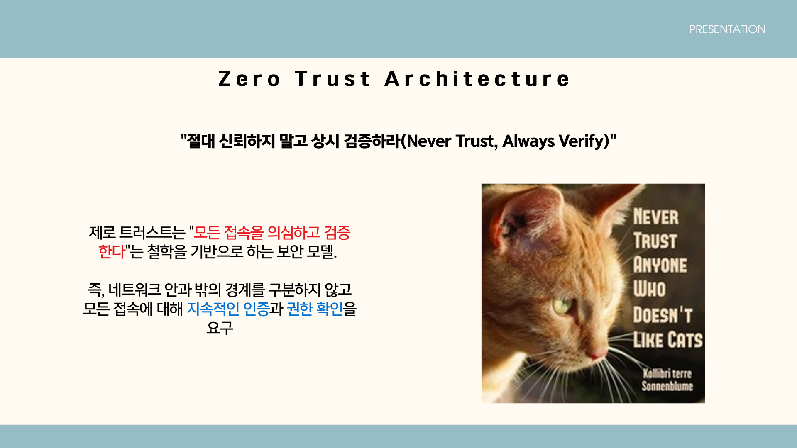
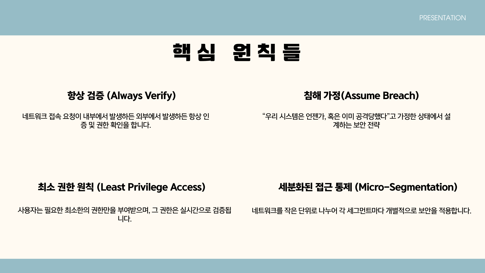
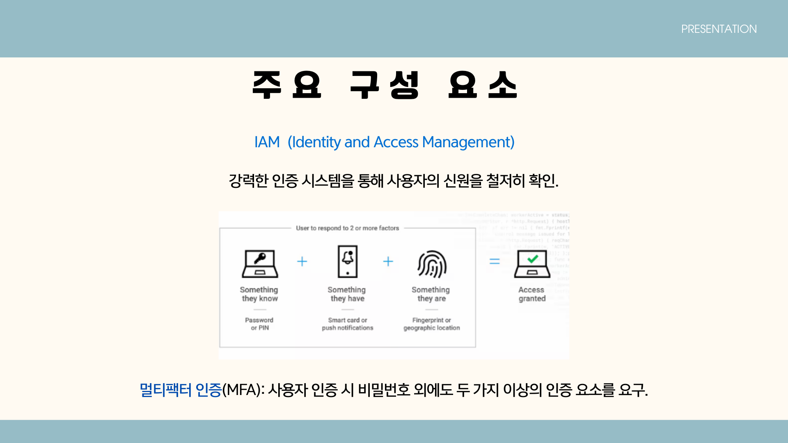
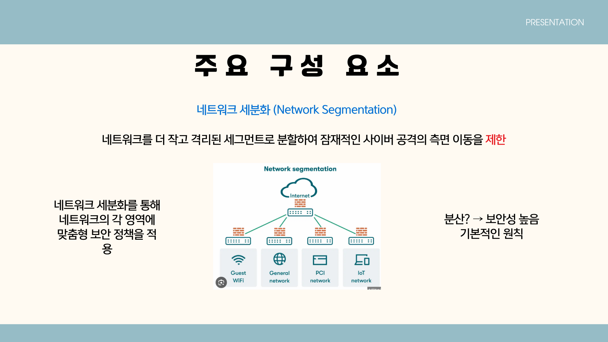
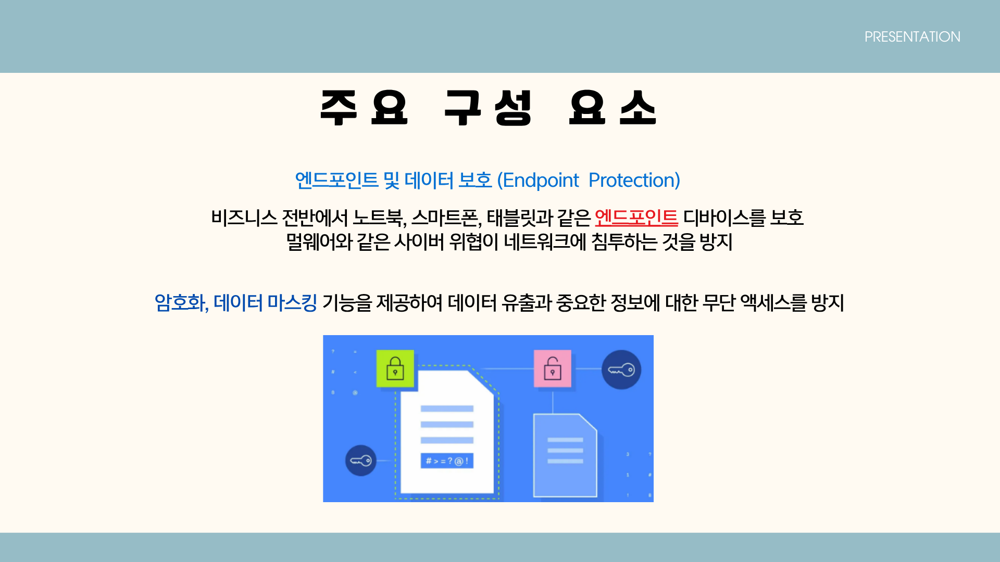
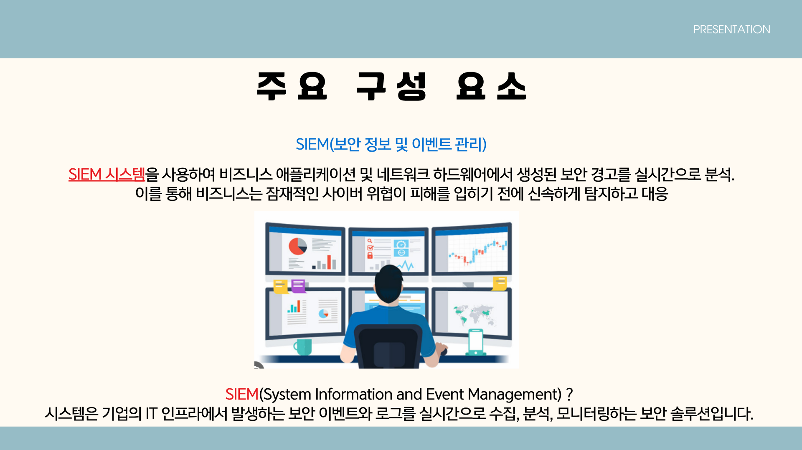
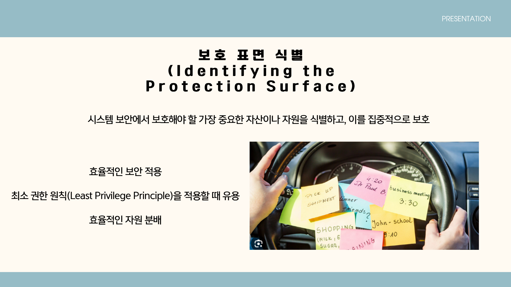
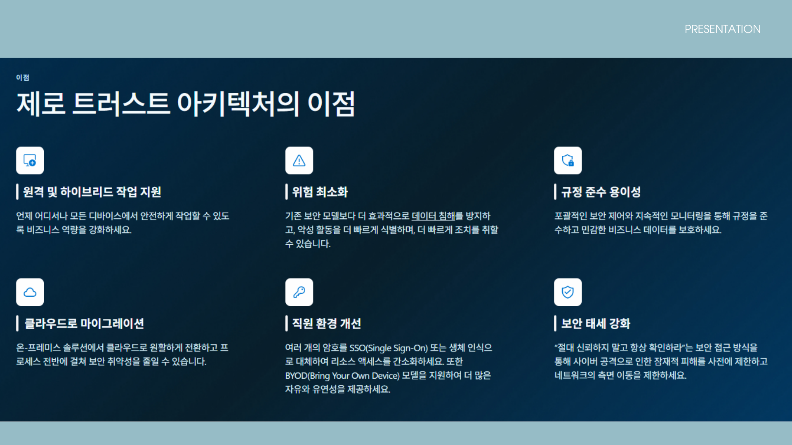

# 제로 트러스트 아키텍처(Zero Trust Architecture)

> **요약:** 제로 트러스트는 네트워크 내부와 외부의 구분 없이 모든 접속을 기본적으로 불신하고, 지속적인 인증과 권한 검증으로 리스크를 줄이는 보안 아키텍쳐입니다.

---

## 목차
1. [개요](#1-개요)  
2. [기존 모델과의 차이](#2-기존-모델과의-차이)  
3. [핵심 원칙](#3-핵심-원칙)  
4. [구성 요소 및 기능](#4-구성-요소-및-기능)  
5. [보호 표면 식별(Protection Surface)](#5-보호-표면-식별protection-surface)  
6. [아키텍처의 주요 이점](#6-제로-트러스트-아키텍처의-주요-이점)  
7. [실제 사례](#7-실제-사례)  
8. [도입 시 고려사항 및 과제](#8-도입-시-고려사항-및-과제)  
9. [기술 스택 예시](#9-기술-스택-예시)  
10. [결론](#10-결론)  

---

## 1. 개요

제로 트러스트는 “내부든 외부든 신뢰하지 않는다 (Never trust, always verify)”는 철학을 바탕으로, 모든 접속에 대해 지속적·동적 검증을 수행하는 보안 아키텍처입니다.  
기존의 경계 기반(성곽과 해자) 보안 모델이 내부 위협과 클라우드·원격 근무 환경의 변화에 취약해지면서 도입이 확산되었습니다.

---

## 2. 기존 모델과의 차이

### 기존 모델 특징
- 외부에서의 접근을 강하게 차단(방화벽 중심)
- 내부는 암묵적 신뢰(once inside, trusted)
- 단일 로그인/장시간 세션 유지에 의존

### 문제점
- 내부 계정 유출 시 전체 내부 자원 노출 가능
- 세션 탈취에 취약
- 네트워크 위치 기반 보안의 한계

### EXAMPLE

--예시:
사내 VPN이나 내부망에만 접속하면 자동으로 사내 시스템(DB, 파일서버)에 접근 가능한 환경

문제점:
한 번만 로그인하면 내부 모든 리소스에 접근 가능
내부 계정이 유출되면, 공격자는 내부망 전체를 자유롭게 이동 가능
인증이 ‘초기 1회’에 그치고, 지속적인 검증이 이루어지지 않음
➡ 이는 전통적인 ‘성곽과 해자(castle-and-moat)’ 보안 모델의 대표 사례로,
“내부는 안전하다”는 가정 아래 지속적 인증이 존재하지 않습니다.

--예시:
웹 애플리케이션에서 한 번 로그인하면 12시간 이상 세션이 유지되고,
중간에 사용자 상태(위치, 장치, IP, 이상행동 등)를 다시 검증하지 않는 경우

문제점:
세션 탈취(Session Hijacking)에 취약
비정상적인 네트워크 이동(IP 변경 등)에도 인증 재요구가 없음
➡ 제로 트러스트에서는 일정 시간마다 재인증(reauthentication) 또는
행동 기반 검증(behavioral verification) 을 수행해야 합니다.

---

## 3. 핵심 원칙

| 원칙 | 설명 |
|---:|---|
| 항상 검증 (Always Verify) | 접속 요청마다 사용자·디바이스·컨텍스트를 검증 |
| 최소 권한 (Least Privilege) | 업무에 필요한 최소 권한만 부여 |
| 침해 가정 (Assume Breach) | 내부 침해 가능성을 전제로 설계 |
| 마이크로 세그멘테이션 (Micro-Segmentation) | 네트워크를 작은 단위로 나누어 각 세그먼트마다 개별적으로 보안을 적용합니다. |

---

## 4. 구성 요소 및 기능

### IAM (Identity & Access Management)

- MFA, SSO, RBAC/PBAC 등으로 사용자 신원과 권한을 관리  
- 접근 전 사용자 및 디바이스 신뢰성 검사

제로 트러스트는 리소스에 대한 액세스 권한을 부여하기 전에 항상 사용자와 디바이스의 신뢰성을 확인합니다. 특히 이 프레임워크는 다단계 인증, SSO(Single Sign-On), 역할 기반 액세스 제어와 같은 IAM 전략을 사용하여 ID 관련 유출을 방지합니다. 이러한 기능은 로그인 프로세스를 간소화하고 여러 개의 암호를 외울 필요성을 줄여 비즈니스 전반에 걸쳐 직원의 사용자 경험을 개선할 수도 있습니다.

### 네트워크 세분화 (Micro-Segmentation)

- 네트워크를 작은 영역으로 분리하여 횡적 이동 차단  
- 세그먼트별 맞춤형 보안 정책 적용

네트워크 세분화
ZTA는 네트워크를 더 작고 격리된 세그먼트로 분할하여 잠재적인 사이버 공격의 측면 이동을 제한합니다. 각 세그먼트는 비즈니스에서 보안 침해를 억제하고 사이버 위협이 인프라의 다른 부분으로 확산되는 것을 방지하는 보안 영역의 역할을 합니다. 데이터 침해가 발생하면 비즈니스는 이를 특정 영역으로 쉽게 제한하여 피해를 크게 줄일 수 있습니다.

### 엔드포인트 보안 (Endpoint Security)

- 디바이스 상태 검사(패치, 안티바이러스, 설정 등)  
- 위협 탐지·격리·복구 기능

제로 트러스트 아키텍처는 비즈니스 전반에서 노트북, 스마트폰, 태블릿과 같은 엔드포인트 디바이스를 보호하여 멀웨어와 같은 사이버 위협이 네트워크에 침투하는 것을 방지합니다. 

엔드포인트 보안은 이러한 디바이스가 대규모 사이버 공격이 침입하여 혼란을 야기하기 위한 게이트웨이로 표적이 되는 경우가 많기 때문에 필수적입니다. ZTA는 고급 위협 탐지 및 대응 기능, 포괄적인 암호화, 정기적인 디바이스 업데이트를 제공하여 비즈니스 운영의 무결성을 유지하는 데 도움을 줍니다.
### 데이터 보안 (Data Security)
- 데이터 암호화(전송/저장), 마스킹, DLP 적용

제로 트러스트 프레임워크는 강력한 액세스 제어, 엔드투엔드 암호화, 데이터 마스킹 기능을 제공하여 데이터 유출과 중요한 정보에 대한 무단 액세스를 방지합니다. 이와 같은 효과적인 데이터 보안 조치를 사용하면 비즈니스는 규정을 일관되게 준수하고 고객의 신뢰를 유지할 수 있습니다. ZTA는 또한 비즈니스 데이터의 유출이나 도난을 방지하는 DLP(데이터 손실 방지) 전략으로 구성되어 있습니다.
### 로그·위협 분석 (SIEM / SOAR)
- 실시간 로그 수집 및 상관분석, 자동화된 대응 플레이북

ZTA는 SIEM 시스템을 사용하여 비즈니스 애플리케이션 및 네트워크 하드웨어에서 생성된 보안 경고를 실시간으로 분석합니다. 이를 통해 비즈니스는 잠재적인 사이버 위협이 피해를 입히기 전에 신속하게 탐지하고 대응할 수 있습니다.

또한 제로 트러스트 아키텍처 내의 SIEM 시스템은 보안 트렌드와 패턴에 대한 귀중한 인사이트를 제공하여 위협 환경을 더 잘 이해할 수 있도록 도와줍니다. 조직은 과거 데이터를 분석하여 반복되는 문제를 파악하고 선제적으로 문제를 해결하기 위한 조치를 취할 수 있습니다. 비즈니스가 새로운 사이버 위협에 대비하고 강력한 보안 태세를 유지하려면 지속적인 개선 프로세스를 도입하는 것이 필수적입니다.

### SEIM?

SIEM(System Information and Event Management) 시스템은 기업의 IT 인프라에서 발생하는 보안 이벤트와 로그를 실시간으로 수집, 분석, 모니터링하는 보안 솔루션입니다. 이 시스템은 보안 사고를 감지하고, 추적하고, 대응할 수 있도록 돕는 중요한 도구입니다.

- 로그 수집기 (Log Collector): 다양한 소스에서 발생하는 로그를 수집합니다.
- 데이터 저장소 (Data Storage): 수집된 데이터를 안전하게 저장하고 분석할 수 있게 합니다.
- 분석 엔진 (Analytics Engine): 수집된 데이터를 분석하여 이상 징후를 감지하고 경고를 발생시킵니다.
- 대시보드 및 시각화 (Dashboard & Visualization): 실시간 모니터링을 위해 시각적으로 정보를 제공합니다.
- 경고 및 알림 (Alert & Notification): 중요한 보안 이벤트가 발생하면 관리자에게 즉시 경고를 보냅니다.
---

## 5. 보호 표면 식별(Protection Surface)

**정의:** 
**보호 표면(Protection Surface)**은 보호할 필요가 있는 비즈니스 자산, 데이터, 시스템 등을 의미합니다. 제로 트러스트 모델에서는 이를 세밀하게 식별하고 보호하는 것이 중요합니다.

### 절차
1. 비즈니스 자산 파악  
2. 자산별 위협 분석 및 우선순위 설정  
3. 보호 대상 자원(데이터베이스, API, 파일서버 등) 식별  
4. 자산별 접근 통제·암호화 정책 수립

### 이점
- 보안 자원의 효율적 분배  
- 최소 권한 적용의 기반 마련  
- 침해 발생 시 피해 범위 최소화

### 주요 기능
- 로그 수집기(Log Collector): 다양한 소스(네트워크, 서버, 앱)에서 로그 수집  
- 데이터 저장소(Data Storage): 보관 및 검색 가능한 저장소 제공  
- 분석 엔진(Analytics Engine): 상관분석, 이상탐지, 규칙기반 탐지  
- 대시보드(Visualization) 및 알림(Alerting): 실시간 모니터링과 경보

---

## 6. 제로 트러스트 아키텍처의 주요 이점

- 원격 및 하이브리드 작업 지원
언제 어디서나 모든 디바이스에서 안전하게 작업할 수 있어, 기업의 비즈니스 연속성을 강화합니다.

- 위험 최소화
기존 보안 모델보다 더 효율적으로 데이터 침해를 방지하고, 악성 활동을 신속하게 식별하여 대응할 수 있습니다.

- 규정 준수 용이성
포괄적인 보안 정책과 지속적인 모니터링을 통해 규정 준수를 쉽게 실현하고, 민감한 비즈니스 데이터를 보호합니다.

- 직원 환경 개선
여러 개인용 장치를 SSO(Single Sign-On)나 생체 인증을 통해 리스크를 줄이고, BYOD(Bring Your Own Device) 모델을 지원하여 더 많은 유연성과 자유로운 작업 환경을 제공합니다.

- 클라우드로 마이그레이션
온프레미스 솔루션에서 클라우드로 원활하게 전환하여, 보안 취약점을 줄이고, 클라우드 환경의 이점을 활용할 수 있습니다.

- 보안 태세 강화
“절대 신뢰하지 말고 항상 확인하라”는 원칙을 통해 보안 접근 방식을 강화하고, 사이버 공격을 미리 방지하며 네트워크의 불필요한 이동을 제한합니다.

---
## 7. 실제 사례

### 1) Google — BeyondCorp
- VPN 없이도 내부 리소스 접근 가능하도록 설계  
- 네트워크 위치가 아닌 사용자·디바이스 상태를 기반으로 접근 제어

### 2) Microsoft — Zero Trust Security Model
- Azure AD(아이덴티티), Intune(디바이스), Defender(탐지) 통합 운영

### 3) 미국 국방부(DoD)
- DoD Zero Trust Reference Architecture 문서화(2021)  
- 계층별(사용자·기기·응용·데이터) 검증 적용

### 4) 금융기관 전환 사례
- SSO+MFA, 접근 로그 실시간 분석, 시스템별 분리 정책 등 도입

---

## 8. 도입 시 고려사항 및 과제
- **복잡성 증가:** 기존 시스템 통합 및 정책 설계의 복잡성  
- **비용 문제:** 초기 도입 비용 및 운영 인력 필요  
- **조직변화 관리:** 사용자 교육과 운영 프로세스 변화 필요  
- **정책 설계:** 동적 정책 엔진과 규칙의 정확한 설계 필요

---

## 9. 기술 스택 예시

| 분야 | 솔루션 / 제품 |
|---|---|
| 인증·권한관리 | Azure AD, Okta, Ping Identity |
| 네트워크 접근 제어 | Zscaler, Palo Alto Prisma Access, Cisco Duo |
| 로그·이벤트 분석 | Splunk, IBM QRadar, Elastic Security |
| 보안 오케스트레이션 | Cortex XSOAR, Microsoft Sentinel |
| 데이터 보호 | Symantec DLP, Microsoft Purview |
| 디바이스 관리 | Microsoft Intune, CrowdStrike Falcon |

---

## 10. 결론
제로 트러스트는 단순한 기술 도입이 아니라 **보안 철학의 전환**입니다.  
"내부는 안전하다"는 가정을 버리고, **모든 접속을 지속 검증**함으로써 현대의 클라우드·원격 근무·모바일 환경에서 발생하는 위험을 효과적으로 줄일 수 있습니다.  
도입 시에는 기술·운영·조직 측면의 준비가 필요하며, 단계적 접근(보호 표면 식별 → 정책 설계 → 도구 통합 → 운영 고도화)을 권장합니다.

---

