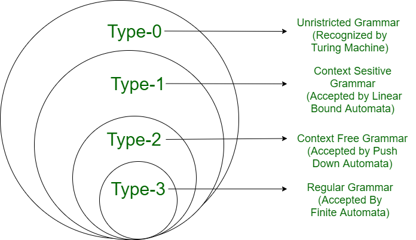

# 정규표현식(Regular Expression : Regex, Regexp)

## 💡 핵심 요약💡
> - **한 줄 정의** : 문자열에서 특정 패턴을 찾거나 조작하기 위해 사용하는 일종의 형식화된 문자열입니다.
>
> - **핵심 키워드** : `패턴 매칭`, `메타문자`, `문자 클래스`, `수량자`, `앵커`, `그룹화`
>
> - **왜 중요한가?** : 텍스트 처리와 데이터 검증에서 강력한 도구로 활용되며, 복잡한 문자열 검색, 치환, 추출 작업을 효율적으로 수행할 수 있어 개발자와 데이터 과학자에게 필수적인 기술입니다.

## 1. 개념

특정 패턴을 가진 문자열을 찾거나 조작하기 위한 형식 언어(Formal Language)입니다.

정규표현식은 다양한 프로그래밍 언어와 도구에서 지원되며, 복잡한 문자열 검색, 치환, 추출 작업을 간단하게 수행할 수 있습니다.

하지만 아쉽게도 **하나의 표준이 존재하지 않아 언어나 구현체마다 문법과 기능이 다릅니다.**

만약 자바와 자바스크립트로 개발을 할 때, 같은 문법으로 정규 표현식을 작성하면 호환성 문제가 발생할 수 있습니다.

---

## 2. 왜 필요한가?

### 텍스트 처리의 복잡성
- 대량의 텍스트 데이터에서 특정 패턴을 찾거나 변환하는 작업은 매우 복잡할 수 있습니다.
- 예를 들어, 이메일 주소, 전화번호, 우편번호 등 특정 형식을 가진 데이터를 추출하거나 검증하는 작업이 필요할 때 정규표현식이 유용합니다.

### 효율적인 문자열 조작
- 정규표현식을 사용하면 복잡한 문자열 조작 작업을 간결한 코드로 표현할 수 있습니다.
- 반복문과 조건문을 사용하지 않고도 패턴 매칭과 치환을 수행할 수 있어 코드의 가독성과 유지보수성이 향상됩니다.

### 다양한 응용 분야
- 데이터 검증: 사용자 입력이 특정 형식을 따르는지 확인
- 로그 분석: 로그 파일에서 특정 이벤트나 오류 메시지 추출
- 웹 스크래핑: HTML 문서에서 원하는 데이터 추출

---

## 3. 컴퓨터 과학 내에서 정규표현식의 위치
### 촘스키 위계(Chomsky Hierarchy)

노엄 촘스키(Avram Noam Chomsky)가 1956년에 제시한 형식 언어 분류 체계로, 언어의 생성 규칙에 따라 4가지 유형으로 나눕니다.


- Type 0 : **무제한 문법(Unrestricted Grammar : UG)**

    Recognized By Turing Machine

    생성 규칙 : αAβ → β (α, β는 임의의 문자열)

- Type 1 : **문맥 민감 문법(Context-Sensitive Grammar : CSG)**

    Accepted By Linear Bounded Automaton

    생성 규칙 : αAβ → αγβ (γ는 공백이 아닌 문자열)

- Type 2 : **문맥 자유 문법 (Context-Free Grammar : CFG)**

    Accepted By Pushdown Automaton

    생성 규칙 : A → α (A는 단일 비단말 기호, α는 임의의 문자열)
    
- Type 3 : **정규 문법 (Regular Grammar : RG)** <- 정규표현식의 위치
    
    Accepted By Finite Automaton

    생성 규칙 : A → aB 또는 A → a (A, B는 단일 비단말 기호, a는 단일 단말 기호)

### 정규 표현식과 유한 오토마타, 정규 언어
- 정규 언어(Regular Language)는 정규 문법으로 생성되는 언어입니다. 다른말로 하면 정규 표현식으로 표현 가능한 언어라고도 할 수 있습니다.
- 유한 오토마타(Finite Automaton)는 정규 언어를 인식하는 추상 기계입니다. 정규 표현식과 유한 오토마타는 서로 변환이 가능하며, 동일한 언어를 표현할 수 있습니다.
```
정규 표현식 <-> 유한 오토마타 <-> 정규 문법
```

### 정규 표현식 엔진의 기본 개념
- **NFA (Nondeterministic Finite Automaton)** : 비결정적 유한 오토마타
    - 여러 경로를 동시에 탐색 (백트래킹 사용)
    - 느리지만 복잡한 패턴 처리에 유리
        - 백트래킹을 사용하기 때문에 최악의 경우 O(2^n) 시간 복잡도를 가질 수 있음
        - 이런 부분을 공격하면 ReDoS (Regular Expression Denial of Service) 공격이 발생할 수 있음
    - 캡처 그룹, 역참조 지원
    - Java, JavaScript, Python 등에서 사용

- **DFA (Deterministic Finite Automaton)** : 결정적 유한 오토마타
    - 단일 경로만 탐색
    - 빠르지만 복잡한 패턴 처리에 불리
    - 캡처 그룹, 역참조 미지원
    - grep, awk, sed 등에서 사용

---

## 4. 정규 표현식의 주요 구성 요소

정규 표현식은 크게 리터럴, 메타 문자, 문자 클래스, 수량자, 앵커, 그룹화 등으로 구성됩니다. 각 구성 요소는 패턴을 정의하는 데 고유한 역할을 합니다.
위에서 이야기 했던대로 하나의 표준이 존재하지는 않지만 알아두면 좋을 것 같아서 주요 구성 요소를 정리해봤습니다.

### 4.1 리터럴 (Literals)
가장 기본적인 형태의 정규 표현식으로, 있는 그대로의 문자를 매칭합니다.

```java
// 일반 문자열 매칭
String pattern = "hello";
"hello world".matches(".*hello.*"); // true
"Hello world".matches(".*hello.*"); // false (대소문자 구분)

// 대소문자 무시 (Pattern.CASE_INSENSITIVE 플래그 사용)
Pattern p = Pattern.compile("hello", Pattern.CASE_INSENSITIVE);
p.matcher("Hello world").find(); // true
```

### 4.2 메타 문자 (Meta-characters)
정규 표현식에서 특별한 의미를 가지는 문자들입니다. 이 문자들을 리터럴로 사용하려면 백슬래시(`\`)로 이스케이프해야 합니다.
주요 메타 문자: `. ^ $ * + ? { } [ ] \ | ( )`

### 4.2.1 `.` (Any character)
개행 문자(`\n`)를 제외한 모든 단일 문자와 매칭됩니다.

```java
// . 은 개행 문자를 제외한 모든 문자 하나와 매칭
"cat".matches("c.t");  // true
"cut".matches("c.t");  // true
"ct".matches("c.t");   // false (문자 하나 필요)
"c\\nt".matches("c.t"); // false (개행 제외)

// DOTALL 모드로 개행도 포함
Pattern.compile("c.t", Pattern.DOTALL).matcher("c\\nt").matches(); // true
```

### 4.2.2 `|` (Alternation / OR)
둘 중 하나를 선택하는 OR 연산자입니다.

```java
// OR 연산
"cat".matches("cat|dog");     // true
"dog".matches("cat|dog");     // true
"bird".matches("cat|dog");    // false

// 그룹과 함께 사용
"gmail.com".matches("(gmail|naver|daum)\\\\.com"); // true
```

### 4.2.3 `\` (Escape Character)
메타 문자를 일반 문자로 취급하게 하거나, 특수한 문자 클래스를 정의할 때 사용합니다.
Java 문자열에서는 백슬래시 자체를 이스케이프해야 하므로 `\\`로 작성해야 합니다.

```java
// 메타 문자 . 을 일반 문자로 매칭
"abc.def".matches("abc\\\\.def"); // true
"abc.def".matches("abc.def");   // true (.이 모든 문자와 매칭되므로)
"abcXdef".matches("abc\\\\.def"); // false
```

### 4.3 문자 클래스 (Character Classes)
대괄호 `[]` 안에 포함된 문자 중 하나와 매칭됩니다.

```java
// [abc] : a, b, c 중 하나
"a".matches("[abc]");    // true
"d".matches("[abc]");    // false

// [^abc] : a, b, c를 제외한 모든 문자 (부정)
"d".matches("[^abc]");   // true
"a".matches("[^abc]");   // false

// [a-z] : 범위 지정 (Range)
"m".matches("[a-z]");    // true (소문자)
"M".matches("[A-Z]");    // true (대문자)
"5".matches("[0-9]");    // true (숫자)

// [a-zA-Z] : 조합 (Union)
"a".matches("[a-zA-Z]"); // true

// [a-z&&[def]] : 교집합 (Intersection) - Java 정규식 특징
"d".matches("[a-z&&[def]]"); // true (d, e, f 중 하나이면서 소문자)
"a".matches("[a-z&&[def]]"); // false
```

### 4.4 사전 정의된 문자 클래스 (Predefined Character Classes / Shorthands)
자주 사용되는 문자 클래스를 짧게 표현한 것입니다.

```java
// \\d - Digit (숫자) = [0-9]
"5".matches("\\\\d");      // true
"a".matches("\\\\d");      // false

// \\D - Non-Digit (숫자 아님) = [^0-9]
"a".matches("\\\\D");      // true

// \\w - Word character (단어 문자) = [a-zA-Z0-9_]
"a".matches("\\\\w");      // true
"_".matches("\\\\w");      // true
"@".matches("\\\\w");      // false (특수문자 제외)

// \\W - Non-Word character = [^a-zA-Z0-9_]
"@".matches("\\\\W");      // true

// \\s - Whitespace (공백) = [ \\t\\n\\r\\f]
" ".matches("\\\\s");      // true
"\\t".matches("\\\\s");     // true

// \\S - Non-Whitespace = [^\\s]
"a".matches("\\\\S");      // true
```

### 4.5 수량자 (Quantifiers)
앞의 요소가 얼마나 반복되는지를 지정합니다.

#### 4.5.1 기본 수량자
```java
// * : 0회 이상 ({0,})
"".matches("a*");        // true
"aaa".matches("a*");     // true

// + : 1회 이상 ({1,})
"".matches("a+");        // false
"a".matches("a+");       // true

// ? : 0회 또는 1회 ({0,1})
"a".matches("a?");       // true
"aa".matches("a?");      // false

// {n} : 정확히 n회
"aa".matches("a{2}");    // true

// {n,m} : n회 이상 m회 이하
"aaa".matches("a{2,4}"); // true

// {n,} : n회 이상
"aaa".matches("a{2,}");  // true
```

#### 4.5.2 수량자의 종류 (Greedy, Lazy, Possessive)
| 종류 | 문법 | 설명 | 예시 (`aab` 에서 `a+` 매칭) |
|---|---|---|---|
| **Greedy** (탐욕적) | `*`, `+`, `?`, `{n,m}` | 가능한 한 **가장 많이** 매칭하려고 시도합니다. (기본값) | `aa` (전체 매칭) |
| **Reluctant** (Lazy, 게으른) | `*?`, `+?`, `??`, `{n,m}?` | 가능한 한 **가장 적게** 매칭하려고 시도합니다. | `a` (첫 번째 a만 매칭) |
| **Possessive** (소유적) | `*+`, `++`, `?+`, `{n,m}+` | Greedy처럼 많이 매칭하지만, **백트래킹을 허용하지 않습니다.** 성능 최적화에 사용됩니다. | `aa` (매칭 후 뒤로 돌아가지 않음) |

```java
// Greedy vs Lazy
String text = "<div>Hello</div>";
// Greedy: <div>Hello</div> 전체 매칭
text.matches("<div>.*</div>"); 
// Lazy: <div>Hello</div> 에서 <div>, </div> 각각 매칭 시도 가능 (find() 사용 시)
```

### 4.6 경계 (Anchors)
문자열의 특정 위치를 지정합니다. 문자를 소비하지 않고 위치만 확인합니다 (Zero-width assertion).

```java
// ^ : 문자열(또는 라인)의 시작
Pattern.compile("^hello").matcher("hello world").find(); // true

// $ : 문자열(또는 라인)의 끝
Pattern.compile("world$").matcher("hello world").find(); // true

// \\b : 단어 경계 (Word Boundary) - 문자와 공백/특수문자 사이
"cat".matches("\\\\bcat\\\\b"); // true
"cathedral".matches("\\\\bcat\\\\b"); // false (cat이 단어의 일부임)

// \\B : 단어 경계가 아님
"cathedral".matches(".*\\\\Bcat\\\\B.*"); // true (중간에 포함된 cat)

// \\A : 입력의 시작 (무조건 문자열 전체의 시작)
// \\z : 입력의 끝 (무조건 문자열 전체의 끝)
// \\Z : 입력의 끝 (마지막 종결자(\\n)가 있으면 그 앞)
```
### 4.7 그룹화 (Grouping)
여러 문자를 하나의 단위로 묶거나, 매칭된 부분을 추출할 때 사용합니다.

#### 4.7.1 캡처 그룹 (Capturing Groups) - `(...)`
매칭된 부분을 메모리에 저장하여 나중에 참조할 수 있습니다.

```java
String log = "2025-11-18 23:43:21 ERROR User login failed";

Pattern p = Pattern.compile("(\\\\d{4}-\\\\d{2}-\\\\d{2}) (\\\\d{2}:\\\\d{2}:\\\\d{2}) (\\\\w+) (.+)");
Matcher m = p.matcher(log);

if (m.find()) {
    System.out.println("날짜: " + m.group(1));    // 2025-11-18
    System.out.println("시간: " + m.group(2));    // 23:43:21
    System.out.println("레벨: " + m.group(3));    // ERROR
    System.out.println("메시지: " + m.group(4));  // User login failed
}
```

#### 4.7.2 비캡처 그룹 (Non-Capturing Groups) - `(?:...)`
그룹화는 필요하지만, 메모리에 저장할 필요가 없을 때 사용합니다. 성능상 이점이 있습니다.

```java
// 그룹화는 필요하지만 캡처는 불필요한 경우
String url = "<https://www.example.com>";

// 비캡처 그룹 사용 (성능 향상)
Pattern p2 = Pattern.compile("(?:https|http)://(.+)");
Matcher m2 = p2.matcher(url);
if (m2.find()) {
    // m2.group(1)은 이제 www.example.com (프로토콜은 캡처 안 됨)
    System.out.println(m2.group(1)); // www.example.com
}
```

#### 4.7.3 명명된 그룹 (Named Groups) - `(?<name>...)`
인덱스 대신 이름으로 그룹을 참조할 수 있어 가독성이 좋아집니다.

```java
String date = "2025-11-18";
Pattern p = Pattern.compile("(?<year>\\\\d{4})-(?<month>\\\\d{2})-(?<day>\\\\d{2})");
Matcher m = p.matcher(date);

if (m.find()) {
    System.out.println("년도: " + m.group("year"));   // 2025
    System.out.println("월: " + m.group("month"));    // 11
    System.out.println("일: " + m.group("day"));      // 18
}
```

#### 4.7.4 역참조 (Back-reference) - `\\1`, `\\k<name>`
앞서 매칭된 그룹을 다시 참조합니다.

```java
// 중복 단어 찾기
String text = "the the cat sat on the the mat";
Pattern p = Pattern.compile("\\\\b(\\\\w+)\\\\s+\\\\1\\\\b");
Matcher m = p.matcher(text);

while (m.find()) {
    System.out.println("중복 단어: " + m.group(1));
}

// HTML 태그 매칭 (여는 태그와 닫는 태그가 같아야 함)
String html = "<h1>Title</h1><p>Content</p><h2>Subtitle</h2>";
Pattern tagPattern = Pattern.compile("<(\\\\w+)>.*?</\\\\1>");
Matcher tagMatcher = tagPattern.matcher(html);

while (tagMatcher.find()) {
    System.out.println(tagMatcher.group());
}
```

### 4.8 플래그 (Flags)
정규 표현식의 동작 방식을 변경하는 옵션입니다. `Pattern.compile()`의 두 번째 인자로 전달하거나, 패턴 내에 `(?flags)` 형태로 포함할 수 있습니다.

- `Pattern.CASE_INSENSITIVE` (`(?i)`): 대소문자를 구분하지 않습니다.
- `Pattern.MULTILINE` (`(?m)`): `^`와 `$`가 전체 문자열이 아닌 각 라인의 시작과 끝에 매칭됩니다.
- `Pattern.DOTALL` (`(?s)`): `.`이 개행 문자를 포함한 모든 문자와 매칭됩니다.
- `Pattern.COMMENTS` (`(?x)`): 패턴 내의 공백과 주석을 무시합니다. (가독성 향상)

```java
// MULTILINE 예제
String text = "First line\\nSecond line";
Pattern p = Pattern.compile("^Second", Pattern.MULTILINE); // 각 줄의 시작에서 매칭
Matcher m = p.matcher(text);
System.out.println(m.find()); // true
```

---

## 5. 심화 개념 (Advanced Concepts)

### 5.1 Greedy vs. Lazy 상세 예제

#### Greedy (탐욕적) - 기본 동작

```java
String html = "<div>Hello</div><div>World</div>";

// Greedy: 최대한 많이 매칭
Pattern greedy = Pattern.compile("<div>.*</div>");
Matcher m = greedy.matcher(html);
if (m.find()) {
    System.out.println(m.group());
    // 출력: <div>Hello</div><div>World</div>
    // (전체를 하나로 매칭)
}
```

#### Lazy (게으른) - `?` 추가

```java
String html = "<div>Hello</div><div>World</div>";

// Lazy: 최소한만 매칭
Pattern lazy = Pattern.compile("<div>.*?</div>");
Matcher m = lazy.matcher(html);
while (m.find()) {
    System.out.println(m.group());
}
// 출력:
// <div>Hello</div>
// <div>World</div>
// (각각 개별 매칭)
```

**수량자별 Lazy 버전**:

```java
// Greedy  →  Lazy
// *       →  *?
// +       →  +?
// ?       →  ??
// {n,m}   →  {n,m}?
// {n,}    →  {n,}?

// 실무 예제: HTML 태그 추출
String html = "<p>First</p><p>Second</p>";

// Greedy
html.replaceAll("<p>.*</p>", "[CONTENT]");
// 결과: [CONTENT]

// Lazy
html.replaceAll("<p>.*?</p>", "[CONTENT]");
// 결과: [CONTENT][CONTENT]
```

## 📊 6. 성능 최적화 팁

### 6.1 Pattern 재사용

```java
// ❌ 나쁜 예: 매번 컴파일
public boolean validateEmail(String email) {
    return email.matches("^[\\\\w.-]+@[\\\\w.-]+\\\\.[a-zA-Z]{2,}$");
    // matches()는 내부에서 매번 Pattern.compile() 호출
}

// ✅ 좋은 예: Pattern 재사용
public class EmailValidator {
    private static final Pattern EMAIL_PATTERN =
        Pattern.compile("^[\\\\w.-]+@[\\\\w.-]+\\\\.[a-zA-Z]{2,}$");

    public boolean validateEmail(String email) {
        return EMAIL_PATTERN.matcher(email).matches();
    }
}

// 성능 차이: 약 3-5배 빠름

```

### 6.2 비캡처 그룹 사용

```java
// ❌ 느림: 불필요한 캡처
Pattern slow = Pattern.compile("(https|http)://([\\\\w.]+)");

// ✅ 빠름: 비캡처 그룹
Pattern fast = Pattern.compile("(?:https|http)://([\\\\w.]+)");
// 도메인만 필요한 경우 프로토콜 캡처 불필요

```

### 6.3 Catastrophic Backtracking 방지


이 재앙적 백트래킹은 정규표현식을 이용한 공격인 ReDoS(Regular Expression Denial of Service)의 원인이 될 수 있습니다.
실제로 2019년에는 클라우드 플레어에서 ReDos 공격을 받았습니다.

간단하게 해결 가능하지만 주의해서 사용하지 않으면 쉽게 공격을 받을 수 있는 부분입니다.

```java
// ❌ 위험: 재앙적 백트래킹 가능
Pattern dangerous = Pattern.compile("(a+)+b");
String input = "aaaaaaaaaaaaaaaaaaaaaaaaaaac"; // 'b'가 없음
// 이 경우 지수 시간 복잡도로 인해 매우 느려짐 (또는 스택 오버플로우)

// ✅ 안전: Possessive 수량자 사용
Pattern safe = Pattern.compile("(a++)b");
// 또는 Atomic 그룹 사용
Pattern safe2 = Pattern.compile("(?>a+)b");

// 실무에서는 타임아웃 설정
public boolean matchesWithTimeout(String pattern, String input, long timeoutMs) {
    ExecutorService executor = Executors.newSingleThreadExecutor();
    Future<Boolean> future = executor.submit(() -> {
        return Pattern.compile(pattern).matcher(input).matches();
    });

    try {
        return future.get(timeoutMs, TimeUnit.MILLISECONDS);
    } catch (TimeoutException e) {
        future.cancel(true);
        return false;
    } catch (Exception e) {
        return false;
    } finally {
        executor.shutdownNow();
    }
}

```

---

## 📚 7. 참고 자료 및 학습 리소스

### 온라인 도구

- **Regex101** (https://regex101.com/) - 실시간 패턴 테스트 및 설명
- **RegExr** (https://regexr.com/) - 시각적 디버깅
- **RegexPlanet** (https://www.regexplanet.com/) - 다양한 언어별 테스트

### Java 공식 문서

- `java.util.regex.Pattern` JavaDoc
- `java.util.regex.Matcher` JavaDoc

